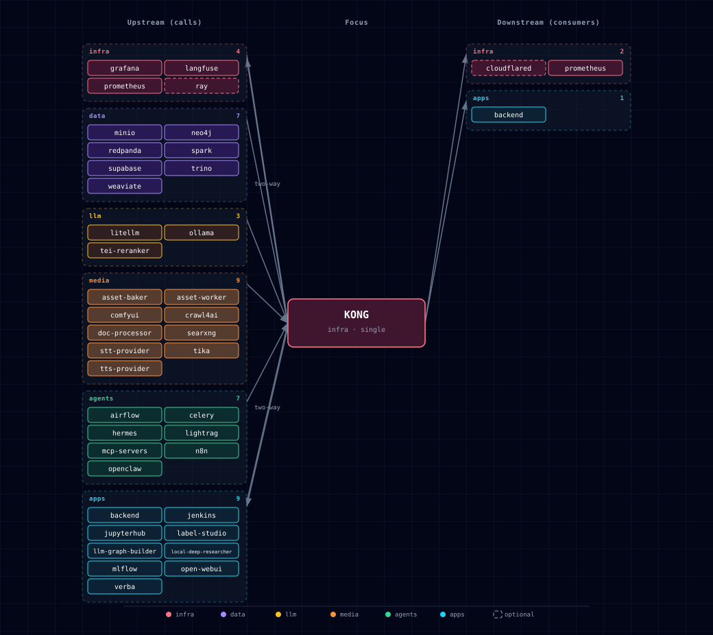

# 5.2.23. Kong API Gateway

Kong is Atlas's API gateway. It routes `*.localhost` requests to services, using a configuration that `./start.sh` generates from the current SOURCE settings. It also applies authentication, CORS and timeouts per route.

## 1. Overview

Kong runs DB-less (`KONG_DATABASE: "off"`) and loads one declarative file. It is the entry point for most browser and API traffic to the stack.

## 2. Dynamic Configuration

`bootstrapper/utils/kong_config_generator.py` builds the Kong configuration on every `./start.sh`:

- **Route generation**: each enabled service gets its routes.
- **Disabled services**: a service with `*_SOURCE=disabled` gets no route.
- **Health check (advisory)**: the generator probes localhost-sourced services and warns if they are down. It creates the route either way.

`volumes/api/kong-dynamic.yml` is a generated runtime file, not a checked-in file. It is in `.gitignore` and reflects the resolved SOURCE state at the last `./start.sh`. A direct `docker compose up` from a clean checkout fails because the bind-mount source does not exist. Always start through `./start.sh`, which writes the file before it runs compose.

Validate the generator contract without `./start.sh`. The checker copies `.env.example` to a temporary directory, runs `kong_config_generator` against it, and checks the output. It does not read your local `volumes/api/kong-dynamic.yml`, which depends on your `.env`.

```bash
uv run --project bootstrapper python scripts/check-kong-routes.py
```

`python3 scripts/check-kong-routes.py` also works if `PyYAML` is installed in your system Python. Otherwise it prints `FAIL import: PyYAML is required to parse Kong config` and exits with status 2. The `uv` form uses the project's pinned dependencies.

## 3. Service Routing

### 3.1. Always-Available Routes (Supabase)
- `/` on bare `localhost` → Atlas service directory and health dashboard
- `/auth/v1/` → Supabase Auth service
- `/rest/v1/` → Supabase API (PostgREST)
- `/graphql/v1` → Supabase GraphQL
- `/realtime/v1/` → Supabase Realtime
- `/storage/v1/` → Supabase Storage (key-auth). `/storage/v1/object/public/`, `/storage/v1/object/sign/` and `/storage/v1/object/upload/sign/` carry CORS only. Browsers and outside services fetch public-bucket and signed URLs without an `apikey`; Storage enforces the bucket's public flag or the signed token.
- `/pg/` → Supabase Meta service
- `supabase-studio.localhost` → Supabase Studio dashboard

**Allowed Host names.** The path routes answer only on these Hosts:

- `localhost`, `127.0.0.1`, `kong-api-gateway` (the in-network name), `<PROJECT_NAME>-kong-api-gateway` (the container name) and `host.docker.internal`.
- Each bare hostname or IPv4 address in `KONG_SUPABASE_EXTRA_HOSTS`. Use it for a tunnel hostname, the LAN address when `HOST_BIND_IP` exposes Kong, or the host of a custom `API_EXTERNAL_URL`/`SITE_URL`.

Any other Host gets 404, so a public hostname does not reach Supabase by accident. A Host header with a port still matches. Matching is case-sensitive, so list hosts in lowercase. IPv6 literals cannot be listed.

**Consumers.** The key-auth services also carry an `acl` that admits only the `anon` (`SUPABASE_ANON_KEY`) and `admin` (`SUPABASE_SERVICE_KEY`) groups, as upstream Supabase does. Another Kong key, such as `BACKEND_KONG_API_KEY`, gets 403 there.

### 3.2. Dynamic Routes (Based on SOURCE)

Kong publishes one `<alias>.localhost` host per enabled service. [Ports and Routes §2](../../docs/operations/ports-and-routes.md#2-kong-hostnames) lists every host, its SOURCE condition and its auth gate. The generated §13.1 table lists every service Kong proxies; `volumes/api/kong-dynamic.yml` is the exact route set for your `.env`.

Example: `curl http://lightrag.localhost:${KONG_HTTP_PORT}/health`

**Localhost sources.** Each `*-localhost` source still gets a Kong route that proxies through `host.docker.internal` to the host.

- Kong's compose entry sets `extra_hosts: ["host.docker.internal:${HOST_GATEWAY_IP}"]`, so this works on Linux Docker. Docker Desktop resolves the name itself.
- For a non-default host port, set `<SVC>_LOCALHOST_PORT`. The in-container consumers (`runtime_sc.<svc>.localhost.environment`) and the Kong generator both read it and use `http://host.docker.internal:${<SVC>_LOCALHOST_PORT}`.

## 4. SOURCE-Based Configuration

### 4.1. ComfyUI Routes
```python
# Generated based on COMFYUI_SOURCE (simplified)
if source == 'managed-localhost-mps':
    service['url'] = localhost_url('COMFYUI_MPS_LOCALHOST_PORT', '8188')
elif source == 'localhost':
    service['url'] = localhost_url('COMFYUI_LOCALHOST_PORT', '8000')
else:  # container-cpu / container-gpu
    service['url'] = 'http://comfyui:18188/'
# No route created if source == 'disabled'
```

### 4.2. Proxy timeouts

Kong 3.x has no global proxy-timeout setting, and its per-service default is 60 s. The generator therefore writes `read_timeout` and `write_timeout` on every service in `kong-dynamic.yml`:

| Service | Timeout |
|---|---|
| Default (including n8n, so long webhooks are not cut off) | 300 s |
| `docling-api` | `DOCLING_INFERENCE_TIMEOUT_SECONDS` + 30 s (930 s by default) |
| `asset-baker` | `ASSET_BAKER_TIMEOUT_SECONDS` + 30 s (630 s by default) |
| Backend `api.localhost` | 3,630 s, or the Docling value + 30 s if larger. Backend requests wait on Docling or on a ComfyUI job of up to 3,600 s. |
| Backend plugin services | the plugin's own values; the Backend value for any field the plugin does not set |
| `litellm-gateway`, `ollama-api` | 630 s, for slow non-streaming completions |

Kong retries only on connection errors (`KONG_NGINX_PROXY_PROXY_NEXT_UPSTREAM=error`). A request that times out on connect, send or read fails after one wait and is not re-sent.

### 4.3. Localhost Service Health Checks

`check_localhost_service()` opens a TCP connection to each localhost-sourced service with a 2-second timeout. If it fails, the generator prints a warning and still creates the route. The route returns errors until the host service starts.

## 5. Authentication

Kong applies one of three schemes per route:

- **API key** (`key-auth`): Supabase API services.
- **Basic** (`basic-auth`): protected dashboards.
- **Pass-through**: services that handle their own auth.

On a Basic-auth route Kong reads the dashboard credential from `Authorization` or `Proxy-Authorization`. Some clients need `Authorization` for the service's own token: Crawl4AI's `Bearer`, Label Studio's `Token`, and Langfuse's public-API `Basic pk:sk`. They send the dashboard credential as `Proxy-Authorization: Basic …` alongside it. Trino's route strips the credential before forwarding (`hide_credentials`), because Trino rejects any password over plain HTTP.

**Blocked paths.** Two routes answer `403` at the gateway and never reach the upstream. Use the internal network for these paths:

- `s3.minio.localhost`: the MinIO metrics paths (`/minio/v2/metrics`, `/minio/metrics/v3`, `/minio/prometheus/metrics`).
- `prometheus.localhost`: `/-/quit` and `/-/reload`.

### 5.1. Forwarded headers

Kong runs with `KONG_PORT_MAPS=${KONG_HTTP_PORT}:8000,${KONG_HTTPS_PORT}:8443`. `X-Forwarded-Port` therefore carries the published port, so upstreams that build absolute URLs from it (Trino redirects and `nextUri`) point back at Kong.

Kong sets `X-Forwarded-Host` itself, without a port, and overwrites any value a plugin adds. The n8n route therefore also adds an RFC 7239 `Forwarded: host=n8n.localhost:<port>;proto=http` header, which n8n's editor origin check reads first. That header names the HTTP port, so n8n's editor live connection works through Kong over HTTP only.

A client inside the Docker network that calls `kong-api-gateway:8000` directly also sees the published port in `X-Forwarded-Port`. Supabase Storage builds S3 signatures and resumable-upload (TUS) URLs from it. S3 or TUS calls through Kong from another container therefore need `STORAGE_PUBLIC_URL`. Atlas's own containers use only the Storage REST API.

## 6. CORS Handling

Every service gets a CORS plugin. A bare `{'name': 'cors'}` answers `Access-Control-Allow-Origin: *`, which would let any website the operator visits read responses from the no-login services. The generator (`_with_local_cors`) scopes each plugin:

- **Allowed origins**: any `*.localhost`, `localhost` or `127.0.0.1` page on any port, plus the exact origins in `KONG_CORS_EXTRA_ORIGINS` (for a LAN or tunnel front-end). Other origins get no `Access-Control-Allow-Origin`.
- **`KONG_CORS_EXTRA_ORIGINS` format**: entries are normalised to the browser's form: lowercase, no trailing slash, no default port. A wildcard or path is ignored with a warning.
- **Not an authentication boundary**: simple cross-site requests, such as plain POSTs, still reach the upstream.
- Kong never adds `Access-Control-Allow-Credentials`, but an upstream's own header passes through for allowed origins.
- `[::1]` origins cannot match, because Kong drops the brackets. Use `localhost` or `127.0.0.1`.
- Upstream CORS settings, such as `BACKEND_CORS_ORIGINS`, apply only inside what Kong allows.

## 7. Rate Limiting

Some services include rate limiting for protection:

```python
# SearxNG example
{
    'name': 'rate-limiting',
    'config': {
        'minute': 60,
        'hour': 1000,
        'policy': 'local'
    }
}
```

## 8. WebSocket Support

Kong supports WebSocket connections for real-time services:

```python
{
    'name': 'realtime-v1-ws',
    'url': 'http://supabase-realtime:4000/socket',
    'protocol': 'ws',
    # ...
}
```

## 9. Configuration Generation Process

1. **Startup**: `./start.sh` runs `generate_kong_configuration` after service configuration and dependency checks, and before LiteLLM configuration.
2. **Environment parsing**: the generator reads SOURCE values from the parsed `.env`.
3. **Health checks**: the generator probes localhost-sourced services and warns if they are down (§4.3).
4. **Route generation**: only enabled services get routes.
5. **File writing**: the configuration is written to `volumes/api/kong-dynamic.yml`.
6. **Kong startup**: Kong loads the generated file from `/home/kong/kong.yml`.

Kong loads only the plugins named in `KONG_PLUGINS` (`services/kong/compose.yml`). DB-less Kong rejects the whole declarative file if it names any other plugin, which takes down every route. A generator change that emits a new plugin must add it to `KONG_PLUGINS`. `tests/test_kong_route_and_auth_invariants.py` checks every emitted plugin against the list.

## 10. Debugging Kong Configuration

### 10.1. View Generated Configuration
```bash
# Check what configuration was generated
cat volumes/api/kong-dynamic.yml

# View Kong logs
docker logs ${PROJECT_NAME}-kong-api-gateway -f

# Test Kong routing end-to-end (proxies SearXNG's /healthz through Kong;
# the bare-localhost root serves the generated Atlas dashboard)
curl -H 'Host: search.localhost' http://localhost:${KONG_HTTP_PORT}/healthz
```

### 10.2. Verify Routes
```bash
# Validate the generated declarative config inside the running gateway
docker exec ${PROJECT_NAME}-kong-api-gateway kong config parse /home/kong/kong.yml
# List hosts and paths Kong will route
grep -nE '^\s+(hosts|paths):' -A2 volumes/api/kong-dynamic.yml

# Test specific routes
curl -H "Host: comfyui.localhost" http://localhost:${KONG_HTTP_PORT}/
curl -H "Host: n8n.localhost" http://localhost:${KONG_HTTP_PORT}/
curl -H "Host: jupyter.localhost" http://localhost:${KONG_HTTP_PORT}/
curl -H "Host: openclaw.localhost" http://localhost:${KONG_HTTP_PORT}/
curl -H "Host: hermes.localhost" http://localhost:${KONG_HTTP_PORT}/
curl -H "Host: api.localhost" http://localhost:${KONG_HTTP_PORT}/health
# If BACKEND_KONG_AUTH=key-auth:
curl -H "Host: api.localhost" -H "apikey: ${BACKEND_KONG_API_KEY}" http://localhost:${KONG_HTTP_PORT}/health
curl -H "Host: litellm.localhost" http://localhost:${KONG_HTTP_PORT}/ui/
curl -H "Host: minio.localhost" http://localhost:${KONG_HTTP_PORT}/
curl -H "Host: spark.localhost" http://localhost:${KONG_HTTP_PORT}/
curl -H "Host: spark-history.localhost" http://localhost:${KONG_HTTP_PORT}/
curl -u "${DASHBOARD_USERNAME}:${DASHBOARD_PASSWORD}" -H "Host: trino.localhost" http://localhost:${KONG_HTTP_PORT}/
curl -u "${DASHBOARD_USERNAME}:${DASHBOARD_PASSWORD}" -H "Host: redpanda.localhost" http://localhost:${KONG_HTTP_PORT}/
curl -H "Host: airflow.localhost" http://localhost:${KONG_HTTP_PORT}/
# Airflow REST API (same alias). 3.x is JWT-only — exchange password
# for a token via /auth/token, then call /api/v2/ with Bearer auth:
TOKEN=$(curl -fsS -X POST -H "Host: airflow.localhost" \
  -H 'Content-Type: application/json' \
  -d "{\"username\":\"admin\",\"password\":\"${AIRFLOW_ADMIN_PASSWORD}\"}" \
  http://localhost:${KONG_HTTP_PORT}/auth/token | jq -r .access_token)
curl -H "Host: airflow.localhost" -H "Authorization: Bearer $TOKEN" \
  http://localhost:${KONG_HTTP_PORT}/api/v2/dags
```

## 11. Advanced Configuration

For advanced Kong configuration needs, modify the `KongConfigGenerator` class in `bootstrapper/utils/kong_config_generator.py`.

Key methods:
- `generate_kong_config()` - Main configuration generator
- `check_localhost_service()` - Health check implementation
- `generate_*_service()` - Service-specific route generators

## 12. Integration with Other Services

§13 lists the services Kong proxies and the services that call Kong.

## 13. Dependencies & Integrations

### 13.1. Current — Upstream (this service calls)

| Service | Category | Status |
|---|---|---|
| grafana | infra | current |
| langfuse | infra | current |
| prometheus ↔ | infra | current |
| ray | infra | optional: RAY_SOURCE=ray-container-cpu or ray-container-gpu |
| minio | data | current |
| neo4j | data | current |
| redpanda | data | current |
| spark | data | current |
| supabase | data | current |
| trino | data | current |
| weaviate | data | current |
| litellm | llm | current |
| ollama | llm | current |
| tei-reranker | llm | current |
| asset-baker | media | current |
| asset-worker | media | current |
| comfyui | media | current |
| crawl4ai | media | current |
| doc-processor | media | current |
| searxng | media | current |
| stt-provider | media | current |
| tika | media | current |
| tts-provider | media | current |
| airflow | agents | current |
| celery | agents | current |
| hermes | agents | current |
| lightrag | agents | current |
| mcp-servers | agents | current |
| n8n | agents | current |
| openclaw | agents | current |
| trueforge | agents | optional: TRUEFORGE_SOURCE=container |
| backend ↔ | apps | current |
| jenkins | apps | current |
| jupyterhub | apps | current |
| label-studio | apps | current |
| llm-graph-builder | apps | current |
| local-deep-researcher | apps | current |
| mlflow | apps | current |
| open-webui | apps | current |
| verba | apps | current |

### 13.2. Current — Downstream (services that call this)

| Service | Category | Status |
|---|---|---|
| cloudflared | infra | optional: public hostnames configured in the Cloudflare dashboard |
| prometheus ↔ | infra | current |
| backend ↔ | apps | current |

### 13.3. Architecture diagram



[Open the full-size diagram](./architecture.html) for a full-screen view.

### 13.4. Future — Missing pair integrations

- **kong ↔ multi2vec-clip** — *Why:* with CLIP's raw `/vectors` endpoint behind Kong, backend, n8n and jupyterhub could compute embeddings without a Weaviate query. This enables re-ranking and offline batch jobs. *Mechanism:* alias `clip.localhost` → `http://multi2vec-clip:8080/vectors`, gated by `MULTI2VEC_CLIP_SOURCE != disabled`, CORS plugin only. *Effort:* small. *Confidence:* low.

### 13.5. Future — Candidate new services

- **[Keycloak](../../docs/research/candidates/keycloak.md)** — *Headline:* self-hosted OIDC/OAuth2 provider. It would replace per-service basic-auth with one SSO layer behind Kong. *Wires into:* kong, jupyterhub, open-webui, n8n, minio, neo4j, openclaw, backend.

### 13.6. Future — Unused features in this service

- **Per-consumer metrics** — *Why pursue:* the global `prometheus` plugin runs with `per_consumer: false`, so metrics cannot be split by API consumer. *Effort:* small.
- **`opentelemetry` plugin** — *Why pursue:* emit OTLP spans for every gateway hop so requests through Kong → LiteLLM → Ollama can be stitched into a single trace. *Effort:* small.
- **`jwt` plugin (replacing per-route basic-auth)** — *Why pursue:* validate JWTs against the Supabase GoTrue keys in `.env`. This would secure jupyter, n8n, openclaw and hermes without a new identity service. *Effort:* medium.
- **`request-size-limiting` plugin** — *Why pursue:* ComfyUI and Docling routes accept arbitrarily large multipart uploads; a 100 MB cap at the gateway prevents accidental host OOM. *Effort:* small.
- **`correlation-id` plugin** — *Why pursue:* inject `X-Request-ID` on ingress so backend/litellm/hermes logs become joinable across the request path. *Effort:* small.
- **`ai-proxy` plugin** — *Why pursue:* Kong's AI Gateway normalizes OpenAI/Anthropic/Ollama request shapes at the edge, worth evaluating as a comparison (not replacement) for LiteLLM's role. *Effort:* large.
- **`ai-prompt-guard` plugin** — *Why pursue:* regex allow/deny on prompt content at the gateway gives a defense-in-depth layer before LiteLLM. *Effort:* medium.
- **Health-check active probing** — *Why pursue:* swap the one-shot TCP probe at startup for Kong's `healthchecks.active` block so localhost services auto-recover when they bounce. *Effort:* small.
- **Admin API on a private host port** — *Why pursue:* Kong's admin API binds to container loopback (`127.0.0.1:8001`). The image has no `curl` to query it. Publishing read-only `/status` on an internal host port would serve external health dashboards. *Effort:* small.

## 14. Troubleshooting

### 14.1. Common Issues

**Route not found (404)**
- Check if service SOURCE is enabled
- Verify service is running and healthy
- Check hosts file configuration

**Connection refused**
- For localhost routes, ensure service is running on specified port
- Check firewall settings for localhost services
- Verify Docker network connectivity

**Authentication errors**
- Check if service requires API key authentication
- Verify Supabase keys are properly generated
- Ensure proper headers are sent

### 14.2. Debug Commands
```bash
# Check Kong gateway status
docker compose ps | grep kong

# View detailed Kong configuration
docker exec ${PROJECT_NAME}-kong-api-gateway cat /home/kong/kong.yml

# Check that the gateway is up (the image has no curl or wget)
docker exec ${PROJECT_NAME}-kong-api-gateway kong health
```

## 15. Capabilities & limitations

Support tier: **experimental** — Capability contract declared; no cited cold-start, workflow, or upgrade qualification run yet (evidence at `v0.1.0`).

| Capability | Status | Verification | Notes |
|---|---|---|---|
| SOURCE-aware dynamic gateway routing | supported | tested | The bootstrapper generates DB-less Kong routes for enabled container and localhost sources, including service-specific upstream paths and health contracts. |
| Route authentication and traffic policy | partial | tested | Atlas applies Basic, key-auth, pass-through, rate-limit, and CORS policies per route, but it does not enforce one uniform identity policy across every upstream. |
| Direct Compose startup from a clean checkout | not-supported | documented | Kong requires the declarative configuration generated by the Atlas startup pipeline, so operators must use ./start.sh before Compose can launch the gateway. |
