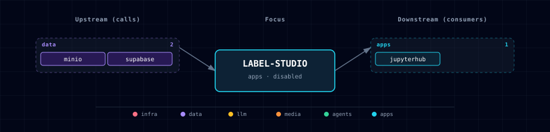

# 5.2.23. Label Studio

## 1. Overview

Label Studio is Atlas' disabled-by-default dataset review and annotation surface for ML, RAG, and creative outputs. It runs the Apache-2.0 community image `heartexlabs/label-studio:1.23.0`, stores application metadata in a dedicated Supabase Postgres database, and uses a scoped MinIO bucket for S3-compatible media/upload storage.

## 2. Access

| Path | URL | Notes |
|---|---|---|
| Kong | `http://label-studio.localhost:${KONG_HTTP_PORT}` | Routed only when `LABEL_STUDIO_SOURCE=container`; fronted by Atlas dashboard basic auth. |
| Direct | `http://localhost:${LABEL_STUDIO_PORT}` | Host-port path for local development. |
| In-network | `http://label-studio:8080` | Used by notebooks and future service consumers. |

The initial upstream user is controlled by `LABEL_STUDIO_USERNAME` and `LABEL_STUDIO_PASSWORD`; Atlas maps them to Label Studio's upstream `USERNAME` and `PASSWORD` bootstrap env vars. `DISABLE_SIGNUP_WITHOUT_LINK=true` is set so broad self-signup is not the default posture.

## 3. Configuration

```env
LABEL_STUDIO_SOURCE=disabled
LABEL_STUDIO_DB_NAME=label_studio
LABEL_STUDIO_DB_USER=label_studio
LABEL_STUDIO_USERNAME=admin@atlas.local
MINIO_BUCKET_LABEL_STUDIO=label-studio
```

Track: `ml-eng`. Category: `apps`. The service is not included in `data-eng`; that track stays focused on lakehouse runtime services from the data-eng-lab handoff.

## 4. Architecture & Wiring

When enabled, `label-studio-init` creates the dedicated Postgres database and role after `minio-init` provisions the `label-studio` bucket and scoped service account. The app container receives:

- Postgres metadata settings via `DJANGO_DB=default` and `POSTGRE_*`.
- S3-compatible storage settings via `STORAGE_TYPE=s3`, `STORAGE_AWS_ENDPOINT_URL=http://minio:9000`, and the scoped `MINIO_LABEL_STUDIO_*` credentials.
- `LABEL_STUDIO_HOST` and `CSRF_TRUSTED_ORIGINS` for the Kong alias.
- `LABEL_STUDIO_USER_TOKEN`, exposed as upstream `USER_TOKEN`, for API/notebook smoke paths.

Label Studio's S3/import/export storage connections remain project-specific in upstream Label Studio. Atlas provisions the bucket and credentials, but each project still chooses source/target storage in the Label Studio UI or API.

### 4.1 Notebook Export Loop

JupyterHub receives `LABEL_STUDIO_URL` and `LABEL_STUDIO_API_URL` when the service is enabled and includes `label-studio-sdk`. A notebook can export annotations and then log artifacts to MLflow or upsert reviewed rows into Weaviate:

```python
import os
from label_studio_sdk import Client

client = Client(url=os.environ["LABEL_STUDIO_API_URL"], api_key=os.environ["LABEL_STUDIO_API_KEY"])
project = client.get_project(1)
annotations = project.export_tasks(export_type="JSON")
```

MLflow and Weaviate export examples are intentionally notebook-owned in this first slice; the Label Studio service does not automatically write model registry entries or vector collections.

## 5. Dependencies & Integrations

### 5.1 Current — Upstream (this service calls)

| Service | Category |
|---|---|
| minio | data |
| supabase | data |

### 5.2 Current — Downstream (services that call this)

| Service | Category |
|---|---|
| jupyterhub | apps |

### 5.3 Architecture diagram



[Open the interactive HTML diagram](./architecture.html) for a full-screen view.

### 5.4 Future — Missing pair integrations

- **backend ↔ label-studio** — *Why:* active-learning loops could enqueue model predictions and review tasks from backend workflows. *Mechanism:* backend REST client using `LABEL_STUDIO_API_URL` and `LABEL_STUDIO_USER_TOKEN`, with explicit project IDs and provenance fields. *Effort:* medium. *Confidence:* medium.
- **label-studio ↔ weaviate** — *Why:* reviewed annotations should become curated vector metadata for retrieval/evaluation. *Mechanism:* notebook or backend export job reads Label Studio JSON and upserts namespaced Weaviate objects. *Effort:* small. *Confidence:* high.
- **label-studio ↔ mlflow** — *Why:* reviewed datasets and evaluator labels should be attached to MLflow runs. *Mechanism:* notebook export logs JSON artifacts/metrics to `MLFLOW_TRACKING_URI`. *Effort:* small. *Confidence:* high.

### 5.5 Future — Candidate new services

SSO/permissions work should land before Label Studio is treated as a broad multi-user review platform. Label Studio CE has its own auth model; Atlas does not integrate it with Supabase Auth in this slice.

### 5.6 Future — Unused features in this service

Enterprise review workflows, role-based permissions, and organization-wide SSO are intentionally out of scope for the first Atlas integration.

## 6. Troubleshooting

- **Route missing:** confirm `LABEL_STUDIO_SOURCE=container`; Kong only emits `label-studio.localhost` when the service is enabled.
- **Storage errors:** confirm `MINIO_SOURCE=container`; Label Studio requires MinIO for this Atlas slice.
- **Login unavailable:** use `LABEL_STUDIO_USERNAME` and the generated `LABEL_STUDIO_PASSWORD` from `.env`.
- **Project storage not visible:** add the provisioned MinIO bucket as a project-specific source or target storage connection in Label Studio.
