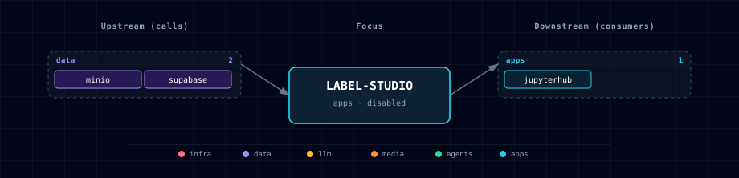

# 5.2.24. Label Studio

## 1. Overview

Label Studio is Atlas's disabled-by-default dataset review and annotation surface for ML, RAG and creative outputs. It runs the Apache-2.0 community image `heartexlabs/label-studio:1.23.0`. It stores application metadata in a dedicated Supabase Postgres database and media and uploads in a scoped, S3-compatible MinIO bucket.

## 2. Access

| Path | URL | Notes |
|---|---|---|
| Kong | `http://label-studio.localhost:${KONG_HTTP_PORT}` | Routed only when `LABEL_STUDIO_SOURCE=container`; fronted by Atlas dashboard basic auth. |
| Direct | `http://localhost:${LABEL_STUDIO_PORT}` | Host-port path for local development. |
| In-network | `http://label-studio:8080` | Used by notebooks and future service consumers. |

`LABEL_STUDIO_USERNAME` and `LABEL_STUDIO_PASSWORD` set the initial user; Atlas maps them to Label Studio's `USERNAME` and `PASSWORD` bootstrap env vars. `DISABLE_SIGNUP_WITHOUT_LINK=true` turns off open self-signup.

## 3. Configuration

```env
LABEL_STUDIO_SOURCE=disabled
LABEL_STUDIO_DB_NAME=label_studio
LABEL_STUDIO_DB_USER=label_studio
LABEL_STUDIO_USERNAME=admin@atlas.local
MINIO_BUCKET_LABEL_STUDIO=label-studio
```

Track: `ml-eng` (not `data-eng`). Category: `apps`.

## 4. Architecture & Wiring

When the service is enabled, `supabase-db-init` creates the dedicated Postgres database and role (`services/supabase/db/scripts/05-scoped-roles.sh`). `minio-init` provisions the `label-studio` bucket and a scoped service account, and `label-studio-init` then verifies the login. The app container receives:

- Postgres metadata settings via `DJANGO_DB=default` and `POSTGRE_*`.
- S3-compatible storage settings via `STORAGE_TYPE=s3`, `STORAGE_AWS_ENDPOINT_URL=http://minio:9000`, and the scoped `MINIO_LABEL_STUDIO_*` credentials.
- `LABEL_STUDIO_HOST` and `CSRF_TRUSTED_ORIGINS` for the Kong alias.
- `LABEL_STUDIO_USER_TOKEN`, exposed as upstream `USER_TOKEN`, for API/notebook smoke paths.

`SSRF_PROTECTION_ENABLED=true` is set, so a task import from a URL cannot fetch private or internal addresses (other Atlas services, cloud metadata endpoints). Upstream Label Studio 1.23 turns it off by default. The setting does not cover ML backend URLs.

Storage connections are project-specific in Label Studio. Atlas provisions the bucket and credentials, but each project selects its source and target storage in the Label Studio UI or API.

### 4.1. Notebook Export Loop

JupyterHub receives `LABEL_STUDIO_URL`, `LABEL_STUDIO_API_URL` and `LABEL_STUDIO_API_KEY` when the service is enabled. The optional `label-studio-sdk` is intentionally not bundled. Releases up to 2.1.0 pin `datamodel-code-generator==0.26.1`, which has published advisories; 2.1.1 and later require `>=0.70.0`. If you install the SDK yourself, use 2.1.1 or later. Use `httpx` for the REST flow, then log exported artifacts to MLflow or upsert reviewed rows into Weaviate:

```python
import os
import httpx

response = httpx.get(
    f'{os.environ["LABEL_STUDIO_API_URL"].rstrip("/")}/api/projects/1/export',
    headers={"Authorization": f'Token {os.environ["LABEL_STUDIO_API_KEY"]}'},
    params={"exportType": "JSON"},
    timeout=60,
)
response.raise_for_status()
annotations = response.json()
```

MLflow and Weaviate exports are notebook-owned. The Label Studio service does not write model registry entries or vector collections.

## 5. Dependencies & Integrations

### 5.1. Current — Upstream (this service calls)

| Service | Category |
|---|---|
| minio | data |
| supabase | data |

### 5.2. Current — Downstream (services that call this)

| Service | Category |
|---|---|
| kong | infra |
| jupyterhub | apps |

### 5.3. Architecture diagram



[Open the full-size diagram](./architecture.html) for a full-screen view.

### 5.4. Future — Missing pair integrations

- **backend ↔ label-studio** — *Why:* active-learning loops could enqueue model predictions and review tasks from backend workflows. *Mechanism:* backend REST client using `LABEL_STUDIO_API_URL` and `LABEL_STUDIO_USER_TOKEN`, with explicit project IDs and provenance fields. *Effort:* medium. *Confidence:* medium.
- **label-studio ↔ weaviate** — *Why:* reviewed annotations should become curated vector metadata for retrieval/evaluation. *Mechanism:* notebook or backend export job reads Label Studio JSON and upserts namespaced Weaviate objects. *Effort:* small. *Confidence:* high.
- **label-studio ↔ mlflow** — *Why:* reviewed datasets and evaluator labels should be attached to MLflow runs. *Mechanism:* notebook export logs JSON artifacts/metrics to `MLFLOW_TRACKING_URI`. *Effort:* small. *Confidence:* high.

### 5.5. Future — Candidate new services

Add SSO and permissions before you use Label Studio as a multi-user review platform. Label Studio CE has its own auth model; Atlas does not integrate it with Supabase Auth.

### 5.6. Future — Unused features in this service

Enterprise review workflows, role-based permissions and organization-wide SSO are out of scope.

## 6. Troubleshooting

- **Route missing:** confirm `LABEL_STUDIO_SOURCE=container`; Kong only emits `label-studio.localhost` when the service is enabled.
- **Storage errors:** confirm `MINIO_SOURCE=container`; Label Studio requires MinIO.
- **Login unavailable:** use `LABEL_STUDIO_USERNAME` and the generated `LABEL_STUDIO_PASSWORD` from `.env`.
- **Project storage not visible:** add the provisioned MinIO bucket as a project-specific source or target storage connection in Label Studio.

## 7. Capabilities & limitations

Support tier: **experimental** — Capability contract declared; no cited cold-start, workflow, or upgrade qualification run yet (evidence at `v0.1.0`).

| Capability | Status | Verification | Notes |
|---|---|---|---|
| Human dataset review and annotation | supported | tested | Atlas starts the Label Studio UI/API with a dedicated Postgres role and initial administrator for operator-created labeling projects. |
| Scoped MinIO project storage | partial | tested | Atlas provisions a dedicated bucket and credentials, but each project must still configure its own import or export storage connection in Label Studio. |
| Notebook export integration | partial | tested | JupyterHub receives the Label Studio URL and legacy API token for REST exports, while MLflow, Weaviate, and Backend review loops remain notebook-owned or future work. |
| Label Studio access control | partial | tested | The direct port relies on Label Studio login and disabled open signup. Kong adds dashboard Basic Auth and ACL. Atlas does not integrate Supabase SSO or enterprise roles. |
| Annotation service high availability | not-supported | documented | Postgres and MinIO preserve metadata and assets. Atlas runs one Label Studio replica and one local data volume, without a tested backup or failover workflow. |
