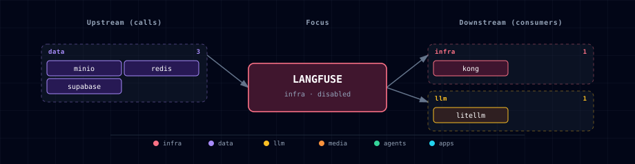

# 5.2.24. Langfuse (LLM traces + evals)

## 1. Overview

Langfuse is an optional, disabled-by-default observability surface for LLM traces, prompt/eval history, latency, and cost inspection. Atlas wires it to LiteLLM first: calls that already pass through LiteLLM can emit Langfuse traces through LiteLLM's `success_callback`.

Langfuse complements Prometheus and Grafana. Prometheus/Grafana remain the infrastructure metrics and dashboard layer; Langfuse is the LLM behavior layer. Direct ComfyUI traces, Hermes custom spans, backend custom spans, n8n step spans, and OpenTelemetry fan-out are out of scope for the first slice.

## 2. Access

| Surface | URL | Notes |
| --- | --- | --- |
| Kong | `http://langfuse.localhost:${KONG_HTTP_PORT}` | Routed only when `LANGFUSE_SOURCE=container`. |
| Direct | `http://localhost:${LANGFUSE_PORT}` | Bound through `HOST_BIND_IP`; production profile keeps it local. |

The first-run user is controlled by `LANGFUSE_INIT_USER_EMAIL`, `LANGFUSE_INIT_USER_NAME`, and `LANGFUSE_INIT_USER_PASSWORD`. The initial project keys are `LANGFUSE_PUBLIC_KEY` and `LANGFUSE_SECRET_KEY`; LiteLLM uses those for gateway tracing.

## 3. Configuration

```dotenv
LANGFUSE_SOURCE=disabled              # container | disabled
LANGFUSE_PORT=                        # topology-assigned
LANGFUSE_ENDPOINT=                    # auto-managed
LANGFUSE_PUBLIC_KEY=                  # auto-generated
LANGFUSE_SECRET_KEY=                  # auto-generated
LANGFUSE_SALT=                        # auto-generated
LANGFUSE_ENCRYPTION_KEY=              # auto-generated
LANGFUSE_NEXTAUTH_SECRET=             # auto-generated
LANGFUSE_CLICKHOUSE_PASSWORD=         # auto-generated
MINIO_BUCKET_LANGFUSE=langfuse
```

Current Langfuse self-hosting uses a web container, worker container, Postgres, ClickHouse, Redis/Valkey, and S3/blob storage. Atlas reuses Supabase Postgres, Redis, and MinIO, and adds a Langfuse-owned ClickHouse container. This is a low-scale local Docker Compose deployment, not a high-availability production Langfuse cluster.

## 4. Architecture & Wiring

When enabled, the family starts:

- `langfuse-init`: creates the Langfuse Postgres database after `minio-init` provisions the bucket/service account.
- `langfuse-clickhouse`: stores traces, observations, and scores.
- `langfuse-web`: serves the UI and ingestion APIs.
- `langfuse-worker`: processes queued ingestion work.

LiteLLM receives `LANGFUSE_BASE_URL`, `LANGFUSE_PUBLIC_KEY`, and `LANGFUSE_SECRET_KEY`. The generated LiteLLM config adds `success_callback: ["langfuse"]` only while `LANGFUSE_SOURCE=container`; disabling Langfuse removes the callback on the next config render. Existing Prometheus callbacks stay in place.

## 5. Dependencies & Integrations

### 5.1. Current — Upstream (this service calls)

| Service | Category |
|---|---|
| minio | data |
| redis | data |
| supabase | data |

### 5.2. Current — Downstream (services that call this)

| Service | Category |
|---|---|
| kong | infra |
| litellm | llm |

### 5.3. Architecture diagram



[Open the full-size diagram](./architecture.html) for a full-screen view.

### 5.4. Future — Missing pair integrations

_No high-confidence opportunities identified._

### 5.5. Future — Candidate new services

_No high-confidence opportunities identified._

### 5.6. Future — Unused features in this service

_No high-confidence opportunities identified._

## 6. Troubleshooting

- **No traces appear:** confirm `LANGFUSE_SOURCE=container`, restart after the LiteLLM config regenerates, and check that `LANGFUSE_PUBLIC_KEY` / `LANGFUSE_SECRET_KEY` match the initial project keys.
- **Langfuse fails to start with MinIO errors:** keep `MINIO_SOURCE=container`; Langfuse requires S3-compatible event storage in this Atlas slice.
- **Rollback to direct LiteLLM behavior:** the rollback path is to set `LANGFUSE_SOURCE=disabled` and rerun `./start.sh`. The Langfuse containers scale to zero, Kong stops routing `langfuse.localhost`, and LiteLLM no longer emits the Langfuse `success_callback`.
- **ClickHouse timezone or empty queries:** keep ClickHouse and Postgres on UTC. The compose fragment sets ClickHouse `TZ=UTC`.
