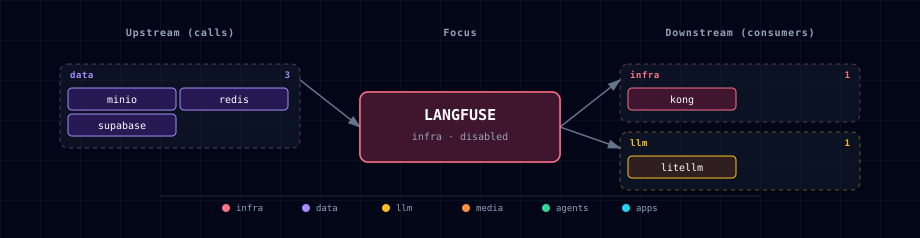

# 5.2.25. Langfuse (LLM traces + evals)

## 1. Overview

Langfuse is an optional, disabled-by-default store for LLM traces, prompt and eval history, latency and cost. LiteLLM sends a trace for every call through its `success_callback` and `failure_callback`, so failed, timed-out and rate-limited calls are traced too.

Prometheus and Grafana stay the infrastructure metrics layer; Langfuse covers LLM behavior. Section 4.2 lists what is traced.

## 2. Access

| Surface | URL | Notes |
| --- | --- | --- |
| Kong | `http://langfuse.localhost:${KONG_HTTP_PORT}` | Routed only when `LANGFUSE_SOURCE=container`; guarded by the Kong dashboard basic-auth (`DASHBOARD_USERNAME` / `DASHBOARD_PASSWORD`) before the Langfuse login. |
| Direct | `http://localhost:${LANGFUSE_PORT}` | Bound through `HOST_BIND_IP` (default `127.0.0.1:`, loopback only). Set `0.0.0.0:` or a LAN address for deliberate remote access. An empty value also binds all interfaces. |

The first-run user is controlled by `LANGFUSE_INIT_USER_EMAIL`, `LANGFUSE_INIT_USER_NAME`, and `LANGFUSE_INIT_USER_PASSWORD`. The initial project keys are `LANGFUSE_PUBLIC_KEY` and `LANGFUSE_SECRET_KEY`; LiteLLM uses those for gateway tracing.

## 3. Configuration

```dotenv
LANGFUSE_SOURCE=disabled              # container | disabled
LANGFUSE_PORT=                        # topology-assigned
LANGFUSE_ENDPOINT=                    # auto-managed
LANGFUSE_PUBLIC_KEY=                  # auto-generated
LANGFUSE_SECRET_KEY=                  # auto-generated
LANGFUSE_SALT=                        # auto-generated
LANGFUSE_ENCRYPTION_KEY=              # auto-generated
LANGFUSE_NEXTAUTH_SECRET=             # auto-generated
LANGFUSE_CLICKHOUSE_PASSWORD=         # auto-generated
MINIO_BUCKET_LANGFUSE=langfuse
```

Langfuse self-hosting needs a web container, a worker container, Postgres, ClickHouse, Redis/Valkey and S3/blob storage. Atlas reuses Supabase Postgres, Redis and MinIO, and adds a Langfuse-owned ClickHouse container. This is a low-scale local Docker Compose deployment, not a high-availability production cluster.

## 4. Architecture & Wiring

When enabled, the family starts:

- `langfuse-init`: after `minio-init` provisions the bucket and service account, checks the Langfuse Postgres database. `supabase-db-init` creates that database (`services/supabase/db/scripts/05-scoped-roles.sh`).
- `langfuse-clickhouse`: stores traces, observations, and scores. A compose `configs:` entry mounted into `config.d` keeps ClickHouse's own system log tables (`metric_log`, `text_log`, `trace_log` and others) for 7 days. It also sets logging to `warning` level, 3 × 100 MB. Without it they grow about 126 MB a day while idle. On a volume created before this, ClickHouse renames a changed system table to `<name>_0`; drop those once to reclaim the space.
- `langfuse-web`: serves the UI and ingestion APIs.
- `langfuse-worker`: processes queued ingestion work.

LiteLLM receives `LANGFUSE_HOST`, `LANGFUSE_BASE_URL`, `LANGFUSE_PUBLIC_KEY`, and `LANGFUSE_SECRET_KEY`. The generated LiteLLM config adds `success_callback: ["langfuse"]` and `failure_callback: ["langfuse"]` only while `LANGFUSE_SOURCE=container`. Disabling Langfuse removes both callbacks on the next config render. Existing Prometheus callbacks stay in place.

Media attachments are not browser-viewable. `LANGFUSE_S3_MEDIA_UPLOAD_ENDPOINT` is the in-network `http://minio:9000`, so presigned URLs given to the browser or to host-side SDK uploads point at a host they cannot resolve. Text traces (all LiteLLM traffic) are unaffected.

### 4.1. Why two host variables

Both `LANGFUSE_HOST` and `LANGFUSE_BASE_URL` hold the same endpoint. The variable name changed across SDK majors, and a wrong name **fails silently**:

| SDK | Reads | If unset |
|---|---|---|
| langfuse-python **v2** (bundled in the pinned LiteLLM image) | `LANGFUSE_HOST` only | defaults to `https://cloud.langfuse.com` |
| langfuse-python **v4** | `LANGFUSE_BASE_URL`, with `LANGFUSE_HOST` as a deprecated alias | defaults to `https://cloud.langfuse.com` |

With only `LANGFUSE_BASE_URL` set, the v2 SDK sends every trace to the public cloud, which rejects the local keys and drops the data. LiteLLM still logs `Initialized Success Callbacks - ['langfuse']`, and every call succeeds. Setting both keeps tracing correct on the current pin and after a later image bumps the SDK.

### 4.2. What is actually traced

Coverage is **exactly what passes through the LiteLLM gateway**. Open WebUI (`OPENAI_API_BASE_URLS: http://litellm:4000/v1`), the backend and LightRAG's default binding all route through it.

The exception is LightRAG's **per-role binding overrides**. `LIGHTRAG_EXTRACT_LLM_BINDING_HOST`, `LIGHTRAG_KEYWORD_LLM_BINDING_HOST` and `LIGHTRAG_QUERY_LLM_BINDING_HOST` can point a role straight at a native provider such as Ollama, bypassing LiteLLM. Those calls produce **no Langfuse traces**, and nothing warns about it.

Direct ComfyUI traces, Hermes custom spans, backend custom spans, n8n step spans, and OpenTelemetry fan-out are out of scope. LiteLLM's OTel export (its `otel` callback, enabled with `ATLAS_OTEL_ENABLED`) is independent of the Langfuse callback.

## 5. Dependencies & Integrations

### 5.1. Current — Upstream (this service calls)

| Service | Category |
|---|---|
| minio | data |
| redis | data |
| supabase | data |

### 5.2. Current — Downstream (services that call this)

| Service | Category |
|---|---|
| kong | infra |
| litellm | llm |

### 5.3. Architecture diagram



[Open the full-size diagram](./architecture.html) for a full-screen view.

### 5.4. Future — Missing pair integrations

_No high-confidence opportunities identified._

### 5.5. Future — Candidate new services

_No high-confidence opportunities identified._

### 5.6. Future — Unused features in this service

_No high-confidence opportunities identified._

## 6. Troubleshooting

- **No traces appear and nothing errors.** The SDK fails silently. Check in this order:
  1. `LANGFUSE_SOURCE=container`, and the regenerated LiteLLM config has the `langfuse` callback.
  2. `docker exec <project>-litellm printenv LANGFUSE_HOST` prints your local endpoint. If it is empty, the SDK sends traces to `https://cloud.langfuse.com`. That host rejects your keys and drops the data without a log line.
  3. `LANGFUSE_PUBLIC_KEY` and `LANGFUSE_SECRET_KEY` match the initial project keys.
  4. The call went through LiteLLM (§4.2). A LightRAG role bound to a native provider never reaches it.

  To probe end to end, make one chat completion through LiteLLM. Then run `curl -u "$LANGFUSE_PUBLIC_KEY:$LANGFUSE_SECRET_KEY" http://localhost:${LANGFUSE_PORT}/api/public/traces` and check that `meta.totalItems` went up. Use the direct port: through Kong, the dashboard basic auth takes the `Authorization` header.
- **`langfuse-web` is `(unhealthy)` but the UI works.** Next.js binds `$HOSTNAME`, which Docker sets to the container ID, so loopback probes fail. Atlas sets `HOSTNAME=0.0.0.0`. If the problem returns, check `docker exec <project>-langfuse-web printenv HOSTNAME`.
- **Langfuse is auto-disabled at start:** Langfuse needs MinIO for S3-compatible event storage. With `MINIO_SOURCE=disabled`, `./start.sh` reports a dependency violation and scales Langfuse to 0. Set `MINIO_SOURCE=container`.
- **Rollback to direct LiteLLM behavior:** for a rollback, set `LANGFUSE_SOURCE=disabled` and rerun `./start.sh`. The Langfuse containers scale to zero, Kong stops routing `langfuse.localhost`, and LiteLLM no longer emits the Langfuse `success_callback` / `failure_callback`.
- **ClickHouse timezone or empty queries:** keep ClickHouse and Postgres on UTC. The compose fragment sets ClickHouse `TZ=UTC`.

## 7. Capabilities & limitations

Support tier: **experimental** — Capability contract declared; no cited cold-start, workflow, or upgrade qualification run yet (evidence at `v0.1.0`).

| Capability | Status | Verification | Notes |
|---|---|---|---|
| Self-hosted LLM observability stack | supported | tested | Atlas configures the Langfuse web, worker, ClickHouse, Postgres, Redis, and MinIO dependencies as one optional self-hosted deployment. |
| Automatic LiteLLM trace capture | partial | tested | LiteLLM success callbacks emit traces when Langfuse is enabled, but calls that bypass LiteLLM or use native provider bindings are not captured automatically. |
| Highly available Langfuse deployment | not-supported | documented | The stock topology is a local low-scale deployment without replicated Langfuse, ClickHouse, or supporting data-store services. |
