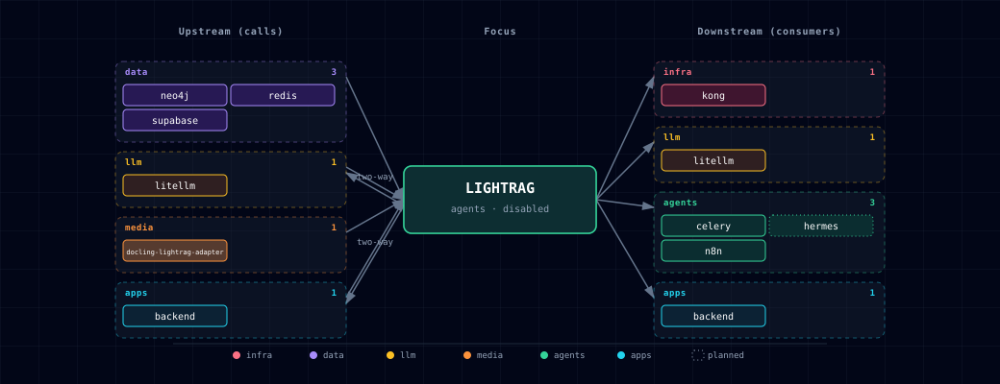

# 5.2.26. LightRAG

> **Image:** `ghcr.io/hkuds/lightrag:v1.5.4`
> **Container port:** 9621 (API + WebUI)  · **Default host port:** allocated by `topology.py` (agents band 63070–63089)
> **Default:** disabled

## 1. Overview

[LightRAG](https://github.com/HKUDS/LightRAG) is a graph-augmented RAG server. It ingests documents (PDF, Office, images, tables, equations) and extracts a knowledge graph with an LLM. It embeds chunks and entities in a vector store. Its query API combines graph traversal with vector search.

In this stack, LightRAG reuses existing infrastructure:

- **LLM + embeddings** routed through LiteLLM (`LLM_BINDING_HOST=http://litellm:4000/v1`).
- **Vector store** → Supabase pgvector (`PGVectorStorage`).
- **Graph store** → Neo4j (`Neo4JStorage`). `LIGHTRAG_NEO4J_URI` follows `NEO4J_GRAPH_DB_SOURCE`: `bolt://neo4j-graph-db:7687` for the container, `bolt://host.docker.internal:${NEO4J_LOCALHOST_BOLT_PORT}` for a host-run Neo4j.
- **KV + doc-status** → Redis (`RedisKVStorage`).
- **Document parsing** → LightRAG's `native` engine for docx/md/textpack, and `legacy` text extraction for everything else, including PDFs. Compose fixes `LIGHTRAG_PARSER=*:native-teP,*:legacy-R`; `.env` cannot change it. When in-stack LightRAG and Docling are both enabled, a file goes to Docling only if its name has the `.[docling].` hint (for example `report.[docling].pdf`). Docling is reached through an isolated adapter (`LIGHTRAG_DOCLING_ENDPOINT`) that holds the Docling credential (§4.3).
- **Credentials** → the base and embedding LLM bindings always send `LITELLM_MASTER_KEY`. Point `LIGHTRAG_LLM_BINDING_HOST` and `LIGHTRAG_EMBEDDING_BINDING_HOST` only at LiteLLM. Any other host, native Ollama included, also receives the master key.
- **Reranking** is off by default. To enable it, set `LIGHTRAG_RERANK_ADAPTER_ENABLED=true` with `TEI_RERANKER_SOURCE` enabled (see §3 and the [backend README §5.1](../backend/README.md)).

When Supabase, Neo4j or Redis is disabled, Atlas clears that backend's connection URI but keeps the storage selector. Atlas does not select file-backed storage automatically. For a file-backed mode, set the `LIGHTRAG_*_STORAGE` selector yourself and provide persistence. Images are extracted as text unless the file has the `.[docling].` hint and Docling is enabled.

## 2. Source variants

| Source | Scale | Endpoint | Notes |
|---|---|---|---|
| `container` | 1 | `http://lightrag:9621` | In-stack LightRAG |
| `localhost` | 0 | `http://host.docker.internal:${LIGHTRAG_LOCALHOST_PORT}` | Host-installed LightRAG |
| `disabled` | 0 | `""` | LightRAG off; consumers see empty endpoint |

## 3. Configuration

Storage selectors and model bindings can be overridden via `.env`:

```env
LIGHTRAG_SOURCE=disabled                            # default
LIGHTRAG_KV_STORAGE=RedisKVStorage                  # alt: JsonKVStorage
LIGHTRAG_VECTOR_STORAGE=PGVectorStorage             # alt: NanoVectorDBStorage, QdrantVectorDBStorage, ...
LIGHTRAG_GRAPH_STORAGE=Neo4JStorage                 # alt: NetworkXStorage, MemgraphStorage, AGEStorage
LIGHTRAG_DOC_STATUS_STORAGE=RedisDocStatusStorage   # alt: PGDocStatusStorage, JsonDocStatusStorage
LIGHTRAG_LLM_MODEL=                                 # empty = inherit LITELLM_DEFAULT_MODEL
LIGHTRAG_EXTRACT_LLM_MODEL=                         # empty = inherit LLM_MODEL
LIGHTRAG_KEYWORD_LLM_MODEL=                         # empty = inherit LLM_MODEL
LIGHTRAG_QUERY_LLM_MODEL=                           # empty = inherit LLM_MODEL
LIGHTRAG_EXTRACT_MAX_ASYNC_LLM=                     # empty = inherit MAX_ASYNC_LLM
LIGHTRAG_QUERY_LLM_TIMEOUT=                         # empty = inherit LLM_TIMEOUT
LIGHTRAG_QUERY_ENABLE_RERANK=false                  # rerank via backend adapter; needs LIGHTRAG_RERANK_ADAPTER_ENABLED=true + TEI
LIGHTRAG_QUERY_TOP_K=10                             # graph query KG top-k
LIGHTRAG_QUERY_CHUNK_TOP_K=5                        # graph query chunk top-k
LIGHTRAG_QUERY_MAX_TOTAL_TOKENS=12000               # graph query context budget
LIGHTRAG_EMBEDDING_MODEL=                           # empty = inherit LITELLM_EMBEDDING_MODEL
LIGHTRAG_VLM_PROCESS_ENABLE=true                    # vision LLM for images/figures
```

LightRAG v1.5 has separate LLM settings for three roles: extraction, keyword extraction and query answering. Atlas exposes them as `LIGHTRAG_EXTRACT_*`, `LIGHTRAG_KEYWORD_*` and `LIGHTRAG_QUERY_*`, and maps them to LightRAG's `EXTRACT_*`, `KEYWORD_*` and `QUERY_*`. An empty role value inherits the base `LLM_*` setting. When `LIGHTRAG_LLM_MODEL` is empty, `lightrag-init` resolves the base model.

Role API keys (`LIGHTRAG_EXTRACT_LLM_BINDING_API_KEY`, `LIGHTRAG_KEYWORD_LLM_BINDING_API_KEY`, `LIGHTRAG_QUERY_LLM_BINDING_API_KEY`) are resolved at start by `init/scripts/resolve-role-keys.py`. It follows LightRAG 1.5.4's own host resolution:

- An empty role host means the base `LLM_BINDING_HOST`. An `azure_openai` role on its own binding defaults to `AZURE_OPENAI_ENDPOINT` instead.
- If the role's effective host is the in-network LiteLLM (`litellm:4000`), an empty key becomes `LITELLM_MASTER_KEY`. LiteLLM-routed roles need no key wiring.
- If a role has its own binding or host that resolves anywhere else, set its key. Otherwise the container stops at start and names the variable. This keeps the master key inside LiteLLM.
- A role that only mirrors the base binding and host is left unchanged. A Bedrock role never gets a key; LightRAG signs it with AWS credentials.

> **Observability caveat.** A role whose `*_LLM_BINDING_HOST` points at a native provider (for example Ollama directly) is **off the LiteLLM gateway**. Langfuse tracing in Atlas is gateway-level, so that role's calls produce no traces, and nothing warns. See [Langfuse §4.2](../langfuse/README.md).

**Catalog request defaults across the role boundary.** A model's `request_defaults` in the Ollama catalog (`services/ollama/models.yaml`) reach the model only through LiteLLM. The catalog sets `think: false` on `qwen3.8:latest`. `litellm-init` renders them into the model's `litellm_params`.

A native LightRAG 1.5.4 binding does not send them. The Ollama binding forwards only Ollama's `options` object ([`binding_options.py#L435`](https://github.com/HKUDS/LightRAG/blob/v1.5.4/lightrag/llm/binding_options.py#L435), [`lightrag_server.py#L1739-L1740`](https://github.com/HKUDS/LightRAG/blob/v1.5.4/lightrag/api/lightrag_server.py#L1739-L1740)), and `think` is a top-level field beside it. So `resolve-role-keys.py` reads the catalog (read-only mount) and sets each role's transport at start:

- **A role that would inherit a native base stays on LiteLLM.** Example: `LIGHTRAG_LLM_BINDING` and `LIGHTRAG_LLM_BINDING_HOST` point at `ollama` on `http://host.docker.internal:11434` (`LLM_PROVIDER_SOURCE=ollama-localhost`). Take a role whose model declares catalog `request_defaults` and that sets no binding, host or key. Atlas binds it to `openai` at `http://litellm:4000/v1` with the LiteLLM master key.
  - LiteLLM applies the defaults, so the role sends the same request it would on the default path.
  - The cost is one gateway hop for that role, which also brings it back under Langfuse tracing.
  - The role's model must be one LiteLLM serves. Every Ollama catalog model is while an `ollama-*` `LLM_PROVIDER_SOURCE` is selected.
  - A routed `EXTRACT` is no longer bound to Ollama, so the `EXTRACT_OLLAMA_LLM_*` caps below do not apply to it.
- **A role whose model declares none keeps the base binding.** Embedding entries, and chat entries without `request_defaults`, resolve as before. A role on such a model still goes native.
- **Explicit role settings win.** A role that sets its own `LIGHTRAG_<ROLE>_LLM_BINDING`, `_BINDING_HOST` or `_BINDING_API_KEY` is never re-routed. If those settings put it on a native host, it cannot receive its model's defaults, and the start log and doctor say so.
- **Where to see it.** At start, the container logs one `lightrag: <ROLE> role: …` line per role, with binding, host, model and request defaults (never a key). `./start.sh doctor` reports the same in its `lightrag-role-transport` check and warns when a role loses its defaults. LightRAG's `/health` shows each role's `binding`, `host` and `model` under `configuration.role_llm_config`, with keys stripped.
- **End-to-end test.** On a development stack, `scripts/smoke-lightrag-role-models.sh` uploads a document, runs a query, and checks LiteLLM's logs for each role's model. The two role models must differ. `LIGHTRAG_SMOKE_WAIT_SECONDS` (default 30) sets the extraction wait.

Atlas also exposes LightRAG's query defaults: `LIGHTRAG_QUERY_ENABLE_RERANK`, `LIGHTRAG_QUERY_TOP_K`, `LIGHTRAG_QUERY_CHUNK_TOP_K` and `LIGHTRAG_QUERY_MAX_TOTAL_TOKENS`. The numeric values default to integers, because LightRAG v1.5 parses them as integers and rejects empty strings.

**Reranking.** `LIGHTRAG_QUERY_ENABLE_RERANK` defaults to `false`. LightRAG's Jina/Cohere rerank clients send `{query, documents}`, but TEI's `/rerank` expects `{query, texts}`, so Atlas never wires LightRAG directly to TEI. To rerank, set `LIGHTRAG_RERANK_ADAPTER_ENABLED=true` with `TEI_RERANKER_SOURCE` enabled. Atlas then sets `RERANK_BINDING=jina` and `RERANK_BINDING_HOST=http://backend:8000/lightrag/rerank`, and passes the adapter's bearer token as `RERANK_BINDING_API_KEY`. See the [backend README §5.1](../backend/README.md).

For local Ollama graph RAG, use a fast non-reasoning model for `EXTRACT` and `KEYWORD`, and reserve the stronger answer model for `QUERY`:

```env
LIGHTRAG_LLM_MODEL=qwen3.8:latest
LIGHTRAG_EXTRACT_LLM_MODEL=mistral-small3.2:24b
LIGHTRAG_KEYWORD_LLM_MODEL=mistral-small3.2:24b
LIGHTRAG_QUERY_LLM_MODEL=qwen3.8:latest
```

Atlas does not ship these model names as defaults. Without role variables, LightRAG uses one model for all roles.

**Extract-role generation caps on native Ollama.** To run only the EXTRACT role on native Ollama, set its model, binding, host and key:

```env
LIGHTRAG_EXTRACT_LLM_MODEL=mistral-small3.2:24b          # required for a role on its own binding
LIGHTRAG_EXTRACT_LLM_BINDING=ollama
LIGHTRAG_EXTRACT_LLM_BINDING_HOST=http://host.docker.internal:11434
LIGHTRAG_EXTRACT_LLM_BINDING_API_KEY=ollama              # required; any value, see the key note below
LIGHTRAG_EXTRACT_OLLAMA_LLM_NUM_PREDICT=4096              # max output tokens per extract call
LIGHTRAG_EXTRACT_OLLAMA_LLM_NUM_CTX=16384                 # context window for each extract call
```

In LightRAG v1.5.4, a role whose binding differs from the base binding (`openai`, through LiteLLM) sends no provider options unless you set role-scoped ones. Atlas sets the last two lines by default, and LightRAG reads them as `EXTRACT_OLLAMA_LLM_*`.

- **Why the caps matter.** Without them a degenerate extraction generates until a timeout fires, because Ollama's own `num_predict` default is unbounded.
- **Choosing `NUM_PREDICT`.**
  - A dense chunk can legitimately need several thousand output tokens, and a cap that cuts one off loses entities without any error.
  - Extraction results are cached, and the cache key ignores these options, so after raising the cap clear LightRAG's LLM cache (`POST /documents/clear_cache`) to re-extract.
- **Choosing `NUM_CTX`.** The same role runs three kinds of call, so the context window has to fit the largest:
  - the extraction prompt, about 1.75k tokens, with a paragraph chunk of up to 2000 tokens;
  - the gleaning pass, which resends the first answer;
  - merge summaries of up to 12000 input tokens.

  16384 covers all three plus the output cap. It overrides Ollama's VRAM-based default and any `OLLAMA_CONTEXT_LENGTH` for these calls. If other callers load the same model at a different context length, Ollama reloads it on each switch.
- **Keep them numeric.** LightRAG sends a non-integer value, including an empty one, as a string, and Ollama then rejects every extract call. Compose falls back to the defaults above when a value is empty.
- **When they apply.** Both caps take effect only while `EXTRACT` is bound to Ollama. Other bindings ignore them.
- **EXTRACT API key.** On native Ollama the key is required, because LightRAG needs a key for a role on its own binding. Ollama ignores the value, so any string works. If it is empty, the container stops at start and names the variable (role-key rules above).

**Timeouts and failed chunks are upstream behaviour.** Checked against the pinned `lightrag-hku` 1.5.4 source:

- **Per-call timeout.**
  - `LIGHTRAG_EXTRACT_LLM_TIMEOUT` (`EXTRACT_LLM_TIMEOUT`, default `LLM_TIMEOUT`, which is 240 s) reaches the Ollama client as its HTTP timeout ([`lightrag_server.py#L1639-L1643`](https://github.com/HKUDS/LightRAG/blob/v1.5.4/lightrag/api/lightrag_server.py#L1639-L1643), [`ollama.py#L157`](https://github.com/HKUDS/LightRAG/blob/v1.5.4/lightrag/llm/ollama.py#L157)).
  - That timeout is per read, not per request. It works as a per-call deadline here only because extraction calls do not stream, so Ollama sends nothing until it finishes.
  - The hard wall-clock cap is the worker's `asyncio.wait_for` at twice the timeout ([`utils.py#L929-L938`](https://github.com/HKUDS/LightRAG/blob/v1.5.4/lightrag/utils.py#L929-L938), [`#L1274-L1277`](https://github.com/HKUDS/LightRAG/blob/v1.5.4/lightrag/utils.py#L1274-L1277)).
  - `num_predict` only stops a runaway before the timeout does when the model produces `NUM_PREDICT` tokens within it. At the defaults that means roughly 17 tokens per second (4096 in 240 s). On slower hosts, raise `LIGHTRAG_EXTRACT_LLM_TIMEOUT` too.
- **A failed chunk fails its document.**
  - One chunk that times out cancels the document's other chunk tasks ([`operate.py#L3746-L3779`](https://github.com/HKUDS/LightRAG/blob/v1.5.4/lightrag/operate.py#L3746-L3779)).
  - The whole document is marked `FAILED` with nothing merged into the graph ([`pipeline.py#L2534-L2554`](https://github.com/HKUDS/LightRAG/blob/v1.5.4/lightrag/pipeline.py#L2534-L2554)).
  - The drain moves on to the next document ([`pipeline.py#L1998-L2029`](https://github.com/HKUDS/LightRAG/blob/v1.5.4/lightrag/pipeline.py#L1998-L2029)), and the failed one is re-queued on the next processing pass.
  - Skipping just the chunk and keeping a partial graph for that document is not configurable in 1.5.4.

The bootstrapper derives the Docling adapter endpoint; do not set it. It is set only for `LIGHTRAG_SOURCE=container` with Docling enabled. Localhost LightRAG gets an empty endpoint, because the adapter has no host port.

The bootstrapper generates two security variables on first launch and writes them to `.env`:

```env
LIGHTRAG_API_KEY=<auto>          # X-API-Key header for document/query routes; forwarded to LiteLLM
LIGHTRAG_TOKEN_SECRET=<auto>     # JWT signing secret for /login flows
```

LightRAG's default `WHITELIST_PATHS=/health,/api/*` leaves `/health` and the Ollama-compatible `/api/*` chat routes open without a key. Atlas keeps that default, because the LiteLLM `lightrag` model uses `/api/*`.

- A Bearer header that carries the API key is parsed as a JWT and rejected with 401, even with a valid `X-API-Key`.
- Browser access is limited to the Kong origin (`CORS_ORIGINS=http://lightrag.localhost:${KONG_HTTP_PORT}`). LightRAG's default `*` would let any web page read ingested documents through `/api/chat` on the direct port.
- While `/api/*` is open, a blind cross-site POST can still spend model tokens without reading the reply.

Without `LIGHTRAG_TOKEN_SECRET`, LightRAG uses a hardcoded default JWT key, which is a security risk. The bootstrapper generates both values only when they are absent, so values you set are kept. After you rotate `LIGHTRAG_API_KEY`, re-run `litellm-init`: it writes the key into LiteLLM's `lightrag` model.

## 4. Usage

### 4.1. Web UI

Browse `http://lightrag.localhost:${KONG_HTTP_PORT}` (after `--setup-hosts`) or `http://localhost:${LIGHTRAG_API_PORT}/webui`. Upload documents, view the KG, run queries.

### 4.2. Native API

```bash
# Insert a document
curl -sX POST http://localhost:${LIGHTRAG_API_PORT}/documents/upload \
  -H "X-API-Key: ${LIGHTRAG_API_KEY}" \
  -F "file=@my-paper.pdf"

# Query
curl -sX POST http://localhost:${LIGHTRAG_API_PORT}/query \
  -H "X-API-Key: ${LIGHTRAG_API_KEY}" \
  -H "Content-Type: application/json" \
  -d '{"query": "What is graph-augmented RAG?", "mode": "hybrid"}'
```

`/query` takes a `mode` field: `local`, `global`, `hybrid`, `naive`, `mix` or `bypass`. The default is `mix`. A slash prefix in the `query` text does not select a mode on this route; it is sent as part of the question.

### 4.3. Docling adapter protocol

LightRAG v1.5.4 submits document parsing to `POST /v1/convert/file/async` (multipart field `files`), polls `GET /v1/status/poll/{task_id}`, downloads `GET /v1/result/{task_id}`, and probes `GET /health`. Atlas implements exactly those routes in `docling-lightrag-adapter`. The adapter, LightRAG, and `docling-gpu` share only `docling-lightrag-network`; the adapter has no published port and no backend-network membership. LightRAG receives only the adapter endpoint, while the adapter alone receives `DOCLING_API_TOKEN` for its upstream call.

The adapter accepts at most two outstanding jobs by default and returns `429` before reading an upload when full. Result artifacts expire after 900 seconds by default and are deleted after download, failure, cancellation, or expiry. An expired job must be resubmitted. These values are controlled by `DOCLING_ADAPTER_MAX_JOBS` and `DOCLING_ADAPTER_RESULT_TTL_SECONDS` in the Docling manifest.

### 4.4. Via LiteLLM (recommended for other stack services)

When LightRAG is enabled, LiteLLM registers it as the `lightrag` model. Any LiteLLM consumer (open-webui, openclaw, n8n, hermes, backend, local-deep-researcher, jupyterhub) can call it. The model uses LightRAG's Ollama-compatible `/api/chat` route. There, a prefix on the last user message selects the mode: `/local`, `/global`, `/hybrid`, `/naive`, `/mix` or `/bypass`. Without a prefix the mode is `mix`.

```bash
curl -sX POST http://localhost:${LITELLM_PORT}/v1/chat/completions \
  -H "Authorization: Bearer ${LITELLM_MASTER_KEY}" \
  -H "Content-Type: application/json" \
  -d '{
    "model": "lightrag",
    "messages": [
      {"role": "user", "content": "/hybrid What is graph-augmented RAG?"}
    ]
  }'
```

## 5. Dependencies & Integrations

### 5.1. Current — Upstream (this service calls)

| Service | Category |
|---|---|
| neo4j | data |
| redis | data |
| supabase | data |
| litellm ↔ | llm |
| docling-lightrag-adapter | media |
| backend ↔ | apps |

### 5.2. Current — Downstream (services that call this)

_Rows marked planned are documented or intended, not wired yet._

| Service | Category | Status |
|---|---|---|
| kong | infra | current |
| litellm ↔ | llm | current |
| celery | agents | current |
| hermes | agents | planned |
| n8n | agents | current |
| backend ↔ | apps | current |

### 5.3. Architecture diagram



[Open the full-size diagram](./architecture.html) for a full-screen view.

### 5.4. Future — Missing pair integrations

_No high-confidence opportunities identified._

### 5.5. Future — Candidate new services

_No high-confidence opportunities identified._

### 5.6. Future — Unused features in this service

_No high-confidence opportunities identified._

## 6. Storage backend matrix

| Storage role | Default selector | Behavior when the external source is disabled |
|---|---|---|
| KV | `RedisKVStorage` on Redis `db=2` | Redis URI is cleared; selector remains `RedisKVStorage`. |
| Vector | `PGVectorStorage` on Supabase pgvector | Postgres URI is cleared; selector remains `PGVectorStorage`. |
| Graph | `Neo4JStorage` on Neo4j | Neo4j URI is cleared; selector remains `Neo4JStorage`. |
| Doc-status | `RedisDocStatusStorage` on Redis `db=2` | Redis URI is cleared; selector remains `RedisDocStatusStorage`. |

With a cleared URI and the default selector, LightRAG fails at start; the bootstrapper prints a warning that names the selector. To run without that backend, set the `LIGHTRAG_*_STORAGE` selector to a local class.

The stack backup (`services/backup`) does not cover the KV and doc-status data in Redis `db=2`. A restore therefore brings back the graph and vectors without the documents and chunks they reference. `LIGHTRAG_WORKERS` has no effect: the server runs as one uvicorn process.

## 7. Init container

`lightrag-init` runs once per `docker compose up`. It:

1. Runs after LiteLLM's Compose health gate and reads LiteLLM `/v1/models`.
2. Resolves the base `LIGHTRAG_LLM_MODEL` / `LIGHTRAG_EMBEDDING_MODEL` / `LIGHTRAG_EMBEDDING_DIM` from explicit overrides, LiteLLM defaults, or LiteLLM's model list. Writes LightRAG's native `LLM_MODEL` / `EMBEDDING_MODEL` / `EMBEDDING_DIM` to `/app/data/.env`. If no chat model can be resolved, init exits non-zero instead of starting LightRAG with an empty `LLM_MODEL`. Role-specific `LIGHTRAG_EXTRACT_*`, `LIGHTRAG_KEYWORD_*`, and `LIGHTRAG_QUERY_*` variables are passed directly to the runtime container.
3. Polls Postgres for up to 120 s until it accepts connections, then runs the idempotent pgvector migration. `supabase-db` is SOURCE-replaceable, so `lightrag-init` has no compose `depends_on` on it.
4. Runs the Neo4j migration, which is non-fatal. It pre-creates the range index on `(:base).entity_id`; otherwise LightRAG creates it on first write. It posts to the HTTP endpoint of the Bolt URI's host: `neo4j-graph-db:7474`, or `NEO4J_LOCALHOST_HTTP_PORT` for `NEO4J_GRAPH_DB_SOURCE=localhost`.

## 8. Troubleshooting

- **First boot exceeds health-check timeout** — `start_period` is 300 s. Initial tokenizer, embedding-model, and document-parser setup can take several minutes.
- **First boot logs missing PostgreSQL tables** — expected on a cold volume. LightRAG probes for its tables, logs relation-missing errors, then creates the tables and indexes before reporting healthy.
- **`lightrag: LightRAG <ROLE> role uses binding … and has no API key`, then the container restarts**. A role with its own binding or host points away from the in-network LiteLLM, and its key is empty. `init/scripts/resolve-role-keys.py` stops before LightRAG starts, so that host never receives the LiteLLM master key. Set the named `LIGHTRAG_<ROLE>_LLM_BINDING_API_KEY` in `.env`; for native Ollama any value works.
- **A role shows `openai` at `http://litellm:4000` although `LIGHTRAG_LLM_BINDING` points at native Ollama** — expected for a role whose model declares catalog `request_defaults`, such as `think: false`. A native LightRAG 1.5.4 binding does not send them, so the role stays on LiteLLM. To run it natively and accept the reasoning cost, set its binding, host and key. See [§3](#3-configuration).
- **Empty KG after ingestion** — make sure `LIGHTRAG_LLM_MODEL` is a chat-capable model. Some embedding-only Ollama tags produce empty triples without an error.
- **Rerank does not run although TEI is enabled** — set `LIGHTRAG_RERANK_ADAPTER_ENABLED=true` (§3). Without it Atlas sets `RERANK_BINDING=null`. `./start.sh doctor` warns if the flag is on but TEI or LightRAG is off.
- **Embedding dimension.** Without `LIGHTRAG_EMBEDDING_DIM`, init looks the dimension up in a built-in table:
  - 768: nomic-embed-text.
  - 1024: qwen3-embedding:0.6b, bge-m3, mxbai-embed-large.
  - 1536: text-embedding-3-small, text-embedding-ada-002.
  - 3072: text-embedding-3-large.

  A name that contains a table entry (for example `ollama/bge-m3`) also matches. For other models, init probes LiteLLM. If the probe fails, for example before `ollama-pull` finishes on first boot, init falls back to 768. A wrong dimension makes every vector insert fail with a dimension mismatch. Set `LIGHTRAG_EMBEDDING_DIM` for any model outside the table.
- **Changing the embedding model or dimension.** LightRAG 1.5.4 names each vector table after the embedding model and dimension, for example `LIGHTRAG_VDB_CHUNKS_ollama_nomic_embed_text_768d` in schema `public`. A new model or `LIGHTRAG_EMBEDDING_DIM` therefore writes to new, empty tables. Existing documents are not re-embedded, and their doc status in Redis still says processed. To change it:
  1. Keep copies of your source documents. Step 2 also deletes the graph and the uploaded files.
  2. On the old settings, clear all documents: `curl -sX DELETE http://localhost:${LIGHTRAG_API_PORT}/documents -H "X-API-Key: ${LIGHTRAG_API_KEY}"`.
  3. Set the new `LIGHTRAG_EMBEDDING_MODEL` and `LIGHTRAG_EMBEDDING_DIM` in `.env`.
  4. Run `./start.sh`, then upload the documents again.
  5. Optional: list the old, empty tables and drop them by name:

     ```bash
     docker exec -it ${PROJECT_NAME}-supabase-db psql -U supabase_admin -d postgres -c '\dt public.lightrag_vdb_*'
     docker exec -it ${PROJECT_NAME}-supabase-db psql -U supabase_admin -d postgres -c 'DROP TABLE public.lightrag_vdb_chunks_<old_suffix>, public.lightrag_vdb_entity_<old_suffix>, public.lightrag_vdb_relation_<old_suffix>'
     ```

  Do not drop the `lightrag` schema. It holds only Atlas's `lightrag.vectors_meta` marker, not the vector tables, so the drop removes no vectors.

## 9. Capabilities & limitations

Support tier: **experimental** — Capability contract declared; no cited cold-start, workflow, or upgrade qualification run yet (evidence at `v0.1.0`).

| Capability | Status | Verification | Notes |
|---|---|---|---|
| Graph-augmented retrieval through LiteLLM | supported | tested | Atlas resolves LightRAG chat and embedding models through LiteLLM and exposes graph-aware query modes. |
| External persistent storage | partial | tested | Atlas wires Supabase pgvector, Neo4j, and Redis when enabled; disabling them clears connection URIs without selecting file-backed storage implementations. |
| LightRAG reranking | partial | tested | Reranking requires TEI plus the opt-in backend adapter because direct LightRAG-to-TEI request payloads are incompatible. |
