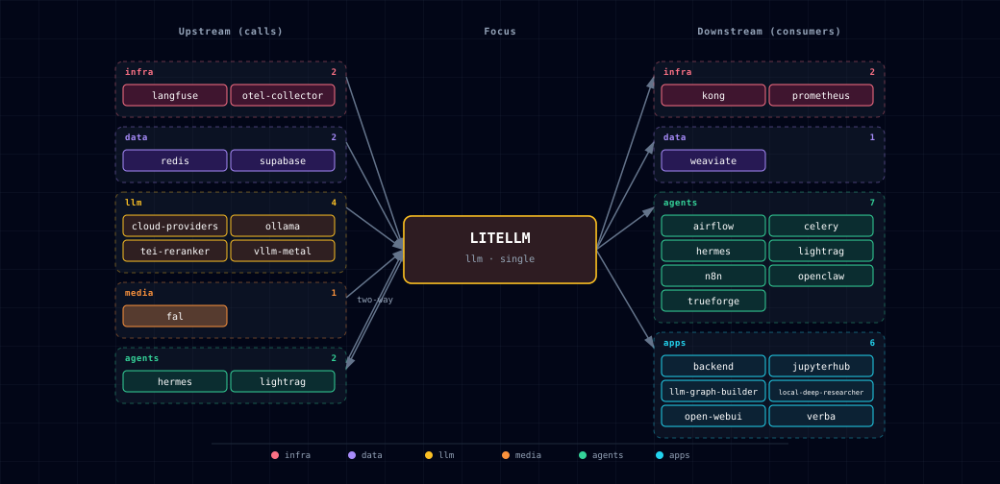

# 5.2.26. LiteLLM Gateway

## 1. Overview

LiteLLM is the always-on OpenAI-compatible front door for every LLM provider in the stack. Every consumer service (Backend, Open WebUI, n8n, JupyterHub, Local Deep Researcher, OpenClaw, Weaviate vectorization) talks to **one URL** and **one API key** — `LITELLM_BASE_URL` / `LITELLM_API_KEY` — and LiteLLM routes each request to the right upstream based on the model name.

When [Hermes Agent](../hermes/README.md) is enabled, `services/litellm/init/scripts/init.py` appends a `hermes-agent` row to `model_list` whose `api_base` is `${HERMES_ENDPOINT}/v1`. The entry is NOT sourced from the YAML model catalogs (Hermes is a service/runtime, not a model provider type), so it lives outside the catalog taxonomy but uses the same `os.environ/HERMES_API_KEY` bearer token. Effect: Open WebUI, n8n, backend, jupyterhub, openclaw all see `hermes-agent` in the dropdown with no per-consumer wiring.

## 2. Image and ports

- Image: `ghcr.io/berriai/litellm:v1.83.14-stable.patch.2` (override via `LITELLM_IMAGE`). Pinned to a `vX.Y.Z-stable` tag; LiteLLM's prod docs explicitly warn against `main-latest` / `main-stable`.
- Internal port: `4000`. Host port: `LITELLM_PORT` (default `63040`). See `.env.example` for the current default.
- Internal port `4000` is also used by `supabase-realtime`; not a collision (different container hostnames).

## 3. Architecture

```
Consumers ──► litellm:4000 ──► Local engine (Ollama) and/or Cloud providers
                  │
                  ├─► supabase-db:5432/litellm   (DATABASE_URL)
                  └─► redis:6379                 (REDIS_HOST/PORT/PASSWORD)
```

- **Local engine** is a single-select choice (`LLM_PROVIDER_SOURCE`):
  - `ollama-container-cpu` / `ollama-container-gpu` — Docker Ollama upstream
  - `ollama-localhost` — Ollama running on the host machine
  - `none` — no local engine (cloud only)
- **Cloud providers** are independent toggles (each `enabled` / `disabled`):
  - `CLOUD_OPENAI_SOURCE` (requires `OPENAI_API_KEY`)
  - `CLOUD_ANTHROPIC_SOURCE` (requires `ANTHROPIC_API_KEY`)
  - `CLOUD_OPENROUTER_SOURCE` (requires `OPENROUTER_API_KEY`)
- Bootstrapper refuses to start when `LLM_PROVIDER_SOURCE=none` AND every cloud source is `disabled`.

## 4. Persistence

- **Database**: dedicated `litellm` database on the existing Supabase Postgres server. Created on first start by the `litellm-init` container (`services/litellm/init/scripts/init.py`). Same host (`supabase-db`), same credentials — separate logical database, so LiteLLM's `LiteLLM_*` Prisma-managed tables stay isolated from Supabase's schema. Override the database name via `LITELLM_DB_NAME`.
- **Redis**: response cache + rate-limit state. Reuses the stack's Redis at `redis:6379` with `REDIS_PASSWORD`.
- **Master key**: `LITELLM_MASTER_KEY` (must start with `sk-`) is auto-generated by the bootstrapper on first start and written into `.env`. Never overwritten on subsequent runs — virtual keys and spend history persist.

## 5. Configuration

The YAML model catalogs are the single source of truth for which models LiteLLM exposes.

```
services/ollama/models.yaml  ─┐
services/litellm/models.yaml  ├──► model_resolver.active_models(env) ──► litellm-init renders /app/config.yaml ──► litellm reads model_list
wizard selections in .env    ─┘
```

On every `docker compose up`, **`litellm-init`** calls `model_resolver.active_models()` — which reads the YAML catalogs and the wizard's env vars (`LLM_PROVIDER_SOURCE`, `OLLAMA_USER_MODELS`, `OLLAMA_CUSTOM_MODELS`, `LITELLM_*_ENABLED`, cloud `*_API_KEY`, `*_USER_MODELS`) — and renders `volumes/litellm/config.yaml` with per-provider routing rules baked into the init script (see bullet list below). For `ollama-localhost` sources with `OLLAMA_AUTO_IMPORT_LOCAL_MODELS=true`, `litellm-init` also queries the upstream `/api/tags` and unions any host-pulled models into the active set. The bootstrapper writes only a stub before `docker compose up` to satisfy the bind mount; the real `model_list` is filled in by `services/litellm/init/scripts/init.py` before the LiteLLM proxy starts. No database query is involved in config rendering.

To change which models are exposed, run the wizard (`./start.sh`) or edit the relevant env var in `.env` and restart. To add a model not in the curated catalog, either set `OLLAMA_CUSTOM_MODELS` or add a new entry to the appropriate YAML file. For an **embedding** entry, declare its output dimension with `dim:` — the wizard auto-selects the embedding model whose `dim` matches the backend's required dimension (`memory_facts vector(768)`), and `model_resolver.embedding_dim_warning` flags any non-matching pick.

`volumes/litellm/config.yaml` is rebuilt on every run, so direct edits there are overwritten. Per-provider routing rules baked into `litellm-init`:

- **Ollama** rows: `model: ollama/<name>`, `api_base: $LITELLM_OLLAMA_UPSTREAM`. `render_model_list` actually registers **two** aliases per Ollama model — `ollama/<name>` and the bare `<name>` — and selects the `ollama_chat/` adapter for chat models (falling back to `ollama/` for embeddings); see §7 for the accurate per-endpoint detail.
- **OpenAI** rows: `model: <name>`, `api_key: $OPENAI_API_KEY`.
- **Anthropic** rows: `model: anthropic/<name>`, `api_key: $ANTHROPIC_API_KEY`.
- **OpenRouter** rows: `model: <name>` (catalog names already carry the `openrouter/` prefix), `api_key: $OPENROUTER_API_KEY`.

### 5.1. `*_USER_MODELS` env vars

The wizard's multiselect choices persist as comma-separated lists in `.env` so they survive across runs:

| Env var | Set by | Notes |
|---|---|---|
| `OLLAMA_USER_MODELS` | Single unified Ollama models multiselect (source-aware — container shows the library scrape only; localhost shows a merged view where rows are badged `[pulled]` if already on the upstream and `[library]` if catalog-only). | `model_resolver` computes the active set (every source); `ollama-pull` then pulls those models for container sources. |
| `OLLAMA_CUSTOM_MODELS` | Ollama "additional models to pull" free-text step. | Merged into the active set by `model_resolver` for every Ollama source. `ollama-pull` fetches them for container sources. For `ollama-localhost`, the bootstrapper pulls the declared union (`OLLAMA_USER_MODELS` ∪ `OLLAMA_CUSTOM_MODELS`) onto the host daemon at every start (#757). |
| `OPENAI_USER_MODELS` | OpenAI multiselect (after live `/v1/models` fetch). | `model_resolver` activates matching catalog entries; names not in the curated catalog are synthesized with generic capability defaults. |
| `ANTHROPIC_USER_MODELS` | Anthropic multiselect (after live `/v1/models` fetch). | Same synthesize-on-missing handling as OpenAI. |
| `OPENROUTER_USER_MODELS` | OpenRouter multiselect (after live `/api/v1/models` fetch). | Same synthesize-on-missing handling. |

To add a model outside the curated catalogs without re-running the wizard: set the relevant `*_USER_MODELS` or `OLLAMA_CUSTOM_MODELS` env var in `.env` and run `docker compose up` — `model_resolver` + `litellm-init` pick it up automatically.

> Note: `model_resolver` considers only providers that are both enabled (e.g. `LITELLM_OPENAI_ENABLED=true`) and keyed (`OPENAI_API_KEY` non-empty). Disabling a provider in `.env` causes `model_resolver` to produce zero active entries for that provider, so LiteLLM stops routing to it.

### 5.2. How `litellm-init` loads the catalog (container wiring)

`litellm-init` renders `volumes/litellm/config.yaml` at startup. Two things are bind-mounted into the container, deliberately **kept in separate dirs**:

| Mount | Holds | Env var (default) | Resolved by |
|---|---|---|---|
| `bootstrapper/utils` → `/catalog:ro` | resolver **modules** (`model_resolver.py`, `llm_catalog.py`, `cloud_providers.py`, `litellm_settings.py`, …) | `ATLAS_CATALOG_DIR` (`/catalog`) | `init.py::_catalog_dir()` |
| `services/{ollama,litellm}/models.yaml` → `/atlas-models/<svc>-models.yaml:ro` | model **catalogs** (flat `<svc>-models.yaml` layout) | `ATLAS_MODELS_DIR` (`/atlas-models`) | `llm_catalog._find_models_dir()` → `_find_yaml()` |

The two mounts are kept separate deliberately: catalogs can't be nested inside the read-only `/catalog` mount, and `/catalog` must be on `sys.path` so `litellm-init`'s loose sibling imports resolve. Both constraints are documented alongside `init.py::_catalog_dir()`, which is the authoritative reference when touching this wiring. When adding a new resolver module that `litellm-init` exec-loads, keep the dual-context import shape — `try: from utils import X` / `except ImportError: import X` — so it works both in the bootstrapper venv (package context) and the container (`/catalog` loose modules). Coverage: `bootstrapper/tests/test_litellm_init_loose_imports.py` and `test_compose_nested_mounts.py`.

### 5.3. Consumer-declared model rows

A downstream integration can surface its own OpenAI-compatible routes (typically served by a [backend plugin](../backend/README.md)) as first-class LiteLLM models by declaring a `litellm_models` block in `atlas.consumer.yml` — see [reusing-atlas.md §6.3.2](../../docs/deployment/reusing-atlas.md#632-exposing-plugin-models-to-litellm-with-litellm_models) for the full merge, validation, and secret-handling contract. Because the config is regenerated declaratively on every start, Atlas merges these consumer-owned rows into `model_list` rather than calling the LiteLLM admin API, so the consumer's aliases appear in `/v1/models` with no registration script; removing the manifest removes only that consumer's rows on the next start. Coverage: `bootstrapper/tests/test_consumer_litellm_models.py`, `test_litellm_init_render.py::TestConsumerModelMerge`, `test_consumer_doctor.py`.

## 6. Access

| Surface | URL | Notes |
|---|---|---|
| Admin dashboard (Kong alias) | `http://litellm.localhost:${KONG_HTTP_PORT}/ui/` | **Use this from your browser.** A bare visit to `http://litellm.localhost:${KONG_HTTP_PORT}/` 302-redirects to `/ui/`. Requires `./start.sh --setup-hosts` so `litellm.localhost` resolves. |
| Admin dashboard (direct port) | `http://localhost:${LITELLM_PORT}/ui/` | Equivalent. The proxy root (`/`) on the direct port serves Swagger UI rather than redirecting — operators who want the API explorer should use the bare direct port; the dashboard always lives under `/ui/`. |
| Proxy API (Kong alias) | `http://litellm.localhost:${KONG_HTTP_PORT}/v1/*` | `GET /v1/models`, `POST /v1/chat/completions`, `POST /v1/embeddings`, etc. Bearer token = `${LITELLM_MASTER_KEY}`. |
| Proxy API (direct port) | `http://localhost:${LITELLM_PORT}/v1/*` | Same surface, no Kong in the path. |
| Usage telemetry | `http://litellm.localhost:${KONG_HTTP_PORT}/spend/{logs,users}` | Raw JSON rollups backing the dashboard's spend pages. Master-key auth. |
| In-network DNS (sibling containers) | `http://litellm:4000` | What `backend`, `open-web-ui`, `jupyterhub`, `local-deep-researcher`, `hermes`, and `weaviate` actually call. Not reachable from the host. |

### 6.1. Admin dashboard login

The dashboard at `/ui/` is password-protected. Credentials are set
explicitly on the LiteLLM container via two env vars:

| Env var | Default | Meaning |
|---|---|---|
| `LITELLM_UI_USERNAME` | `admin` | Username for the dashboard login form. Override in `.env` to change. |
| `LITELLM_MASTER_KEY` | auto-generated | Doubles as the dashboard **password**. The same `sk-…` value used as the proxy Bearer token. |

To recover the password:

```bash
grep '^LITELLM_MASTER_KEY=' .env | cut -d= -f2-
```

(Compose maps `LITELLM_UI_USERNAME` → `UI_USERNAME` and
`LITELLM_MASTER_KEY` → `UI_PASSWORD` inside the container; modern
LiteLLM versions require both env vars to be set explicitly — the
historic "master key alone authenticates the UI" fallback was retired
in favour of the V2 login endpoint.)

### 6.2. Kong-alias plumbing

The Kong route at `litellm.localhost` is **always-on** — no toggle. It's
generated by `bootstrapper/utils/kong_config_generator.py::generate_litellm_service()`
and proxies the entire LiteLLM surface (not just `/ui/`), so any LiteLLM
endpoint works through either the direct port or the alias. The route
uses `preserve_host: True` so LiteLLM's SPA constructs login redirect
URLs against `litellm.localhost:${KONG_HTTP_PORT}` (the browser's actual
URL) instead of the internal Docker hostname `litellm:4000` (which the
browser cannot resolve).

## 7. Ollama adapter choice (`ollama_chat/` vs `ollama/`)

LiteLLM ships two Ollama integrations and **they are not interchangeable**:

| Adapter | Hits Ollama at | Use for | Notes |
|---|---|---|---|
| `ollama_chat/<model>` | `/api/chat` | Chat completions (`/v1/chat/completions`) | Real OpenAI-shaped: multi-turn history, tool calls, vision payloads, and the Ollama-native `think` parameter all flow through. |
| `ollama/<model>` | `/api/generate` | Embeddings (`/v1/embeddings`) | Single-prompt completion. Tool calls do **not** work; multi-turn history is flattened to a single prompt; the `think` parameter is silently dropped. Required for embedding routes because `ollama_chat/` rejects `/v1/embeddings` with `Unmapped LLM provider for this endpoint`. |

`services/litellm/init/scripts/init.py::render_model_list` uses the versioned
catalog metadata described below. Curated `kind: embedding` entries get
`ollama/`; curated `kind: chat` entries get their declared adapter. A
metadata-free custom or live-discovered model uses the legacy name heuristic
with a visible startup warning so existing operator-defined models remain
compatible.

### 7.1. Versioned model capability metadata

Catalog rows may declare `metadata_version: 1` — provider-neutral fields covering
`kind` (chat/embedding), `adapter`, `capabilities`, `request_defaults` (e.g.
`think: false`), `recommended_roles` (`extract`, `keyword`, `query`, `judge`,
`embedding`, `vision`), and an embedding's `dim`. The full field schema is
documented as a docstring/schema comment next to the loader in
`llm_catalog.py`. LiteLLM receives standard `model_info` fields plus a
namespaced `atlas_model_metadata` block, letting LightRAG and future consumers
assign roles without provider, model-family, or hardware assumptions.

Detailed metadata is available from authenticated `GET /v1/model/info`;
`GET /v1/models` is the compatibility listing and does not expose the complete
`model_info` payload:

```bash
curl -s http://localhost:${LITELLM_PORT}/v1/model/info \
  -H "Authorization: Bearer ${LITELLM_MASTER_KEY}"
```

LightRAG and other consumers select a role (`extract`, `query`, …) via a
deterministic tie-breaking procedure — documented as a docstring on the
role-selection function in `model_resolver.py` — that is provider- and
hardware-agnostic.

## 8. Thinking models (`think: false`)

Ollama's reasoning-capable family (qwen3, gpt-oss, deepseek-r1, …)
splits its output into a `thinking` channel and a `content` channel.
When the proxy's `max_tokens` budget is exceeded mid-`<think>` block —
or when a consumer like Hermes Agent only reads `content` — the
response arrives empty.

`init.py` applies `think: false` only when a model's catalog
`request_defaults` declares it. Qwen3.6 uses that default so its answer is
written into `content` instead of `reasoning`; unrelated chat models do not
inherit it. Legacy metadata-free chat models retain the old default for
backward compatibility and emit a warning.

Consumers that explicitly want the thinking trace can override
per-request:

```bash
curl -s -X POST http://localhost:63040/v1/chat/completions \
  -H "Authorization: Bearer $LITELLM_MASTER_KEY" \
  -d '{"model":"qwen3.6:latest","messages":[...],"think":true}'
```

`think: false` is **not** added to embedding entries (they use the
`ollama/` adapter which doesn't accept the parameter).

## 9. Health

- `GET http://localhost:63040/health/liveliness` — fast liveness check (no auth).
- `GET http://localhost:63040/v1/models` (with `Authorization: Bearer $LITELLM_MASTER_KEY`) — lists every model registered in `model_list`.

### 9.1. Expected startup noise (cosmetic, self-resolves in milliseconds)

The first time the `litellm` container reaches the database after a cold boot,
the `${PROJECT_NAME}-supabase-db` log emits a burst of
`relation "<…>" does not exist` errors against the `litellm` database. This is
an upstream LiteLLM race: its 4 uvicorn workers each bootstrap Prisma and probe
the dashboard views concurrently with the view-creation step, so a worker can
briefly see a relation the migration hasn't created yet. It clears within tens
of milliseconds and never recurs. Confirm all 8 dashboard views exist:

```bash
docker exec -e PGPASSWORD="$SUPABASE_DB_PASSWORD" ${PROJECT_NAME}-supabase-db \
  psql -U supabase_admin -d litellm -tAc "
    SELECT count(*) FROM pg_views WHERE schemaname='public' AND viewname IN
      ('LiteLLM_VerificationTokenView','MonthlyGlobalSpend','Last30dKeysBySpend',
       'Last30dModelsBySpend','MonthlyGlobalSpendPerKey','MonthlyGlobalSpendPerUserPerKey',
       'DailyTagSpend','Last30dTopEndUsersSpend')"
# Expect: 8
```

If the count is not 8, or the errors keep recurring after startup, it is a real bug — escalate.

## 10. Smoke tests

```bash
# Liveness
curl -s http://localhost:63040/health/liveliness

# Chat completion (Ollama upstream)
curl -s -H "Authorization: Bearer $LITELLM_MASTER_KEY" \
  -X POST http://localhost:63040/v1/chat/completions \
  -d '{"model":"ollama/qwen3.6:latest","messages":[{"role":"user","content":"hi"}]}'

# Embeddings (Ollama upstream — Weaviate uses this path)
curl -s -H "Authorization: Bearer $LITELLM_MASTER_KEY" \
  -X POST http://localhost:63040/v1/embeddings \
  -d '{"model":"ollama/nomic-embed-text","input":"hi"}'

# Cache and spend audit
redis-cli -h localhost -p ${REDIS_PORT} -a "$REDIS_PASSWORD" --scan --pattern "litellm*"
psql -h localhost -p ${SUPABASE_DB_PORT} -U postgres -d litellm -c "SELECT * FROM \"LiteLLM_SpendLogs\" ORDER BY \"startTime\" DESC LIMIT 5;"
```

## 11. Bypass paths

- **`ollama-pull`** still talks to the Ollama upstream directly (`/api/pull`) — model pulls are not OpenAI-compatible and don't go through LiteLLM. The compose service injects `OLLAMA_HOST_URL` from `LITELLM_OLLAMA_UPSTREAM`. The pull container does not run when `LLM_PROVIDER_SOURCE=none` (`OLLAMA_PULL_SCALE=0`).
- **Open WebUI's native Ollama UI features** (model pulls in the UI) are disabled — `ENABLE_OLLAMA_API: "false"` is set in compose. Use the `ollama-pull` init container or `docker exec -it $PROJECT_NAME-ollama ollama pull <model>` for direct pulls.

## 12. Backup option

If LiteLLM ever stops being a fit (license shift, security incident, project drift), [Portkey AI Gateway](https://github.com/Portkey-ai/gateway) (Apache-2.0) is the documented fallback. Migration cost is bounded because every consumer reads only `LITELLM_BASE_URL` + `LITELLM_API_KEY` — swap the gateway, not the consumers.

## 13. Built-in `lightrag` model

When `LIGHTRAG_SOURCE != disabled`, `litellm-init` registers a `lightrag` model that proxies to LightRAG's Ollama-shim (`{LIGHTRAG_ENDPOINT}/api`). Encode the query mode in the user message prefix: `/hybrid`, `/local`, `/global`, `/naive`, `/mix`. Default mode is `/hybrid`.

```bash
curl -sX POST http://localhost:${LITELLM_PORT}/v1/chat/completions \
  -H "Authorization: Bearer ${LITELLM_MASTER_KEY}" \
  -d '{"model":"lightrag","messages":[{"role":"user","content":"/hybrid What is RAG?"}]}'
```

## 14. Dependencies & Integrations

### 14.1. Current — Upstream (this service calls)

| Service | Category |
|---|---|
| langfuse | infra |
| otel-collector | infra |
| redis | data |
| supabase | data |
| cloud-providers | llm |
| ollama | llm |
| tei-reranker | llm |
| vllm-metal | llm |
| fal | media |
| hermes ↔ | agents |
| lightrag ↔ | agents |

### 14.2. Current — Downstream (services that call this)

| Service | Category |
|---|---|
| kong | infra |
| prometheus | infra |
| weaviate | data |
| airflow | agents |
| celery | agents |
| hermes ↔ | agents |
| lightrag ↔ | agents |
| n8n | agents |
| openclaw | agents |
| backend | apps |
| jupyterhub | apps |
| llm-graph-builder | apps |
| local-deep-researcher | apps |
| open-webui | apps |
| verba | apps |

### 14.3. Architecture diagram



[Open the interactive HTML diagram](./architecture.html) for a full-screen view.

### 14.4. Future — Missing pair integrations

- **litellm ↔ minio** — *Why:* LiteLLM ships a first-class S3 logger that persists full request/response payloads. MinIO is in the stack but unused for LLM telemetry — wiring it gives offline replay, prompt-regression diffs, and audit trails without a new dependency. *Mechanism:* `litellm_settings.success_callback: ["s3"]` + `s3_callback_params` pointing at `http://minio:9000`; provision a `litellm-logs` bucket via `minio-init`. *Effort:* small. *Confidence:* high.
- **litellm ↔ stt-provider** — *Why:* LiteLLM exposes a unified `/v1/audio/transcriptions` endpoint, but consumers hit `STT_ENDPOINT` directly today, bypassing LiteLLM's auth/rate-limit/spend/Kong-alias affordances. *Mechanism:* add an `audio_transcription` row in `model_list` with `model: openai/<name>` + `api_base: ${STT_ENDPOINT}` (speaches is OpenAI-compatible; parakeet needs a thin shim). *Effort:* medium. *Confidence:* medium.
- **litellm ↔ tts-provider** — *Why:* same argument as STT — LiteLLM has `/v1/audio/speech` routing; consumers hit TTS engines directly. *Mechanism:* TTS row in `model_list` with `model: openai/<voice>` + `api_base: ${TTS_ENDPOINT}` for speaches; chatterbox (port 4123, non-OpenAI shape) needs an adapter. *Effort:* medium. *Confidence:* medium.
- **litellm ↔ searxng** — *Why:* LiteLLM's MCP servers feature lets a tool be advertised to every chat-completions client. Wiring searxng as a built-in `search_web` tool gives open-webui/n8n/hermes/jupyterhub web search for free. *Mechanism:* define a LiteLLM MCP server in `litellm_settings.mcp_servers` calling `http://searxng:8080/search?format=json`. *Effort:* medium. *Confidence:* medium.

### 14.5. Future — Candidate new services

_No high-confidence opportunities identified._

### 14.6. Future — Unused features in this service

- **Guardrails** — *Why pursue:* presidio PII redaction, lakera prompt-injection scanning, hide-secrets — all configurable per virtual key. Stack handles user data but has zero LLM-side PII controls today. *Effort:* medium.
- **Virtual keys + team budgets** — *Why pursue:* the master key is the only credential; consumers all share it. Per-service virtual keys with spend caps would give n8n / jupyterhub / open-webui isolated budgets and revocable creds. *Effort:* small.
- **Semantic caching + per-key cache controls** — *Why pursue:* basic Redis response caching is already enabled stack-wide; LiteLLM's embedding-similarity semantic cache and per-virtual-key TTL/namespace controls remain unused. *Effort:* small.
- **`/v1/audio/transcriptions` + `/v1/audio/speech` routing** — *Why pursue:* see pair-integrations above. *Effort:* medium.
- **Fallback model chains** — *Why pursue:* declare `fallbacks: [{"gpt-5": ["claude-opus", "ollama/qwen3.6"]}]` so a cloud outage degrades gracefully to local Ollama. *Effort:* small.
