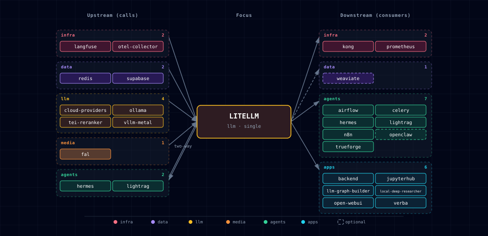

# 5.2.27. LiteLLM Gateway

## 1. Overview

LiteLLM is the always-on OpenAI-compatible front door for every LLM provider in the stack. The default consumers (Backend, Open WebUI, n8n, JupyterHub, Local Deep Researcher, OpenClaw, Weaviate vectorization) use **one URL** and **one API key**: `LITELLM_BASE_URL` and `LITELLM_API_KEY`. LiteLLM routes each request to the upstream for its model name. Services with a documented native-provider override, such as LightRAG role bindings, can bypass this path.

To open the dashboard or call the API, see §5 Access. To check a running gateway, see §10 Smoke tests.

When [Hermes Agent](../hermes/README.md) is enabled, `services/litellm/init/scripts/init.py` appends a `hermes-agent` row to `model_list`, with `api_base` `${HERMES_ENDPOINT}/v1` and the `os.environ/HERMES_API_KEY` bearer token. The row does not come from the YAML model catalogs, because Hermes is a service, not a model provider. Open WebUI, n8n, backend, jupyterhub and openclaw see `hermes-agent` in their model lists with no per-consumer wiring.

## 2. Image and ports

- Image: `ghcr.io/berriai/litellm:v1.83.14-stable.patch.2` (override via `LITELLM_IMAGE`). Pinned to a `vX.Y.Z-stable` tag; LiteLLM's prod docs explicitly warn against `main-latest` / `main-stable`.
- Internal port: `4000`. Host port: `LITELLM_PORT` (default `63040`). See `.env.example` for the current default.
- Internal port `4000` is also used by `supabase-realtime`; not a collision (different container hostnames).

## 3. Architecture

```
Consumers ──► litellm:4000 ──► Ollama / vLLM Metal / Cloud providers
                  │
                  ├─► supabase-db:5432/litellm   (DATABASE_URL)
                  └─► redis:6379                 (REDIS_HOST/PORT/PASSWORD)
```

- **Ollama upstream** is a single-select choice (`LLM_PROVIDER_SOURCE`):
  - `ollama-container-cpu` / `ollama-container-gpu` — Docker Ollama upstream
  - `ollama-localhost` — Ollama running on the host machine
  - `none` — no Ollama upstream
- **vLLM Metal** is an independent managed-host choice:
  - `VLLM_METAL_SOURCE=managed-localhost` — native Apple-silicon vLLM upstream
  - `VLLM_METAL_SOURCE=disabled` — default
- **Cloud providers** are independent toggles (each `enabled` / `disabled`):
  - `CLOUD_OPENAI_SOURCE` (requires `OPENAI_API_KEY`)
  - `CLOUD_ANTHROPIC_SOURCE` (requires `ANTHROPIC_API_KEY`)
  - `CLOUD_OPENROUTER_SOURCE` (requires `OPENROUTER_API_KEY`)
- Bootstrapper refuses to start only when `LLM_PROVIDER_SOURCE=none`, vLLM Metal is disabled, AND every cloud source is disabled.

## 4. Persistence

- **Database**: dedicated `litellm` database on the existing Supabase Postgres server. Created on first start by the `litellm-init` container (`services/litellm/init/scripts/init.py`). Same host (`supabase-db`) with a dedicated role (`LITELLM_DB_USER` / `LITELLM_DB_PASSWORD`) — separate logical database, so LiteLLM's `LiteLLM_*` Prisma-managed tables stay isolated from Supabase's schema. Override the database name via `LITELLM_DB_NAME`.
- **Redis**: response cache and rate-limit state, on the stack's Redis at `redis:6379` with `REDIS_PASSWORD`.
  - The response cache serves embeddings, reranks and transcriptions for `LITELLM_CACHE_TTL`, because a fixed model returns the same result for the same input.
  - Chat, text-completion and Responses API calls are cached only when `LITELLM_CACHE_CHAT=true`. Then an identical request to `hermes-agent` or `lightrag` returns the cached reply for the TTL. It does not run the agent or see newly ingested documents. Send `"cache": {"no-cache": true}` in the request body for those calls.
- **Master key**: `LITELLM_MASTER_KEY` (must start with `sk-`) is auto-generated by the bootstrapper on first start and written into `.env`. Never overwritten on subsequent runs — virtual keys and spend history persist.

## 5. Access

In the URLs and commands on this page, replace each `${VAR}` with the value of that variable in `.env`.

| Surface | URL | Notes |
|---|---|---|
| Admin dashboard (Kong alias) | `http://litellm.localhost:${KONG_HTTP_PORT}/ui/` | **Use this from your browser.** A bare visit to `http://litellm.localhost:${KONG_HTTP_PORT}/` 302-redirects to `/ui/`. Requires `./start.sh --setup-hosts` so `litellm.localhost` resolves. |
| Admin dashboard (direct port) | `http://localhost:${LITELLM_PORT}/ui/` | Equivalent. On the direct port, the proxy root (`/`) serves the Swagger UI API explorer and does not redirect. The dashboard is always under `/ui/`. |
| Proxy API (Kong alias) | `http://litellm.localhost:${KONG_HTTP_PORT}/v1/*` | `GET /v1/models`, `POST /v1/chat/completions`, `POST /v1/embeddings`, etc. Bearer token = `${LITELLM_MASTER_KEY}`. |
| Proxy API (direct port) | `http://localhost:${LITELLM_PORT}/v1/*` | Same surface, no Kong in the path. |
| Usage telemetry | `http://litellm.localhost:${KONG_HTTP_PORT}/spend/{logs,users}` | Raw JSON rollups backing the dashboard's spend pages. Master-key auth. |
| In-network DNS (sibling containers) | `http://litellm:4000` | What `backend`, `open-web-ui`, `jupyterhub`, `local-deep-researcher`, `hermes`, and `weaviate` actually call. Not reachable from the host. |

### 5.1. Admin dashboard login

The dashboard at `/ui/` needs a login. Two env vars set the credentials on the LiteLLM container:

| Env var | Default | Meaning |
|---|---|---|
| `LITELLM_UI_USERNAME` | `admin` | Username for the dashboard login form. Override in `.env` to change. |
| `LITELLM_MASTER_KEY` | auto-generated | Doubles as the dashboard **password**. The same `sk-…` value used as the proxy Bearer token. |

To recover the password:

```bash
grep '^LITELLM_MASTER_KEY=' .env | cut -d= -f2-
```

Compose maps `LITELLM_UI_USERNAME` → `UI_USERNAME` and `LITELLM_MASTER_KEY` → `UI_PASSWORD`. LiteLLM requires both.

### 5.2. Kong-alias plumbing

The Kong route at `litellm.localhost` is **always on**; there is no toggle. `bootstrapper/utils/kong_config_generator.py::generate_litellm_service()` generates it. It proxies the whole LiteLLM surface, not only `/ui/`, so every endpoint works on the direct port and on the alias. The route uses `preserve_host: True`. LiteLLM's SPA then builds login redirects to `litellm.localhost:${KONG_HTTP_PORT}`, which the browser can resolve, and not to `litellm:4000`.

## 6. Configuration

The YAML model catalogs and the wizard selections in `.env` decide which provider models LiteLLM exposes.

```
services/ollama/models.yaml  ─┐
services/litellm/models.yaml  ├──► model_resolver.active_models(env) ──► litellm-init renders /app/config.yaml ──► litellm reads model_list
wizard selections in .env    ─┘
```

On every `docker compose up`, **`litellm-init`** calls `model_resolver.active_models()`. It reads the YAML catalogs and the wizard's env vars: `LLM_PROVIDER_SOURCE`, `OLLAMA_USER_MODELS`, `OLLAMA_CUSTOM_MODELS`, `LITELLM_*_ENABLED`, cloud `*_API_KEY` and `*_USER_MODELS`. It then renders `volumes/litellm/config.yaml` with the per-provider routing rules below. Config rendering uses no database query.

- For `ollama-localhost` with `OLLAMA_AUTO_IMPORT_LOCAL_MODELS=true`, `litellm-init` also reads the upstream `/api/tags` and adds host-pulled models to the active set. If the host daemon does not answer within 10 s, the init log prints `auto-import: failed to fetch /api/tags`. Host-pulled tags are then not registered for this run.
- Before `docker compose up`, the bootstrapper writes only a stub, for the bind mount. `services/litellm/init/scripts/init.py` fills in the real `model_list` before the LiteLLM proxy starts.

To change the exposed models, run the wizard (`./start.sh`), or edit the env var in `.env` and restart. To add a model that is not in the curated catalog, set `OLLAMA_CUSTOM_MODELS` or add an entry to the YAML file. For an **embedding** entry, declare its output dimension with `dim:`. The wizard lists models with `dim: 768` first, and the chosen model's `dim` sets `LANGMEM_EMBEDDING_DIM` (see [Ollama §5](../ollama/README.md)).

`volumes/litellm/config.yaml` is rebuilt on every run, so direct edits there are overwritten. Per-provider routing rules baked into `litellm-init`:

- **Ollama** rows: `model: ollama/<name>`, `api_base: $LITELLM_OLLAMA_UPSTREAM`. `render_model_list` registers **two** aliases per Ollama model: `ollama/<name>` and the bare `<name>`. Chat models use the `ollama_chat/` adapter and embeddings use `ollama/` (§7).
- **OpenAI** rows: `model: openai/<name>`, `api_key: $OPENAI_API_KEY`.
- **Anthropic** rows: `model: anthropic/<name>`, `api_key: $ANTHROPIC_API_KEY`.
- **OpenRouter** rows: `model: openrouter/<name>`, `api_key: $OPENROUTER_API_KEY`.

Each cloud row gets its provider prefix once. A name that already has it (the catalog's `openrouter/...` ids, a wizard-saved row) is kept. A bare `vendor/model` OpenRouter id from a flag or manifest therefore still routes through OpenRouter. Clients always use the configured name as `model_name`.

### 6.1. `*_USER_MODELS` env vars

The wizard's multiselect choices persist as comma-separated lists in `.env` so they survive across runs:

| Env var | Set by | Notes |
|---|---|---|
| `OLLAMA_USER_MODELS` | The Ollama models multiselect ([Ollama §5](../ollama/README.md)). | `model_resolver` computes the active set (every source); `ollama-pull` then pulls those models for container sources. |
| `OLLAMA_CUSTOM_MODELS` | Ollama "additional models to pull" free-text step. | Merged into the active set by `model_resolver` for every Ollama source. `ollama-pull` fetches them for container sources. For `ollama-localhost`, the bootstrapper pulls `OLLAMA_USER_MODELS` ∪ `OLLAMA_CUSTOM_MODELS` onto the host daemon at every start. |
| `OPENAI_USER_MODELS` | OpenAI multiselect (after live `/v1/models` fetch). | `model_resolver` activates matching catalog entries; names not in the curated catalog are synthesized with generic capability defaults. |
| `ANTHROPIC_USER_MODELS` | Anthropic multiselect (after live `/v1/models` fetch). | Same synthesize-on-missing handling as OpenAI. |
| `OPENROUTER_USER_MODELS` | OpenRouter multiselect (after live `/api/v1/models` fetch). | Same synthesize-on-missing handling. |

To add a model outside the curated catalogs without the wizard, set the `*_USER_MODELS` or `OLLAMA_CUSTOM_MODELS` env var in `.env` and run `docker compose up`. `model_resolver` and `litellm-init` pick it up.

> Note: `model_resolver` activates a provider only when it is enabled and keyed. Enabled means `CLOUD_<PROVIDER>_SOURCE=enabled`; the bootstrapper derives `LITELLM_<PROVIDER>_ENABLED` from it at every start. Keyed means `<PROVIDER>_API_KEY` is set. To stop routing to a provider, set `CLOUD_<PROVIDER>_SOURCE=disabled`. Do not edit `LITELLM_<PROVIDER>_ENABLED`; the next start overwrites it.

**Default models follow the routed set.** Before each launch the bootstrapper checks the default models against the models this launch registers. The defaults are `LITELLM_DEFAULT_MODEL`, `LITELLM_VISION_MODEL` and the embedding pair (`LITELLM_EMBEDDING_MODEL`, `LANGMEM_EMBEDDING_MODEL`). It replaces a default that this launch does not route with `model_resolver`'s best active pick, and prints `Default model KEY: old -> new (reason)`. The embedding pair moves together. Not routed means one of these:

- an `ollama/*` model while Ollama is not the engine;
- an Ollama tag that is not selected;
- a model of a disabled or unkeyed cloud provider;
- a cloud model that is no longer selected.

It never replaces a routed default. It also leaves a consumer-declared model, the managed vLLM Metal model, and an Ollama tag under `ollama-localhost` with host auto-import on. A model of an enabled provider whose API key is missing is kept too; fix the key. A stale default with no replacement is a warning.

### 6.2. How `litellm-init` loads the catalog (container wiring)

`litellm-init` renders `volumes/litellm/config.yaml` at startup. Two things are bind-mounted into the container, deliberately **kept in separate dirs**:

| Mount | Holds | Env var (default) | Resolved by |
|---|---|---|---|
| `bootstrapper/utils` → `/catalog:ro` | resolver **modules** (`model_resolver.py`, `llm_catalog.py`, `cloud_providers.py`, `litellm_settings.py`, …) | `ATLAS_CATALOG_DIR` (`/catalog`) | `init.py::_catalog_dir()` |
| `services/{ollama,litellm}/models.yaml` → `/atlas-models/<svc>-models.yaml:ro` | model **catalogs** (flat `<svc>-models.yaml` layout) | `ATLAS_MODELS_DIR` (`/atlas-models`) | `llm_catalog._find_models_dir()` → `_find_yaml()` |

The mounts are separate because catalogs cannot be nested inside the read-only `/catalog` mount, and `/catalog` must be on `sys.path` for `litellm-init`'s loose sibling imports. Read `init.py::_catalog_dir()` before you change this wiring. A new resolver module that `litellm-init` loads must use `try: from utils import X` / `except ImportError: import X`. It then works in the bootstrapper venv and in the container. Coverage: `bootstrapper/tests/test_litellm_init_loose_imports.py` and `test_compose_nested_mounts.py`.

### 6.3. Consumer-declared model rows

A downstream integration can expose its own OpenAI-compatible routes, usually served by a [backend plugin](../backend/README.md), as LiteLLM models. Declare a `litellm_models` block in `atlas.consumer.yml`; [Consumer Manifest Reference §9](../../docs/reference/consumer-manifest.md#9-litellm_models) has the merge, validation and secret-handling contract.

Atlas merges these rows into `model_list` at every start; it does not call the LiteLLM admin API. The consumer's aliases appear in `/v1/models` with no registration script. Removing the manifest removes only that consumer's rows on the next start. Coverage: `bootstrapper/tests/test_consumer_litellm_models.py`, `test_litellm_init_render.py::TestConsumerModelMerge`, `test_consumer_doctor.py`.

## 7. Ollama adapter choice (`ollama_chat/` vs `ollama/`)

LiteLLM ships two Ollama integrations and **they are not interchangeable**:

| Adapter | Hits Ollama at | Use for | Notes |
|---|---|---|---|
| `ollama_chat/<model>` | `/api/chat` | Chat completions (`/v1/chat/completions`) | Real OpenAI-shaped: multi-turn history, tool calls, vision payloads, and the Ollama-native `think` parameter all flow through. |
| `ollama/<model>` | `/api/generate` | Embeddings (`/v1/embeddings`) | Single-prompt completion. Tool calls do **not** work; multi-turn history is flattened to a single prompt; the `think` parameter is silently dropped. Required for embedding routes because `ollama_chat/` rejects `/v1/embeddings` with `Unmapped LLM provider for this endpoint`. |

`services/litellm/init/scripts/init.py::render_model_list` uses the versioned catalog metadata below. Curated `kind: embedding` entries get `ollama/`; curated `kind: chat` entries get their declared adapter. A custom or live-discovered model without metadata uses the legacy name heuristic and logs a startup warning. Existing operator-defined models therefore keep working.

### 7.1. Versioned model capability metadata

Catalog rows may declare `metadata_version: 1`. Its provider-neutral fields are `kind` (chat/embedding), `adapter`, `capabilities`, `request_defaults` (for example `think: false`), `recommended_roles` (`extract`, `keyword`, `query`, `judge`, `embedding`, `vision`) and an embedding's `dim`. The field schema is in the comments next to the loader in `llm_catalog.py`.

LiteLLM receives the standard `model_info` fields and a namespaced `atlas_model_metadata` block. LightRAG and other consumers use it to assign roles without provider, model-family or hardware assumptions. A cloud model with no catalog row (for example one picked live from OpenAI) gets no top-level `model_info.mode`. LiteLLM's own model map then routes it, so a Responses-only model such as `gpt-5-pro` is not forced onto `/v1/chat/completions`.

These `capabilities` are declarations. `./start.sh models probe` measures tool calling, JSON output, vision and embedding dimension through this gateway, on demand. It reports each declaration that does not hold and does not change model selection (see [Operations §1.2](../../docs/operations/index.md#12-model-capability-probe)).

Full metadata comes from the authenticated `GET /v1/model/info`. `GET /v1/models` is the compatibility listing and does not return the complete `model_info` payload:

```bash
curl -s http://localhost:${LITELLM_PORT}/v1/model/info \
  -H "Authorization: Bearer ${LITELLM_MASTER_KEY}"
```

LightRAG and other consumers select a model for `extract`, `query` or another role as follows. The role-selection function in `model_resolver.py` has the same procedure in its docstring:

1. Keep rows with `inferred: false`, the required `kind` or capability, and the
   role in `atlas_model_metadata.recommended_roles`.
2. Apply an explicit operator preference when one is configured.
3. Otherwise use lexical `(provider, catalog_name, model_name)` order as the
   provider-neutral fallback.
4. Deduplicate Ollama's dual aliases by `(provider, catalog_name)` and retain
   the operator's preferred alias.

The order is deterministic and assumes no provider, hardware or model family.

## 8. Thinking models (`think: false`)

Ollama's reasoning models (qwen3, gpt-oss, deepseek-r1, …) split their output into a `thinking` channel and a `content` channel. The response arrives empty when the `max_tokens` budget runs out inside the `<think>` block, or when a consumer such as Hermes Agent reads only `content`.

`init.py` applies `think: false` only when a model's catalog `request_defaults` declares it. The default `qwen3.8:latest` catalog row declares it, so its answer goes into `content` instead of `reasoning`. Other chat models do not inherit it. Chat models without metadata keep the old default and log a warning.

To get the thinking trace, override it per request:

```bash
curl -s -X POST http://localhost:${LITELLM_PORT}/v1/chat/completions \
  -H "Authorization: Bearer $LITELLM_MASTER_KEY" \
  -d '{"model":"qwen3.8:latest","messages":[...],"think":true}'
```

`think: false` is **not** added to embedding entries, because their `ollama/` adapter does not accept it.

## 9. Health

- `GET http://localhost:${LITELLM_PORT}/health/liveliness` — fast liveness check (no auth).
- `GET http://localhost:${LITELLM_PORT}/v1/models` (with `Authorization: Bearer $LITELLM_MASTER_KEY`) — lists every model registered in `model_list`.

### 9.1. Expected startup noise (cosmetic, self-resolves in milliseconds)

On the first database connection after a cold boot, the `${PROJECT_NAME}-supabase-db` log shows a burst of `relation "<…>" does not exist` errors for the `litellm` database. This is an upstream LiteLLM race. Its 4 uvicorn workers each start Prisma and probe the dashboard views while the views are being created. The errors clear within tens of milliseconds and do not recur. Confirm that all 8 dashboard views exist:

```bash
docker exec -e PGPASSWORD="$SUPABASE_DB_PASSWORD" ${PROJECT_NAME}-supabase-db \
  psql -U supabase_admin -d litellm -tAc "
    SELECT count(*) FROM pg_views WHERE schemaname='public' AND viewname IN
      ('LiteLLM_VerificationTokenView','MonthlyGlobalSpend','Last30dKeysBySpend',
       'Last30dModelsBySpend','MonthlyGlobalSpendPerKey','MonthlyGlobalSpendPerUserPerKey',
       'DailyTagSpend','Last30dTopEndUsersSpend')"
# Expect: 8
```

If the count is not 8, or the errors continue after startup, it is a real bug. Escalate it.

## 10. Smoke tests

```bash
# Liveness
curl -s http://localhost:${LITELLM_PORT}/health/liveliness

# Chat completion (Ollama upstream)
curl -s -H "Authorization: Bearer $LITELLM_MASTER_KEY" \
  -X POST http://localhost:${LITELLM_PORT}/v1/chat/completions \
  -d '{"model":"ollama/qwen3.8:latest","messages":[{"role":"user","content":"hi"}]}'

# Embeddings (Ollama upstream — Weaviate uses this path)
curl -s -H "Authorization: Bearer $LITELLM_MASTER_KEY" \
  -X POST http://localhost:${LITELLM_PORT}/v1/embeddings \
  -d '{"model":"ollama/nomic-embed-text","input":"hi"}'

# Cache and spend audit
redis-cli -h localhost -p ${REDIS_PORT} -a "$REDIS_PASSWORD" --scan --pattern "litellm*"
psql -h localhost -p ${SUPABASE_DB_PORT} -U supabase_admin -d litellm -c "SELECT * FROM \"LiteLLM_SpendLogs\" ORDER BY \"startTime\" DESC LIMIT 5;"
```

## 11. Bypass paths

- **`ollama-pull`** calls the Ollama upstream directly (`/api/pull`), because model pulls are not OpenAI-compatible. Compose sets its `OLLAMA_HOST_URL` from `LITELLM_OLLAMA_UPSTREAM`. It runs only for the `ollama-container-*` sources; for other sources `OLLAMA_PULL_SCALE=0`. For `ollama-localhost`, the bootstrapper pulls onto the host daemon instead ([Ollama §5](../ollama/README.md)).
- **Open WebUI's native Ollama UI features** (model pulls in the UI) are disabled — `ENABLE_OLLAMA_API: "false"` is set in compose. To pull a model directly on an `ollama-container-*` source, run `docker exec -it $PROJECT_NAME-ollama ollama pull <model>`. On `ollama-localhost`, run `ollama pull <model>` on the host.

## 12. Backup option

If LiteLLM stops being a fit (license change, security incident, project drift), [Portkey AI Gateway](https://github.com/Portkey-ai/gateway) (Apache-2.0) is the documented fallback. The default consumers read `LITELLM_BASE_URL` and `LITELLM_API_KEY`, so the swap happens there. Migrate any native-provider overrides separately.

## 13. Built-in `lightrag` model

When `LIGHTRAG_SOURCE != disabled`, `litellm-init` registers a `lightrag` model that proxies to LightRAG's Ollama-compatible API (`{LIGHTRAG_ENDPOINT}/api`). A prefix on the last user message selects the query mode: `/local`, `/global`, `/hybrid`, `/naive`, `/mix` or `/bypass`. Without a prefix the mode is `mix`.

```bash
curl -sX POST http://localhost:${LITELLM_PORT}/v1/chat/completions \
  -H "Authorization: Bearer ${LITELLM_MASTER_KEY}" \
  -d '{"model":"lightrag","messages":[{"role":"user","content":"/hybrid What is RAG?"}]}'
```

## 14. Dependencies & Integrations

### 14.1. Current — Upstream (this service calls)

| Service | Category |
|---|---|
| langfuse | infra |
| otel-collector | infra |
| redis | data |
| supabase | data |
| cloud-providers | llm |
| ollama | llm |
| tei-reranker | llm |
| vllm-metal | llm |
| fal | media |
| hermes ↔ | agents |
| lightrag ↔ | agents |

### 14.2. Current — Downstream (services that call this)

| Service | Category | Status |
|---|---|---|
| kong | infra | current |
| prometheus | infra | current |
| weaviate | data | optional: only collections whose text2vec-openai baseURL is LiteLLM, as the backend's are |
| airflow | agents | current |
| celery | agents | current |
| hermes ↔ | agents | current |
| lightrag ↔ | agents | current |
| n8n | agents | current |
| openclaw | agents | optional: openclaw-init sets models.providers.litellm.baseUrl when unset; an operator value is kept |
| trueforge | agents | current |
| backend | apps | current |
| jupyterhub | apps | current |
| llm-graph-builder | apps | current |
| local-deep-researcher | apps | current |
| open-webui | apps | current |
| verba | apps | current |

### 14.3. Architecture diagram



[Open the full-size diagram](./architecture.html) for a full-screen view.

### 14.4. Future — Missing pair integrations

- **litellm ↔ minio** — *Why:* LiteLLM ships a first-class S3 logger that persists full request/response payloads. MinIO is in the stack but unused for LLM telemetry — wiring it gives offline replay, prompt-regression diffs, and audit trails without a new dependency. *Mechanism:* `litellm_settings.success_callback: ["s3"]` + `s3_callback_params` pointing at `http://minio:9000`; provision a `litellm-logs` bucket via `minio-init`. *Effort:* small. *Confidence:* high.
- **litellm ↔ stt-provider** — *Why:* LiteLLM exposes a unified `/v1/audio/transcriptions` endpoint, but consumers hit `STT_ENDPOINT` directly today, bypassing LiteLLM's auth/rate-limit/spend/Kong-alias affordances. *Mechanism:* add an `audio_transcription` row in `model_list` with `model: openai/<name>` + `api_base: ${STT_ENDPOINT}` (speaches is OpenAI-compatible; parakeet needs a thin shim). *Effort:* medium. *Confidence:* medium.
- **litellm ↔ tts-provider** — *Why:* same argument as STT — LiteLLM has `/v1/audio/speech` routing; consumers hit TTS engines directly. *Mechanism:* TTS row in `model_list` with `model: openai/<voice>` + `api_base: ${TTS_ENDPOINT}` for speaches; chatterbox (port 4123) is also OpenAI-compatible on `/v1/audio/speech`. *Effort:* medium. *Confidence:* medium.
- **litellm ↔ searxng** — *Why:* LiteLLM's MCP servers feature lets a tool be advertised to every chat-completions client. Wiring searxng as a built-in `search_web` tool gives open-webui/n8n/hermes/jupyterhub web search for free. *Mechanism:* define a LiteLLM MCP server in `litellm_settings.mcp_servers` calling `http://searxng:8080/search?format=json`. *Effort:* medium. *Confidence:* medium.

### 14.5. Future — Candidate new services

_No high-confidence opportunities identified._

### 14.6. Future — Unused features in this service

- **Guardrails** — *Why pursue:* presidio PII redaction, lakera prompt-injection scanning, hide-secrets — all configurable per virtual key. Stack handles user data but has zero LLM-side PII controls today. *Effort:* medium.
- **Virtual keys + team budgets** — *Why pursue:* the master key is the only credential; consumers all share it. Per-service virtual keys with spend caps would give n8n / jupyterhub / open-webui isolated budgets and revocable creds. *Effort:* small.
- **Semantic caching + per-key cache controls** — *Why pursue:* basic Redis response caching is already enabled stack-wide; LiteLLM's embedding-similarity semantic cache and per-virtual-key TTL/namespace controls remain unused. *Effort:* small.
- **`/v1/audio/transcriptions` + `/v1/audio/speech` routing** — *Why pursue:* see pair-integrations above. *Effort:* medium.
- **Fallback model chains** — *Why pursue:* declare `fallbacks: [{"gpt-5": ["claude-opus", "ollama/qwen3.8"]}]` so a cloud outage degrades gracefully to local Ollama. *Effort:* small.

## 15. Capabilities & limitations

Support tier: **experimental** — Capability contract declared; no cited cold-start, workflow, or upgrade qualification run yet (evidence at `v0.1.0`).

| Capability | Status | Verification | Notes |
|---|---|---|---|
| Unified authenticated model gateway | supported | tested | Atlas exposes chat, embeddings, image generation, and reranking through one LiteLLM endpoint protected by the generated master key, with an explicitly credentialed admin UI. |
| Catalog-driven provider routing | supported | tested | Startup deterministically renders Ollama, cloud, service-passthrough, and consumer-declared model rows from typed catalogs and enabled provider configuration. |
| Gateway persistence and response caching | supported | tested | LiteLLM stores its control and spend data in a dedicated Supabase database and uses the authenticated shared Redis service for namespaced bounded-TTL response caching. |
| Vision-model default consumption | stubbed | documented | Atlas resolves and persists LITELLM_VISION_MODEL for selection UX, but the manifest explicitly has no current consumer route for that default. |
| Unified speech routing | not-supported | documented | STT and TTS consumers call their provider endpoints directly; LiteLLM does not register the stock audio transcription or speech routes. |
| Per-service gateway credentials and budgets | not-supported | documented | Stock consumers share the master key; LiteLLM virtual keys, team budgets, and independently revocable per-service credentials are not provisioned. |
