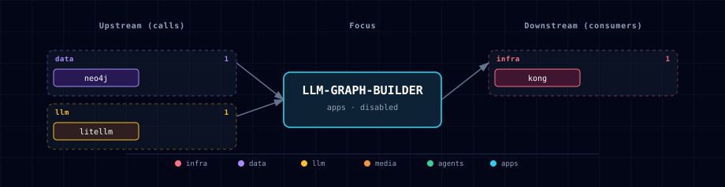

# Neo4j LLM Graph Builder

## 1. Overview
Neo4j LLM Graph Builder is a disabled-by-default Atlas `apps` service for turning documents and web sources into a Neo4j knowledge graph, then chatting over the resulting graph. It is the first GraphRAG-oriented builder UI in the `gen-ai-rag` track and complements LightRAG by providing an operator-facing document-to-graph workflow against Atlas' existing Neo4j and LiteLLM services.

Atlas builds the upstream Neo4j Labs React/FastAPI pair from a pinned git ref because the current upstream deployment path documents source builds rather than stable public official images. The pin is `LLM_GRAPH_BUILDER_REF=4a412f4688cf4096976045c019edc0a7f6ddcb6b`.

## 2. Access
- Direct frontend URL: `http://localhost:${LLM_GRAPH_BUILDER_PORT}`
- Kong frontend URL: `http://graphbuilder.localhost:${KONG_HTTP_PORT}`
- Kong backend API URL: `http://graphbuilder-api.localhost:${KONG_HTTP_PORT}`
- Internal frontend URL: `http://llm-graph-builder-frontend:8080`
- Internal backend URL: `http://llm-graph-builder-backend:8000`

Kong creates both Graph Builder routes only when `LLM_GRAPH_BUILDER_SOURCE=container`. Both routes use the same dashboard-user `basic-auth`, `acl`, and `cors` protections as other disabled-by-default browser tools.

## 3. Configuration
- `LLM_GRAPH_BUILDER_SOURCE=disabled|container` controls whether the service runs. The default is `disabled`.
- `LLM_GRAPH_BUILDER_PORT` is assigned by the apps-category port allocator.
- `LLM_GRAPH_BUILDER_MODEL_ID=atlas_litellm` is the model name shown in the Graph Builder UI.
- `LLM_GRAPH_BUILDER_LLM_MODEL` selects the underlying LiteLLM model alias. Empty means Atlas uses `LITELLM_DEFAULT_MODEL`.
- `LLM_GRAPH_BUILDER_NEO4J_DATABASE=neo4j` controls the database name passed to the upstream backend. Use a dedicated database on Neo4j editions that support multiple databases.
- `LLM_GRAPH_BUILDER_REACT_APP_SOURCES=local,wiki,web` keeps the first Atlas slice local and web oriented. S3 can be added later once endpoint configuration is proven against MinIO.
- `LLM_GRAPH_BUILDER_DIFFBOT_API_KEY` optionally enables upstream Diffbot-backed features; the default Atlas LiteLLM model path leaves it blank.
- `LLM_GRAPH_BUILDER_GCP_LOG_METRICS_ENABLED=false` and `LLM_GRAPH_BUILDER_GCS_FILE_CACHE=false` keep Google Cloud integrations off by default. Enabling either requires `LLM_GRAPH_BUILDER_GCP_PROJECT_ID` and an absolute host path in `LLM_GRAPH_BUILDER_GCP_CREDENTIALS_FILE`; GCS caching additionally requires both `LLM_GRAPH_BUILDER_GCS_UPLOAD_BUCKET` and `LLM_GRAPH_BUILDER_GCS_FAILED_BUCKET`.
- Existing `DIFFBOT_API_KEY` and `GOOGLE_CLOUD_PROJECT` values remain fallback inputs for compatibility. Prefer the namespaced variables in new configurations.
- `LLM_GRAPH_BUILDER_REF` pins the upstream source build.

## 4. Setup Wizard
Graph Builder appears in the `gen-ai-rag` and `all` tracks. It is in the `apps` category because the primary user surface is a browser UI backed by its own API service. It is disabled by default, and the setup wizard should present it after the core RAG data and LLM services are configured.

The first slice offers only `container` and `disabled` source values. A localhost source is intentionally deferred because upstream exposes separate frontend and backend development processes rather than one stable host-running service contract.

## 5. Architecture & Wiring
Graph Builder depends on in-stack Neo4j and LiteLLM. Atlas fails before compose if the service is enabled while `NEO4J_GRAPH_DB_SOURCE` is `disabled` or `localhost`; this keeps the first implementation aligned with the compose dependency graph and the `bolt://neo4j-graph-db:7687` internal URI.

Upstream requires Neo4j 5.23 or later with APOC installed. Atlas currently pins Neo4j 5.26.x with APOC, so the bundled graph database satisfies that prerequisite.

LiteLLM is exposed to Graph Builder as an OpenAI-compatible model named `atlas_litellm`. The upstream backend reads `LLM_MODEL_CONFIG_ATLAS_LITELLM`, which Atlas auto-manages as:

```text
<selected LiteLLM model>,http://litellm:4000/v1,${LITELLM_MASTER_KEY}
```

Graph extraction works best with a model that handles structured extraction reliably. Tiny local models may boot but produce poor or invalid graphs; use `LLM_GRAPH_BUILDER_LLM_MODEL` to pick a capable LiteLLM alias for serious extraction.

MinIO and Docling are integration points rather than hard dependencies in this first slice. MinIO needs endpoint-compatible S3 wiring before Atlas can claim turn-key S3 source ingestion, and Docling remains a companion extractor rather than a direct Graph Builder backend dependency.

Optional Google Cloud features use the exact pinned-upstream contract. Atlas maps the namespaced settings to `GCP_LOG_METRICS_ENABLED`, `GCS_FILE_CACHE`, `PROJECT_ID`, `BUCKET_UPLOAD_FILE`, and `BUCKET_FAILED_FILE`. The configured ADC JSON is mounted read-only at `/run/secrets/atlas-llm-graph-builder-gcp.json`; when both features are off, the credential setting must be blank and a tracked empty placeholder occupies that path. Startup validation rejects ambiguous booleans, configured-but-disabled credentials, and unreadable or structurally incomplete ADC documents before Compose runs.

## 6. Sample Document-To-Graph Workflow
1. Start Atlas with Neo4j, LiteLLM, and Graph Builder enabled, for example:

```bash
./start.sh --track gen-ai-rag --neo4j-graph-db-source container --llm-graph-builder-source container
```

2. Open `http://graphbuilder.localhost:${KONG_HTTP_PORT}` and sign in through Kong's dashboard credentials.
3. Confirm the Neo4j connection uses `NEO4J_URI`, `${GRAPH_DB_USER:-neo4j}`, and `${GRAPH_DB_PASSWORD}` from Atlas.
4. Select `atlas_litellm` as the LLM and upload a small PDF or text file.
5. Generate the graph, then inspect nodes and relationships in the app or in Neo4j Browser at `http://graph.localhost:${KONG_HTTP_PORT}`.
6. Ask a chat question against the processed source and verify citations/provenance before using the graph downstream.

## 7. Namespace And Collision Guardrails
The upstream app writes conventional labels such as `Document`, `Chunk`, and `__Entity__` plus labels extracted from source content. It does not currently expose a general namespace switch. To prevent collisions with other Neo4j workloads:

- Prefer a dedicated value for `LLM_GRAPH_BUILDER_NEO4J_DATABASE` on Neo4j editions that support multiple databases.
- If using the shared `neo4j` database, prefix custom schema labels or source names with an Atlas project namespace.
- Avoid running destructive cleanup/enhancement operations against a database that contains unrelated graph data.
- Keep a small pilot document set until label conventions and downstream GraphRAG use are clear.

## 8. Rollback
Set `LLM_GRAPH_BUILDER_SOURCE=disabled` or rerun:

```bash
./start.sh --llm-graph-builder-source disabled
```

The frontend/backend containers scale to zero, Kong removes `graphbuilder.localhost` and `graphbuilder-api.localhost`, and generated endpoints are blanked. Data already written to Neo4j remains in the configured database and should be removed from Neo4j deliberately if the pilot is no longer needed.

This rollback leaves existing graph data untouched by design.

## 9. Troubleshooting
- Kong route missing: confirm `LLM_GRAPH_BUILDER_SOURCE=container`, rerun `./start.sh`, and ensure `--setup-hosts` has added the aliases.
- API calls fail in the browser: the frontend must use `graphbuilder-api.localhost`, not the internal Docker hostname.
- Model selector errors: confirm `LLM_GRAPH_BUILDER_LITELLM_MODEL_CONFIG` is generated and that the selected LiteLLM model exists.
- Neo4j connection fails: use in-stack `NEO4J_GRAPH_DB_SOURCE=container` for this first slice.
- Poor graph quality: choose a stronger structured-extraction model via `LLM_GRAPH_BUILDER_LLM_MODEL`.

## 10. Dependencies & Integrations

### 10.1 Current — Upstream (this service calls)

| Service | Category |
|---|---|
| minio | data |
| neo4j | data |
| litellm | llm |
| docling | media |

### 10.2 Current — Downstream (services that call this)

_No downstream consumers._

### 10.3 Architecture diagram



[Open the interactive HTML diagram](./architecture.html) for a full-screen view.

### 10.4 Future — Missing pair integrations

- Add endpoint-compatible MinIO S3 source configuration once upstream supports or Atlas patches boto endpoint overrides cleanly.
- Add a Docling handoff workflow for already-extracted text and metadata.

### 10.5 Future — Candidate new services

_No high-confidence opportunities identified._

### 10.6 Future — Unused features in this service

- Upstream token usage tracking can be revisited after Atlas has a shared token telemetry store.
