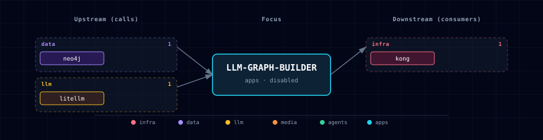

# 5.2.28. Neo4j LLM Graph Builder

## 1. Overview
Neo4j LLM Graph Builder is a disabled-by-default Atlas `apps` service. It turns documents and web sources into a Neo4j knowledge graph and lets you chat over that graph. It complements LightRAG with an operator-facing document-to-graph UI over Atlas's Neo4j and LiteLLM.

Atlas builds the upstream Neo4j Labs React/FastAPI pair from a pinned git ref, because upstream documents source builds, not stable official images. The pin is `LLM_GRAPH_BUILDER_REF=4a412f4688cf4096976045c019edc0a7f6ddcb6b`.

## 2. Access
- Direct frontend URL: `http://localhost:${LLM_GRAPH_BUILDER_PORT}`. The page loads, but its API calls go to the Kong origin below; use the Kong URL for a working UI.
- Kong frontend URL: `http://graphbuilder.localhost:${KONG_HTTP_PORT}`
- Browser API path: `http://graphbuilder.localhost:${KONG_HTTP_PORT}/atlas-api`. Kong strips `/atlas-api` and forwards to the backend. The frontend is built with this same-origin URL, because the browser resends the Kong Basic credential only to the origin that challenged it. Upstream axios sends no credentials cross-origin. After an upgrade, rebuild the frontend image (`docker compose build llm-graph-builder-frontend`) to bake in the URL.
- Kong backend API URL for scripts: `http://graphbuilder-api.localhost:${KONG_HTTP_PORT}`
- Internal frontend URL: `http://llm-graph-builder-frontend:8080`
- Internal backend URL: `http://llm-graph-builder-backend:8000`

Kong creates both Graph Builder routes only when `LLM_GRAPH_BUILDER_SOURCE=container`. Both routes use the same dashboard-user `basic-auth`, `acl`, and `cors` protections as other disabled-by-default browser tools.

## 3. Configuration
- `LLM_GRAPH_BUILDER_SOURCE=disabled|container` controls whether the service runs. The default is `disabled`.
- `LLM_GRAPH_BUILDER_PORT` is assigned by the apps-category port allocator.
- `LLM_GRAPH_BUILDER_MODEL_ID=atlas_litellm` is the model name shown in the Graph Builder UI. Keep it. The compose fragment exports only `LLM_MODEL_CONFIG_ATLAS_LITELLM`, and Graph Builder looks up `LLM_MODEL_CONFIG_<ID>`. Any other id fails every extraction and chat.
- `LLM_GRAPH_BUILDER_LLM_MODEL` selects the LiteLLM model alias. Empty means `LITELLM_DEFAULT_MODEL`. If that is also empty, Atlas uses `gpt-4o-mini`, LiteLLM's OpenAI route, which needs an OpenAI key. A local-only stack must set one of the two.
- `LLM_GRAPH_BUILDER_NEO4J_DATABASE=neo4j` controls the database name passed to the upstream backend. Use a dedicated database on Neo4j editions that support multiple databases.
- `LLM_GRAPH_BUILDER_REACT_APP_SOURCES=local,wiki,web` sets the source types in the UI. S3 is not offered, because its endpoint configuration is not proven against MinIO.
- `LLM_GRAPH_BUILDER_DIFFBOT_API_KEY` optionally enables upstream Diffbot-backed features; the default Atlas LiteLLM model path leaves it blank.
- `LLM_GRAPH_BUILDER_GCP_LOG_METRICS_ENABLED=false` and `LLM_GRAPH_BUILDER_GCS_FILE_CACHE=false` keep Google Cloud integrations off by default. Either one needs `LLM_GRAPH_BUILDER_GCP_PROJECT_ID` and an absolute host path in `LLM_GRAPH_BUILDER_GCP_CREDENTIALS_FILE`. GCS caching also needs `LLM_GRAPH_BUILDER_GCS_UPLOAD_BUCKET` and `LLM_GRAPH_BUILDER_GCS_FAILED_BUCKET`.
- Existing `DIFFBOT_API_KEY` and `GOOGLE_CLOUD_PROJECT` values remain fallback inputs for compatibility. Prefer the namespaced variables in new configurations.
- `LLM_GRAPH_BUILDER_REF` pins the upstream source build.

## 4. Setup Wizard
Graph Builder appears in the `gen-ai-rag` and `all` tracks. It is in the `apps` category, because its main surface is a browser UI with its own API service. It is disabled by default.

Sources: `container` and `disabled` only. There is no `localhost` source: upstream runs the frontend and backend as separate development processes.

## 5. Architecture & Wiring
Graph Builder depends on in-stack Neo4j and LiteLLM. Atlas fails before compose if the service is enabled while `NEO4J_GRAPH_DB_SOURCE` is `disabled` or `localhost`. The compose dependency graph and the internal URI `bolt://neo4j-graph-db:7687` need the in-stack container.

Upstream requires Neo4j 5.23 or later with APOC. Atlas pins Neo4j 5.26.x and loads APOC core (`NEO4J_PLUGINS=["apoc"]`, from the jar the image ships in `labs/`). Graph Builder's extraction (`apoc.merge.node`), auto-connect, duplicate merging and neighbour views need it. APOC extended is not installed.

LiteLLM is exposed to Graph Builder as an OpenAI-compatible model named `atlas_litellm`. The upstream backend reads `LLM_MODEL_CONFIG_ATLAS_LITELLM`, which Atlas auto-manages as:

```text
<selected LiteLLM model>,http://litellm:4000/v1,${LITELLM_MASTER_KEY}
```

Use a model that does structured extraction reliably. Tiny local models can start but produce poor or invalid graphs. Set `LLM_GRAPH_BUILDER_LLM_MODEL` to a capable LiteLLM alias.

MinIO and Docling are integration points, not dependencies. MinIO needs endpoint-compatible S3 wiring before S3 source ingestion works. Docling is a companion extractor, not a Graph Builder backend dependency.

Optional Google Cloud features use the pinned upstream contract. Atlas maps the namespaced settings to `GCP_LOG_METRICS_ENABLED`, `GCS_FILE_CACHE`, `PROJECT_ID`, `BUCKET_UPLOAD_FILE` and `BUCKET_FAILED_FILE`. The ADC JSON is mounted read-only at `/run/secrets/atlas-llm-graph-builder-gcp.json`. When both features are off, the credential setting must be blank, and a tracked empty placeholder occupies that path. Before Compose runs, validation rejects ambiguous booleans, credentials set while both features are off, and unreadable or incomplete ADC documents.

## 6. Sample Document-To-Graph Workflow
1. Start Atlas with Neo4j, LiteLLM, and Graph Builder enabled, for example:

```bash
./start.sh --track gen-ai-rag --neo4j-graph-db-source container --llm-graph-builder-source container
```

2. Open `http://graphbuilder.localhost:${KONG_HTTP_PORT}` and sign in through Kong's dashboard credentials.
3. Confirm the Neo4j connection uses `NEO4J_URI`, `${GRAPH_DB_USER:-neo4j}`, and `${GRAPH_DB_PASSWORD}` from Atlas.
4. Select `atlas_litellm` as the LLM and upload a small PDF or text file.
5. Generate the graph, then inspect nodes and relationships in the app or in Neo4j Browser at `http://graph.localhost:${KONG_HTTP_PORT}`.
6. Ask a chat question against the processed source and verify citations/provenance before using the graph downstream.

## 7. Namespace And Collision Guardrails
The upstream app writes labels such as `Document`, `Chunk` and `__Entity__`, plus labels extracted from source content. It has no namespace switch. To prevent collisions with other Neo4j workloads:

- Prefer a dedicated value for `LLM_GRAPH_BUILDER_NEO4J_DATABASE` on Neo4j editions that support multiple databases.
- If using the shared `neo4j` database, prefix custom schema labels or source names with an Atlas project namespace.
- Avoid running destructive cleanup/enhancement operations against a database that contains unrelated graph data.
- Keep a small pilot document set until label conventions and downstream GraphRAG use are clear.

## 8. Rollback
Set `LLM_GRAPH_BUILDER_SOURCE=disabled` or rerun:

```bash
./start.sh --llm-graph-builder-source disabled
```

The frontend and backend containers scale to zero. Kong removes `graphbuilder.localhost` and `graphbuilder-api.localhost`, and generated endpoints are blanked. The rollback leaves graph data in the configured Neo4j database; delete it in Neo4j if you no longer need it.

## 9. Troubleshooting
- Kong route missing: confirm `LLM_GRAPH_BUILDER_SOURCE=container`, rerun `./start.sh`, and ensure `--setup-hosts` has added the aliases.
- API calls fail in the browser (401 or CORS): open the UI at `http://graphbuilder.localhost:${KONG_HTTP_PORT}`. The frontend calls the same-origin `/atlas-api` path. An older image that targets `graphbuilder-api.localhost` needs a rebuild: `docker compose build llm-graph-builder-frontend`.
- Model selector errors: confirm `LLM_GRAPH_BUILDER_LITELLM_MODEL_CONFIG` is generated and that the selected LiteLLM model exists.
- Neo4j connection fails: use in-stack `NEO4J_GRAPH_DB_SOURCE=container`.
- Poor graph quality: choose a stronger structured-extraction model via `LLM_GRAPH_BUILDER_LLM_MODEL`.

## 10. Dependencies & Integrations

### 10.1. Current — Upstream (this service calls)

| Service | Category |
|---|---|
| neo4j | data |
| litellm | llm |

### 10.2. Current — Downstream (services that call this)

| Service | Category |
|---|---|
| kong | infra |

### 10.3. Architecture diagram



[Open the full-size diagram](./architecture.html) for a full-screen view.

### 10.4. Future — Missing pair integrations

- Add endpoint-compatible MinIO S3 source configuration once upstream supports or Atlas patches boto endpoint overrides cleanly.
- Add a Docling handoff workflow for already-extracted text and metadata.

### 10.5. Future — Candidate new services

_No high-confidence opportunities identified._

### 10.6. Future — Unused features in this service

- Upstream token usage tracking can be revisited after Atlas has a shared token telemetry store.

## 11. Capabilities & limitations

Support tier: **experimental** — Capability contract declared; no cited cold-start, workflow, or upgrade qualification run yet (evidence at `v0.1.0`).

| Capability | Status | Verification | Notes |
|---|---|---|---|
| Document-to-Neo4j graph workflow | partial | tested | Atlas builds the pinned upstream UI/backend and wires Neo4j (with APOC core) plus LiteLLM; APOC extended procedures are not installed. |
| LiteLLM extraction and graph chat | partial | tested | Atlas exposes one OpenAI-compatible model alias, while graph quality and structured extraction remain dependent on the operator-selected model. |
| Graph Builder access control | partial | tested | Kong protects both browser and backend aliases with Basic Auth and ACL. The host-published frontend skips app auth, and the internal backend sets authentication off. |
| Optional Google Cloud features | partial | tested | Atlas validates complete logging or GCS-cache configuration and mounts ADC read-only, but the disabled default uses a placeholder and no live cloud operation is certified. |
| Graph namespace and rollback isolation | partial | documented | Disabling containers preserves generated Neo4j data, while upstream labels share the selected database and Atlas cannot prevent collisions or destructive cleanup in a shared database. |
| Turn-key MinIO and Docling ingestion | not-supported | documented | MinIO endpoint-compatible S3 ingestion and a direct Docling handoff are integration points only. In the stock Atlas path, operators must use local, wiki, or web sources. |
