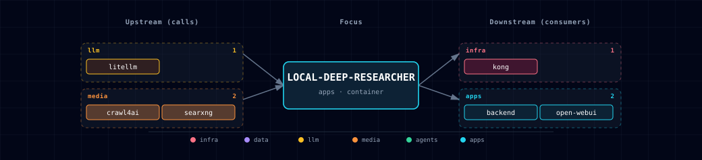

# 5.2.29. Local Deep Researcher

LangGraph-based multi-step research agent. The user submits a topic. LDR runs a search-summarize-reflect loop (default 3 iterations) and returns a Markdown report that cites its sources. Upstream is [langchain-ai/local-deep-researcher](https://github.com/langchain-ai/local-deep-researcher). The stack runs the LangGraph dev server (`langgraph dev`) on container port 2024, published at `LOCAL_DEEP_RESEARCHER_PORT`.

LDR is **local** by design: it uses the stack's LiteLLM gateway (so any local Ollama model LiteLLM serves works) and SearXNG for web search. The default loop needs no outbound API key. The backend exposes a typed `/research/start|status|result|cancel|logs|sessions|health` surface. Its client calls the stock LangGraph dev-server API (`/ok`, `/threads`, `/threads/{id}/runs/stream`). The LDR endpoint is reachable directly and through Kong's `research.localhost` alias.

## 1. Overview

Image: `python:3.11.15-slim`. At each start, the entrypoint checks out the manifest-pinned upstream commit into the repo volume, verifies it and installs it. A restart never pulls a mutable branch. Sources: `container` or `disabled`. There is no GPU path: LDR runs no inference and orchestrates LiteLLM.

## 2. Access

| Path | URL | Notes |
|---|---|---|
| Direct | `http://localhost:${LOCAL_DEEP_RESEARCHER_PORT}` (default `63097`) | LangGraph dev-server REST API. |
| Kong | `http://research.localhost:63000` | Route generated from `LOCAL_DEEP_RESEARCHER_SOURCE` (needs the `--setup-hosts` entries). |
| LangGraph API | `POST /threads`, `POST /threads/{id}/runs/stream` | Standard LangGraph dev-server endpoints. |

Browser access is limited to the Kong origin (`CORS_ALLOW_ORIGINS=http://research.localhost:${KONG_HTTP_PORT}`), so other web pages cannot read or delete threads through the direct port. The Backend calls the API server-side and is unaffected.

Canonical port table: [Ports and Routes](../../docs/reference/ports-routes.md).

## 3. Configuration

```bash
LOCAL_DEEP_RESEARCHER_SOURCE=container       # container | disabled
LOCAL_DEEP_RESEARCHER_PORT=63097             # computed by topology.py
LOCAL_DEEP_RESEARCHER_REF=38f769f84380f2065de76021ac7c5215f88aa39e
LOCAL_DEEP_RESEARCHER_LANGGRAPH_CLI_VERSION=0.4.31
LOCAL_DEEP_RESEARCHER_UPSTREAM_LOCK_SHA256=26fc35ac377836de6628e5f7b180944c4d4bd50a5e9f0200bd6e663f20e35c1a
LOCAL_DEEP_RESEARCHER_LOOPS=3                # max research iterations
LOCAL_DEEP_RESEARCHER_SEARCH_API=searxng     # only searxng is wired; tavily/perplexity need upstream API keys
LOCAL_DEEP_RESEARCHER_WORKERS=3              # reserved; the entrypoint does not pass --n-workers to langgraph dev
LOCAL_DEEP_RESEARCHER_FULL_PAGE_MODE=disabled # disabled | builtin | crawl4ai (crawl4ai needs CRAWL4AI_SOURCE=container); sets FETCH_FULL_PAGE
```

Adaptive env (auto-injected):

```bash
LITELLM_BASE_URL=http://litellm:4000
LITELLM_API_KEY=${LITELLM_MASTER_KEY}
LITELLM_DEFAULT_MODEL=ollama/qwen3.8:latest  # the one model every step uses
# STT_ENDPOINT / TTS_ENDPOINT / DOCLING_ENDPOINT are not injected: the LDR
# research path is text-only.
```

**Required dependencies** (`depends_on.required`): `searxng` (search) and `litellm` (summaries). LDR connects to no database. The **backend** (`research_service.py`) calls this server over HTTP and stores research sessions in `public.research_*`; the Supabase dependency belongs to the backend.

**Full-page mode.** `LOCAL_DEEP_RESEARCHER_FULL_PAGE_MODE` sets `FETCH_FULL_PAGE`. `disabled` keeps search snippets only. `builtin` uses upstream's own page fetch. `crawl4ai` sends each URL to [Crawl4AI](../crawl4ai/README.md); startup fails if `CRAWL4AI_SOURCE` is not `container`.

**Pinned source.** `LOCAL_DEEP_RESEARCHER_REF` must be a full commit SHA. Startup checks the upstream `uv.lock` against `LOCAL_DEEP_RESEARCHER_UPSTREAM_LOCK_SHA256`. It then installs from Atlas's hashed lock `build/config/runtime-requirements.lock`. A mismatch stops startup before the source tree is replaced.

To upgrade:

1. Change the three pins in the manifest.
2. Run `uv run --project bootstrapper python scripts/refresh-local-deep-researcher-lock.py`.
3. Run the same command with `--check`.
4. Commit the regenerated files under `locks/` and `build/config/`.
5. Re-test the LDR patches and the backend research contract.

**Optional adaptive** (`runtime_deps.local-deep-researcher.optional`): `neo4j-graph-db`, `n8n`, `weaviate` and the media providers. The manifest declares them, but no LDR code uses them yet.

## 4. Architecture & wiring

**Research loop:**

1. Client calls `POST /threads` to create a thread.
2. Client calls `POST /threads/{id}/runs/stream` with the research topic.
3. LangGraph executes the StateGraph defined upstream:
   - `generate_query` — LiteLLM produces a search query.
   - `web_research` — calls SearXNG at `http://searxng:8080/search?format=json`.
   - `summarize_sources` — LiteLLM summarizes the gathered snippets into a `running_summary`.
   - `reflect_on_summary` — LiteLLM produces a follow-up query if loop count < `LOCAL_DEEP_RESEARCHER_LOOPS`.
   - `finalize_summary` — outputs the final Markdown report.
4. State (running_summary, sources_gathered, loop_count) lives in the LangGraph dev-server's in-memory checkpointer.

**Checkpointer caveat.** The dev-server's in-memory checkpointer drops thread state on container restart, so research cannot resume. A Redis-backed checkpointer is a future pair (§5.4).

**Search backend.** `LOCAL_DEEP_RESEARCHER_SEARCH_API=searxng` calls `http://searxng:8080/search?q=…&format=json`. SearXNG must have `formats: [json]` enabled (it does, in `services/searxng/config/settings.yml`).

**LLM gateway.** Every LLM step calls LiteLLM at `http://litellm:4000/v1`. All steps use one model: `LITELLM_DEFAULT_MODEL`. Atlas's `build/scripts/init-config.py` reads it at startup and exits if it is empty.

**Backend integration.** `services/backend/app/app/research_client.py` calls `http://local-deep-researcher:2024` with a `ResearchRequest`/`ResearchResult` schema behind the backend's `/research/*` routes. Sessions persist to `public.research_sessions`. The client checks `/ok` and creates a thread with `POST /threads`. A backend background task then calls `POST /threads/{thread_id}/runs/stream` with `assistant_id=ollama_deep_researcher`, `on_disconnect=cancel` and `stream_mode=["values"]`.

## 5. Dependencies & Integrations

### 5.1. Current — Upstream (this service calls)

| Service | Category |
|---|---|
| litellm | llm |
| crawl4ai | media |
| searxng | media |

### 5.2. Current — Downstream (services that call this)

| Service | Category |
|---|---|
| kong | infra |
| backend | apps |
| open-webui | apps |

### 5.3. Architecture diagram



[Open the full-size diagram](./architecture.html) for a full-screen view.

### 5.4. Future — Missing pair integrations

- **local-deep-researcher ↔ redis** — *Why:* LDR runs `langgraph dev` with the in-memory checkpointer, so thread state is lost on restart; no Redis checkpointer is wired today. *Mechanism:* swap checkpointer to `langgraph.checkpoint.redis.RedisSaver` pointed at a fresh index (`redis://:${REDIS_PASSWORD}@redis:6379/4` — `/3` is JupyterHub's); add `REDIS_URL` to LDR env. *Effort:* small. *Confidence:* medium.
- **local-deep-researcher ↔ neo4j** — *Why:* each research run yields `sources_gathered` + a `running_summary`. Writing these as `(Topic)-[CITES]->(Source)` triples lets later runs detect overlap and reuse evidence. *Mechanism:* post-`finalize_summary` callback writes Cypher `MERGE` via `bolt://neo4j-graph-db:7687`. *Effort:* medium. *Confidence:* medium.
- **local-deep-researcher ↔ minio** — *Why:* the final markdown report lives only in LangGraph thread state and the Backend's `public.research_*` rows; no object store holds it. *Mechanism:* on `finalize_summary`, S3 `PutObject` to `${MINIO_ENDPOINT}` bucket `research-reports` keyed by `session_id`. *Effort:* small. *Confidence:* medium.
- **local-deep-researcher ↔ hermes** — *Why:* Hermes has no path to invoke multi-step web research today. Exposing LDR as a Hermes tool turns "deep research" into a single tool call. *Mechanism:* a Hermes skill (`/opt/data/skills/<category>/<name>/SKILL.md`, installed by hermes-init) or an MCP server that POSTs to `http://local-deep-researcher:2024/threads/{id}/runs/stream` and returns the final summary. *Effort:* medium. *Confidence:* medium.

### 5.5. Future — Candidate new services

- **open_deep_research (langchain-ai)** — *Headline:* multi-agent deep-research engine (supervisor + parallel sub-researchers) evaluated as a disabled-by-default **opt-in second research engine complementing LDR** (LDR stays the fast/local/key-free tier). GO-conditional per [`docs/strategy/langchain-stack-evaluation.md`](https://github.com/thekaveh/atlas/blob/main/docs/strategy/langchain-stack-evaluation.md), gated on a key-free LiteLLM+SearXNG boot at acceptable cost; its `messages`/`final_report` schema needs a per-engine branch in the backend research client.
- **Firecrawl** ([details](https://github.com/thekaveh/atlas/blob/main/docs/research/candidates/firecrawl.md)) — *Headline:* self-hosted JS-rendering scraper that returns clean markdown, replacing LDR's `builtin` / `crawl4ai` full-page fetch with structured extraction. *Wires into:* n8n, backend, hermes.

### 5.6. Future — Unused features in this service

- **Persistent LangGraph checkpointer** — *Why pursue:* dev-server inmem checkpointer drops thread history on restart, so resumable research is impossible. *Effort:* small.
- **Tavily / Perplexity search backends** — *Why pursue:* upstream supports both via `SEARCH_API=tavily|perplexity` plus API keys; Atlas injects no key for either. *Effort:* small.
- **`USE_TOOL_CALLING` for gpt-oss models** — *Why pursue:* enables structured tool calls instead of JSON mode for gpt-oss family, improving reliability with LiteLLM-routed local models. *Effort:* small.
- **`STRIP_THINKING_TOKENS` toggle** — *Why pursue:* Hermes-style reasoning models leak `<think>` blocks into the report; upstream env var hides them. *Effort:* small.
- **LangSmith tracing** — *Why pursue:* `LANGSMITH_API_KEY` ships upstream; superseded if Langfuse lands but useful as a stopgap. *Effort:* small.

## 6. Troubleshooting

**Container keeps restarting.** The pinned checkout, lock verification or install failed. `docker logs <project>-local-deep-researcher` shows the failing step; network or PyPI access is the usual cause.

**Research returns empty / "no sources gathered".** SearXNG returned no JSON results. Check `curl 'http://localhost:${SEARXNG_PORT}/search?q=test&format=json'`; if the JSON format is disabled, fix `services/searxng/config/settings.yml`.

**Runs hang at `summarize_sources`.** LiteLLM is unreachable or the model is overloaded. Run `docker logs <project>-litellm -f` and confirm that LiteLLM serves `LITELLM_DEFAULT_MODEL`.

**State lost on restart.** Expected — see the in-memory checkpointer note above. The fix is the Redis-checkpointer integration listed under Future.

**Kong route 404 for `research.localhost`.** Kong has the route when `LOCAL_DEEP_RESEARCHER_SOURCE=container`. A 404 usually means the `*.localhost` hosts entries are missing (`./start.sh --setup-hosts`) or the service is disabled.

```bash
docker compose ps local-deep-researcher
docker compose logs -f local-deep-researcher
curl -s http://localhost:${LOCAL_DEEP_RESEARCHER_PORT}/threads -X POST -H 'content-type: application/json' -d '{}'
```

For general startup and routing issues, see [Troubleshooting](../../docs/quick-start/troubleshooting.md).

## 7. Operations

**Run a research session from the CLI.**

```bash
# 1. Create a thread
THREAD=$(curl -s -X POST http://localhost:${LOCAL_DEEP_RESEARCHER_PORT}/threads \
  -H 'content-type: application/json' -d '{}' | jq -r .thread_id)

# 2. Stream a run (SSE)
curl -N -X POST http://localhost:${LOCAL_DEEP_RESEARCHER_PORT}/threads/$THREAD/runs/stream \
  -H 'content-type: application/json' \
  -d '{"assistant_id":"ollama_deep_researcher","on_disconnect":"cancel","input":{"research_topic":"vector database trade-offs 2026"}}'
```

The stream emits LangGraph node events; the final `finalize_summary` event contains the Markdown report.

**Inspect thread state.**

```bash
curl -s http://localhost:${LOCAL_DEEP_RESEARCHER_PORT}/threads/$THREAD/state | jq '.values'
```

Returns `running_summary`, `sources_gathered`, `loop_count`, current node — useful for debugging stalls.

**Tune the research depth.** `LOCAL_DEEP_RESEARCHER_LOOPS` (default 3) and `LOCAL_DEEP_RESEARCHER_SEARCH_API` are defaults. A run's own `max_web_research_loops` and `search_api` override them. Backend `/research/start` fills omitted values from these variables. More loops can exceed the Backend's 300-second run wait. All other settings (provider, model, LiteLLM URL and key) come only from the environment, so a caller cannot redirect the LiteLLM key.

**Change the model.** Set `LITELLM_DEFAULT_MODEL` in `.env` to a model LiteLLM serves, then restart the stack.

## 8. Performance notes

- **Cost per run.** About 2 LLM calls per loop plus 1 (about 7 for the default 3 loops), and one SearXNG call per loop. Local Ollama is free and slow (~30-90 s per loop); cloud APIs through LiteLLM are fast and metered.
- **No streaming to clients.** The backend's `research_client.py` reads the `/runs/stream` SSE channel synchronously and does not forward events.
- **Thread state size.** A 3-loop run produces ~30-60 KB of state (summary + sources). The in-memory checkpointer keeps threads in process without a bound; a restart clears it.

## 9. Capabilities & limitations

Support tier: **experimental** — Capability contract declared; no cited cold-start, workflow, or upgrade qualification run yet (evidence at `v0.1.0`).

| Capability | Status | Verification | Notes |
|---|---|---|---|
| Multi-step local research loop | supported | tested | Atlas pins the upstream LangGraph source and serving dependencies, then routes search through SearXNG and generation through LiteLLM without requiring a direct cloud key. |
| Backend-managed research sessions | partial | tested | The authenticated Backend adds bounded concurrency, cancellation, logs, and Postgres session records around LDR, while direct LangGraph callers bypass that lifecycle. |
| Research endpoint authentication | not-supported | tested | The host-published LangGraph API and CORS-only research.localhost route have no Atlas authentication; use the authenticated Backend research API or restrict direct ingress. Browser access is limited to the research.localhost origin (CORS_ALLOW_ORIGINS), so a web page cannot read threads through the direct port. |
| Research thread persistence | partial | tested | Backend session metadata persists in Postgres, but LDR's in-memory checkpointer loses direct thread state on restart and can grow without a durable shared bound. |
| Full-page Crawl4AI extraction | partial | tested | The opt-in crawl4ai mode is patched and source-gated, while disabled or builtin modes provide different extraction depth and no live web compatibility guarantee. |
| Declared optional service integrations | stubbed | documented | Neo4j, n8n, Weaviate, speech, and document services appear as runtime hints, but the LDR research code consumes only LiteLLM, SearXNG, and optional Crawl4AI today. |
| Parallel research worker control | stubbed | documented | LOCAL_DEEP_RESEARCHER_WORKERS is reserved because the entrypoint does not pass it to langgraph dev; one server process owns the in-memory research state. |
