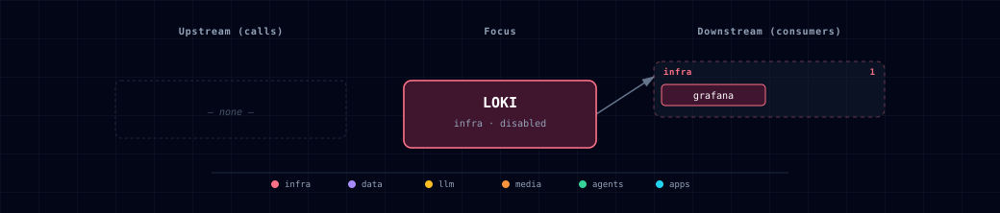

# 5.2.30. Loki

## 1. Overview

Loki is Atlas' disabled by default, Grafana-native log store. The OpenTelemetry Collector sends redacted OTLP logs to Loki's native endpoint, and Grafana provisions a Loki datasource linked to Tempo. Atlas does not automatically scrape container stdout: an application must emit OTLP logs to the Collector to enter this path.

Loki is internal-only, has no Kong route, and should be queried through Grafana. The default retention is short for local development.

## 2. Access

- SOURCE: `LOKI_SOURCE=disabled` by default.
- Internal endpoint: `http://loki:3100`.
- Direct host URL: none in the first slice.
- Kong URL: none; no Kong route is generated.
- Grafana surface: the `Loki` datasource is provisioned when Grafana starts.

## 3. Configuration

The service reads `./config/loki.yaml`, mounted to `/etc/loki/loki.yaml`. `LOKI_RETENTION_PERIOD` defaults to `24h`; compactor retention is enabled, runs every 10 minutes, and deletes expired chunks after the configured two-hour delay. TSDB schema v13 and structured metadata are enabled. Only `service.name` becomes the normalized `service_name` index label; remaining OTLP resource attributes and trace/span identifiers stay structured metadata to avoid high-cardinality indexes.

## 4. Architecture & Wiring

OpenTelemetry Collector redacts and exports application-provided OTLP logs to Loki. Grafana queries Loki directly, and its provisioned datasource links trace identifiers to Tempo. The Collector is required when using this Atlas-managed ingestion path; direct internal Loki writes remain possible but bypass Collector redaction.

## 5. Dependencies & Integrations

### 5.1. Current — Upstream (this service calls)

_No upstream calls._

### 5.2. Current — Downstream (services that call this)

| Service | Category |
|---|---|
| grafana | infra |
| otel-collector | infra |

### 5.3. Architecture diagram

[Open the full-size diagram](./architecture.html) for a full-screen view.

### 5.4. Future — Missing pair integrations

_No high-confidence opportunities identified._

### 5.5. Future — Candidate new services

_No high-confidence opportunities identified._

### 5.6. Future — Unused features in this service

_No high-confidence opportunities identified._

## 6. Troubleshooting

- If Grafana cannot query logs, confirm `LOKI_SOURCE=container` and `LOKI_ENDPOINT=http://loki:3100`.
- Query a service with `{service_name="backend"}` and add `| trace_id = "<32-hex-trace-id>"` to filter on OTLP structured metadata.
- If the Collector is enabled, Loki must also be in container mode. Collector startup validation rejects a disabled Loki source.
- If storage grows unexpectedly, check `LOKI_RETENTION_PERIOD` and compactor logs.
- Roll back by setting `LOKI_SOURCE=disabled`.

## 7. Capabilities & limitations

| Capability | Status | Verification | Notes |
|---|---|---|---|
| Local Grafana-queryable log storage | supported | tested | Atlas provisions a single local Loki store, accepts redacted OTLP logs from the required Collector, and exposes them through a trace-linked Grafana datasource. |
| Automatic Atlas application log collection | not-supported | tested | The Collector persists logs that applications emit over OTLP, but Atlas does not scrape container stdout or install a Promtail/Docker logging driver automatically. |
| Highly available long-term log retention | not-supported | documented | The bundled filesystem-backed single replica is intended for short local retention and has no replicated object-store deployment. |
