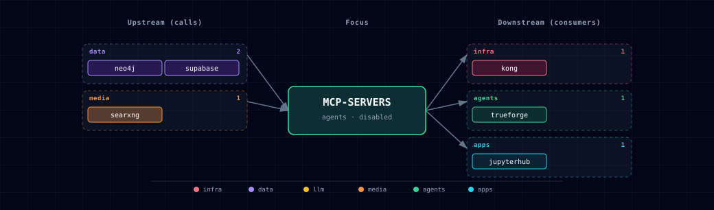

# 5.2.30. Curated MCP Servers

## 1. Overview

The Curated MCP Servers service exposes the first Atlas Model Context Protocol tool surface. It is intentionally small: Postgres read queries, Neo4j schema/read Cypher, and SearXNG web search.

This is not a generic one-server-per-service pattern. The package starts with tools that are useful across Open WebUI, Hermes, and future agent workflows while keeping write actions disabled by default.

## 2. Access

| Surface | URL | Notes |
|---|---|---|
| Direct MCP endpoint | `http://localhost:${MCP_SERVERS_PORT}/mcp` | Streamable HTTP MCP endpoint bound to loopback only. |
| Kong MCP endpoint | `http://mcp.localhost:${KONG_HTTP_PORT}/mcp` | Routed only when `MCP_SERVERS_SOURCE=container`. Kong dashboard credentials apply. |

`MCP_SERVERS_SOURCE=disabled` is the default. Enable it with:

```bash
./start.sh --mcp-servers-source container
```

## 3. Configuration

| Variable | Default | Purpose |
|---|---:|---|
| `MCP_SERVERS_SOURCE` | `disabled` | Enables or disables the curated MCP package. |
| `MCP_SERVERS_PORT` | generated | Host port assigned by Atlas topology. |
| `MCP_POSTGRES_MAX_ROWS` | `50` | Maximum rows returned by the Postgres tool. |
| `MCP_SEARXNG_MAX_RESULTS` | `5` | Maximum results returned by the SearXNG tool. |
| `MCP_TOOL_TIMEOUT_SECONDS` | `15` | Upstream call timeout. |

## 4. Architecture & Wiring

`mcp-servers` calls:

- Supabase Postgres through `supabase-db:5432`
- Neo4j through `NEO4J_URI`
- SearXNG through `http://searxng:8080`

Open WebUI and Hermes should consume the service directly as HTTP MCP clients where possible. LiteLLM MCP Gateway is reserved for cases where Atlas explicitly wants model-facing tool access under LiteLLM key/team/org policy.

MetaMCP, Docker MCP Gateway, and `mcpo` remain later or conditional tools. MetaMCP becomes attractive once Atlas needs namespaces and per-consumer policy across several MCP servers. Docker MCP Gateway fits broad vendor connector catalogs better than this internal-service-first slice. `mcpo` is a translator for stdio-only or OpenAPI-only cases, not the Atlas default architecture.

## 5. Dependencies & Integrations

### 5.1. Current — Upstream (this service calls)

| Service | Category |
|---|---|
| neo4j | data |
| supabase | data |
| searxng | media |

### 5.2. Current — Downstream (services that call this)

_No downstream consumers._

### 5.3. Architecture diagram



[Open the interactive HTML diagram](./architecture.html) for a full-screen view.

### 5.4. Future — Missing pair integrations

_No high-confidence opportunities identified._

### 5.5. Future — Candidate new services

_No high-confidence opportunities identified._

### 5.6. Future — Unused features in this service

_No high-confidence opportunities identified._

## 6. Security & Guardrails

- Guardrail summary: consent, credential handling, namespace discipline, read-only execution, prompt-injection awareness, and bounded result sizes are part of the v1 contract.
- Consent: MCP clients should expose tools only after an operator intentionally enables `MCP_SERVERS_SOURCE=container` and registers the endpoint.
- Credential handling: database credentials stay in container environment variables and must not be pasted into client configs.
- read-only default: Postgres rejects multiple statements and mutation keywords; Neo4j exposes read/schema tools only in v1.
- Namespace discipline: tool names are prefixed by their backend purpose to avoid collisions as more MCP servers arrive.
- Prompt-injection risk: treat database rows and web search results as untrusted tool output.
- Rate and size limits: use `MCP_POSTGRES_MAX_ROWS`, `MCP_SEARXNG_MAX_RESULTS`, and `MCP_TOOL_TIMEOUT_SECONDS` instead of unbounded queries.

## 7. Docling MCP Follow-Up

Docling MCP is the first specialist MCP expansion candidate because upstream supports remote Docling Serve mode and Streamable HTTP. It should be added behind its own disabled SOURCE or a clearly linked follow-up once Atlas has the first curated package working and can decide how document upload authorization should behave.

## 8. Troubleshooting

- If startup fails with a Neo4j or SearXNG dependency error, enable the missing service or keep `MCP_SERVERS_SOURCE=disabled`.
- If SearXNG search returns 403, confirm the in-stack SearXNG instance has JSON output enabled.
- If Open WebUI cannot call the Kong URL, configure the MCP server as Streamable HTTP and include the required Kong Basic Auth credentials.
