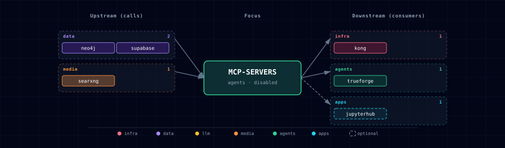

# 5.2.31. Curated MCP Servers

## 1. Overview

The Curated MCP Servers service exposes the first Atlas Model Context Protocol tool surface. It is intentionally small: Postgres read queries, Neo4j schema/read Cypher, and SearXNG web search.

This is not a generic one-server-per-service pattern. The package starts with tools that are useful across Open WebUI, Hermes, and future agent workflows. Its query filters and routing hints bound common requests but are not a least-privilege security boundary.

The runtime uses the standalone **FastMCP 3** framework (`fastmcp==3.4.4`), pinned exactly for reproducible image builds. It serves Streamable HTTP at `/mcp`.

## 2. Access

| Surface | URL | Notes |
|---|---|---|
| Direct MCP endpoint | `http://localhost:${MCP_SERVERS_PORT}/mcp` | Host publish is loopback-only; backend-network containers can call the unauthenticated service-DNS endpoint directly. |
| Kong MCP endpoint | `http://mcp.localhost:${KONG_HTTP_PORT}/mcp` | Routed only when `MCP_SERVERS_SOURCE=container`. Kong dashboard credentials apply. |

`MCP_SERVERS_SOURCE=disabled` is the default. Enable it with:

```bash
./start.sh --mcp-servers-source container
```

## 3. Configuration

| Variable | Default | Purpose |
|---|---:|---|
| `MCP_SERVERS_SOURCE` | `disabled` | Enables or disables the curated MCP package. |
| `MCP_SERVERS_PORT` | generated | Host port assigned by Atlas topology. |
| `MCP_POSTGRES_DB_USER` | `atlas_mcp` | Restricted read-only Postgres login used by the Postgres tool (§6). Its password is generated. |
| `MCP_POSTGRES_MAX_ROWS` | `50` | Maximum rows returned by the Postgres tool. |
| `MCP_NEO4J_MAX_ROWS` | empty | Maximum rows returned by the Neo4j tool. Empty uses `MCP_POSTGRES_MAX_ROWS`. |
| `MCP_SEARXNG_MAX_RESULTS` | `5` | Maximum results returned by the SearXNG tool. |
| `MCP_TOOL_TIMEOUT_SECONDS` | `15` | Upstream call timeout. |

## 4. Architecture & Wiring

`mcp-servers` calls:

- Supabase Postgres through `supabase-db:5432`
- Neo4j through `NEO4J_URI`
- SearXNG through `http://searxng:8080`

The runtime serves Streamable HTTP (stateless, JSON responses) at `/mcp` on container port `8000`, published to loopback (`127.0.0.1`) on the host. Transport settings live on FastMCP 3's `run(transport="http", …)` call, not the constructor.

FastMCP 3's **Host/Origin protection** is on. It accepts only the loopback forms (`127.0.0.1`, `localhost`, `::1`), the Compose hostname `mcp-servers` and the Kong hostname `mcp.localhost`. Any other `Host`/`Origin` gets `421`/`403`. This guard defends against DNS rebinding; it is not authentication. Kong Basic Auth + ACL protect only the Kong route. Backend-network containers can call the unauthenticated `http://mcp-servers:8000/mcp` with the `mcp-servers` Host.

Open WebUI and Hermes should consume the service directly as HTTP MCP clients where possible. LiteLLM MCP Gateway is reserved for cases where Atlas explicitly wants model-facing tool access under LiteLLM key/team/org policy.

MetaMCP, Docker MCP Gateway, and `mcpo` remain later or conditional tools. MetaMCP becomes attractive once Atlas needs namespaces and per-consumer policy across several MCP servers. Docker MCP Gateway fits broad vendor connector catalogs better than this internal-service-first slice. `mcpo` is a translator for stdio-only or OpenAPI-only cases, not the Atlas default architecture.

## 5. Dependencies & Integrations

### 5.1. Current — Upstream (this service calls)

| Service | Category |
|---|---|
| neo4j | data |
| supabase | data |
| searxng | media |

### 5.2. Current — Downstream (services that call this)

| Service | Category | Status |
|---|---|---|
| kong | infra | current |
| trueforge | agents | current |
| jupyterhub | apps | optional: MCP_SERVERS_SOURCE=container |

### 5.3. Architecture diagram



[Open the full-size diagram](./architecture.html) for a full-screen view.

### 5.4. Future — Missing pair integrations

_No high-confidence opportunities identified._

### 5.5. Future — Candidate new services

- Docling MCP is the first candidate for a specialist MCP server, because upstream supports remote Docling Serve and Streamable HTTP. It needs its own disabled SOURCE and a decision on document-upload authorization.

### 5.6. Future — Unused features in this service

_No high-confidence opportunities identified._

## 6. Security & Guardrails

- Guardrail summary: consent, credential handling, namespace discipline, syntactic query filters, prompt-injection awareness, and bounded result sizes are part of the current contract. These controls do not provide tenant isolation or complete side-effect prevention.
- Consent: MCP clients should expose tools only after an operator intentionally enables `MCP_SERVERS_SOURCE=container` and registers the endpoint.
- Credential handling: database credentials stay in the container environment; never paste them into client configs. The Postgres tool connects as the scoped read-only `atlas_mcp` role (`MCP_POSTGRES_DB_USER`), not the RLS-bypassing `supabase_admin` owner. The role has no superuser or BYPASSRLS rights. It can SELECT tables in the `public`, `n8n` and `storage` schemas; RLS-enabled Atlas tables return no rows to it.
- Credential deny list: these tables and columns are revoked from the role:
  - Open WebUI: `auth`, `config`, `oauth_session`, `api_key`, `tool.valves`, `function.valves`, `user.api_key`, `user.settings`.
  - n8n: `credentials_entity`, `user_api_keys`, the OAuth token/client/code tables, `secrets_provider_connection`, `deployment_key`, `settings`, `event_destinations`, `variables`, and the `user` password and MFA columns.
- Deny-list gaps: a table an app adds later is readable until it is added to the list (n8n's from creation, others from the next restart). The list is applied at stack start, before n8n's first migrations. On a fresh install, n8n's listed tables (including a first-session API key) stay readable until the next `./start.sh`. There is no schema, table, or column allowlist or output redaction. Use the tool only with trusted operators.
- Query side effects: accepted privileged SQL functions and Neo4j procedures can still cause side effects, within the rights of the connecting role.
- Query side effects (Postgres): the validator rejects multiple statements and common mutation keywords. It does not block every function; it accepts `pg_read_file` and `pg_terminate_backend`. Such calls run as the unprivileged `atlas_mcp` role, which has no superuser, file-read or signal privileges.
- Query side effects (Neo4j): the tool connects with the Neo4j admin credentials (`GRAPH_DB_USER`, default `neo4j`). The read session blocks writes such as `db.createLabel`, but procedures such as `db.checkpoint` still run.
- APOC: Neo4j loads APOC core. `apoc.load.*` sends HTTP requests to any backend-network service, and `apoc.meta.*.of` / `apoc.cypher.*` run Cypher strings, all from a read session. The Cypher validator therefore rejects:
  - any APOC call except exact argument-free `CALL apoc.meta.schema()` / `stats()` / `data()`, optionally with `YIELD … RETURN …` of plain names;
  - any other text that contains `apoc`, including string literals (so a read that filters on a URL containing `apoc` is refused);
  - any statement that contains a backslash, because Neo4j decodes `\uXXXX` escapes inside names;
  - backtick-quoted names that spell a blocked keyword (for example `` n.`set` ``).
- Unaliased `RETURN`: a `RETURN` of an unaliased expression (`RETURN n.name`, `count(*)`) cannot run inside the server-side `LIMIT` wrapper. The tool runs it unwrapped and caps the rows client-side.
- Namespace discipline: tool names are prefixed by their backend purpose to avoid collisions as more MCP servers arrive.
- Prompt-injection risk: treat database rows and web search results as untrusted tool output.
- Rate and size limits: use `MCP_POSTGRES_MAX_ROWS`, `MCP_NEO4J_MAX_ROWS`, `MCP_SEARXNG_MAX_RESULTS`, and `MCP_TOOL_TIMEOUT_SECONDS` instead of unbounded queries.
- Host/Origin boundary: see §4. The check defends against DNS rebinding; it is not authentication. All `backend-network` containers bypass Kong's Basic Auth/ACL policy.
- Framework pinning: `fastmcp==3.4.4` and `mcp==1.28.1` are pinned exactly, because FastMCP permits breaking changes in minor releases. The image build runs `pip check`. Bump both together. Before upgrading, re-run `bootstrapper/tests/test_mcp_servers_framework.py`; it exercises the real FastMCP client, the `/mcp` transport and the Host/Origin guard.

## 7. Troubleshooting

- If startup fails with a Neo4j or SearXNG dependency error, enable the missing service or keep `MCP_SERVERS_SOURCE=disabled`.
- If SearXNG search returns 403, confirm the in-stack SearXNG instance has JSON output enabled.
- If Open WebUI cannot call the Kong URL, configure the MCP server as Streamable HTTP and include the required Kong Basic Auth credentials.

## 8. Capabilities & limitations

Support tier: **experimental** — Capability contract declared; no cited cold-start, workflow, or upgrade qualification run yet (evidence at `v0.1.0`).

| Capability | Status | Verification | Notes |
|---|---|---|---|
| Curated Streamable HTTP tools | supported | tested | Atlas serves FastMCP tools for bounded Postgres reads, Neo4j schema/read Cypher, and SearXNG search through one stateless /mcp endpoint. |
| Database query guardrails | partial | tested | Regex filters, Postgres read-only transactions, Neo4j READ_ACCESS, and row/time caps block common direct mutation syntax. They do not prevent privileged function or procedure side effects within the rights of the connecting role. Postgres runs as the restricted atlas_mcp login; Neo4j runs with its admin credentials. |
| Tenant-scoped Postgres reads | partial | tested | MCP uses a dedicated read-only login without object ownership or BYPASSRLS and permits bounded SELECT/WITH/SHOW/EXPLAIN. It reads the public, n8n and storage schemas minus a credential deny list. There is no schema, table, or column allowlist or redaction, so access remains operator-scoped rather than tenant-scoped. |
| MCP ingress authentication | partial | tested | 127.0.0.1 protects only the host publish. Inside Docker, all backend-network containers can call unauthenticated http://mcp-servers:8000/mcp with the allowed mcp-servers Host. They bypass Kong Basic Auth and ACL. Host/Origin checks are not authentication. |
| Write and administration prevention | partial | tested | Atlas ships no dedicated write or administration tool. Accepted CALL db.* procedures run with the Neo4j admin credentials and can cause administration or write side effects. Neo4j loads APOC unrestricted, but the validator admits only argument-free apoc.meta.* calls. Accepted SELECT functions run as the restricted atlas_mcp Postgres login. |
| Per-consumer MCP authorization | not-supported | tested | Unauthenticated backend-network callers bypass Kong. All Kong dashboard consumers reach the same tool set and administrator credentials for Neo4j, and the shared atlas_mcp Postgres login. Atlas configures no application credential, OAuth scopes, tenant namespaces, or tool policy. |
