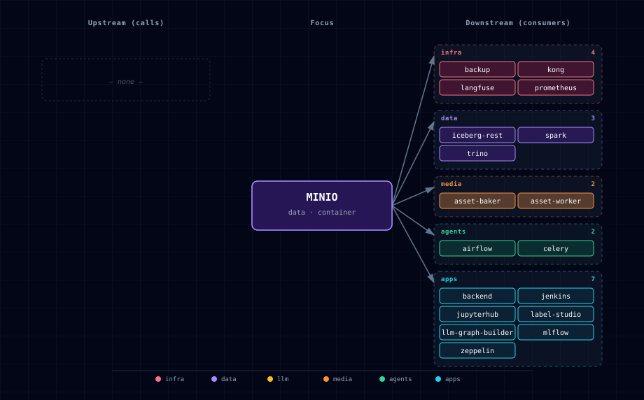

# 5.2.31. MinIO

## 1. Overview

S3-compatible object storage for the artifact tier of the stack. Complements Supabase Storage rather than replacing it: Supabase Storage stays the app-tier surface (row-level-security uploads, signed URLs, ≤50 MB files); MinIO is the artifact-tier surface for high-throughput, large-blob workloads.

## 2. Endpoints

| Surface | URL | Notes |
|---|---|---|
| Admin console (Kong alias) | `http://minio.localhost:${KONG_HTTP_PORT}` | **Use this from your browser.** Requires `./start.sh --setup-hosts` so `minio.localhost` resolves to `127.0.0.1`. Login `minioadmin` / `${MINIO_ROOT_PASSWORD}`. |
| Admin console (direct port) | `http://localhost:${MINIO_CONSOLE_PORT}` (default `63021`) | Equivalent; no hosts setup required. |
| S3 API (host port) | `http://localhost:${MINIO_PORT}` (default `63020`) | **Recommended for s3 clients** (no proxy hop). Stable per `BASE_PORT`. See §2.1. |
| S3 API (Kong alias) | `http://s3.minio.localhost:${KONG_HTTP_PORT}` | Friendly, `BASE_PORT`-independent host. Requires `./start.sh --setup-hosts`. Proxies to `minio:9000` with `preserve_host` so S3 SigV4 validates. |
| S3 API (internal) | `http://minio:9000` | What sibling containers (backend, n8n, ComfyUI, JupyterHub, docling consumers) call via the per-bucket service-account credentials. |
| Admin console (internal) | `http://minio:9001` | What Kong proxies for the console alias. |

Both Kong routes are generated in
`bootstrapper/utils/kong_config_generator.py` and gated on
`MINIO_SOURCE != disabled`: `generate_minio_service()` →
`minio.localhost` (console, `minio:9001`) and
`generate_minio_s3_service()` → `s3.minio.localhost` (S3 API,
`minio:9000`). Both use `preserve_host: True` so the browser/client
keeps its real Host header (the console SPA builds correct redirect URLs;
the S3 client's SigV4 signature still validates). `s3.minio.localhost` is
declared via `extra_kong_aliases` in `services/minio/service.yml`, so
`--setup-hosts` wires it into `/etc/hosts`.

### 2.1. Connecting an external S3-compatible client (CLI, SDK, TUI)

Any S3-compatible tool — `aws` CLI, boto3, `mc`, `s3cmd`, rclone, or a
custom client — connects with these settings. Two endpoints work; pick one:

- **Direct host port** `http://localhost:${MINIO_PORT}` (default `63020`) —
  recommended; no proxy hop, best for heavy/upload traffic.
- **Kong alias** `http://s3.minio.localhost:${KONG_HTTP_PORT}` — a stable
  friendly host that doesn't change with `BASE_PORT`; needs `--setup-hosts`.

| Setting | Value | Source |
|---|---|---|
| Endpoint URL | `http://localhost:${MINIO_PORT}` (default `63020`) **or** `http://s3.minio.localhost:${KONG_HTTP_PORT}` | `MINIO_PORT` / Kong alias |
| Region | `us-east-1` | `MINIO_REGION` |
| Access key | `minioadmin` (full access), or a per-bucket key (scoped) | `MINIO_ROOT_USER` / `MINIO_<BUCKET>_ACCESS_KEY` |
| Secret key | `grep ^MINIO_ROOT_PASSWORD= .env` (full), or the per-bucket secret | `MINIO_ROOT_PASSWORD` / `MINIO_<BUCKET>_SECRET_KEY` |
| Addressing style | **path-style (required)** | localhost/IP endpoints can't use virtual-host style |
| TLS | none (`http://`) | the in-stack baseline serves plain HTTP |

The endpoint is **stable across restarts** for a given `BASE_PORT` (the
port is `BASE_PORT + 20` by default), so it's safe to hard-code in an
external tool's profile. Use the root credentials for browse-everything
access, or a per-bucket service-account key (see §5) to scope a tool to
one bucket.

`aws` CLI example:

```sh
aws --endpoint-url "http://localhost:${MINIO_PORT:-63020}" \
    --region us-east-1 \
    s3 ls
# Credentials via env or ~/.aws/credentials:
#   AWS_ACCESS_KEY_ID=minioadmin
#   AWS_SECRET_ACCESS_KEY=$(grep ^MINIO_ROOT_PASSWORD= .env | cut -d= -f2-)
# aws CLI uses path-style automatically against a custom --endpoint-url.
```

Generic client config (the fields a tool like a standalone S3 TUI needs):

```
endpoint  = localhost:63020      # or ${MINIO_PORT}; host, no scheme for some clients
use_ssl   = false
region    = us-east-1
access_key = minioadmin
secret_key = <MINIO_ROOT_PASSWORD from .env>
path_style = true
```

> **Direct port vs Kong alias.** Both reach the same S3 API. The Kong
> alias (`s3.minio.localhost`) gives a stable, `BASE_PORT`-independent
> hostname — convenient to hard-code in an external tool — and uses
> `preserve_host` so the client's SigV4 signature (which covers the Host
> header) still validates through the proxy. The direct host port skips
> the proxy hop entirely, which is preferable for large/streaming
> uploads. For a browse-oriented tool either is fine; for bulk transfer,
> prefer the direct port.

## 3. Default credentials

- **Root user:** `MINIO_ROOT_USER` (default `minioadmin`)
- **Root password:** `MINIO_ROOT_PASSWORD` — auto-generated to `.env` on first `./start.sh`. Retrieve with `grep ^MINIO_ROOT_PASSWORD= .env`. Use these credentials to log into the admin console.

Root credentials are NEVER surfaced to consumers — see Service accounts below.

## 4. Bucket layout

Fifteen buckets are pre-provisioned by `minio-init` across twelve built-in consumers. Bucket names are the bare service identifier unless overridden:

| Bucket | Intended consumer |
|---|---|
| `comfyui` | ComfyUI generated outputs |
| `backend` | Backend (FastAPI) large blobs / embeddings / model checkpoints |
| `n8n` | n8n workflow file inputs and outputs |
| `jupyter` | JupyterHub datasets and model artifacts |
| `docling` | Doc Processor parsed-document persistence |
| `langfuse` | Langfuse trace and media object storage |
| `mlflow` | MLflow experiment and model artifacts |
| `label-studio` | Label Studio import/export and annotation assets |
| `lakehouse`, `jars`, `checkpoints`, `landing` | Iceberg lakehouse storage, Spark artifacts, checkpoints, and landing data |
| `raw-assets` | Shared input objects written by the scoped asset-ingest identity and accepted by Asset Worker and Asset Baker reference routes |
| `asset-worker` | Asset Worker optimized GLB outputs |
| `asset-baker` | Asset Baker baked GLB and texture outputs |

Bucket names are overridable via `MINIO_BUCKET_<NAME>` env vars. The two
pre-existing processor output settings remain canonical as
`ASSET_WORKER_MINIO_BUCKET` and `ASSET_BAKER_MINIO_BUCKET`; provisioning and
runtime writes consume those same values, so renamed buckets remain aligned.

Parent-owned consumers can add their own bucket and scoped service account without
forking Atlas by passing `MINIO_EXTRA_CONSUMERS` into `minio-init`. The value is a
space-separated list of entries using the same grammar as the built-in consumers.
The fifth field adds writable buckets; the optional sixth field adds read-only
buckets:

```text
CONSUMER:BUCKET_VAR:ACCESS_VAR:SECRET_VAR[:RW_BUCKET_VAR,...[:RO_BUCKET_VAR,...]]
```

For example, a DayDreams-style parent overlay can define:

```yaml
services:
  minio-init:
    environment:
      MINIO_EXTRA_CONSUMERS: "daydreams:MINIO_BUCKET_DAYDREAMS:MINIO_DAYDREAMS_ACCESS_KEY:MINIO_DAYDREAMS_SECRET_KEY"
      MINIO_BUCKET_DAYDREAMS: ${MINIO_BUCKET_DAYDREAMS:-daydreams-artifacts}
      MINIO_DAYDREAMS_ACCESS_KEY: ${MINIO_DAYDREAMS_ACCESS_KEY}
      MINIO_DAYDREAMS_SECRET_KEY: ${MINIO_DAYDREAMS_SECRET_KEY}
```

The bucket, access key, and secret key variables live in the parent-owned
`.env.user` or `ATLAS_ENV_USER_FILE`; Atlas's tracked `.env.example` only owns
the generic `MINIO_EXTRA_CONSUMERS` hook.

## 5. Service accounts

Each consumer has its own MinIO service account with an inline IAM policy scoped to one bucket or a small named set. The Iceberg account has four writable buckets. The generated `MINIO_ASSET_INGEST_*` identity can populate `raw-assets` without root access. Each asset processor can read and list that shared input bucket, but can write or delete objects only in its own output bucket. Extra consumers declared via `MINIO_EXTRA_CONSUMERS` receive the same idempotent bucket, named policy, and inline service-account provisioning:

```json
{
  "Version": "2012-10-17",
  "Statement": [
    { "Effect": "Allow", "Action": ["s3:GetObject", "s3:PutObject", "s3:DeleteObject"],
      "Resource": ["arn:aws:s3:::<bucket>/*"] },
    { "Effect": "Allow", "Action": ["s3:ListBucket"],
      "Resource": ["arn:aws:s3:::<bucket>"] }
  ]
}
```

Built-in credentials are auto-generated to `.env` and exposed as `MINIO_<NAME>_ACCESS_KEY` and `MINIO_<NAME>_SECRET_KEY` where `<NAME>` is one of the built-in consumers. Parent-owned extra consumer credentials are supplied by the parent overlay. A cross-bucket access attempt with a consumer credential returns `403 AccessDenied`.

## 6. Consumer integration recipe (for follow-up PRs)

Python (boto3):

```python
import boto3
from botocore.client import Config
import os

s3 = boto3.client(
    "s3",
    endpoint_url=os.environ["MINIO_ENDPOINT"],
    aws_access_key_id=os.environ["MINIO_BACKEND_ACCESS_KEY"],
    aws_secret_access_key=os.environ["MINIO_BACKEND_SECRET_KEY"],
    region_name=os.environ["MINIO_REGION"],
    config=Config(s3={"addressing_style": "path"}),
)
s3.put_object(Bucket=os.environ["MINIO_BUCKET_BACKEND"], Key="hello.txt", Body=b"hello")
```

Shell (`mc`):

```sh
mc alias set local http://localhost:${MINIO_PORT} "$MINIO_BACKEND_ACCESS_KEY" "$MINIO_BACKEND_SECRET_KEY"
mc cp ./somefile local/backend/somefile
```

### 6.1. Declarative consumer storage contract (`storage:`)

A downstream consumer (see [reusing-atlas.md](../../docs/deployment/reusing-atlas.md))
declares object stores in its `atlas.consumer.yml` instead of hand-writing a
`minio-init` compose override and reverse-engineering endpoints:

```yaml
# atlas.consumer.yml
name: daydreams
storage:
  buckets:
    - name: artifacts              # store handle (unique per consumer)
      bucket: daydreams-artifacts  # optional; default "<consumer>-<name>"
      extra_buckets: [daydreams-thumbs]   # optional, share the scoped account
```

Atlas compiles each store to the existing `MINIO_EXTRA_CONSUMERS` grammar
(no init logic is forked): it sets `MINIO_BUCKET_<KEY>`, appends the
`CONSUMER:BUCKET_VAR:ACCESS_VAR:SECRET_VAR[:EXTRA…]` entry, generates a scoped
service-account credential once (persisted, never rotated on restart), and
**generates the `minio-init` overlay for you** (a gitignored
`volumes/minio/consumer-storage.compose.yml`) so no consumer compose override is
required. Bucket names are validated (S3 rules) and collision-checked against
built-in buckets and across consumers.

Each store also exports stable, per-store fields (consumed by #345 endpoint
wiring) — bucket, **distinct** internal vs public-read endpoints, region, and
**credential references** (variable names, never raw secret values):

```text
ATLAS_STORE_DAYDREAMS_ARTIFACTS_BUCKET=daydreams-artifacts
ATLAS_STORE_DAYDREAMS_ARTIFACTS_INTERNAL_ENDPOINT=http://minio:9000
ATLAS_STORE_DAYDREAMS_ARTIFACTS_PUBLIC_ENDPOINT=http://localhost:${MINIO_PORT}
ATLAS_STORE_DAYDREAMS_ARTIFACTS_REGION=us-east-1
ATLAS_STORE_DAYDREAMS_ARTIFACTS_ACCESS_KEY_VAR=MINIO_DAYDREAMS_ARTIFACTS_ACCESS_KEY
ATLAS_STORE_DAYDREAMS_ARTIFACTS_SECRET_KEY_VAR=MINIO_DAYDREAMS_ARTIFACTS_SECRET_KEY
```

The public endpoint tracks `BASE_PORT`/host changes automatically. The
underlying `MINIO_EXTRA_CONSUMERS` overlay path (§6 above and
[reusing-atlas.md §6.1.2](../../docs/deployment/reusing-atlas.md#612-adding-parent-owned-minio-buckets))
remains supported for existing `_user` integrations.

### 6.2. Browser-safe presigned URLs (sign against the public host)

Presigned-URL signatures cover the request **host**, so signing against the
internal endpoint (`minio:9000`) and then rewriting the URL to the public host
produces an invalid signature — a standing bug class. **Never rewrite a signed
URL.** Sign directly against the browser-visible public endpoint:

- With boto3: create the client with `endpoint_url` set to the **public** base
  (`ATLAS_STORE_<KEY>_PUBLIC_ENDPOINT`) before calling `generate_presigned_url`.
- Dependency-free: use Atlas's reference presigner
  `bootstrapper/utils/s3_presign.py::presign_get_url(endpoint=<public>, …)`,
  which signs against the exact host you pass and returns the URL verbatim
  (path-style by default, TTL-bounded, with optional
  `response_content_type` / `response_content_disposition`).

An opt-in live smoke test
(`bootstrapper/tests/test_storage_presign_e2e.py`, `ATLAS_STORAGE_E2E=1`)
uploads with the scoped credential against the internal endpoint and fetches
the object through a presigned URL signed against the public endpoint — proving
the round-trip without root credentials.

## 7. Source variants

`MINIO_SOURCE` may be:

- `container` (default) — run MinIO in a Docker Compose container
- `disabled` — turn MinIO off (`MINIO_SCALE=0`); the service is not scheduled

`localhost` and `external` variants are not provided in this release.

## 8. Data persistence

MinIO data lives in the `${PROJECT_NAME}-minio-data` named Docker volume mounted at `/data`. `./stop.sh --cold` removes this volume.

## 9. Operations

- **Add a bucket manually:** `mc mb local/<bucket>` from a host with `mc` and the root alias configured.
- **Add a parent-owned consumer bucket:** set `MINIO_EXTRA_CONSUMERS` plus the referenced bucket/access/secret variables in a `_user` compose overlay and parent-owned env overlay, then run `docker compose up --force-recreate minio-init` or restart Atlas.
- **Rotate a service-account key:** edit `MINIO_<NAME>_ACCESS_KEY` and `MINIO_<NAME>_SECRET_KEY` in `.env`, then run `docker compose up --force-recreate minio-init` to re-provision.
- **Logs:** `docker logs ${PROJECT_NAME}-minio` and `docker logs ${PROJECT_NAME}-minio-init`.

## 10. Dependencies & Integrations

### 10.1. Current — Upstream (this service calls)

_No upstream calls._

### 10.2. Current — Downstream (services that call this)

| Service | Category |
|---|---|
| backup | infra |
| kong | infra |
| langfuse | infra |
| prometheus | infra |
| iceberg-rest | data |
| spark | data |
| trino | data |
| asset-baker | media |
| asset-worker | media |
| airflow | agents |
| backend | apps |
| jenkins | apps |
| jupyterhub | apps |
| label-studio | apps |
| llm-graph-builder | apps |
| mlflow | apps |
| zeppelin | apps |

### 10.3. Architecture diagram



[Open the interactive HTML diagram](./architecture.html) for a full-screen view.

### 10.4. Future — Missing pair integrations

- **minio ↔ backend** — *Why:* `minio-init` provisions a `backend` bucket plus scoped keys, but FastAPI never consumes them — large blobs, model checkpoints, embedding caches have nowhere durable to land. *Mechanism:* boto3 client at `http://minio:9000` with `MINIO_BACKEND_ACCESS_KEY`/`SECRET_KEY`, path-style addressing. *Effort:* small. *Confidence:* high.
- **minio ↔ n8n** — *Why:* the `n8n` bucket and keys are pre-provisioned, and n8n ships a first-party S3 node with custom-endpoint support; workflows could persist files without hitting Supabase Storage's 50 MB ceiling. *Mechanism:* n8n S3 credential at `http://minio:9000`; optional `N8N_EXTERNAL_BINARY_DATA_MODE=s3`. *Effort:* small. *Confidence:* high.
- **minio ↔ weaviate** — *Why:* Weaviate explicitly supports MinIO as `backup-s3` (upstream docs). Stack has no Weaviate backup story today. *Mechanism:* enable `backup-s3` in `WEAVIATE_ENABLE_MODULES`, set `BACKUP_S3_BUCKET=weaviate-backups`, `BACKUP_S3_ENDPOINT=minio:9000`, `BACKUP_S3_USE_SSL=false`; add `weaviate-backups` entry in `init-minio.sh`. *Effort:* small. *Confidence:* high.
- **minio ↔ jupyterhub** — *Why:* notebooks need a durable, sharable dataset tier outside the per-user volume; the `jupyter` bucket and keys exist. *Mechanism:* inject `MINIO_JUPYTER_*` + `AWS_S3_ENDPOINT=http://minio:9000` into singleuser env; expose via `s3fs`/`boto3`. *Effort:* small. *Confidence:* high.
- **minio ↔ comfyui** — *Why:* ComfyUI outputs sit in an ephemeral volume; a `comfyui` bucket exists. Persisting renders lets backend/n8n/open-webui share artifacts across `./stop.sh --cold`. *Mechanism:* post-generation hook (custom node or sidecar) uploads `output/` to `s3://comfyui/` via `MINIO_COMFYUI_*`. *Effort:* medium. *Confidence:* medium.
- **minio ↔ doc-processor** — *Why:* docling parses have no persistent landing zone; the `docling` bucket is unused, blocking downstream RAG flows from finding outputs at stable URIs. *Mechanism:* doc-processor writes payloads to `s3://docling/<source-hash>/` via `MINIO_DOCLING_*` keys. *Effort:* small. *Confidence:* high.

### 10.5. Future — Candidate new services

- **Langfuse** ([details](../../docs/research/candidates/langfuse.md)) — *Headline:* LLM observability platform that uses S3 (MinIO) for long-term trace/blob storage. *Wires into:* litellm, hermes, backend, open-webui, local-deep-researcher.
- **Apache Iceberg + DuckDB** ([details](../../docs/research/candidates/iceberg-duckdb.md)) — *Headline:* open table format on top of MinIO that gives the stack a queryable analytics tier. *Wires into:* jupyterhub, backend, n8n.

### 10.6. Future — Unused features in this service

- **Bucket notifications (webhook/Redis/NATS targets)** — *Why pursue:* MinIO can POST object-created events to a webhook or Redis stream; would let backend/n8n/Weaviate react to uploads instead of polling. *Effort:* medium.
- **Object lifecycle rules (expiration + versioning)** — *Why pursue:* `comfyui` and `jupyter` buckets will grow unbounded; per-bucket ILM rules (expire after N days, keep N versions) are a one-shot `mc ilm` config in `init-minio.sh`. *Effort:* small.
- **Server-side encryption (SSE-S3 / SSE-KMS)** — *Why pursue:* stack stores secrets and user uploads in plaintext on the host volume; SSE-S3 with auto-generated KEK gives at-rest encryption without consumer changes. *Effort:* medium.
- **STS / AssumeRole for per-user JupyterHub creds** — *Why pursue:* replaces the single shared `MINIO_JUPYTER_*` credential with short-lived per-user tokens. *Effort:* large.

## 11. Troubleshooting

- **`SignatureDoesNotMatch`** — most often clock skew between host and container. Sync your host clock.
- **Browser-based S3 client fails with CORS** — MinIO's default CORS config rejects unrecognized origins. Configure via `mc admin config` if browser uploads are required.
- **`403 AccessDenied`** — confirm the consumer credential's scoped policy matches the target bucket. Use root credentials to inspect: `mc admin policy info local <consumer>-policy`.
- **Cross-path-style failures** — MinIO requires path-style addressing. In boto3 use `Config(s3={"addressing_style": "path"})`.
- **`minio` container restart-loops** — typically `MINIO_ROOT_PASSWORD` is empty. Confirm `.env` has it populated; if blank, delete the line and re-run `./start.sh` (the bootstrapper will regenerate).
