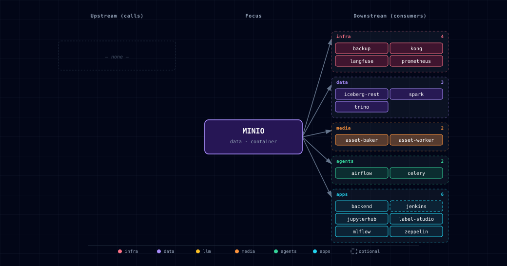

# 5.2.32. MinIO

## 1. Overview

S3-compatible object storage for the artifact tier of the stack. It complements Supabase Storage and does not replace it.

- Supabase Storage is the app-tier surface: row-level-security uploads, signed URLs, files up to 50 MB.
- MinIO is the artifact-tier surface for high-throughput, large-blob workloads.

The container runs [Silo](https://github.com/pgsty/silo) (`pgsty/silo` and `pgsty/mc`), the Pigsty-maintained fork of the archived MinIO community server. MinIO no longer publishes community images, and `quay.io/minio` refuses anonymous pulls. Silo keeps MinIO's S3 API, `MINIO_*` environment, `/minio/*` routes and `mc admin` surface, so everything below applies. The long-term server choice is tracked in [#1277](https://github.com/thekaveh/atlas/issues/1277).

## 2. Endpoints

| Surface | URL | Notes |
|---|---|---|
| Admin console (Kong alias) | `http://minio.localhost:${KONG_HTTP_PORT}` | **Use this from your browser.** Requires `./start.sh --setup-hosts` so `minio.localhost` resolves to `127.0.0.1`. Login `minioadmin` / `${MINIO_ROOT_PASSWORD}`. |
| Admin console (direct port) | `http://localhost:${MINIO_CONSOLE_PORT}` (default `63021`) | Equivalent; no hosts setup required. |
| S3 API (host port) | `http://localhost:${MINIO_PORT}` (default `63020`) | **Recommended for s3 clients** (no proxy hop). Stable per `BASE_PORT`. See §2.1. |
| S3 API (Kong alias) | `http://s3.minio.localhost:${KONG_HTTP_PORT}` | `BASE_PORT`-independent host. Requires `./start.sh --setup-hosts`. Proxies to `minio:9000` with `preserve_host` so S3 SigV4 validates. Metrics paths answer 403 (§2.2). |
| S3 API (internal) | `http://minio:9000` | What sibling containers (backend, n8n, ComfyUI, JupyterHub, docling consumers) call via the per-bucket service-account credentials. |
| Admin console (internal) | `http://minio:9001` | What Kong proxies for the console alias. |

Both Kong routes are generated in `bootstrapper/utils/kong_config_generator.py` when `MINIO_SOURCE != disabled`. They use `preserve_host`, so the client keeps its real Host header. The console SPA then builds correct redirect URLs, and the S3 client's SigV4 signature validates.

### 2.1. Connecting an external S3-compatible client (CLI, SDK, TUI)

Any S3-compatible tool (`aws` CLI, boto3, `mc`, `s3cmd`, rclone, or a custom client) connects with these settings. Two endpoints reach the same S3 API and validate SigV4 signatures:

- The direct host port: no proxy hop, best for heavy upload traffic.
- The Kong alias: a `BASE_PORT`-independent hostname that needs `--setup-hosts`.

| Setting | Value | Source |
|---|---|---|
| Endpoint URL | `http://localhost:${MINIO_PORT}` (default `63020`) **or** `http://s3.minio.localhost:${KONG_HTTP_PORT}` | `MINIO_PORT` / Kong alias |
| Region | `us-east-1` | `MINIO_REGION` |
| Access key | `minioadmin` (full access), or a per-bucket key (scoped) | `MINIO_ROOT_USER` / `MINIO_<BUCKET>_ACCESS_KEY` |
| Secret key | `grep ^MINIO_ROOT_PASSWORD= .env` (full), or the per-bucket secret | `MINIO_ROOT_PASSWORD` / `MINIO_<BUCKET>_SECRET_KEY` |
| Addressing style | **path-style (required)** | localhost/IP endpoints can't use virtual-host style |
| TLS | none (`http://`) | the in-stack baseline serves plain HTTP |

The endpoint is stable across restarts for a given `BASE_PORT`, so you can hard-code it in a tool's profile. By default the port is `BASE_PORT + 20`. Use the root credentials to browse every bucket, or a per-bucket service-account key (§5) to scope a tool to one bucket.

### 2.2. Metrics endpoints

`MINIO_PROMETHEUS_AUTH_TYPE=public` lets Prometheus scrape MinIO on the internal network without credentials. Kong's `s3.minio.localhost` answers 403 on `/minio/v2/metrics`, `/minio/metrics/v3` and `/minio/prometheus/metrics`. The direct `MINIO_PORT` serves them without credentials, and MinIO's default API CORS reflects any origin. Any web page can read them there, so keep `MINIO_PORT` loopback-bound.

## 3. Default credentials

- **Root user:** `MINIO_ROOT_USER` (default `minioadmin`)
- **Root password:** `MINIO_ROOT_PASSWORD` — auto-generated to `.env` on first `./start.sh`. Retrieve with `grep ^MINIO_ROOT_PASSWORD= .env`. Use these credentials to log into the admin console.

Consumers do not get the root credentials. They use the scoped service accounts in §5, including Spark's worker, connect and history containers. Two exceptions are deliberate:

- **Airflow**: its containers and seeded `minio_default` connection carry the root pair, so DAG authors must be trusted. The Airflow README states this trusted-DAG boundary.
- **Backup runner**: it falls back to the root pair in local S3 mode (see the backup README).

`minio-init` applies a changed secret key to the existing account. A changed access key creates a new account, and `minio-init` never removes earlier ones. Remove a leaked key yourself with `mc admin user svcacct rm local <old-access-key>`.

## 4. Bucket layout

Sixteen buckets are pre-provisioned by `minio-init` across thirteen built-in consumers. Bucket names are the bare service identifier unless overridden:

| Bucket | Intended consumer |
|---|---|
| `comfyui` | ComfyUI generated outputs |
| `backend` | Backend (FastAPI) large blobs / embeddings / model checkpoints |
| `n8n` | n8n workflow file inputs and outputs |
| `jupyter` | JupyterHub datasets and model artifacts |
| `docling` | Doc Processor parsed-document persistence |
| `langfuse` | Langfuse trace and media object storage |
| `mlflow` | MLflow experiment and model artifacts |
| `label-studio` | Label Studio import/export and annotation assets |
| `spark-history` | Spark history-server event logs |
| `lakehouse`, `jars`, `checkpoints`, `landing` | Iceberg lakehouse storage, Spark artifacts, checkpoints, and landing data |
| `raw-assets` | Shared input objects written by the scoped asset-ingest identity and accepted by Asset Worker and Asset Baker reference routes |
| `asset-worker` | Asset Worker optimized GLB outputs |
| `asset-baker` | Asset Baker baked GLB and texture outputs |

Override bucket names with `MINIO_BUCKET_<NAME>` env vars. The asset processors' output buckets are set by `ASSET_WORKER_MINIO_BUCKET` and `ASSET_BAKER_MINIO_BUCKET`. Provisioning and runtime writes read the same values, so a renamed bucket stays aligned.

Parent-owned consumers can add their own bucket and scoped service account without forking Atlas:

- Pass `MINIO_EXTRA_CONSUMERS` into `minio-init`: a space-separated list of `CONSUMER:BUCKET_VAR:ACCESS_VAR:SECRET_VAR` entries, optionally extended with extra read/write bucket lists.
- Supply the referenced variables in the parent-owned `.env.user` or `ATLAS_ENV_USER_FILE`.

[Reusing Atlas §6.1.2](../../docs/operations/reusing-atlas.md#612-adding-parent-owned-minio-buckets) has the full grammar and a worked example. §6.1 covers the declarative `storage:` alternative.

## 5. Service accounts

Each consumer has its own MinIO service account with an inline IAM policy. The policy allows get/put/delete/list on the consumer's own bucket, with these exceptions:

- The Iceberg account writes four buckets.
- The Spark account writes `spark-history` and the same four lakehouse buckets.
- The Jupyter account can also read `lakehouse`.
- The shared `MINIO_ASSET_INGEST_*` identity writes `raw-assets` without root access. Each asset processor can only read and list `raw-assets`, and writes its own bucket.

Extra consumers in `MINIO_EXTRA_CONSUMERS` get the same idempotent bucket, named policy and service-account provisioning. The `minio-init` provisioning script generates the policy JSON.

Built-in credentials are auto-generated to `.env` and exposed as `MINIO_<NAME>_ACCESS_KEY` and `MINIO_<NAME>_SECRET_KEY` where `<NAME>` is one of the built-in consumers. Parent-owned extra consumer credentials are supplied by the parent overlay. A cross-bucket access attempt with a consumer credential returns `403 AccessDenied`.

## 6. Consumer integration recipe

A consumer connects with any standard S3 SDK or the `mc` CLI, using the endpoint and per-bucket credentials from §2.1 and §5. Examples: boto3 with `Config(s3={"addressing_style": "path"})`, or `mc alias set` against the host port.

### 6.1. Declarative consumer storage contract (`storage:`)

A downstream consumer can declare object stores in the `storage:` block of its `atlas.consumer.yml`, with no compose override. Atlas compiles each store to the `MINIO_EXTRA_CONSUMERS` grammar, provisions a scoped service-account credential, and generates the `minio-init` overlay. Each store exports stable `ATLAS_STORE_<KEY>_*` fields: bucket, internal and public endpoints, region, and credential variable names. [Consumer Manifest Reference §7](../../docs/reference/consumer-manifest.md#7-storage) has the full schema.

### 6.2. Browser-safe presigned URLs (sign against the public host)

A presigned-URL signature covers the request **host**. A URL signed against `minio:9000` and then rewritten to the public host has an invalid signature. **Never rewrite a signed URL.** Sign against the browser-visible public endpoint, for example by setting boto3's `endpoint_url` to the public base before `generate_presigned_url`. `bootstrapper/utils/s3_presign.py` is a dependency-free reference presigner.

## 7. Source variants

`MINIO_SOURCE` may be:

- `container` (default) — run MinIO in a Docker Compose container
- `disabled` — turn MinIO off (`MINIO_SCALE=0`); the service is not scheduled

`localhost` and `external` variants are not provided in this release.

## 8. Data persistence

MinIO data lives in the `${PROJECT_NAME}-minio-data` named Docker volume mounted at `/data`. `./stop.sh --cold` removes this volume.

## 9. Operations

- **Add a bucket manually:** `mc mb local/<bucket>` from a host with `mc` and the root alias configured.
- **Add a parent-owned consumer bucket:** set `MINIO_EXTRA_CONSUMERS` and its bucket, access and secret variables in a `_user` compose overlay and env overlay. Then run `./start.sh` again. A bare `docker compose` command does not load the `_user` overlay.
- **Rotate a service-account key:** edit `MINIO_<NAME>_ACCESS_KEY` and `MINIO_<NAME>_SECRET_KEY` in `.env`, then run `docker compose -p <PROJECT_NAME> up --force-recreate minio-init` to re-provision. If the stack uses overlays or a consumer manifest, run `./start.sh` again instead.
- **Logs:** `docker logs ${PROJECT_NAME}-minio` and `docker logs ${PROJECT_NAME}-minio-init`.

## 10. Dependencies & Integrations

### 10.1. Current — Upstream (this service calls)

_No upstream calls._

### 10.2. Current — Downstream (services that call this)

| Service | Category | Status |
|---|---|---|
| backup | infra | current |
| kong | infra | current |
| langfuse | infra | current |
| prometheus | infra | current |
| iceberg-rest | data | current |
| spark | data | current |
| trino | data | current |
| asset-baker | media | current |
| asset-worker | media | current |
| airflow | agents | current |
| celery | agents | current |
| backend | apps | current |
| jenkins | apps | optional: an operator-authored Jenkins job; none ships with Atlas |
| jupyterhub | apps | current |
| label-studio | apps | current |
| mlflow | apps | current |
| zeppelin | apps | current |

### 10.3. Architecture diagram

[Open the full-size diagram](./architecture.html) for a full-screen view.

### 10.4. Future — Missing pair integrations

- **minio ↔ backend (general artifact API)** — *Why:* Backend RAG ingestion reads consumer-declared corpora with each store's scoped MinIO account. The built-in `backend` bucket is not yet a general destination for large blobs, model checkpoints or embedding caches. *Mechanism:* add an artifact client at `http://minio:9000` using `MINIO_BACKEND_ACCESS_KEY`/`SECRET_KEY`, with upload/download routes and path-style addressing. *Effort:* small. *Confidence:* high.
- **minio ↔ n8n** — *Why:* the `n8n` bucket and keys are pre-provisioned, and n8n's S3 node supports a custom endpoint. Workflows could store files above Supabase Storage's 50 MB limit. *Mechanism:* n8n S3 credential at `http://minio:9000`; optional `N8N_EXTERNAL_BINARY_DATA_MODE=s3`. *Effort:* small. *Confidence:* high.
- **minio ↔ weaviate (direct `backup-s3`)** — *Why:* the backup runner already archives native `backup-filesystem` snapshots. `backup-s3` would write straight to the bucket and skip the local snapshot volume. *Mechanism:* enable `backup-s3` in `WEAVIATE_ENABLE_MODULES`, set `BACKUP_S3_BUCKET=weaviate-backups`, `BACKUP_S3_ENDPOINT=minio:9000`, `BACKUP_S3_USE_SSL=false`; add `weaviate-backups` entry in `init-minio.sh`. *Effort:* small. *Confidence:* high.
- **minio ↔ comfyui** — *Why:* ComfyUI outputs sit in an ephemeral volume, and a `comfyui` bucket exists. Uploaded renders would let backend, n8n and open-webui share artifacts across `./stop.sh --cold`. *Mechanism:* post-generation hook (custom node or sidecar) uploads `output/` to `s3://comfyui/` via `MINIO_COMFYUI_*`. *Effort:* medium. *Confidence:* medium.
- **minio ↔ doc-processor** — *Why:* docling output has no persistent landing zone, and the `docling` bucket is unused. Downstream RAG flows cannot find outputs at stable URIs. *Mechanism:* doc-processor writes payloads to `s3://docling/<source-hash>/` via `MINIO_DOCLING_*` keys. *Effort:* small. *Confidence:* high.

### 10.5. Future — Candidate new services

_No high-confidence opportunities identified._

### 10.6. Future — Unused features in this service

- **Bucket notifications (webhook/Redis/NATS targets)** — *Why pursue:* MinIO can POST object-created events to a webhook or Redis stream. Backend, n8n and Weaviate could react to uploads instead of polling. *Effort:* medium.
- **Object lifecycle rules (expiration + versioning)** — *Why pursue:* the `comfyui` and `jupyter` buckets grow without limit. Per-bucket ILM rules (expire after N days, keep N versions) are one `mc ilm` config in `init-minio.sh`. *Effort:* small.
- **Server-side encryption (SSE-S3 / SSE-KMS)** — *Why pursue:* the stack stores secrets and user uploads in plaintext on the host volume. SSE-S3 with a generated KEK encrypts at rest with no consumer change. *Effort:* medium.
- **STS / AssumeRole for per-user JupyterHub creds** — *Why pursue:* replaces the single shared `MINIO_JUPYTER_*` credential with short-lived per-user tokens. *Effort:* large.

## 11. Troubleshooting

- **`SignatureDoesNotMatch`** — most often clock skew between host and container. Sync your host clock.
- **Browser-based S3 client fails with CORS** — Atlas sets no MinIO CORS policy, and MinIO reflects any origin by default. A CORS failure usually comes from the client or a proxy between them; check the request's `Origin` and the Kong route. Restrict origins with `mc admin config` if needed.
- **`403 AccessDenied`** — confirm the consumer credential's scoped policy matches the target bucket. Use root credentials to inspect: `mc admin policy info local <consumer>-policy`.
- **Cross-path-style failures** — MinIO requires path-style addressing. In boto3 use `Config(s3={"addressing_style": "path"})`.
- **`minio` container restart-loops** — usually `MINIO_ROOT_PASSWORD` is empty. If it is blank in `.env`, delete the line and rerun `./start.sh`, which generates a new value.

## 12. Capabilities & limitations

Support tier: **experimental** — Capability contract declared; no cited cold-start, workflow, or upgrade qualification run yet (evidence at `v0.1.0`).

| Capability | Status | Verification | Notes |
|---|---|---|---|
| S3-compatible artifact storage | supported | tested | Atlas exposes the MinIO S3 API and console directly and through Kong for in-stack artifacts, lakehouse data, traces, models, and backups. |
| Scoped consumer bucket provisioning | supported | tested | The idempotent init service creates built-in and declared extra-consumer buckets, policies, and service-account credentials with scoped access. |
| Highly available storage lifecycle controls | not-supported | documented | The stock single-node deployment configures no replication, object versioning, lifecycle retention, or server-side encryption policy. |
