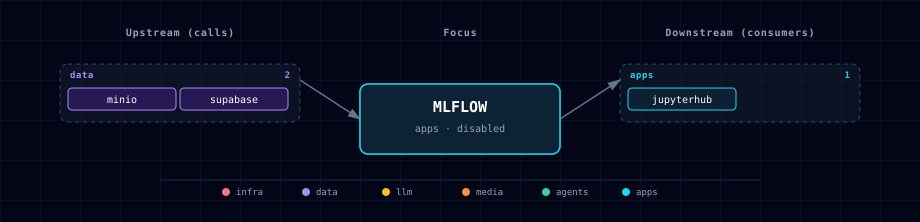

# 5.2.33. MLflow (experiment tracking + artifacts)

## 1. Overview

MLflow is an optional, disabled-by-default experiment tracking and artifact registry surface for the ML Engineering track. Atlas runs MLflow as a tracking server backed by Supabase Postgres for run metadata and MinIO for run artifacts, model files, and small notebook outputs.

This first slice is intentionally narrow: notebooks can log experiments and artifacts through `MLFLOW_TRACKING_URI`; model promotion automations are out of scope.

## 2. Access

| Surface | URL | Notes |
| --- | --- | --- |
| Kong | `http://mlflow.localhost:${KONG_HTTP_PORT}` | Routed only when `MLFLOW_SOURCE=container`. |
| Direct | `http://localhost:${MLFLOW_PORT}` | Bound through `HOST_BIND_IP`; production profile keeps it local. |
| In-network | `http://mlflow:5000` | Used by JupyterHub and future service consumers. |

## 3. Configuration

```dotenv
MLFLOW_SOURCE=disabled
MLFLOW_PORT=
MLFLOW_ENDPOINT=
MLFLOW_TRACKING_URI=
MLFLOW_DB_NAME=mlflow
MLFLOW_DB_USER=mlflow
MLFLOW_DB_PASSWORD=
MINIO_BUCKET_MLFLOW=mlflow
```

`MLFLOW_SOURCE=container` requires `MINIO_SOURCE=container`; the bootstrapper fails early otherwise so runs cannot silently lose artifacts.

## 4. Architecture & Wiring

When enabled, `mlflow-init` creates the dedicated Postgres database and role after `minio-init` provisions the MLflow bucket and scoped service account. The `mlflow` container starts `mlflow server` with:

- a Postgres backend store at `supabase-db:5432/${MLFLOW_DB_NAME}`;
- proxied artifacts under `s3://${MINIO_BUCKET_MLFLOW}`;
- S3-compatible access through MinIO at `http://minio:9000`.

JupyterHub receives `MLFLOW_TRACKING_URI=http://mlflow:5000` when MLflow is enabled and includes the MLflow Python client.

Minimal notebook smoke:

```python
import mlflow

mlflow.set_tracking_uri("http://mlflow:5000")
with mlflow.start_run():
    mlflow.log_param("source", "atlas-smoke")
    mlflow.log_metric("score", 1.0)
    with open("/tmp/atlas-mlflow-smoke.txt", "w", encoding="utf-8") as handle:
        handle.write("atlas mlflow artifact")
    mlflow.log_artifact("/tmp/atlas-mlflow-smoke.txt")
```

## 5. Dependencies & Integrations

### 5.1. Current — Upstream (this service calls)

| Service | Category |
|---|---|
| minio | data |
| supabase | data |

### 5.2. Current — Downstream (services that call this)

| Service | Category |
|---|---|
| kong | infra |
| jupyterhub | apps |

### 5.3. Architecture diagram



[Open the full-size diagram](./architecture.html) for a full-screen view.

### 5.4. Future — Missing pair integrations

Backend and n8n can use the MLflow REST API for model registry reads in later tickets. That work is not part of the first slice.

### 5.5. Future — Candidate new services

Label Studio can export reviewed datasets or metrics into MLflow in a later data/ML workflow.

### 5.6. Future — Unused features in this service

MLflow model serving, deployment plugins, and promotion workflows are intentionally out of scope for this first Atlas integration.

## 6. Troubleshooting

- **No tracking URI in notebooks:** confirm `MLFLOW_SOURCE=container` and restart after the bootstrapper regenerates `.env`.
- **Artifacts fail to upload:** keep `MINIO_SOURCE=container`; MLflow requires MinIO-backed artifact storage in this Atlas slice.
- **Database errors on first boot:** check `mlflow-init` logs. It creates the `mlflow` database/role idempotently before the tracking server starts.

## 7. Capabilities & limitations

| Capability | Status | Verification | Notes |
|---|---|---|---|
| Experiment and run tracking | supported | tested | Atlas runs an MLflow tracking server with a dedicated Postgres database and injects its tracking URI plus client into JupyterHub. |
| Scoped MinIO artifact storage | supported | tested | MLflow proxies artifacts to a dedicated MinIO bucket with generated service credentials and refuses Atlas enablement when MinIO is unavailable. |
| MLflow ingress authentication | partial | tested | mlflow.localhost is protected by Kong dashboard Basic Auth and ACL, but the host-published direct UI/API has no MLflow application authentication. |
| Model registry deployment automation | not-supported | documented | The first Atlas slice stores tracking and registry metadata only; it ships no model serving, promotion, deployment plugin, or Backend/n8n automation. |
| Tracking service high availability | not-supported | documented | Postgres and MinIO persist state, but Atlas runs one MLflow server without replicas, failover routing, or a tested backup-and-restore workflow for the combined stores. |
