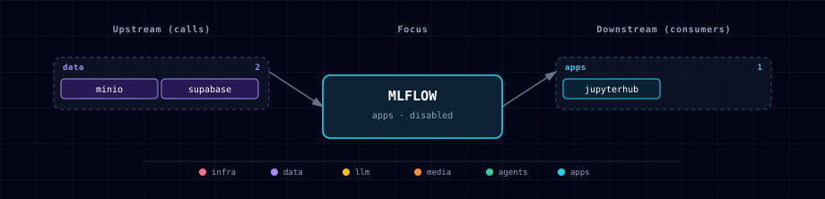

# 5.2.33. MLflow (experiment tracking + artifacts)

## 1. Overview

MLflow is an optional, disabled-by-default experiment tracking and artifact registry surface for the ML Engineering track. Atlas runs MLflow as a tracking server backed by Supabase Postgres for run metadata and MinIO for run artifacts, model files, and small notebook outputs.

Notebooks log experiments and artifacts through `MLFLOW_TRACKING_URI`; model promotion automations are out of scope.

## 2. Access

| Surface | URL | Notes |
| --- | --- | --- |
| Kong | `http://mlflow.localhost:${KONG_HTTP_PORT}` | Routed only when `MLFLOW_SOURCE=container`, behind Kong dashboard basic auth (`DASHBOARD_USERNAME` / `DASHBOARD_PASSWORD`). MLflow has no login of its own. A browser API call or write is accepted only from an origin in `MLFLOW_SERVER_CORS_ALLOWED_ORIGINS` (this route and the direct port); others get 403. SDK and `curl` calls send no `Origin` and are not affected. |
| Direct | `http://localhost:${MLFLOW_PORT}` | Bound through `HOST_BIND_IP` (default `127.0.0.1:`, loopback only). An empty value or a LAN address publishes the port on the network. MLflow still answers 403 "invalid host header" to a `Host` not in `MLFLOW_SERVER_ALLOWED_HOSTS` (set in `compose.yml`). Add the LAN address there to use it. |
| In-network | `http://mlflow:5000` | Used by JupyterHub. |

## 3. Configuration

```dotenv
MLFLOW_SOURCE=disabled
MLFLOW_PORT=
MLFLOW_ENDPOINT=
MLFLOW_TRACKING_URI=
MLFLOW_DB_NAME=mlflow
MLFLOW_DB_USER=mlflow
MLFLOW_DB_PASSWORD=
MINIO_BUCKET_MLFLOW=mlflow
```

`MLFLOW_SOURCE=container` requires `MINIO_SOURCE=container`; the bootstrapper fails early otherwise so runs cannot silently lose artifacts.

## 4. Architecture & Wiring

When MLflow is enabled, `supabase-db-init` creates its Postgres database and role (`services/supabase/db/scripts/05-scoped-roles.sh`). `minio-init` provisions the MLflow bucket and scoped service account. `mlflow-init` then only checks that it can log in to the database. Atlas builds the exact reviewed MLflow base with pinned PostgreSQL and S3 drivers, then starts the guarded server with:

- a Postgres backend store at `supabase-db:5432/${MLFLOW_DB_NAME}`;
- proxied artifacts under `s3://${MINIO_BUCKET_MLFLOW}`;
- S3-compatible access through MinIO at `http://minio:9000`.

JupyterHub receives `MLFLOW_TRACKING_URI=http://mlflow:5000` when MLflow is enabled and includes the MLflow Python client.

Minimal notebook smoke:

```python
import mlflow

mlflow.set_tracking_uri("http://mlflow:5000")
with mlflow.start_run():
    mlflow.log_param("source", "atlas-smoke")
    mlflow.log_metric("score", 1.0)
    with open("/tmp/atlas-mlflow-smoke.txt", "w", encoding="utf-8") as handle:
        handle.write("atlas mlflow artifact")
    mlflow.log_artifact("/tmp/atlas-mlflow-smoke.txt")
```

## 5. Dependencies & Integrations

### 5.1. Current — Upstream (this service calls)

| Service | Category |
|---|---|
| minio | data |
| supabase | data |

### 5.2. Current — Downstream (services that call this)

| Service | Category |
|---|---|
| kong | infra |
| jupyterhub | apps |

### 5.3. Architecture diagram



[Open the full-size diagram](./architecture.html) for a full-screen view.

### 5.4. Future — Missing pair integrations

Backend and n8n could read the model registry over the MLflow REST API. Not implemented.

### 5.5. Future — Candidate new services

Label Studio can export reviewed datasets or metrics into MLflow in a later data/ML workflow.

### 5.6. Future — Unused features in this service

MLflow model serving, deployment plugins and promotion workflows are out of scope.

## 6. Troubleshooting

- **Database connections:** each of the 4 server workers opens separate tracking and registry SQLAlchemy engines. `MLFLOW_SQLALCHEMYSTORE_POOL_SIZE=2` and `MLFLOW_SQLALCHEMYSTORE_MAX_OVERFLOW=3` cap them at 40 connections to the shared `supabase-db` (SQLAlchemy's 5+10 default allowed 120). MLflow ignores `MAX_OVERFLOW=0`, so use at least 1.
- **Job-backed MLflow features:** `atlas_server.py` starts uvicorn directly instead of `mlflow server`, so MLflow's background job runner does not run. MLflow 3.16 features that submit server-side jobs fail with HTTP 500 and leave a PENDING job row. Nothing Atlas ships uses them.
- **No tracking URI in notebooks:** confirm `MLFLOW_SOURCE=container` and restart after the bootstrapper regenerates `.env`.
- **Artifacts fail to upload:** keep `MINIO_SOURCE=container`; MLflow supports only MinIO-backed artifact storage.
- **Database errors on first boot:** `mlflow-init` only runs a login check. `supabase-db-init` creates the `mlflow` database and role (`services/supabase/db/scripts/05-scoped-roles.sh`), so check its logs for the cause.
- **`atlas-mlflow: upgrading the MLflow database schema` in the server log:** expected once after an MLflow image change. `atlas_server.py` runs `mlflow db upgrade` before the server starts. Back up the database first if you need a rollback point; migrations do not run backwards.
- **AI Gateway endpoints return 404:** this is intentional. MLflow 3.16.1 fixes CVE-2026-71211, but Atlas configures no gateway endpoints and keeps that secrets-holding surface closed. Atlas supports MLflow tracking, registry metadata, and artifact APIs. It disables the native, REST, and AJAX AI Gateway route families at the outer ASGI boundary, also when `_MLFLOW_STATIC_PREFIX` is set.
- **A custom `MLFLOW_IMAGE` exits at startup:** Atlas currently accepts exactly MLflow 3.16.1. Before the allowlist changes, review a new version with the route guard, private server environment, dependency image and the required multi-architecture smoke.

## 7. Capabilities & limitations

Support tier: **experimental** — Capability contract declared; no cited cold-start, workflow, or upgrade qualification run yet (evidence at `v0.1.0`).

| Capability | Status | Verification | Notes |
|---|---|---|---|
| Experiment and run tracking | supported | tested | Atlas runs an MLflow tracking server with a dedicated Postgres database and injects its tracking URI plus client into JupyterHub. |
| Scoped MinIO artifact storage | supported | tested | MLflow proxies artifacts to a dedicated MinIO bucket with generated service credentials and refuses Atlas enablement when MinIO is unavailable. |
| MLflow ingress authentication | partial | tested | mlflow.localhost is protected by Kong dashboard Basic Auth and ACL, but the host-published direct tracking UI/API has no MLflow application authentication. |
| MLflow AI Gateway SSRF containment | supported | tested | Atlas accepts exactly reviewed MLflow 3.16.1, which closes CVE-2026-64849 and CVE-2026-71211. Every prefixed and unprefixed AI Gateway route family stays disabled at its ASGI boundary, because Atlas configures no gateway endpoints. The built image runs a required multi-architecture smoke. |
| Model registry deployment automation | not-supported | documented | The first Atlas slice stores tracking and registry metadata only; it ships no model serving, promotion, deployment plugin, or Backend/n8n automation. |
| Tracking service high availability | not-supported | documented | Postgres and MinIO persist state, but Atlas runs one MLflow server without replicas, failover routing, or a tested backup-and-restore workflow for the combined stores. |
