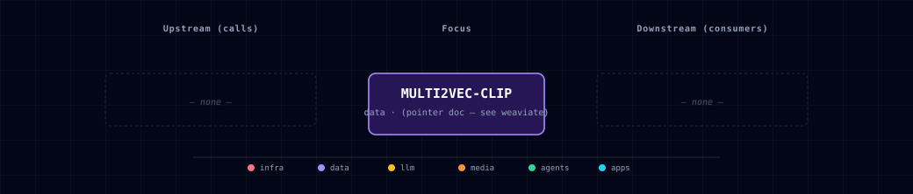

# 5.2.34. Multi2Vec CLIP

Multimodal CLIP vectorizer module for Weaviate. It runs the [`semitechnologies/multi2vec-clip`](https://github.com/weaviate/multi2vec-clip-inference) image and exposes `POST /vectorize` and `GET /meta` on internal port `8080`. The Docker repo has no `-inference` suffix; the GitHub source repo has it.

Weaviate is the only consumer, through its `multi2vec-clip` module (`CLIP_INFERENCE_API=http://multi2vec-clip:8080`). Every container on `backend-network` can also reach `/vectorize`.

The default model is `sentence-transformers-clip-ViT-B-32` (English-only ViT-B/32). One endpoint embeds both text and images, so one call can vectorize a `{texts, images}` batch for cross-modal similarity search.

## 1. Overview

Image: `semitechnologies/multi2vec-clip:sentence-transformers-clip-ViT-B-32-1.5.1` (the `MULTI2VEC_CLIP_IMAGE` default in `.env.example`). Tags name the model. The `-1.5.1` suffix pins the inference-server build; the un-suffixed `…-ViT-B-32` tag moves to the newest build.

Container port: `8080`, internal only (no host port). The default `container-cpu` source sets `ENABLE_CUDA=0`. `container-gpu` sets `ENABLE_CUDA=1` but does not request a GPU, so it does not work yet (§6).

The bootstrapper runs CLIP only when `WEAVIATE_SOURCE=container`; with any other Weaviate source it scales CLIP to 0.

## 2. Access

| Path | URL | Notes |
|---|---|---|
| Direct | — | No host port. Internal-only by design. |
| Internal | `http://multi2vec-clip:8080/vectorize` | What Weaviate (and future consumers) call. |
| Kong | — | Infra module; no Kong route. |
| Meta | `GET http://multi2vec-clip:8080/meta` | Returns model config; useful as a health probe. |

Canonical port table: [Ports and Routes](../../docs/reference/ports-routes.md).

## 3. Configuration

```bash
MULTI2VEC_CLIP_SOURCE=container-cpu       # container-cpu | container-gpu | disabled
CLIP_INFERENCE_API=http://multi2vec-clip:8080
MULTI2VEC_CLIP_SIGLIP2_IMAGE=semitechnologies/multi2vec-clip:google-siglip2-so400m-patch16-512-1.5.1
```

The bootstrapper keeps Weaviate's module list in step with the source. The default list is:

```bash
WEAVIATE_ENABLE_MODULES=text2vec-openai,text2vec-ollama,multi2vec-clip,generative-openai,generative-ollama,backup-filesystem
CLIP_INFERENCE_API=http://multi2vec-clip:8080
```

To disable CLIP, set `MULTI2VEC_CLIP_SOURCE=disabled` (or pass `--multi2vec-clip-source disabled`). The bootstrapper then removes `multi2vec-clip` from `WEAVIATE_ENABLE_MODULES` and clears `CLIP_INFERENCE_API`. Do not edit those two values by hand; the bootstrapper overwrites them. Collections that use `multi2vec-clip` as their vectorizer fail on the next ingest.

**SigLIP 2 opt-in image.** The ViT-B/32 image stays the default so existing collections keep their vector space. To test Weaviate's SigLIP 2 `so400m` image, copy the reference value into the live image variable:

```bash
MULTI2VEC_CLIP_IMAGE=semitechnologies/multi2vec-clip:google-siglip2-so400m-patch16-512-1.5.1
MULTI2VEC_CLIP_SOURCE=container-cpu
CLIP_INFERENCE_API=http://multi2vec-clip:8080
```

Use `container-cpu`: `container-gpu` does not reserve a GPU yet, so the container exits and Weaviate never becomes ready (§6).

Do not change `MULTI2VEC_CLIP_IMAGE` on a stack with `multi2vec-clip` collections without a migration plan. ViT-B/32 emits 512-d vectors; the SigLIP 2 image emits 1152-d vectors. Recreate the collections, or revectorize them into new ones, before you use SigLIP 2. Only the image changes: the endpoint, port, topology row and track stay the same.

## 4. Architecture & wiring

**Call shape.**

```http
POST /vectorize
Content-Type: application/json

{
  "texts": ["a red sports car"],
  "images": ["<base64 PNG>"]
}

→ 200 OK
{
  "textVectors": [[...512 floats...]],
  "imageVectors": [[...512 floats...]]
}
```

Weaviate calls this endpoint internally on every `POST /v1/objects` against a collection whose `vectorizer: multi2vec-clip`. The CLIP module knows nothing about Weaviate — it's a pure embedding service.

**Network.** Joined to `backend-network`. Any container on that network can `POST /vectorize` directly. The data-flow graph does not list this path because no service uses it.

**Volumes / state.** None. The model is baked into the image; the container is stateless and trivially restartable.

**Manifest layout.** `services/multi2vec-clip/` holds only documentation. The container, image, env vars and wizard row belong to the `weaviate` family (`services/weaviate/service.yml`, `services/weaviate/compose.yml`).

## 5. Dependencies & Integrations

### 5.1. Current — Upstream (this service calls)

_No upstream calls._

### 5.2. Current — Downstream (services that call this)

_No downstream consumers._

### 5.3. Architecture diagram



[Open the full-size diagram](./architecture.html) for a full-screen view.

### 5.4. Future — Missing pair integrations

- **multi2vec-clip ↔ backend** — *Why:* backend has no direct path to multimodal embeddings; today it can only reach CLIP indirectly by writing through Weaviate. Direct `/vectorize` calls unlock zero-shot image tagging, image-vs-text similarity scoring, and ad-hoc embedding without round-tripping through a collection. *Mechanism:* `POST http://multi2vec-clip:8080/vectorize` with `{texts, images}`. *Effort:* small. *Confidence:* high.
- **multi2vec-clip ↔ minio** — *Why:* MinIO hosts artifact buckets (comfyui, backend, n8n, jupyter, docling) but none of those image artifacts are indexed for semantic retrieval. A small ingest worker streams new objects through CLIP into Weaviate. *Mechanism:* MinIO bucket-notification webhook → fetch object → base64 → `POST /vectorize` → upsert into a `MediaAssets` Weaviate collection. *Effort:* medium. *Confidence:* medium.
- **multi2vec-clip ↔ comfyui** — *Why:* ComfyUI images stay unindexed in volumes. Embedding each one into Weaviate enables prompt-similarity search, dedup and "find prior renders that look like X". *Mechanism:* ComfyUI custom SaveImage post-hook → call backend ingest endpoint → backend forwards bytes to `multi2vec-clip:8080/vectorize` and upserts. *Effort:* medium. *Confidence:* medium.
- **multi2vec-clip ↔ jupyterhub** — *Why:* notebook users today spin up their own CLIP model to experiment with multimodal embeddings; the stack already runs one. *Mechanism:* JupyterHub user pods reach `http://multi2vec-clip:8080/vectorize` over `backend-network`; document a one-cell helper in the notebook starter image. *Effort:* small. *Confidence:* high.
- **multi2vec-clip ↔ n8n** — *Why:* n8n workflows handling inbound email/Slack attachments or webhook-uploaded images can vectorize on-the-fly for routing, classification, or RAG. *Mechanism:* n8n HTTP Request node → `POST http://multi2vec-clip:8080/vectorize` → branch on cosine-similarity to label-vectors. *Effort:* small. *Confidence:* high.
- **multi2vec-clip ↔ doc-processor** — *Why:* docling extracts figures/diagrams from PDFs but discards the visual signal. CLIP-embedding extracted figures alongside text chunks enables true multimodal RAG over document corpora. *Mechanism:* docling post-extraction step → for each figure, base64 → `POST /vectorize` → store with parent-chunk metadata. *Effort:* medium. *Confidence:* medium.

### 5.5. Future — Candidate new services

_No high-confidence opportunities identified._

### 5.6. Future — Unused features in this service

- **GPU mode (`MULTI2VEC_CLIP_SOURCE=container-gpu`)** — *Why pursue:* the variant sets `ENABLE_CUDA=1` but gets no GPU; wire the NVIDIA device request ([#1373](https://github.com/thekaveh/atlas/issues/1373)). *Effort:* small.
- **Model variant selection beyond ViT-B-32** — *Why pursue:* upstream ships SigLIP 2, multilingual XLM-R+ViT, LAION ViT-B-16; we hard-pin `sentence-transformers-clip-ViT-B-32`. Exposing `MULTI2VEC_CLIP_IMAGE` choices in the wizard unlocks multilingual + higher-recall regimes. *Effort:* small.
- **Multi-field weighted vectors** — *Why pursue:* the CLIP module supports per-field weights (`image_fields` weight 0.9, `text_fields` weight 0.1); no collection in `weaviate-init` exercises this. *Effort:* small.
- **`/meta` health surfacing** — *Why pursue:* container exposes `/meta` with model config; not scraped or shown in the wizard's service-table health column. *Effort:* small.
- **`trust_remote_code` for custom CLIP variants** — *Why pursue:* enables loading community models (Qwen3-VL, ColPali) already supported by the upstream loader. *Effort:* medium (security review needed).

## 6. Troubleshooting

**`container-gpu` leaves Weaviate not-ready.** `container-gpu` sets `ENABLE_CUDA=1`, but the compose fragment requests no GPU (no `runtime: nvidia`, no device reservation). The CLIP container exits at startup (`Torch not compiled with CUDA enabled` or no visible CUDA device). Weaviate, with `multi2vec-clip` enabled, then waits for it forever. Use `container-cpu` or `disabled`. GPU wiring is tracked in [#1373](https://github.com/thekaveh/atlas/issues/1373).

**Container OOMs on CPU.** Memory use grows under load and with large batches. Raise the Docker memory budget, or send smaller batches. `container-gpu` is not usable until GPU device requests are wired.

**Weaviate ingest fails with `connection refused to multi2vec-clip:8080`.** `MULTI2VEC_CLIP_SOURCE` is `disabled`, or the container is down. CLIP has no host port, so query `/meta` from a sibling container (commands below). The Weaviate image has `wget` but no `curl`.

**Embeddings look random / clustering broken.** Confirm that `/meta` returns the configuration of the expected model. A stale image cache after a model change can pin you to the old checkpoint. `docker compose pull multi2vec-clip && docker compose up -d --force-recreate multi2vec-clip`.

**Module not available in Weaviate.** `WEAVIATE_ENABLE_MODULES` must list `multi2vec-clip`. Check `docker exec <project>-weaviate env | grep ENABLE_MODULES`.

```bash
docker compose ps multi2vec-clip
docker compose logs -f multi2vec-clip
docker exec <project>-weaviate wget -qO- http://multi2vec-clip:8080/meta | jq .
```

For general startup and routing issues, see [Troubleshooting](../../docs/quick-start/troubleshooting.md).

## 7. Operations

**Smoke-test from a sibling container.**

```bash
docker exec <project>-backend curl -s http://multi2vec-clip:8080/meta | jq 'keys'
# → ["clip_model", "text_model"]  (the Hugging Face configs of the loaded model)
```

**Embed a text + image batch.**

```bash
docker exec <project>-backend curl -s -X POST http://multi2vec-clip:8080/vectorize \
  -H 'content-type: application/json' \
  -d "$(jq -n --arg img "$(base64 < ./photo.png)" '{texts:["red car"], images:[$img]}')"
# → {"textVectors":[[...512 floats...]], "imageVectors":[[...512 floats...]]}
```

Output vectors are 512-d for ViT-B/32. Cosine similarity between a text vector and an image vector gives the canonical CLIP score.

**Restart without rebuilding.** Stateless — `docker compose restart multi2vec-clip` is safe. The model file is in the image, so restart reuses the same packaged weights without a rebuild.

## 8. Performance notes

- **Vector dimension is fixed by the model.** ViT-B/32 gives 512; SigLIP 2 gives 1152. Changing the model needs a new or revectorized collection.
- **Measure before sizing.** Latency depends on hardware, image size and batch shape. Benchmark the exact image and payload before you set capacity or timeout budgets.
