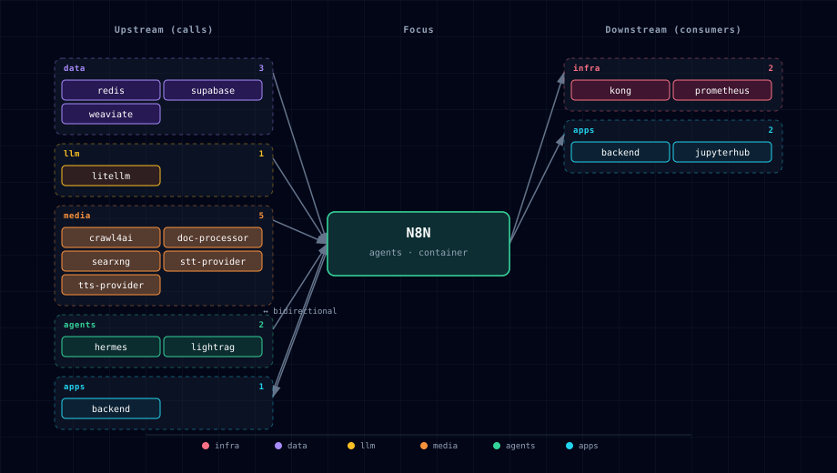

# 5.2.34. n8n

Workflow automation engine. The stack runs n8n in **queue mode** by default — one `n8n` web/API container plus an `n8n-worker` container that consumes jobs from Redis. A short-lived `n8n-init` container handles first-run setup: installing community nodes (ComfyUI image-to-image, MCP client). Seeded workflow templates (under `services/n8n/init/config/`) and PostgreSQL credentials are imported **manually** — `n8n-init` prints the next steps; it does not auto-import workflows or seed credentials (see the setup steps below). The result is a fully-wired automation surface that ties LLM (LiteLLM), media (ComfyUI/STT/TTS/Docling/SearXNG), and data (Supabase/Weaviate/MinIO) services together without writing code.

n8n is also the only "agents"-tier service besides Hermes; the two are complementary. n8n is event-driven and visual (cron triggers, webhooks, manual runs); Hermes is conversational and skill-driven. n8n reaches Hermes through a shared `HERMES_ENDPOINT` env var so a workflow can hand off to an agent (the reverse edge — Hermes calling a workflow — isn't wired today; see §4).

## 1. Overview

Image: `n8nio/n8n:2.28.2`. The web/API container handles HTTP + UI; the worker container handles execution. Both share state through Supabase Postgres (workflow definitions, executions history, credentials) and Redis (queue + execution coordination). The `n8n-init` container runs after the web/API container is reachable, installs required community nodes, then exits. Startup now checks that one-shot exit code after detached `compose up` and fails the launcher if it exited nonzero.

Track placement: n8n is available in `all`, `gen-ai-eng`, and `gen-ai-rag`. In the RAG track it provides workflow orchestration for document ingestion, search-to-extraction flows, vector-store operations, and human-reviewed automation around the RAG services.

## 2. Access

| Path | URL | Notes |
|---|---|---|
| Direct | `http://localhost:${N8N_PORT}` (default `63075`) | UI + REST API. |
| Kong | `http://n8n.localhost:${KONG_HTTP_PORT}` | Recommended for browser use; needs `./start.sh --setup-hosts`. Kong route uses `preserve_host: True`. |
| Webhook | `${N8N_HOST}/webhook/<path>` | n8n's webhook entry point; resolves to whichever host you used to reach n8n. |

Canonical port table: [Ports and Routes](../../docs/deployment/ports-and-routes.md).

## 3. Configuration

```bash
N8N_SOURCE=container                # container | disabled
N8N_PORT=63075                      # computed by topology.py
N8N_ENCRYPTION_KEY=<random>         # auto-generated by bootstrapper; rotate before deploy
N8N_HOST=n8n.localhost              # Kong alias hostname
N8N_PROTOCOL=http
N8N_EXECUTIONS_MODE=queue           # queue (default, requires worker + redis) | regular (single-process)
N8N_INIT_NODES=n8n-nodes-comfyui@0.0.9,@ksc1234/n8n-nodes-comfyui-image-to-image@1.0.2
```

n8n 2.28.2 always uses the owner-account setup flow. Community nodes are
loaded from the pinned packages installed by `n8n-init`; the retired
`N8N_AUTH_ENABLED`, `N8N_ALLOW_CONNECTIONS_FROM`,
`N8N_COMMUNITY_PACKAGES_ENABLED`, and
`N8N_COMMUNITY_PACKAGES_ALLOW_TOOL_USAGE` variables are intentionally absent
because this n8n release does not consume them.

Adaptive env (auto-injected based on active SOURCE values):

```bash
STT_ENDPOINT=...                    # resolved per STT_PROVIDER_SOURCE
TTS_ENDPOINT=...                    # resolved per TTS_PROVIDER_SOURCE
DOCLING_ENDPOINT=...                # resolved per DOC_PROCESSOR_SOURCE
```

Required Postgres/Redis env (built from the upstream services' creds):

```bash
DB_TYPE=postgresdb
DB_POSTGRESDB_HOST=supabase-db
DB_POSTGRESDB_DATABASE=postgres
DB_POSTGRESDB_USER=supabase_admin
DB_POSTGRESDB_PASSWORD=${SUPABASE_DB_PASSWORD}
QUEUE_BULL_REDIS_HOST=redis
QUEUE_BULL_REDIS_PASSWORD=${REDIS_PASSWORD}
BACKEND_N8N_API_TOKEN=            # auto-generated workflow-scoped bearer
```

The bundled Backend-calling workflows attach
`Authorization: Bearer $env.BACKEND_N8N_API_TOKEN` to every request. The
value is present on both the n8n web and worker containers because queue-mode
executions run on the worker. Workflow expressions can read this value, so the
Backend accepts it only on the research, memory-automation, legacy ComfyUI, and
storage-upload routes used by the bundled workflows. It cannot access plugin,
workflow-administration, generic-job, or RAG-ingestion operator routes. Do not
return it in webhook payloads, execution output, or browser-side code.

**Required runtime dep:** `weaviate` (per `runtime_deps.n8n.requires`). With `WEAVIATE_SOURCE=disabled`, n8n is force-disabled with an error message — the stack design treats Weaviate-backed vector ops as load-bearing for the seeded AI workflows.

## 4. Architecture & wiring

**Queue mode flow:**

1. UI/webhook hits `n8n:5678` (web container) → workflow record stored in Supabase Postgres.
2. Execution is pushed onto BullMQ queue in Redis db `/0` (`QUEUE_BULL_REDIS_DB: 0`).
3. `n8n-worker` polls Redis, picks up the job, runs the workflow, writes execution history back to Postgres.
4. UI streams progress via Redis pub/sub back to the web container.

**Init flow** (`n8n-init`, pinned n8n image + npm lockfile):

1. Before the n8n web or worker process starts, install the committed exact package set with `npm ci --omit=dev --ignore-scripts` into the shared `/home/node/.n8n/nodes` directory.
2. `n8n-workflow` is pinned to the version inside `n8nio/n8n:2.28.2`, avoiding wildcard peer drift. n8n's first-party MCP client, tool, registry, and trigger nodes replace the redundant `n8n-nodes-mcp` community package and its vulnerable transitive chain. `N8N_INIT_NODES` can replace the default set only with comma-separated exact `name@x.y.z` specs; the former unversioned Atlas default is recognized as a compatibility alias for the committed lock.
3. Print completion. The seeded workflow template in `services/n8n/init/config/`
   (mounted at `/config/`) is imported **manually** via the n8n UI — `n8n-init`
   does not auto-import workflows.
4. Exit 0 only when the complete package tree is installed; otherwise exit 1 and prevent n8n from starting. Initialization does not call n8n's authenticated internal REST API.

**Hard dependencies** (`depends_on.required`): `supabase`, `redis`, `litellm`. Without LiteLLM, all AI Agent nodes (the most-used feature) 404.

**Adaptive integrations** (`runtime_adaptive.n8n.adapts_to`): `stt_provider`, `tts_provider`, `doc_processor`, `lightrag`, `hermes`. When any of those is `disabled`, the corresponding endpoint env var is set to empty and workflow nodes referencing it surface 502 at run time.

**Hermes wiring.** `HERMES_ENDPOINT` is injected so workflows can call into Hermes via the HTTP Request node. Inverse path (Hermes → n8n) is webhook-driven: n8n's public REST API has no execute endpoint, so expose a Webhook-trigger workflow and have Hermes POST to its URL.

**Seeded workflows.** `services/n8n/init/config/searxng-research-workflow.json` ships as a worked example of the SearXNG → LiteLLM research pattern, imported manually via the n8n UI. Additional example workflows are staged under `services/n8n/workflows-stage/workflows/` for the same manual-import path. Repository tests validate the pinned HTTP Request/Webhook method fields, fresh-database importability, trigger reachability, and Code-node syntax. Research examples carry request/session context in ordinary items and explicit node references, poll before retrieving results, and produce terminal reports even when every session fails; they do not mutate `$execution.customData`.

**Consumer workflow seeding (#412).** A downstream consumer no longer has to script workflow import/activation/readiness itself. It declares an `n8n_workflows` block in `atlas.consumer.yml` (see [reusing-atlas.md §6.3.3](../../docs/deployment/reusing-atlas.md#633-seeding-n8n-workflows-with-n8n_workflows)) and Atlas seeds them for it:

1. The bootstrapper validates each workflow (JSON parseable, **credential-safe** — a node may reference credentials by a `{id, name}` mapping only; a raw string/list value or a mapping with extra keys, i.e. an embedded credential `data` payload, is rejected; optional `sha256` checksum; stable/unique id; non-colliding webhook routes), normalizes the JSON to an **Atlas-namespaced id** `atlas-consumer-<id>` (stripping runtime-state carriers `staticData`/`pinData`) with the activation policy baked in, and writes the gitignored `volumes/n8n/consumer-workflows/` (per-workflow JSON + `plan.json`) plus a compose overlay adding an Atlas-owned **`n8n-seed`** container (the n8n image, sharing the n8n schema).
2. After n8n is healthy, the seeder (`seed-workflows.sh`, a thin wrapper that `exec`s node on `seed-workflows.js` — **node, not `wget`**, because the n8n image is Alpine/BusyBox whose `wget` has no `--method` and there is no `curl`) runs `n8n import:workflow` for each file — **idempotent, keyed by the namespaced `atlas-consumer-<id>`**, so re-running startup updates the workflow in place, never creates a duplicate active workflow, and — because Atlas owns the `atlas-consumer-*` id namespace — can never overwrite another consumer's or a user's workflow.
3. When `N8N_API_KEY` is set, the seed activates workflows through the public API (checking the HTTP status and warning on a non-2xx) so their production webhooks register on the running instance without a restart, and **reconciles removed workflows** — any `atlas-consumer-*` workflow no longer declared by a manifest is deactivated + deleted so a since-removed entry doesn't orphan a live webhook. Without a key the workflow is imported + active-persisted (its webhook registers on the next n8n restart) and reconcile is skipped (logged). Declared webhooks are then probed for readiness (opt-in; `POST` probes require an explicit `probe: true` because they can trigger side effects).

All artifacts regenerate every start, so removing a manifest — or a single workflow — drops exactly its own generated files on the next start. Seeder HTTP operations have a manifest-owned 10-second absolute deadline (`N8N_SEED_HTTP_TIMEOUT_MS`), and spawned n8n CLI operations have a manifest-owned 120-second deadline (`N8N_SEED_COMMAND_TIMEOUT_MS`); both values must be positive. The detached startup verifier includes `n8n-seed`, so a crash or nonzero container exit cannot be omitted from the final launch result. The seeder remains **best-effort** per workflow: an import or activation failure is logged and isolated and does not make the seed container fail, so one bad consumer workflow cannot abort `docker compose up --wait`. Coverage: `bootstrapper/tests/test_consumer_n8n_workflows.py`, `test_consumer_doctor.py`, `test_n8n_seed_bounds.py`, and `test_init_scripts_compile.py` (`node --check` on the seeder). The live import/activation/reconcile/webhook-probe against a running n8n is an optional live test (not exercised by the unit suite).

## 5. Calling LightRAG from n8n

When `LIGHTRAG_SOURCE != disabled`, the env vars `LIGHTRAG_ENDPOINT` and `LIGHTRAG_API_KEY` are injected into n8n containers. Use the HTTP Request node:

- URL: `={{$env.LIGHTRAG_ENDPOINT}}/query`
- Auth: Bearer token from `={{$env.LIGHTRAG_API_KEY}}`
- Body (JSON): `{"query": "/hybrid Your question"}`

<a id="6-dependencies--integrations"></a>

## 6. Dependencies & Integrations

### 6.1. Current — Upstream (this service calls)

| Service | Category |
|---|---|
| redis | data |
| supabase | data |
| supavisor | data |
| weaviate | data |
| litellm | llm |
| crawl4ai | media |
| doc-processor | media |
| searxng | media |
| stt-provider | media |
| tika | media |
| tts-provider | media |
| hermes | agents |
| lightrag | agents |
| backend ↔ | apps |

### 6.2. Current — Downstream (services that call this)

| Service | Category |
|---|---|
| kong | infra |
| prometheus | infra |
| backend ↔ | apps |
| jupyterhub | apps |

### 6.3. Architecture diagram



[Open the interactive HTML diagram](./architecture.html) for a full-screen view.

### 6.4. Future — Missing pair integrations

- **n8n ↔ comfyui** — *Why:* `n8n-nodes-comfyui` is installed by `n8n-init`, but no `COMFYUI_ENDPOINT` env is injected into n8n's compose, so users hand-enter `http://comfyui:18188` in every workflow credential. *Mechanism:* inject `COMFYUI_ENDPOINT=${COMFYUI_ENDPOINT}` (matches the STT/TTS/DOCLING pattern); add `comfyui` to `runtime_deps.optional`. *Effort:* small. *Confidence:* high.
- **n8n ↔ minio** — *Why:* MinIO already provisions an `n8n` bucket plus `MINIO_N8N_*` creds, but neither credentials nor the S3 endpoint are passed to n8n, so the dedicated bucket sits unused. *Mechanism:* env-inject `S3_ENDPOINT=http://minio:9000`, `S3_BUCKET=${MINIO_BUCKET_N8N}`, `S3_ACCESS_KEY`/`S3_SECRET_KEY`; add `minio` to `runtime_deps.optional`. Path-style addressing required. *Effort:* small. *Confidence:* high.
- **n8n ↔ neo4j** — *Why:* Neo4j is the stack's graph store but has no first-party n8n node; KG-from-document flows can't write to Neo4j without custom HTTP-node calls. *Mechanism:* inject `NEO4J_URI=bolt://neo4j-graph-db:7687` + creds; use the HTTP Request node hitting `http://neo4j-graph-db:7474/db/neo4j/tx/commit` until a vetted community node is adopted. *Effort:* medium. *Confidence:* medium.
- **n8n ↔ searxng** — *Why:* n8n advertises a `SearXNG Tool` sub-node for AI-agent workflows but the endpoint is not injected. *Mechanism:* inject `SEARXNG_ENDPOINT=http://searxng:8080`; add `searxng` to `runtime_deps.optional`. *Effort:* small. *Confidence:* high.
- **n8n ↔ openclaw** — *Why:* OpenClaw is the messaging-platform gateway. Wiring it to n8n turns every n8n webhook into a chat-triggered automation. *Mechanism:* OpenClaw → n8n via webhook at `http://n8n:5678/webhook/<path>`; n8n → OpenClaw via HTTP Request node; shared bearer secret in both manifests. *Effort:* medium. *Confidence:* medium.

### 6.5. Future — Candidate new services

- **Langfuse** ([details](../../docs/research/candidates/langfuse.md)) — *Headline:* self-hostable LLM/diffusion trace + eval store; n8n's HTTP node can log per-step trace events. *Wires into:* litellm, hermes, comfyui.
- **Browserless** ([details](../../docs/research/candidates/browserless.md)) — *Headline:* headless-Chrome backend so n8n can scrape JS-rendered pages, render PDFs, screenshot. *Wires into:* searxng, doc-processor, backend.
- **NocoDB** ([details](../../docs/research/candidates/nocodb.md)) — *Headline:* spreadsheet UI over the existing Supabase Postgres, with a first-party n8n node for row CRUD. *Wires into:* supabase, backend.

### 6.6. Future — Unused features in this service

- **MCP Server Trigger node** — *Why pursue:* the pinned n8n runtime already ships first-party MCP client, tool, registry, and trigger nodes, but bundled workflows do not yet expose an Atlas workflow as an MCP tool for Hermes/LiteLLM clients. *Effort:* small.
- **Native Weaviate Vector Store cluster node** — *Why pursue:* upstream ships a native Weaviate vector-store node; workflows currently talk to Weaviate via raw HTTP. Switching unlocks embeddings + retrievers without custom code. *Effort:* small.
- **Built-in webhook auth (header auth + signature verification)** — *Why pursue:* OpenClaw and external triggers need verified webhooks; n8n supports this but no defaults are baked into the manifest. *Effort:* small.

## 7. Troubleshooting

**`Command start not found` restart loop.** Almost always corruption in the `atlas-n8n-data` volume after a partial cold-start. Surgical fix: `docker volume rm <project>-n8n-data` (without `./stop.sh --cold`). On next `./start.sh`, n8n re-initializes from scratch.

**Init container exits with `EACCES` writing nodes.** The community-package install needs the node-modules dir writable. Check `docker logs <project>-n8n-init`; typically a remnant from an earlier failed run. `docker volume rm <project>-n8n-data` clears it.

**Workflows enqueued but never execute.** `EXECUTIONS_MODE=queue` requires both the web and worker containers up. Verify `docker compose ps | grep n8n` shows two healthy n8n rows and Redis is reachable from both.

**AI Agent nodes 404.** LiteLLM is down or `LITELLM_MASTER_KEY` rotated without restarting n8n. n8n caches the key at startup; bounce n8n after rotation.

```bash
docker compose ps n8n n8n-worker
docker compose logs -f n8n
docker compose logs -f n8n-worker
docker compose logs n8n-init        # one-shot; useful for first-run debug
```

For general startup and routing issues, see [Troubleshooting](../../docs/quick-start/troubleshooting.md).
