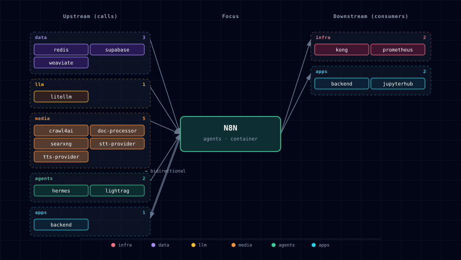

# 5.2.35. n8n

## 1. Overview

Workflow automation engine, run in **queue mode** by default: an `n8n` web/API container and an `n8n-worker` container that takes jobs from Redis. Its workflows connect LLM (LiteLLM), media (ComfyUI, STT, TTS, Docling, SearXNG) and data (Supabase, Weaviate) services without code.

Image: `n8nio/n8n:2.28.2`. The web/API container serves HTTP and the UI; the worker runs executions. Both share state through Supabase Postgres (workflow definitions, execution history, credentials) and Redis (queue and execution coordination).

The one-shot `n8n-init` runs first, installs the pinned ComfyUI community nodes and exits. The web/API and worker containers start only after it succeeds, and the launcher fails if it exits nonzero. It does not import workflow templates (`services/n8n/init/config/`) or PostgreSQL credentials; import them manually (§4).

Track placement: n8n is in `all`, `gen-ai-rag` and `gen-ai-eng`. In the RAG track it orchestrates document ingestion, search-to-extraction flows, vector-store operations and human-reviewed automation. n8n requires Weaviate (§3), and `gen-ai-eng` does not include Weaviate. On that track, pass `--weaviate-source container`, or n8n is auto-disabled at start.

n8n (event-driven, visual: cron triggers, webhooks, manual runs) and Hermes (conversational, skill-driven) complement each other. Workflows call Hermes through `HERMES_ENDPOINT`. Hermes → n8n is not wired (see §4).

## 2. Access

| Path | URL | Notes |
|---|---|---|
| Direct | `http://localhost:${N8N_PORT}` (default `63075`) | UI + REST API. |
| Kong | `http://n8n.localhost:${KONG_HTTP_PORT}` | Recommended for browser use; needs `./start.sh --setup-hosts`. Kong route uses `preserve_host: True`. |
| Webhook | `${WEBHOOK_URL}webhook/<path>` | n8n's externally reachable webhook entry point; `WEBHOOK_URL` defaults to the complete Kong base URL, including scheme and port. The worker gets the same `WEBHOOK_URL` and `N8N_EDITOR_BASE_URL`, because queue-mode executions build `$execution.resumeUrl`, Wait-on-webhook, Form and approval links there. |

Canonical port table: [Ports and Routes](../../docs/reference/ports-routes.md).

## 3. Configuration

```bash
N8N_SOURCE=container                # container | disabled
N8N_PORT=63075                      # computed by topology.py
N8N_ENCRYPTION_KEY=<random>         # auto-generated by bootstrapper; rotate before deploy
N8N_HOST=n8n.localhost              # Kong alias hostname (fixed in compose.yml; not read from .env)
N8N_PROTOCOL=http
N8N_EXECUTIONS_MODE=queue           # queue (default, requires worker + redis) | regular (single-process)
N8N_INIT_NODES=n8n-nodes-comfyui@0.0.9,@ksc1234/n8n-nodes-comfyui-image-to-image@1.0.2
```

n8n 2.28.2 always uses the owner-account setup flow. Community nodes load from the pinned packages that `n8n-init` installs. The pinned image needs no auth-mode or community-package env vars.

Both containers run with `NODE_ENV=production` (the image default). Development mode would add any-origin credentialed CORS, drop `X-Frame-Options` and return stack traces from the REST API.

Production mode also checks the editor WebSocket `Origin` against the `Forwarded` host that Kong injects (`n8n.localhost:${KONG_HTTP_PORT}`). The editor works there and on the direct port. Through a tunnel hostname (cloudflared with `httpHostHeader: n8n.localhost`) or another Kong port, the editor shows "Connection lost". Webhooks still work.

`N8N_BLOCK_ENV_ACCESS_IN_NODE` is `"false"` on `n8n` and `n8n-worker`. Otherwise n8n 2.x rejects `$env` in expressions. Every bundled workflow authenticates to the backend with `$env.BACKEND_N8N_API_TOKEN`, and the research workflow also reads `$env.LITELLM_*`. Anyone who can edit workflows can therefore read the container environment, including database and encryption credentials. Treat n8n editor access as administrator access.

Adaptive env (auto-injected based on active SOURCE values):

```bash
STT_ENDPOINT=...                    # resolved per STT_PROVIDER_SOURCE
PARAKEET_API_TOKEN=                 # generated Parakeet bearer; server-side only
TTS_ENDPOINT=...                    # resolved per TTS_PROVIDER_SOURCE
DOCLING_ENDPOINT=...                # resolved per DOC_PROCESSOR_SOURCE
DOCLING_API_TOKEN=                  # generated Docling bearer; server-side only
```

Required Postgres/Redis env (built from the upstream services' creds):

```bash
DB_TYPE=postgresdb
DB_POSTGRESDB_HOST=supabase-db
DB_POSTGRESDB_DATABASE=postgres
DB_POSTGRESDB_USER=${N8N_DB_USER}
DB_POSTGRESDB_PASSWORD=${N8N_DB_PASSWORD}
QUEUE_BULL_REDIS_HOST=redis
QUEUE_BULL_REDIS_PASSWORD=${REDIS_PASSWORD}
BACKEND_N8N_API_TOKEN=            # auto-generated workflow-scoped bearer
```

The bundled Backend-calling workflows send `Authorization: Bearer $env.BACKEND_N8N_API_TOKEN` on every request. Both the web and worker containers have the value, because queue-mode executions run on the worker. The token reaches only a limited set of Backend routes; the Backend docs list them. Do not return it in webhook payloads, execution output or browser-side code.

Only `BACKEND_N8N_API_TOKEN` is route-scoped. The web and worker containers also receive the stack-wide LiteLLM master key and provider-level credentials for cloud models, Docling and Parakeet. Trusted workflow expressions may call those services.

- Calls to `${DOCLING_ENDPOINT}/v1/document/convert` must send `Authorization: Bearer {{$env.DOCLING_API_TOKEN}}`.
- Calls to a Parakeet `${STT_ENDPOINT}/v1/audio/transcriptions` route must send `{{$env.PARAKEET_API_TOKEN}}`. Speaches and whisper.cpp do not use it.
- Use the LiteLLM master key and provider-level credentials only in server-side expressions. Never put them in execution output, webhook responses or browser JavaScript.

**Required runtime dep:** `weaviate` (`runtime_deps.n8n.requires`). With `WEAVIATE_SOURCE=disabled`, n8n and `n8n-worker` are auto-disabled with an error message, because the seeded AI workflows need Weaviate vector operations.

## 4. Architecture & wiring

**Queue mode flow:**

1. UI/webhook hits `n8n:5678` (web container) → workflow record stored in Supabase Postgres.
2. Execution is pushed onto BullMQ queue in Redis db `/0` (`QUEUE_BULL_REDIS_DB: 0`).
3. `n8n-worker` polls Redis, picks up the job, runs the workflow, writes execution history back to Postgres.
4. UI streams progress via Redis pub/sub back to the web container.

**Init flow** (`n8n-init`, pinned n8n image + npm lockfile):

1. Before n8n starts, `n8n-init` installs the committed package set with `npm ci --omit=dev --ignore-scripts` into the shared `/home/node/.n8n/nodes`.
2. On a warm restart it skips the install if two conditions hold. The installed `package.json` and `package-lock.json` match the committed ones, and `node_modules/.package-lock.json` exists. Restarts then need no npm registry access.
3. All package versions are pinned, including the `n8n-workflow` peer dependency. Comments next to the n8n-init lockfile give the reasons.
4. `N8N_INIT_NODES` can replace the default set, as comma-separated exact `name@x.y.z` specs. An unchanged custom set is skipped on later starts, so an offline restart keeps it. A changed set is installed into a staging directory and swapped in only if `npm install` succeeds.
5. The workflow template in `services/n8n/init/config/` (mounted at `/config/`) is not imported; import it manually in the n8n UI.
6. `n8n-init` exits 0 only when the complete package tree is installed. Otherwise it exits 1, and n8n does not start. It does not call n8n's authenticated internal REST API.

**Hard dependencies** (`depends_on.required`): `supabase`, `redis`, `litellm`. Without LiteLLM, the AI Agent nodes fail.

**Adaptive integrations** (`runtime_adaptive.n8n.adapts_to`): `stt_provider`, `tts_provider`, `doc_processor`, `tika`, `lightrag`, `hermes`, `crawl4ai`, `supavisor`. When one is `disabled`, its endpoint env var is empty, and workflow nodes that use it return 502 at run time.

**Hermes wiring.** Workflows call Hermes with the HTTP Request node at `HERMES_ENDPOINT`. For Hermes → n8n, n8n's public REST API has no execute endpoint. Expose a Webhook-trigger workflow and have Hermes POST to its URL.

**Seeded workflows.** Import them manually in the n8n UI:

- `services/n8n/init/config/searxng-research-workflow.json` is a worked example of the SearXNG → LiteLLM research pattern.
- More examples are staged under `services/n8n/workflows-stage/workflows/`.
- Parameter ranges (query count and length, loop limits, search-API choice) and node behavior are in each workflow's inline notes.

Secure every webhook before activation. The legacy bundled POST `/research` fixture has no webhook authentication or credential declaration. Each staged webhook fixture names an `Atlas Webhook Header Auth` credential. Create a local n8n **Header Auth** credential with that name, select it on the webhook node, and give callers the same header and value.

Through Kong (`n8n.localhost`, the `WEBHOOK_URL` that callers use), a webhook can hold its response open for up to 300 s. The research and ComfyUI fixtures need this. `langmem-consolidation` runs only while the memory service reports `enabled` and `status: healthy`.

**Consumer workflow seeding.** A downstream consumer can declare `n8n_workflows` in `atlas.consumer.yml` (see §10 of the [Consumer Manifest Reference](../../docs/reference/consumer-manifest.md)). After n8n is healthy, an `n8n-seed` container validates, namespaces (`atlas-consumer-<id>`), imports and activates each workflow. Seeding is idempotent and best-effort per workflow, so one bad workflow cannot stop startup.

With `N8N_API_KEY` set, workflows removed from the manifest are deactivated and deleted. This includes removing the last one; the seed then runs with an empty plan on every start. The full spec is in §10 of the [Consumer Manifest Reference](../../docs/reference/consumer-manifest.md). The code is `bootstrapper/core/consumer_manifest.py` and `services/n8n/init/scripts/seed-workflows.js`.

## 5. Calling LightRAG from n8n

When `LIGHTRAG_SOURCE != disabled`, n8n containers receive `LIGHTRAG_ENDPOINT` and `LIGHTRAG_API_KEY`. Use the HTTP Request node:

- URL: `={{$env.LIGHTRAG_ENDPOINT}}/query`
- Auth: header `X-API-Key: ={{$env.LIGHTRAG_API_KEY}}` only. Do not also send the key as `Authorization: Bearer`; LightRAG rejects that with 401.
- Body (JSON): `{"query": "Your question", "mode": "hybrid"}`. `mode` is `local`, `global`, `hybrid`, `naive`, `mix` or `bypass`; the default is `mix`.

<a id="6-dependencies--integrations"></a>

## 6. Dependencies & Integrations

### 6.1. Current — Upstream (this service calls)

| Service | Category |
|---|---|
| redis | data |
| supabase | data |
| supavisor | data |
| weaviate | data |
| litellm | llm |
| crawl4ai | media |
| doc-processor | media |
| searxng | media |
| stt-provider | media |
| tika | media |
| tts-provider | media |
| hermes | agents |
| lightrag | agents |
| backend ↔ | apps |

### 6.2. Current — Downstream (services that call this)

| Service | Category |
|---|---|
| kong | infra |
| prometheus | infra |
| backend ↔ | apps |
| jupyterhub | apps |

### 6.3. Architecture diagram



[Open the full-size diagram](./architecture.html) for a full-screen view.

### 6.4. Future — Missing pair integrations

- **n8n ↔ comfyui** — *Why:* `n8n-nodes-comfyui` is installed by `n8n-init`, but no `COMFYUI_ENDPOINT` env is injected into n8n's compose, so users hand-enter `http://comfyui:18188` in every workflow credential. *Mechanism:* inject `COMFYUI_ENDPOINT=${COMFYUI_ENDPOINT}` (matches the STT/TTS/DOCLING pattern); add `comfyui` to `runtime_deps.optional`. *Effort:* small. *Confidence:* high.
- **n8n ↔ minio** — *Why:* MinIO provisions an `n8n` bucket and `MINIO_N8N_*` credentials. n8n receives neither the credentials nor the S3 endpoint, so the bucket is unused. *Mechanism:* env-inject `S3_ENDPOINT=http://minio:9000`, `S3_BUCKET=${MINIO_BUCKET_N8N}`, `S3_ACCESS_KEY`/`S3_SECRET_KEY`; add `minio` to `runtime_deps.optional`. Path-style addressing required. *Effort:* small. *Confidence:* high.
- **n8n ↔ neo4j** — *Why:* Neo4j is the stack's graph store but has no first-party n8n node; KG-from-document flows can't write to Neo4j without custom HTTP-node calls. *Mechanism:* inject `NEO4J_URI=bolt://neo4j-graph-db:7687` + creds; use the HTTP Request node hitting `http://neo4j-graph-db:7474/db/neo4j/tx/commit` until a vetted community node is adopted. *Effort:* medium. *Confidence:* medium.
- **n8n ↔ searxng** — *Why:* n8n advertises a `SearXNG Tool` sub-node for AI-agent workflows but the endpoint is not injected. *Mechanism:* inject `SEARXNG_ENDPOINT=http://searxng:8080`; add `searxng` to `runtime_deps.optional`. *Effort:* small. *Confidence:* high.
- **n8n ↔ openclaw** — *Why:* OpenClaw is the messaging-platform gateway. Wiring it to n8n turns every n8n webhook into a chat-triggered automation. *Mechanism:* OpenClaw → n8n via webhook at `http://n8n:5678/webhook/<path>`; n8n → OpenClaw via HTTP Request node; shared bearer secret in both manifests. *Effort:* medium. *Confidence:* medium.

### 6.5. Future — Candidate new services

- **Browserless** ([details](https://github.com/thekaveh/atlas/blob/main/docs/research/candidates/browserless.md)) — *Headline:* headless-Chrome backend so n8n can scrape JS-rendered pages, render PDFs, screenshot. *Wires into:* searxng, doc-processor, backend.
- **NocoDB** ([details](https://github.com/thekaveh/atlas/blob/main/docs/research/candidates/nocodb.md)) — *Headline:* spreadsheet UI over the existing Supabase Postgres, with a first-party n8n node for row CRUD. *Wires into:* supabase, backend.

### 6.6. Future — Unused features in this service

- **MCP Server Trigger node** — *Why pursue:* the pinned n8n runtime ships first-party MCP client, tool, registry and trigger nodes. No bundled workflow exposes an Atlas workflow as an MCP tool for Hermes or LiteLLM clients. *Effort:* small.
- **Native Weaviate Vector Store cluster node** — *Why pursue:* upstream ships a native Weaviate vector-store node; workflows currently talk to Weaviate via raw HTTP. Switching unlocks embeddings + retrievers without custom code. *Effort:* small.
- **Signed webhook verification** — *Why pursue:* staged Backend-calling examples use n8n Header Auth. Provider-native signature verification would also cover third-party event sources that sign request bodies. *Effort:* small.

## 7. Troubleshooting

**`Command start not found` restart loop.** The usual cause is a corrupt `n8n-data` volume after a partial cold start. Stop the n8n containers first: Docker refuses to remove a volume in use. Then run `docker volume rm <project>-n8n-data` (not `./stop.sh --cold`). The next `./start.sh` recreates the volume and reinstalls the community nodes. Workflows and credentials stay, because they live in Postgres (schema `n8n`) and `N8N_ENCRYPTION_KEY` comes from `.env`.

**Init container exits with `EACCES` writing nodes.** The community-package install needs a writable node-modules directory. Check `docker logs <project>-n8n-init`. The cause is usually a remnant of an earlier failed run. Stop the n8n containers, then run `docker volume rm <project>-n8n-data` to clear it.

**Workflows enqueued but never execute.** Queue mode needs both the web and worker containers. Check that `docker compose ps | grep n8n` shows two healthy n8n rows and that both reach Redis.

**AI Agent node calls fail.** LiteLLM is down, or `LITELLM_MASTER_KEY` changed and n8n was not restarted. The key is read at container start, so restart n8n after a rotation.

```bash
docker compose ps n8n n8n-worker
docker compose logs -f n8n
docker compose logs -f n8n-worker
docker compose logs n8n-init        # one-shot; useful for first-run debug
```

For general startup and routing issues, see [Troubleshooting](../../docs/quick-start/troubleshooting.md).

## 8. Capabilities & limitations

Support tier: **experimental** — Capability contract declared; no cited cold-start, workflow, or upgrade qualification run yet (evidence at `v0.1.0`).

| Capability | Status | Verification | Notes |
|---|---|---|---|
| Queue-mode workflow execution | supported | tested | Atlas serializes database migrations, stores workflows in Postgres, and offloads manual and triggered executions through Redis to a dedicated worker. |
| Bounded consumer workflow seeding | partial | tested | The bootstrapper validates, namespaces, imports, activates, and reconciles declared consumer workflows with time and size bounds, but continues best-effort when one workflow fails. |
| Bundled AI workflow examples | partial | tested | Atlas ships structurally validated research, memory, and image examples, while operators must import staged examples and bind real credentials before production webhook activation. |
| Workflow credential propagation | partial | tested | Both web and worker expose a scoped Backend token plus the stack-wide LiteLLM master key and provider service credentials to workflow expressions. Trusted authors must avoid returning them in outputs or webhooks. |
| Editor and webhook access control | partial | tested | n8n supplies its own login, while direct and CORS-only Kong routes add no Atlas auth; staged privileged examples require operator-bound Header Auth. The legacy bundled /research fixture declares no authentication and must be secured before activation. |
| Idempotent external side effects | not-supported | documented | Queue retries, manual re-runs, and webhook redelivery can repeat arbitrary workflow side effects; Atlas cannot make third-party nodes transactional or universally idempotent. |
| Workflow execution high availability | partial | documented | Postgres and Redis preserve workflow and queue state across process restarts, but Atlas fixes one web and one worker replica with no multi-node failover certification. |
