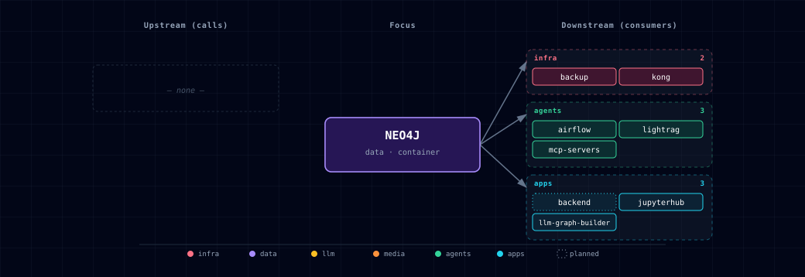

# 5.2.36. Neo4j Graph Database

Neo4j provides graph database capabilities for Atlas, enabling relationship modeling and graph-based queries.

## 1. Overview

The Neo4j service provides:
- Graph database for storing and querying relationships
- Web-based browser interface for data visualization
- Cypher query language support
- Orchestrated offline system/application dumps and authenticated restore staging

## 2. Source modes and access information

| `NEO4J_GRAPH_DB_SOURCE` | Behavior | Browser / HTTP | Bolt |
|---|---|---|---|
| `container` (default) | Runs the Atlas-managed container. | `http://localhost:${GRAPH_DB_DASHBOARD_PORT}` (default `63024`) | `bolt://localhost:${GRAPH_DB_PORT}` (default `63023`) |
| `localhost` | Uses an existing host Neo4j; Atlas does not start the container. | `http://localhost:${NEO4J_LOCALHOST_HTTP_PORT}` (default `7474`) | `bolt://localhost:${NEO4J_LOCALHOST_BOLT_PORT}` (default `7687`) |
| `disabled` | Disables Neo4j and its routes. | unavailable | unavailable |

After running `./start.sh --setup-hosts`, the Kong browser alias is `http://graph.localhost:${KONG_HTTP_PORT}` whenever the selected Neo4j source is enabled.

In container mode, the Browser pre-fills the in-network address `neo4j://neo4j-graph-db:7687`. From the host, change it to `bolt://localhost:${GRAPH_DB_PORT}`.

## 3. Default Credentials

- **Username**: `${GRAPH_DB_USER}` (default: `neo4j`)
- **Password**: `${GRAPH_DB_PASSWORD}` (from .env file)

## 4. Container-mode backup and restore

These commands and paths apply only to `NEO4J_GRAPH_DB_SOURCE=container`. In `localhost` mode, use the backup and restore procedures of the host-managed Neo4j installation. Neo4j Community has no online dump, and the server is the container's main process. Every dump or load therefore runs against the stopped database volume. At startup, an empty `neo4j` database is restored automatically from the newest legacy snapshot. Atlas never schedules backups.

Run the `docker compose` commands from the repository root. If the checkout directory name is not `PROJECT_NAME` (default `atlas`), add `-p "$PROJECT_NAME"` to each command.

### 4.1. Manual Backup

To manually create a graph database backup:

```bash
# Legacy single-database dump into /snapshot (database offline for the duration)
docker compose stop neo4j-graph-db
docker compose run --rm --no-deps --entrypoint /usr/local/bin/backup.sh neo4j-graph-db
docker compose start neo4j-graph-db
```

`backup.sh` refuses to run (exit 75) inside the running container: stopping the server there stops the container before the dump starts.

Legacy dumps go to the `${PROJECT_NAME}-neo4j-backups` volume at `/snapshot`. Checkouts that ran Neo4j before this volume existed may still hold dumps in `services/neo4j/build/snapshot/`. Atlas does not move or delete them. Check a dump's origin and Neo4j version before you load it by hand.

For coordinated backups, use `services/backup/run-consistent-backup.sh`. It dumps `system` and `neo4j` with the exact 5.26.31 image and writes signed metadata with the other database artifacts. It leaves Neo4j running or stopped, as it found it.

### 4.2. Manual Restore

To restore from a previous backup:

```bash
# Load the newest /snapshot/backup_*.dump (database offline for the duration)
docker compose stop neo4j-graph-db
docker compose run --rm --no-deps --entrypoint /usr/local/bin/restore.sh neo4j-graph-db
docker compose start neo4j-graph-db
```

For coordinated restores of the signed `system` + `neo4j` artifacts, use `services/backup/run-database-restore.sh` (see the backup service README).

### 4.3. Automatic Restore

- **Automatic restoration at startup** is enabled by default
- When the container starts with an empty `neo4j` database (a fresh data volume), it restores the latest `/snapshot/backup_*.dump` if one exists. `./stop.sh --cold` also removes the snapshot volume, so nothing is left to restore after it; copy dumps you want to keep out first
- A failed load (automatic or `restore.sh`) leaves `/data/.atlas-restore-incomplete`. The next start then retries the load with `--overwrite-destination`. If no `backup_*.dump` is left, the container does not start: add a dump or delete the marker
- A populated database is never overwritten at startup; to roll a live database back to a snapshot, use the offline `restore.sh` (§4.2)
- To turn off automatic restore, delete the `auto_restore.sh` `COPY` and its `RUN chmod` from `build/Dockerfile`, then rebuild. The entrypoint then logs that automatic restore is disabled and starts normally

### 4.4. Important Backup Notes

- Backups are full offline dumps (`neo4j-admin database dump`). Restart the service yourself with `docker compose start`.
- Coordinated backups write `/snapshot/<timestamp>/neo4j.dump`. Automatic restore ignores them.

## 5. Container-mode data persistence

With `NEO4J_GRAPH_DB_SOURCE=container`, Neo4j data is stored in Docker named volumes. In `localhost` mode, the host installation owns persistence:
- **Volume Name**: `atlas-graph-db-data` (from `${PROJECT_NAME}-graph-db-data`)
- **Mount Point**: `/data` (inside container)
- **Backup Location**: `/snapshot` (named-volume mount)
- **Backup Volume**: `${PROJECT_NAME}-neo4j-backups`

## 6. Environment Variables

Key environment variables for Neo4j:

```bash
# Authentication
GRAPH_DB_USER=neo4j
GRAPH_DB_PASSWORD=your_password
GRAPH_DB_AUTH=neo4j/your_password  # Combined form consumed by the Neo4j container as NEO4J_AUTH

# Port Configuration
GRAPH_DB_PORT=63023            # Bolt protocol (mapped to 7687 inside the container)
GRAPH_DB_DASHBOARD_PORT=63024  # Browser interface and HTTP API (mapped to 7474)

# Container resources
NEO4J_MEMORY_LIMIT=2g          # Compose memory limit for the container
NEO4J_CPU_LIMIT=1.5            # Compose CPU limit for the container
```

The compose fragment loads APOC core (`NEO4J_PLUGINS=["apoc"]`, from the image's `labs/` jar, no download) and allows `apoc.*`. LLM Graph Builder needs it. The container accepts only the `neo4j` admin user, so `GRAPH_DB_USER` matters only in `localhost` mode.

## 7. Usage Examples

### 7.1. Connect via Cypher Shell (container mode)

Set `PROJECT_NAME` in your shell to the value in `.env` (default `atlas`). The command reads the credentials from the container's `NEO4J_AUTH`, so the password does not appear in a process argument list.

```bash
export PROJECT_NAME=atlas
docker exec -it ${PROJECT_NAME}-neo4j-graph-db sh -c \
  'NEO4J_USERNAME="${NEO4J_AUTH%%/*}" NEO4J_PASSWORD="${NEO4J_AUTH#*/}" cypher-shell'
```

Sample queries:

```cypher
MATCH (n) RETURN count(n);  // Count all nodes
MATCH (n) DETACH DELETE n;  // Clear all data (use with caution)
```

### 7.2. Connect via Python
```python
import os
from neo4j import GraphDatabase

source = os.getenv("NEO4J_GRAPH_DB_SOURCE", "container")
bolt_port = (
    os.getenv("NEO4J_LOCALHOST_BOLT_PORT", "7687")
    if source == "localhost"
    else os.getenv("GRAPH_DB_PORT", "63023")
)
driver = GraphDatabase.driver(
    f"bolt://localhost:{bolt_port}",
    auth=("neo4j", os.environ["GRAPH_DB_PASSWORD"])
)

with driver.session() as session:
    result = session.run("MATCH (n) RETURN count(n) as node_count")
    print(result.single()["node_count"])

driver.close()
```

### 7.3. Basic Graph Operations
```cypher
// Create nodes
CREATE (:Person {name: 'Alice', age: 30}), (:Person {name: 'Bob', age: 25});

// Create a relationship
MATCH (a:Person {name: 'Alice'}), (b:Person {name: 'Bob'})
CREATE (a)-[:KNOWS]->(b);

// Query relationships
MATCH (p:Person)-[:KNOWS]->(friend:Person)
RETURN p.name, friend.name;
```

## 8. LightRAG graph store

When `LIGHTRAG_SOURCE != disabled` AND `NEO4J_GRAPH_DB_SOURCE != disabled`, `lightrag-init` provisions the `lightrag_entity_id` range index on `` `base` `` nodes (`migrate-neo4j.cypher`). LightRAG writes the extracted KG (entities + relations) to Neo4j. Browse at `graph.localhost:${KONG_HTTP_PORT}`.

### 8.1. Graphiti backend-only experiment

The backend declares a disabled Graphiti temporal graph memory experiment with `GRAPHITI_ENABLED=false`. No `graphiti` service, init companion, port, Kong alias, SOURCE value, or setup-wizard step exists yet; Neo4j remains the shared graph database container. Graphiti episodes written by the backend must use the `group_id` shape `atlas:<project>:backend:<namespace>:user:<uuid>`. This keeps Graphiti data apart from LightRAG, LLM Graph Builder, Hermes, OpenClaw and ad-hoc Cypher users.

## 9. Integration with Other Services

Current Bolt clients are LightRAG (§8), LLM Graph Builder, JupyterHub, mcp-servers and the backup orchestrator (§13.2). Airflow seeds a `neo4j_default` Connection, and only operator-authored DAGs use it. The Backend receives `NEO4J_*` for planned graph endpoints but opens no Bolt connection (see `docs/maintenance/integration-claims-ledger.md`). n8n has no Neo4j wiring yet (§13.4).

## 10. Performance Tuning

### 10.1. Memory Configuration
`NEO4J_MEMORY_LIMIT` (default `2g`) caps the container. Without explicit settings, the JVM and Neo4j derive heap and page cache from the memory the container sees. Atlas does not forward `NEO4J_server_memory_*` settings from `.env`; to pin them, add them to the service's `environment:` through a Compose override, for example:

```yaml
services:
  neo4j-graph-db:
    environment:
      NEO4J_server_memory_heap_max__size: 2G
      NEO4J_server_memory_pagecache_size: 1G
```

### 10.2. Query Optimization
- Use indexes for frequently queried properties
- Limit result sets with `LIMIT` clause
- Use `EXPLAIN` and `PROFILE` to analyze query performance
- Consider graph data modeling best practices

## 11. Monitoring and Maintenance

### 11.1. Health Checks
```bash
# Check container status
docker logs ${PROJECT_NAME}-neo4j-graph-db -f

# Test HTTP endpoint
curl http://localhost:${GRAPH_DB_DASHBOARD_PORT}/

# Check Bolt connection (credentials from the container's NEO4J_AUTH)
docker exec ${PROJECT_NAME}-neo4j-graph-db sh -c \
  'NEO4J_USERNAME="${NEO4J_AUTH%%/*}" NEO4J_PASSWORD="${NEO4J_AUTH#*/}" cypher-shell "RETURN 1 AS ok"'
```

### 11.2. Database Statistics
```cypher
// Get database info
CALL db.info()

// Get node and relationship counts
MATCH (n) RETURN labels(n), count(n) ORDER BY count(n) DESC

// Check indexes
SHOW INDEXES
```

### 11.3. Cleanup Operations
```cypher
// Remove all data (use with extreme caution)
MATCH (n) DETACH DELETE n

// Remove specific node types
MATCH (p:Person) DETACH DELETE p

```

## 12. Further Reading

- [Neo4j Documentation](https://neo4j.com/docs/)
- [Cypher Query Language](https://neo4j.com/docs/cypher-manual/)
- [Neo4j APOC Documentation](https://neo4j.com/docs/apoc/)
- [Graph Modeling Tips](https://neo4j.com/docs/getting-started/data-modeling/modeling-tips/)

## 13. Dependencies & Integrations

### 13.1. Current — Upstream (this service calls)

_No upstream calls._

### 13.2. Current — Downstream (services that call this)

_Rows marked planned are documented or intended, not wired yet._

| Service | Category | Status |
|---|---|---|
| backup | infra | current |
| kong | infra | current |
| airflow | agents | optional: an operator-authored DAG; airflow-init only seeds the Connection |
| lightrag | agents | current |
| mcp-servers | agents | current |
| backend | apps | planned |
| jupyterhub | apps | current |
| llm-graph-builder | apps | current |

### 13.3. Architecture diagram



[Open the full-size diagram](./architecture.html) for a full-screen view.

### 13.4. Future — Missing pair integrations

- **neo4j ↔ n8n** — *Why:* unlocks no-code graph automation (entity sync, alerting on graph patterns, hydrating workflows from Cypher). n8n ships a first-party Neo4j credential + node. *Mechanism:* n8n Neo4j node configured with `bolt://neo4j-graph-db:7687`, `neo4j` / `${GRAPH_DB_PASSWORD}`; add `NEO4J_URI` to `services/n8n/compose.yml` and a credential seed in n8n init. *Effort:* small. *Confidence:* high.
- **neo4j ↔ hermes** — *Why:* persistent agent memory + entity/relation recall across sessions; Hermes skills write structured episodic memory as a graph and traverse it for context. *Mechanism:* Hermes custom skill via Bolt at `bolt://neo4j-graph-db:7687` using the official neo4j Python driver; `GRAPH_DB_USER`/`GRAPH_DB_PASSWORD` from `.env`. *Effort:* medium. *Confidence:* medium.
- **neo4j ↔ weaviate** — *Why:* GraphRAG patterns — Weaviate finds semantically similar chunks, Neo4j expands the neighbourhood (entities, citations, relationships) for grounded answers. *Mechanism:* backend orchestrator: Weaviate `nearText` → take payload `entity_ids` → Cypher `MATCH (e)-[*1..2]-(n) RETURN n`. *Effort:* medium. *Confidence:* medium.
- **neo4j ↔ doc-processor** — *Why:* Docling extracts structured document elements (sections, tables, references); persisting them as a graph turns the doc corpus into a navigable knowledge graph. *Mechanism:* backend route or n8n flow: docling JSON → LiteLLM entity/relation extractor → Cypher `MERGE` over Bolt. *Effort:* medium. *Confidence:* medium.
- **neo4j ↔ local-deep-researcher** — *Why:* LDR lists neo4j as optional in `runtime_deps` but no concrete wiring exists; research runs naturally produce claim/source/entity graphs that benefit later sessions. *Mechanism:* LDR LangGraph node emitting Cypher on each research step via `bolt://neo4j-graph-db:7687`. *Effort:* small. *Confidence:* medium.

### 13.5. Future — Candidate new services

- **Graphiti (Zep)** (`docs/research/candidates/graphiti.md`) — *Headline:* temporal knowledge-graph framework for agent memory, built on Neo4j. *Wires into:* hermes, backend, n8n, local-deep-researcher.
- **NeoDash** (`docs/research/candidates/neodash.md`) — *Headline:* low-code Cypher dashboards over the existing Neo4j instance, no extra database. *Wires into:* kong (route at `dash.localhost`), backend.

### 13.6. Future — Unused features in this service

- **Native vector index (HNSW)** — *Why pursue:* Neo4j 5 ships an HNSW vector index. Embeddings could live on graph nodes, and one query could combine ANN search with graph traversal. *Effort:* small.
- **GenAI plugin (`genai.vector.encode*`)** — *Why pursue:* embed text directly inside Cypher via OpenAI/Vertex/Bedrock — wire it to LiteLLM and ingestion becomes one query. *Effort:* small.
- **APOC extended** — *Why pursue:* APOC core is loaded (`NEO4J_PLUGINS=["apoc"]` from the image's `labs/` jar); the extended library would add more JSON/HTTP, import and LLM procedures. *Effort:* small.
- **Neosemantics (n10s)** — *Why pursue:* RDF/ontology import/export bridges Neo4j with external semantic-web sources (Wikidata, schema.org). *Effort:* medium.
- **Read-only role for LLM-generated Cypher** — *Why pursue:* safe execution of model-authored queries from open-webui/hermes; mitigates prompt-injection-to-`DETACH DELETE`. *Effort:* small.

## 14. Troubleshooting

### 14.1. Common Issues

- **Container won't start:** check memory allocation and port conflicts.
- **Authentication failures:** check `GRAPH_DB_PASSWORD` and `GRAPH_DB_AUTH` in `.env`. Before the Neo4j data volume exists, each start sets `GRAPH_DB_AUTH` to `GRAPH_DB_USER/GRAPH_DB_PASSWORD`. After that, Neo4j keeps its first-boot password, and a mismatch only prints a warning. To fix it, run `ALTER CURRENT USER SET PASSWORD ...` in `cypher-shell`, then set both values to match.
- **Connection refused:** check that a firewall does not block the ports.
- **Out of memory errors:** raise `NEO4J_MEMORY_LIMIT`, or pin heap and page cache with a Compose override (§10.1).

### 14.2. Debug Commands
```bash
# View detailed logs
docker logs ${PROJECT_NAME}-neo4j-graph-db --tail=100 -f

# Check resource usage
docker stats ${PROJECT_NAME}-neo4j-graph-db

# Verify configuration
docker exec ${PROJECT_NAME}-neo4j-graph-db cat /var/lib/neo4j/conf/neo4j.conf
```

### 14.3. Recovery Procedures

If the database is corrupted, restore the newest legacy snapshot offline with the §4.2 commands. Coordinated signed backups restore with `services/backup/run-database-restore.sh`.

If the newest backup is corrupted, reinitialize the database. This deletes all graph data. Automatic restore loads the newest `/snapshot/backup_*.dump` into any empty database, so rename the corrupted dump first. If an older `backup_*.dump` remains, the new database loads that one; rename every dump to start empty.

```bash
# 1. List the dumps.
docker compose run --rm --no-deps --entrypoint ls neo4j-graph-db -l /snapshot
# 2. Rename the corrupted dump so automatic restore skips it.
docker compose run --rm --no-deps --entrypoint mv neo4j-graph-db \
  /snapshot/backup_<timestamp>.dump /snapshot/corrupt_<timestamp>.dump
# 3. Remove the container, then the data volume (Docker refuses while a container uses it).
docker compose rm -sf neo4j-graph-db
docker volume rm ${PROJECT_NAME}-graph-db-data
# 4. Start Neo4j on a new, empty volume.
docker compose up -d neo4j-graph-db
```

For more troubleshooting help, see the [troubleshooting guide](../../docs/quick-start/troubleshooting.md).

## 15. Capabilities & limitations

Support tier: **experimental** — Capability contract declared; no cited cold-start, workflow, or upgrade qualification run yet (evidence at `v0.1.0`).

| Capability | Status | Verification | Notes |
|---|---|---|---|
| Container and host graph storage | supported | tested | Atlas supports a persistent Neo4j container or an operator-run localhost endpoint and wires Bolt consumers through the selected source. |
| Snapshot backup and restore | supported | tested | The backup orchestrator records whether Neo4j Community 5.26.31 is running and stops it for bounded system and neo4j database dumps. It restores the prior running state on success or failure, and provides an authenticated offline load path. |
| Production access isolation | partial | documented | Password authentication is configured, but direct Bolt and Browser ports are plaintext and Atlas does not provision separate least-privilege service roles. |
