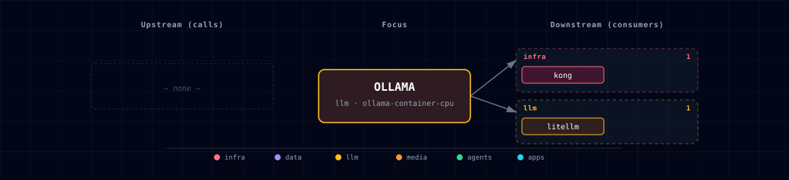

# 5.2.37. Ollama (LLM upstream behind LiteLLM)

**Internal port:** 11434 (no host port mapping for `ollama-container-*` — Ollama is reached over the compose network only)
**SOURCE variable:** `LLM_PROVIDER_SOURCE`
**SOURCE options:** `ollama-container-cpu`, `ollama-container-gpu`, `ollama-localhost`, `none`

For `ollama-localhost`, Ollama must already be listening on the host at the port set by `OLLAMA_LOCALHOST_PORT` (default `11434`) — the stack never spins up an Ollama container in that mode, so the upstream is your responsibility.

## 1. Overview

Ollama is the local LLM engine that runs behind the always-on **LiteLLM gateway**. Consumer services (Backend, Open WebUI, n8n, JupyterHub, Local Deep Researcher, OpenClaw, [Hermes Agent](../hermes/README.md), Weaviate vectorization) do **not** talk to Ollama directly — they read `LITELLM_BASE_URL` + `LITELLM_API_KEY` and LiteLLM routes the request to the configured Ollama upstream. See [LiteLLM Gateway](../litellm/README.md) for the consumer-facing surface.

`LLM_PROVIDER_SOURCE` is a single-select choice for the Ollama upstream:

- `ollama-container-cpu` / `ollama-container-gpu` — Ollama running inside the stack as a Docker container
- `ollama-localhost` — Ollama running natively on the host machine
- `none` — no Ollama upstream; LiteLLM may use vLLM Metal and/or enabled cloud providers

## 2. Access

| Path | URL | Notes |
|---|---|---|
| Through LiteLLM | `http://localhost:63040/v1` | Consumer-facing OpenAI-compatible endpoint. Use `LITELLM_BASE_URL` from `.env`. |
| Kong alias | `http://ollama.localhost:${KONG_HTTP_PORT}` | Host-reachable proxy to raw Ollama `/api` (needs `./start.sh --setup-hosts`). Bypasses LiteLLM — use it for Ollama-native calls (`/api/tags`, `/api/pull`, `/api/ps`). |
| Direct (internal) | `http://ollama:11434` | Reachable over the Compose network. The Ollama container no longer publishes a host port, so from the host reach it through the Kong alias above. |

The Ollama container no longer publishes a host port; the OpenAI-compatible surface is owned by LiteLLM (default `LITELLM_PORT=63040`). See the canonical port table at [Ports and Routes](../../docs/reference/ports-routes.md).

## 3. Configuration

Configure the Ollama upstream through `.env`, the interactive wizard, or CLI flags:

```bash
LLM_PROVIDER_SOURCE=<option>
# Optional, only when LLM_PROVIDER_SOURCE=ollama-localhost:
OLLAMA_LOCALHOST_PORT=11434
# Parallel serving (container-* sources only; #849) — multi-agent consumers
# (8+ concurrent requests) need OLLAMA_NUM_PARALLEL > 1 (Ollama's default is 1).
# For ollama-localhost the host daemon owns both (e.g. launchctl setenv on macOS).
OLLAMA_NUM_PARALLEL=8
OLLAMA_MAX_LOADED_MODELS=2
# KV-cache quantization — the other half of the memory budget.
OLLAMA_KV_CACHE_TYPE=q8_0
OLLAMA_FLASH_ATTENTION=1
# Residency — how long a model stays loaded, and how many fit at once.
OLLAMA_KEEP_ALIVE=
OLLAMA_MODELS_RESIDENT_MIN=
# Advisory floor for ollama-localhost only (#849). Empty by default.
OLLAMA_PARALLEL_MIN=
```

**KV-cache quantization.** The attention KV cache is the dominant per-slot memory cost, and `OLLAMA_NUM_PARALLEL` multiplies it: eight parallel slots hold eight KV caches. `OLLAMA_KV_CACHE_TYPE=q8_0` roughly halves that for a negligible quality cost (`f16` is Ollama's own default and full precision; `q4_0` quarters it with a measurable cost). On unified-memory hosts running several resident models this is the cheapest lever available.

It only takes effect when flash attention is active, which is why `OLLAMA_FLASH_ATTENTION=1` is pinned alongside rather than left to autodetection — a silently-inactive memory setting is worse than an absent one, because it reads as configured. Both apply to the `ollama container-*` sources only; for `ollama-localhost` the host daemon owns them (`launchctl setenv` on macOS), same as the parallel-serving vars.

**Model churn on multi-model runs.** A pipeline that touches several models in sequence — a LightRAG ingest using separate extract, embed and keyword models is the worked example — evicts its own working set when `OLLAMA_MAX_LOADED_MODELS` is below that count. Ollama unloads one model to load the next, then reloads it moments later. There is no error: the run just crawls, and `ollama ps` shows models cycling through `Stopping…`.

Two levers, and they are different things:

- `OLLAMA_MAX_LOADED_MODELS` — how many models fit resident at once. Set it to the number of distinct models one run touches.
- `OLLAMA_KEEP_ALIVE` — how long each stays after its last use. Ollama's default is 5m, so even with enough slots a slow pipeline can still evict between calls. `-1` means forever.

For `ollama-localhost` Atlas cannot set either (the host daemon owns them), so declare `OLLAMA_MODELS_RESIDENT_MIN` and `./start.sh doctor` will read the daemon's actual config and warn before a long run rather than after it.

**`-1` is a footgun worth stating plainly.** It pins *every* loaded model in RAM until you revert it and restart Ollama. On a large model-set that is tens of GB held indefinitely. Prefer setting it for the duration of a run and reverting after — see [reusing Atlas](../../docs/deployment/reusing-atlas.md).

Note that Redis cannot help here. The attention KV cache is per-sequence tensors touched on every generated token; Redis is a network hop. What Redis caches for LLM traffic is whole *responses*, and that happens one layer up at the LiteLLM gateway — see [LiteLLM](../litellm/README.md).

**Declaring a concurrency floor for a host daemon.** On `ollama-localhost` Atlas cannot set the daemon's environment — the host-prereq doctrine means you own it. Ollama's default is **one** parallel slot, and it *silently serializes* concurrent requests rather than rejecting them, so a consumer that needs eight gets correct-but-slow behaviour with nothing in any log to explain it. Set `OLLAMA_PARALLEL_MIN` to what your workload needs and `./start.sh doctor` will read the daemon's actual `OLLAMA_NUM_PARALLEL` back and fail the check when the host is below it, with the exact `launchctl` command to fix it.

The read is deliberately narrow: it works on macOS, where the daemon inherits `launchctl setenv`. Everywhere else a daemon's environment depends on how it was started (systemd drop-in, shell export, container) with no single readable source, so the check reports `skipped` rather than guessing — an unknown never warns.

LiteLLM resolves the upstream URL from `LITELLM_OLLAMA_UPSTREAM` (set automatically by the bootstrapper based on `LLM_PROVIDER_SOURCE`). Consumers should never reference `LITELLM_OLLAMA_UPSTREAM` directly.

Use `./start.sh` for the guided wizard, or pass a targeted flag for scripted changes when the CLI exposes one.

## 4. Integration notes

The Ollama service participates in the Docker Compose network and is consumed exclusively by:

- **LiteLLM** — for chat completions and embeddings via the OpenAI-compatible proxy.
- **`ollama-pull`** — init container that reads `OLLAMA_USER_MODELS` and `OLLAMA_CUSTOM_MODELS` (resolved from the YAML catalogs + env by `model_resolver`) and pulls each named model via `/api/pull` (not OpenAI-compatible, so this bypasses LiteLLM by design). Each pull is retried up to 3× with linear backoff so a transient registry/network blip self-heals; a model that still fails logs a non-fatal ERROR and the remaining models are pulled regardless. Runs only when `LLM_PROVIDER_SOURCE` starts with `ollama-container-`; for `ollama-localhost` the bootstrapper performs the equivalent host-side pull itself at start (see §5 below).

If `LLM_PROVIDER_SOURCE=none`, the stack still starts as long as at least one of `CLOUD_OPENAI_SOURCE`, `CLOUD_ANTHROPIC_SOURCE`, or `CLOUD_OPENROUTER_SOURCE` is `enabled`. The bootstrapper refuses to start when all four are `none`/`disabled`.

## 5. Models — single unified picker, source-aware

The interactive wizard surfaces **one** Ollama model multi-select (and a free-text "additional to pull" step for container sources). The option list is source-aware so the user never sees two near-duplicate pages:

- **`ollama-container-*`** — the multi-select shows the live `https://ollama.com/library` scrape (~230 entries; exact count depends on the upstream catalog at fetch time). Nothing is pulled yet — the in-stack container is launched after wizard exit — so the library is the only meaningful discovery surface. The `ollama-pull` init container fetches checked entries on first start.
- **`ollama-localhost`** — the multi-select **merges** `/api/tags` (already-pulled on your upstream) with the library scrape. Each row carries a status badge: `[pulled]` (on disk on the upstream — checking activates it immediately) or `[library]` (catalog-only — Atlas pulls it onto the host daemon at the next start).

Each row shows capability badges (`[embedding]`, `[thinking]`, `[vision]`, `[tools]`, `[audio]`, `[mlx]` for Apple-Silicon-optimised variants), a `[legacy]` badge for models not updated in ≥ 365 days, a pull count, and per-variant size/description metadata scraped from the model's `ollama.com/library` page — sizes are an approximate Q4-quantization disk footprint (real downloads run ±10–15%). Legacy models sort below recent ones. Exact row layout, column alignment, and narrow-terminal fallback are implementation detail of the bootstrapper wizard's model-picker widget, not covered here.

A search box above the filter chips narrows the list by name (focus with `Tab` or `/`); a capability filter chip row (`ALL · embedding · thinking · vision · tools · audio`) narrows by capability, and the two filters stack. Keybindings and widget styling live in the wizard widget code.

Models the `ollama.com` listing tags as cloud-only (not pullable locally) are excluded from the multiselect; hybrid models that publish both cloud and local variants keep their local variants in the list.

Multi-variant models expand in place into a tree of per-tag variants (`Space` toggles expand/collapse and, on a leaf, that tag's selection). Selections persist to `OLLAMA_USER_MODELS` as a comma-separated tag list (e.g. `qwen3:8b,qwen3:14b`). A bare form (`qwen3`) and its tagged variants (`qwen3:8b`) are mutually exclusive — selecting one clears the other. Full interaction details live in the wizard widget code.

Expanding a model fetches and caches its `ollama.com/library/{model}` detail page, which supplies per-variant disk size, context window, and input modalities, driving per-variant capability badges (e.g. `gemma3:4b` gets `[vision]`, `gemma3:270m` doesn't). On fetch failure the wizard falls back to listing-page param-count tags with the approximate Q4 size. Scrape/cache mechanics live in `model_resolver` / `bootstrapper/utils/llm_catalog.py`.

If the library scrape is unavailable, the picker falls back to the curated default-active baseline below without capability/size metadata (`[legacy]` is suppressed since no age data is available). If `/api/tags` is unreachable, the merged view degrades to library-only. If both are down, a placeholder row explains what to fix. All fallback paths are logged in the session log.

The default-active baseline (`qwen3.8:latest`, `qwen3-embedding:0.6b`, `nomic-embed-text`) is baked into `services/ollama/models.yaml` with `default: true`, so the multi-select is **purely additive** — leaving everything unchecked still leaves the baseline active. On first visit (`OLLAMA_USER_MODELS` empty) the wizard pre-checks the baseline; on later visits it restores the saved selection, intersected with the visible options.

When adding an **embedding** model to `services/ollama/models.yaml`, declare its output vector dimension with `dim:` (e.g. `dim: 768` for `nomic-embed-text`). The wizard's embedding-default step pre-selects whichever model's `dim` equals `MEMORY_FACTS_EMBEDDING_DIM` (768 — the backend `memory_facts vector(768)` column), and `model_resolver.embedding_dim_warning` flags a non-matching pick at `.env`-write time. See the header comments in `services/ollama/models.yaml`.

The third step — **Ollama  ·  additional models to pull** — is a free-text comma-separated list. Shown only for `ollama-container-*` sources; persists as `OLLAMA_CUSTOM_MODELS`. `model_resolver` includes these entries in the active model set for every Ollama source; `ollama-pull` fetches the active set for `ollama-container-*`, and for `ollama-localhost` the bootstrapper pulls the same set onto the host daemon at start.

For `ollama-container-*` sources, `ollama-pull` reads the active set from `OLLAMA_USER_MODELS` ∪ `OLLAMA_CUSTOM_MODELS` (resolved by `model_resolver` from the YAML catalog + env) and pulls each one. For `ollama-localhost`, the bootstrapper pulls the same declared union onto the host daemon at every `./start.sh`: present tags skip via `/api/tags`, missing ones stream through `POST /api/pull` (Ollama verifies layers, so re-runs and interrupted pulls converge), and per-tag failures warn without aborting the stack. The `unpullable-models` doctor check names any declared-but-missing tag. If the daemon isn't running (`ollama serve`), the pull is skipped with a warning and happens on the next start.

| Variable | Set by | Consumed by |
|---|---|---|
| `OLLAMA_USER_MODELS` | Single unified Ollama models multi-select. | `model_resolver` (active set computation from YAML catalogs + env, used by `litellm-init` and `ollama-pull`); `ollama-pull` for container sources; the bootstrapper's host pull for `ollama-localhost`. |
| `OLLAMA_CUSTOM_MODELS` | Wizard "additional models to pull" text step. | `model_resolver` (merged into active set); `ollama-pull` for container sources; the bootstrapper's host pull for `ollama-localhost`. |

## 6. Dependencies & Integrations

### 6.1. Current — Upstream (this service calls)

_No upstream calls._

### 6.2. Current — Downstream (services that call this)

| Service | Category |
|---|---|
| kong | infra |
| litellm | llm |

### 6.3. Architecture diagram



[Open the full-size diagram](./architecture.html) for a full-screen view.

### 6.4. Future — Missing pair integrations

Note: backend, open-webui, n8n, jupyterhub, local-deep-researcher, hermes, weaviate all reach Ollama indirectly through LiteLLM today. These pairs cover gaps where the LiteLLM proxy hides Ollama-native surface (model management, runtime introspection, private GGUF import).

- **ollama ↔ backend** — *Why:* backend has no view of Ollama runtime state. `/api/ps` exposes loaded models, VRAM footprint, TTL; `/api/show` exposes capabilities and Modelfile. An admin endpoint turns "is the model warm?" from a guess into a fact. *Mechanism:* backend reads `OLLAMA_ENDPOINT` and calls `GET ${OLLAMA_ENDPOINT}/api/ps` + `/api/show`; new `/admin/llm/status` route. *Effort:* small. *Confidence:* high.
- **ollama ↔ jupyterhub** — *Why:* notebooks doing model research want raw `/api/pull`, `/api/create`, `/api/show`, embeddings, and structured-output `format` — none of which round-trip cleanly through LiteLLM. *Mechanism:* inject `OLLAMA_HOST=http://ollama:11434` into singleuser env; pre-install `ollama` Python client. *Effort:* small. *Confidence:* high.
- **ollama ↔ minio** — *Why:* `ollama-pull` only fetches from the public registry. Private GGUFs (licensed, fine-tuned, air-gapped) cannot enter the stack today; MinIO is provisioned for artifacts. *Mechanism:* new `ollama-import` init step reading `OLLAMA_MINIO_BUCKET` keys, streaming each GGUF to `/root/.ollama/blobs`, then `POST /api/create` with a generated `FROM ./blob` Modelfile. *Effort:* medium. *Confidence:* medium.
- **ollama ↔ n8n** — *Why:* n8n workflows already call LiteLLM but can't drive `/api/pull` — meaning "nightly, ensure `qwen3:8b` is pulled" or "on webhook, hot-swap a model" cannot be authored. *Mechanism:* ship an n8n credential pointing at `http://ollama:11434`; n8n's HTTP Request node handles streaming `pull` progress lines. *Effort:* small. *Confidence:* medium.

### 6.5. Future — Candidate new services

- **OpenLIT** ([details](../../docs/research/candidates/openlit.md)) — *Headline:* OpenTelemetry-native observability for LLM + vector calls with first-class Ollama instrumentation. *Wires into:* backend, hermes, jupyterhub, weaviate, litellm.

### 6.6. Future — Unused features in this service

- **Quantized KV cache (`OLLAMA_KV_CACHE_TYPE=q8_0` / `q4_0`)** — *Why pursue:* ~2× context length at the same VRAM budget, currently unset (defaults to f16). *Effort:* small.
- **`OLLAMA_FLASH_ATTENTION=1`** — *Why pursue:* free throughput on supported GPUs; currently unset. *Effort:* small.
- **`OLLAMA_NUM_PARALLEL` / `OLLAMA_MAX_LOADED_MODELS`** — *Why pursue:* stack runs multi-tenant (backend + open-webui + n8n + hermes) but uses Ollama defaults. Tuning prevents head-of-line blocking. *Effort:* small.
- **`/api/ps` + `/api/show` surface** — *Why pursue:* gives UI and ops scripts visibility into VRAM occupancy, model capabilities, load TTL. *Effort:* small.
- **Native structured-output `format` (JSON schema)** — *Why pursue:* richer than the OpenAI `response_format` LiteLLM forwards; useful for hermes skills and backend agents that need strict schemas. *Effort:* medium.
- **Modelfile customization pipeline** — *Why pursue:* stack-specific system prompts, templates, ADAPTERs (LoRA) cannot be authored today; `ollama-pull` only consumes public tags. *Effort:* medium.
- **`OLLAMA_KEEP_ALIVE` tuning** — *Why pursue:* default 5m evicts models between idle bursts; per-model overrides via `keep_alive` request field would cut cold-start tail latency. *Effort:* small.

## 7. Troubleshooting

```bash
# Check Ollama container status
docker compose ps ollama

# Check Ollama logs
docker compose logs -f ollama

# Verify LiteLLM can reach Ollama (from inside the network)
docker exec ${PROJECT_NAME}-litellm curl -s http://ollama:11434/api/tags
```

For general startup and routing issues, see [Troubleshooting](../../docs/quick-start/troubleshooting.md). For LiteLLM-specific debugging (model registration, virtual keys, spend logs), see [LiteLLM Gateway](../litellm/README.md).

## 8. Capabilities & limitations

| Capability | Status | Verification | Notes |
|---|---|---|---|
| Local Ollama source selection | supported | tested | Atlas resolves CPU and NVIDIA containers, an existing host daemon, or no Ollama upstream behind the same LiteLLM contract. |
| Declared model provisioning | partial | tested | Selected and custom models are pulled for container and localhost sources, but per-model failures are non-fatal and can leave a registered model unavailable until retried. |
| Parallelism and residency tuning | partial | tested | Atlas applies parallel slots, loaded-model limits, KV-cache quantization, flash attention, and keep-alive to containers; host daemons remain operator-owned with macOS-only advisory probes. |
| Authenticated raw Ollama administration | not-supported | documented | The raw ollama.localhost Kong alias is CORS-only and exposes native model-management APIs without Atlas authentication; restrict network access or use an authentication proxy. |
| Deploy-resource environment override | stubbed | documented | OLLAMA_DEPLOY_RESOURCES is projected by service configuration, but the Compose fragment does not consume it; CPU and GPU reservations come from typed source runtime data. |
