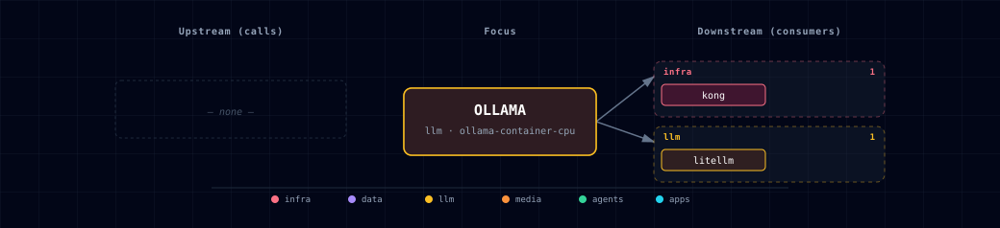

# 5.2.37. Ollama (LLM upstream behind LiteLLM)

**Internal port:** 11434 (no host port for `ollama-container-*`; reach Ollama over the Compose network)
**SOURCE variable:** `LLM_PROVIDER_SOURCE`
**SOURCE options:** `ollama-container-cpu`, `ollama-container-gpu`, `ollama-localhost`, `none`

For `ollama-localhost`, Ollama must already listen on the host at `OLLAMA_LOCALHOST_PORT` (default `11434`). The stack does not start an Ollama container in that mode; you run the upstream.

## 1. Overview

Ollama is the local LLM engine behind the always-on **LiteLLM gateway**. Consumers do **not** call Ollama directly: Backend, Open WebUI, n8n, JupyterHub, Local Deep Researcher, OpenClaw, [Hermes Agent](../hermes/README.md) and Weaviate vectorization. They read `LITELLM_BASE_URL` + `LITELLM_API_KEY`, and LiteLLM routes each request to the configured Ollama upstream. See [LiteLLM Gateway](../litellm/README.md) for the consumer-facing surface.

`LLM_PROVIDER_SOURCE` is a single-select choice for the Ollama upstream:

- `ollama-container-cpu` / `ollama-container-gpu` — Ollama running inside the stack as a Docker container
- `ollama-localhost` — Ollama running natively on the host machine
- `none` — no Ollama upstream; LiteLLM may use vLLM Metal and/or enabled cloud providers

## 2. Access

| Path | URL | Notes |
|---|---|---|
| Through LiteLLM | `http://localhost:${LITELLM_PORT}/v1` | Consumer-facing OpenAI-compatible endpoint. Use `LITELLM_BASE_URL` from `.env`. |
| Kong alias | `http://ollama.localhost:${KONG_HTTP_PORT}` | Host-reachable proxy to raw Ollama `/api` (needs `./start.sh --setup-hosts`). Bypasses LiteLLM — use it for Ollama-native calls (`/api/tags`, `/api/pull`, `/api/ps`). |
| Direct (internal) | `http://ollama:11434` | Reachable over the Compose network. The container publishes no host port; from the host, use the Kong alias. |

The Ollama container publishes no host port. LiteLLM owns the OpenAI-compatible surface (default `LITELLM_PORT=63040`). See the canonical port table at [Ports and Routes](../../docs/reference/ports-routes.md).

## 3. Configuration

Configure the Ollama upstream through `.env`, the interactive wizard, or CLI flags:

```bash
LLM_PROVIDER_SOURCE=<option>
# Optional, only when LLM_PROVIDER_SOURCE=ollama-localhost:
OLLAMA_LOCALHOST_PORT=11434
# Parallel serving (container-* sources only) — multi-agent consumers
# (8+ concurrent requests) need OLLAMA_NUM_PARALLEL > 1 (Ollama's default is 1).
# For ollama-localhost the host daemon owns both (e.g. launchctl setenv on macOS).
OLLAMA_NUM_PARALLEL=8
OLLAMA_MAX_LOADED_MODELS=2
# KV-cache quantization — the other half of the memory budget.
OLLAMA_KV_CACHE_TYPE=q8_0
OLLAMA_FLASH_ATTENTION=1
# Residency — how long a model stays loaded, and how many fit at once.
OLLAMA_KEEP_ALIVE=
OLLAMA_MODELS_RESIDENT_MIN=
# Advisory floor for ollama-localhost only. Empty by default.
OLLAMA_PARALLEL_MIN=
```

**KV-cache quantization.** The attention KV cache is the largest per-slot memory cost, and `OLLAMA_NUM_PARALLEL` multiplies it: eight parallel slots hold eight KV caches. `OLLAMA_KV_CACHE_TYPE=q8_0` roughly halves that for a negligible quality cost. `f16` is Ollama's default (full precision); `q4_0` quarters it with a measurable quality cost. On unified-memory hosts with several resident models, this is the cheapest lever.

Quantization works only when flash attention is on, so Atlas sets `OLLAMA_FLASH_ATTENTION=1` explicitly. Both apply to the `ollama-container-*` sources. For `ollama-localhost`, set them on the host daemon (`launchctl setenv` on macOS), as for the parallel-serving variables.

**Model churn on multi-model runs.** A pipeline can use several models in sequence, for example a LightRAG ingest with separate extract, embed and keyword models. If `OLLAMA_MAX_LOADED_MODELS` is below that count, Ollama unloads one model to load the next, then reloads it soon after. There is no error: the run is slow, and `ollama ps` shows models cycling through `Stopping…`.

Two levers, and they are different things:

- `OLLAMA_MAX_LOADED_MODELS` — how many models fit resident at once. Set it to the number of distinct models one run touches.
- `OLLAMA_KEEP_ALIVE` — how long each stays after its last use. Ollama's default is 5m, so even with enough slots a slow pipeline can still evict between calls. `-1` means forever.

For `ollama-localhost`, Atlas cannot set either; the host daemon owns them. Declare `OLLAMA_MODELS_RESIDENT_MIN`, and `./start.sh doctor` reads the daemon's configuration and warns before a long run.

**`OLLAMA_KEEP_ALIVE=-1` keeps every loaded model in memory until you revert it and restart Ollama.** On a large model set, that is tens of GB. Set it only for the duration of a run (see [reusing Atlas](../../docs/operations/reusing-atlas.md)).

**Concurrency floor for a host daemon.** On `ollama-localhost`, Atlas cannot set the daemon's environment; you own it. Ollama's default is **one** parallel slot, and it queues extra concurrent requests silently. A consumer that needs eight slots is then correct but slow, with nothing in any log. Set `OLLAMA_PARALLEL_MIN` to the slots your workload needs. `./start.sh doctor` reads the daemon's `OLLAMA_NUM_PARALLEL`, fails the check below the floor, and prints the `launchctl` fix.

The check works only on macOS, where the daemon inherits `launchctl setenv`. Elsewhere, the daemon's environment depends on how it was started, with no single readable source. The check then reports `skipped` and never warns.

LiteLLM resolves the upstream URL from `LITELLM_OLLAMA_UPSTREAM` (set automatically by the bootstrapper based on `LLM_PROVIDER_SOURCE`). Consumers should never reference `LITELLM_OLLAMA_UPSTREAM` directly.

## 4. Integration notes

The Ollama service participates in the Docker Compose network and is consumed exclusively by:

- **LiteLLM** — for chat completions and embeddings via the OpenAI-compatible proxy.
- **`ollama-pull`** — init container that pulls each active model through the native (non-OpenAI) `/api/pull`. The active set comes from `OLLAMA_USER_MODELS` and `OLLAMA_CUSTOM_MODELS`, resolved by `model_resolver` from the YAML catalogs and env; the call bypasses LiteLLM. Each pull is tried up to 3 times with linear backoff. A model that still fails logs a non-fatal ERROR, and the other models are still pulled. `ollama-pull` runs only for `ollama-container-*`; for `ollama-localhost` the bootstrapper pulls on the host (§5).

If `LLM_PROVIDER_SOURCE=none`, the stack starts only when vLLM Metal is `managed-localhost` or at least one of `CLOUD_OPENAI_SOURCE`, `CLOUD_ANTHROPIC_SOURCE` or `CLOUD_OPENROUTER_SOURCE` is `enabled`. Otherwise the bootstrapper refuses to start.

## 5. Models — single unified picker, source-aware

The interactive wizard surfaces **one** Ollama model multi-select (and a free-text "additional to pull" step for container sources). The option list is source-aware so the user never sees two near-duplicate pages:

- **`ollama-container-*`** — the multi-select shows the live `https://ollama.com/library` scrape (~230 entries; exact count depends on the upstream catalog at fetch time). Nothing is pulled yet — the in-stack container is launched after wizard exit — so the library is the only meaningful discovery surface. The `ollama-pull` init container fetches checked entries on first start.
- **`ollama-localhost`** — the multi-select **merges** `/api/tags` (models already pulled on your upstream) with the library scrape. Each row has a status badge:
  - `[pulled]`: on disk on the upstream; checking it activates it immediately.
  - `[library]`: catalog-only; Atlas pulls it onto the host daemon at the next start.

Each row shows:

- capability badges: `[embedding]`, `[thinking]`, `[vision]`, `[tools]`, `[audio]`, and `[mlx]` for Apple-Silicon-optimised variants;
- a `[legacy]` badge for models not updated in ≥ 365 days (legacy models sort below recent ones);
- a pull count;
- per-variant size and description, scraped from the model's `ollama.com/library` page. Sizes are an approximate Q4-quantization disk footprint; real downloads run ±10–15%.

A search box above the filter chips narrows the list by name (focus with `Tab` or `/`). A capability filter chip row (`ALL · embedding · thinking · vision · tools · audio`) narrows by capability. The two filters stack.

The multiselect excludes models that the `ollama.com` listing tags as cloud-only (not pullable locally). Hybrid models that publish both cloud and local variants keep their local variants.

Multi-variant models expand in place into a tree of per-tag variants (`Space` toggles expand/collapse and, on a leaf, that tag's selection). Selections persist to `OLLAMA_USER_MODELS` as a comma-separated tag list (e.g. `qwen3:8b,qwen3:14b`). A bare form (`qwen3`) and its tagged variants (`qwen3:8b`) are mutually exclusive — selecting one clears the other.

Expanding a model fetches and caches its `ollama.com/library/{model}` detail page, which supplies per-variant disk size, context window, and input modalities, driving per-variant capability badges (e.g. `gemma3:4b` gets `[vision]`, `gemma3:270m` doesn't). On fetch failure the wizard falls back to listing-page param-count tags with the approximate Q4 size. Scrape/cache mechanics live in `model_resolver` / `bootstrapper/utils/llm_catalog.py`.

Fallbacks, all logged in the session log:

- No library scrape: the picker offers the default baseline below, without capability or size metadata (and without `[legacy]`, because no age data exists).
- `/api/tags` unreachable: the merged view shows the library only. A port that answers with JSON in a shape other than Ollama's `/api/tags` counts as unreachable; the start pulls no models onto it and continues.
- Both down: a placeholder row explains what to fix.

The default baseline (`qwen3.8:latest`, `qwen3-embedding:0.6b`, `nomic-embed-text`) is marked `default: true` in `services/ollama/models.yaml`. `.env.example` seeds `OLLAMA_USER_MODELS` with it. To select nothing, uncheck everything: the wizard writes `OLLAMA_USER_MODELS=` and the bootstrapper keeps the blank. Then `ollama-pull` pulls nothing and `model_resolver` registers no Ollama model. Under `ollama-localhost` with `OLLAMA_AUTO_IMPORT_LOCAL_MODELS=true`, models already pulled on the host are still registered.

Only a missing `OLLAMA_USER_MODELS` key falls back to the baseline in the bootstrapper, and `./start.sh` backfills the key. `litellm-init` always receives the variable, so a bare `docker compose up` with an `.env` that lacks it registers no Ollama model. When the key is unset, the wizard pre-checks the baseline. Otherwise it restores the saved selection, limited to the options shown.

When adding an **embedding** model to `services/ollama/models.yaml`, declare its output vector dimension with `dim:` (e.g. `dim: 768` for `nomic-embed-text`). The wizard's embedding-default step lists models with `dim: 768` first, so one of them is the default pick. The selected model's `dim` sets `LANGMEM_EMBEDDING_DIM` (default 768); for a model with no `dim`, the wizard asks for the dimension. See the header comments in `services/ollama/models.yaml`.

The third step — **Ollama  ·  additional models to pull** — is a free-text comma-separated list. It is shown only for `ollama-container-*` sources and persists as `OLLAMA_CUSTOM_MODELS`. `model_resolver` adds these entries to the active model set for every Ollama source.

**Pulling the active set.** For `ollama-container-*`, `ollama-pull` pulls `OLLAMA_USER_MODELS` ∪ `OLLAMA_CUSTOM_MODELS` (as resolved by `model_resolver`). For `ollama-localhost`, the bootstrapper pulls the same set onto the host daemon at every `./start.sh`:

- Tags already present (per `/api/tags`) are skipped.
- Missing tags stream through `POST /api/pull`. Ollama verifies layers, so re-runs and interrupted pulls converge.
- A pull whose stream sends nothing for 300 s fails as stalled. Each failed tag is retried once, then reported as a warning; the stack still starts. A pull that keeps streaming has no total limit.
- If the daemon is not running (`ollama serve`), the pull is skipped with a warning and runs at the next start.

The `unpullable-models` doctor check names any declared tag that is missing.

| Variable | Set by | Consumed by |
|---|---|---|
| `OLLAMA_USER_MODELS` | Single unified Ollama models multi-select. | `model_resolver` (active set computation from YAML catalogs + env, used by `litellm-init` and `ollama-pull`); `ollama-pull` for container sources; the bootstrapper's host pull for `ollama-localhost`. |
| `OLLAMA_CUSTOM_MODELS` | Wizard "additional models to pull" text step. | `model_resolver` (merged into active set); `ollama-pull` for container sources; the bootstrapper's host pull for `ollama-localhost`. |

## 6. Dependencies & Integrations

### 6.1. Current — Upstream (this service calls)

_No upstream calls._

### 6.2. Current — Downstream (services that call this)

| Service | Category |
|---|---|
| kong | infra |
| litellm | llm |

### 6.3. Architecture diagram



[Open the full-size diagram](./architecture.html) for a full-screen view.

### 6.4. Future — Missing pair integrations

Note: backend, open-webui, n8n, jupyterhub, local-deep-researcher, hermes and weaviate all reach Ollama through LiteLLM. These pairs cover gaps where the LiteLLM proxy hides Ollama-native surface (model management, runtime introspection, private GGUF import).

- **ollama ↔ backend** — *Why:* backend has no view of Ollama runtime state. `/api/ps` exposes loaded models, VRAM footprint, TTL; `/api/show` exposes capabilities and Modelfile. An admin endpoint turns "is the model warm?" from a guess into a fact. *Mechanism:* backend reads `OLLAMA_ENDPOINT` and calls `GET ${OLLAMA_ENDPOINT}/api/ps` + `/api/show`; new `/admin/llm/status` route. *Effort:* small. *Confidence:* high.
- **ollama ↔ jupyterhub** — *Why:* notebooks doing model research want raw `/api/pull`, `/api/create`, `/api/show`, embeddings, and structured-output `format` — none of which round-trip cleanly through LiteLLM. *Mechanism:* inject `OLLAMA_HOST=http://ollama:11434` into singleuser env; pre-install `ollama` Python client. *Effort:* small. *Confidence:* high.
- **ollama ↔ minio** — *Why:* `ollama-pull` only fetches from the public registry. Private GGUFs (licensed, fine-tuned, air-gapped) cannot enter the stack today; MinIO is provisioned for artifacts. *Mechanism:* new `ollama-import` init step reading `OLLAMA_MINIO_BUCKET` keys, streaming each GGUF to `/root/.ollama/blobs`, then `POST /api/create` with a generated `FROM ./blob` Modelfile. *Effort:* medium. *Confidence:* medium.
- **ollama ↔ n8n** — *Why:* n8n workflows call LiteLLM but cannot drive `/api/pull`. So "nightly, ensure `qwen3:8b` is pulled" or "on webhook, hot-swap a model" cannot be authored. *Mechanism:* ship an n8n credential pointing at `http://ollama:11434`; n8n's HTTP Request node handles streaming `pull` progress lines. *Effort:* small. *Confidence:* medium.

### 6.5. Future — Candidate new services

- **OpenLIT** ([details](https://github.com/thekaveh/atlas/blob/main/docs/research/candidates/openlit.md)) — *Headline:* OpenTelemetry-native observability for LLM + vector calls with first-class Ollama instrumentation. *Wires into:* backend, hermes, jupyterhub, weaviate, litellm.

### 6.6. Future — Unused features in this service

- **`/api/ps` + `/api/show` surface** — *Why pursue:* gives UI and ops scripts visibility into VRAM occupancy, model capabilities, load TTL. *Effort:* small.
- **Native structured-output `format` (JSON schema)** — *Why pursue:* richer than the OpenAI `response_format` LiteLLM forwards; useful for hermes skills and backend agents that need strict schemas. *Effort:* medium.
- **Modelfile customization pipeline** — *Why pursue:* stack-specific system prompts, templates, ADAPTERs (LoRA) cannot be authored today; `ollama-pull` only consumes public tags. *Effort:* medium.
- **Per-model `keep_alive` overrides** — *Why pursue:* `OLLAMA_KEEP_ALIVE` is global; a per-request `keep_alive` would keep hot models resident without pinning all of them. *Effort:* small.

## 7. Troubleshooting

```bash
# Check Ollama container status
docker compose ps ollama

# Check Ollama logs
docker compose logs -f ollama

# Verify LiteLLM can reach Ollama (from inside the network)
docker exec ${PROJECT_NAME}-litellm curl -s http://ollama:11434/api/tags
```

For general startup and routing issues, see [Troubleshooting](../../docs/quick-start/troubleshooting.md). For LiteLLM-specific debugging (model registration, virtual keys, spend logs), see [LiteLLM Gateway](../litellm/README.md).

## 8. Capabilities & limitations

Support tier: **experimental** — Capability contract declared; no cited cold-start, workflow, or upgrade qualification run yet (evidence at `v0.1.0`).

| Capability | Status | Verification | Notes |
|---|---|---|---|
| Local Ollama source selection | supported | tested | Atlas resolves CPU and NVIDIA containers, an existing host daemon, or no Ollama upstream behind the same LiteLLM contract. |
| Declared model provisioning | partial | tested | Selected and custom models are pulled for container and localhost sources, but per-model failures are non-fatal and can leave a registered model unavailable until retried. |
| Parallelism and residency tuning | partial | tested | Atlas applies parallel slots, loaded-model limits, KV-cache quantization, flash attention, and keep-alive to containers; host daemons remain operator-owned with macOS-only advisory probes. |
| Authenticated raw Ollama administration | not-supported | documented | The raw ollama.localhost Kong alias is CORS-only and exposes native model-management APIs without Atlas authentication; restrict network access or use an authentication proxy. |
| Deploy-resource environment override | stubbed | documented | OLLAMA_DEPLOY_RESOURCES is projected by service configuration, but the Compose fragment does not consume it; CPU and GPU reservations come from typed source runtime data. |
