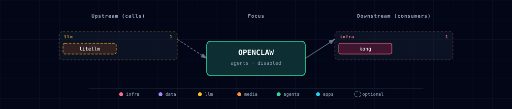

# 5.2.39. OpenClaw AI Agent Service

Open-source AI agent for messaging platforms with web-based administration dashboard.

## 1. Overview

The OpenClaw service provides an LLM-backed agent that connects to messaging apps:

- **Messaging channels**: WhatsApp, Telegram, Discord, Slack, Signal and others (upstream `docs/channels/index.md` in the image). iMessage needs a signed-in Mac running the `imsg` bridge.
- **Workspace files**: Read, create, and manage files in a dedicated workspace
- **Skills**: Bundled skills include `github` and `gog` (Google Calendar, Gmail, Drive). They need the `gh` and `gog` binaries, which the pinned image (`2026.6.10`) does not contain.
- **Web Dashboard**: Browser-based admin panel for configuration and approvals
- **Multi-Provider LLM**: Models come through LiteLLM (§2). Direct Anthropic and OpenAI keys are optional overrides (§4.3).

## 2. Architecture

OpenClaw runs as a single gateway process that:

- Serves the web dashboard on the configured gateway port. The container-mode stack default is 63076; localhost mode uses `OPENCLAW_LOCALHOST_PORT` and defaults to 63065 unless you point it at OpenClaw's native/default 18789.
- Manages messaging platform connections (bridge) on the configured bridge port. The container-mode stack default is 63077.
- Stores configuration in `~/.openclaw/` directory
- Stores workspace files in `~/.openclaw/workspace/`

OpenClaw reaches models through LiteLLM. The container gets `LITELLM_API_KEY` (the LiteLLM master key), which OpenClaw's bundled `litellm` provider reads. Its default base URL `http://localhost:4000` does not resolve in the container. `openclaw-init` therefore sets `models.providers.litellm.baseUrl` to `http://litellm:4000` when it is unset. It keeps an operator value and does not patch a JSON5 config (see below). OpenClaw does not read `LITELLM_BASE_URL`.

Select models from the `litellm` provider. Its built-in default `litellm/claude-opus-4-6` works only if LiteLLM serves a model with that name. You can also point the `openai` provider at LiteLLM (§7). Keep `OPENCLAW_OPENAI_API_KEY` empty then, or a real OpenAI key goes to LiteLLM. `OPENCLAW_OPENAI_API_KEY` and `OPENCLAW_ANTHROPIC_API_KEY` bypass LiteLLM (§4.3).

**Container Mode Initialization**: When running in container mode, an `openclaw-init` container runs first to:
- Set correct volume permissions (uid 1000/node) on config and workspace volumes
- Pre-configure the gateway for non-loopback binding (`gateway.controlUi.dangerouslyAllowHostHeaderOriginFallback`)

OpenClaw accepts JSON5 (comments, trailing commas), but `jq` does not. `openclaw-init` leaves a config that `jq` cannot parse unpatched and logs a warning. Set `models.providers.litellm.baseUrl` and `gateway.controlUi.dangerouslyAllowHostHeaderOriginFallback` in that file yourself.

The gateway container starts with `--bind lan` to listen on all interfaces (required for Docker networking).

## 3. Quick Start

### 3.1. Container Mode (Docker)

**Step 1: Configure source**

Edit `.env`:
```bash
OPENCLAW_SOURCE=container
```

**Step 2: Start the stack**
```bash
./start.sh
```

Or use CLI override:
```bash
./start.sh --openclaw-source container
```

**Step 3: Access the dashboard**

Open `http://localhost:${OPENCLAW_GATEWAY_PORT}` (default 63076) or `http://openclaw.localhost:${KONG_HTTP_PORT}` (via Kong; default port 63000).

**Step 4: Run onboarding** (from the repository root)
```bash
PROJECT_NAME=$(grep '^PROJECT_NAME=' .env | cut -d= -f2-)
docker exec -it ${PROJECT_NAME}-openclaw-gateway openclaw onboard
```

**Note:**
- OpenClaw is **disabled by default** - you must explicitly enable it
- First run requires onboarding to configure messaging channels; the bundled `litellm` provider is pre-pointed at the gateway by `openclaw-init`

### 3.2. Localhost Mode (Native)

**Step 1: Install OpenClaw**
```bash
# Requires Node.js 22+
npm install -g openclaw
```

**Step 2: Run onboarding**
```bash
openclaw onboard --install-daemon
```

**Step 3: Start the gateway**
```bash
openclaw gateway --port 63065
```

**Step 4: Start the stack with OpenClaw localhost**
```bash
./start.sh --openclaw-source localhost
```

Or edit `.env`:
```bash
OPENCLAW_SOURCE=localhost
# Optional: if your local OpenClaw runs on its native/default 18789 instead:
# OPENCLAW_LOCALHOST_PORT=18789
# (URL is derived as http://host.docker.internal:18789 at compose-render time.)
```

### 3.3. Disable OpenClaw

```bash
OPENCLAW_SOURCE=disabled
```

## 4. Configuration

### 4.1. Environment Variables

| Variable | Description | Default |
|----------|-------------|---------|
| `OPENCLAW_SOURCE` | Service source (container, localhost, disabled) | `disabled` |
| `OPENCLAW_IMAGE` | Docker image | `ghcr.io/openclaw/openclaw:2026.6.10` |
| `OPENCLAW_GATEWAY_PORT` | Gateway HTTP port | `63076` |
| `OPENCLAW_BRIDGE_PORT` | Bridge port | `63077` |
| `OPENCLAW_GATEWAY_TOKEN` | Bearer token for the gateway API and dashboard; generated into `.env` at startup when empty and kept afterwards | generated |
| `OPENCLAW_SCALE` | Container replicas (set by bootstrapper) | `0` |

### 4.2. LLM Configuration

By default OpenClaw is wired into the stack's LiteLLM gateway via:

| Variable | Description | Default |
|----------|-------------|---------|
| `LITELLM_BASE_URL` | OpenAI-compatible URL of the LiteLLM proxy | `http://litellm:4000` (in-network) |
| `LITELLM_API_KEY` | Bearer key for LiteLLM (equals `LITELLM_MASTER_KEY`) | auto-generated |

### 4.3. Optional Direct-Provider Overrides

These keys let OpenClaw call a provider directly, without LiteLLM. Use them for a separate budget or key, or for a model that LiteLLM does not serve.

| Variable | Description | Default |
|----------|-------------|---------|
| `OPENCLAW_ANTHROPIC_API_KEY` | Anthropic API key for OpenClaw | Empty by default; set only to bypass LiteLLM with a dedicated OpenClaw key |
| `OPENCLAW_OPENAI_API_KEY` | OpenAI API key for OpenClaw | Empty by default; set only to bypass LiteLLM with a dedicated OpenClaw key |

### 4.4. Localhost-Specific

| Variable | Description | Default |
|----------|-------------|---------|
| `OPENCLAW_LOCALHOST_PORT` | Host port of a native OpenClaw (its own slot, separate from `OPENCLAW_GATEWAY_PORT`). Set it to `18789` if your local OpenClaw uses its native default port. Compose derives the URL `http://host.docker.internal:${OPENCLAW_LOCALHOST_PORT}`. | `63065` |

## 5. LLM Routing and Model Selection

OpenClaw gets LLM access from the always-on LiteLLM gateway (variables in §4.2–§4.3):

- **Default path (LiteLLM)**: the bundled `litellm` provider (key from `LITELLM_API_KEY`, base URL set by `openclaw-init`) or a repurposed `openai` provider (§7) calls the gateway. LiteLLM routes to every Ollama, OpenAI, Anthropic or OpenRouter upstream that the stack enables. Use the model IDs that LiteLLM serves (for example `ollama/qwen3.8:latest`, `gpt-4o`, `claude-sonnet-4-6`).
- **Anthropic override**: set `OPENCLAW_ANTHROPIC_API_KEY` in `.env` to call Anthropic directly. When it is unset, OpenClaw reaches Anthropic only through LiteLLM.
- **OpenAI override**: set `OPENCLAW_OPENAI_API_KEY` in `.env` to call OpenAI directly. When it is unset, OpenClaw does not inherit the stack-wide `OPENAI_API_KEY`.

**Provider selection.** OpenClaw uses the provider named in the selected model id (`litellm/<model>`, `anthropic/<model>`, `openai/<model>`). An override key takes effect only when you select a model from that provider. To keep every request on LiteLLM (budget tracking, spend logs), select `litellm/` models and leave both `OPENCLAW_*_API_KEY` overrides empty.

## 6. Web Dashboard

The OpenClaw gateway includes a built-in web dashboard for administration:

- **Direct access**: `http://localhost:${OPENCLAW_GATEWAY_PORT}` (default 63076)
- **Via Kong**: `http://openclaw.localhost:${KONG_HTTP_PORT}` (default port 63000)

The dashboard provides:
- Chat interface for interacting with the agent
- Configuration management
- Execution approvals
- Channel status monitoring

**Security**: The dashboard is an admin surface and requires `OPENCLAW_GATEWAY_TOKEN` (read it with `grep '^OPENCLAW_GATEWAY_TOKEN=' .env`). Atlas generates the token at startup when it is empty, because the gateway refuses to bind to the LAN without a token.

## 7. Interactive CLI Usage

Run OpenClaw CLI commands inside the container. Run from the repository root; the first line reads the values the later commands use from `.env`:

```bash
env_get() { grep "^$1=" .env | cut -d= -f2-; }; PROJECT_NAME=$(env_get PROJECT_NAME)

# Run onboarding
docker exec -it ${PROJECT_NAME}-openclaw-gateway openclaw onboard

# Point OpenClaw's OpenAI provider at LiteLLM (base URL and gateway key)
docker exec -it ${PROJECT_NAME}-openclaw-gateway openclaw config set models.providers.openai.baseUrl "http://litellm:4000/v1"
docker exec -it ${PROJECT_NAME}-openclaw-gateway sh -c 'openclaw config set models.providers.openai.apiKey "$LITELLM_API_KEY"'

# Check health
docker exec -it ${PROJECT_NAME}-openclaw-gateway openclaw doctor

# View gateway status
docker exec -it ${PROJECT_NAME}-openclaw-gateway openclaw gateway probe

# Read the gateway token
env_get OPENCLAW_GATEWAY_TOKEN
```

## 8. Health Check

Use the `env_get` helper and `PROJECT_NAME` from §7.

```bash
# Direct health check
curl http://localhost:$(env_get OPENCLAW_GATEWAY_PORT)/healthz

# Deep health check (the container's environment supplies the token)
docker exec ${PROJECT_NAME}-openclaw-gateway sh -c 'node openclaw.mjs health --token "$OPENCLAW_GATEWAY_TOKEN"'
```

## 9. Source Modes

### 9.1. container

Runs OpenClaw gateway in a Docker container.

**Best for**: Standard deployment, messaging app integrations

**Resources**: Atlas sets no memory limit and has not measured the gateway's memory use. Upstream's 2 GB guidance applies to building the image, which Atlas does not do.

**Setup**: Automatic via docker-compose

### 9.2. localhost

Connects to OpenClaw running natively on the host machine.

**Best for**: Development, custom configurations, persistent settings

**Resources**: Node.js 22+, npm

**Setup**: Manual — see §3.2 (`openclaw gateway --port 63065`, or set `OPENCLAW_LOCALHOST_PORT` to your port).

### 9.3. disabled

No OpenClaw agent (default).

**Best for**: When messaging agent functionality is not needed

**Impact**: No messaging platform integration available

## 10. Required Services

### 10.1. Required

- **LiteLLM** — the gateway container waits for `litellm` to be healthy (`depends_on`). No other service requires OpenClaw.

### 10.2. LLM access

See §5.

## 11. References

- [OpenClaw Documentation](https://docs.openclaw.ai/)
- [OpenClaw Docker Guide](https://docs.openclaw.ai/install/docker)
- [LiteLLM Gateway](../litellm/README.md) — the OpenAI-compatible front door OpenClaw points at by default
- [Hermes Agent](../hermes/README.md) — the agent runtime. `HERMES_ENDPOINT` and `HERMES_API_KEY` are set in this container, but no OpenClaw-to-Hermes bridge exists yet.
- [OpenClaw GitHub Repository](https://github.com/openclaw/openclaw)

## 12. Dependencies & Integrations

### 12.1. Current — Upstream (this service calls)

| Service | Category | Status |
|---|---|---|
| litellm | llm | optional: openclaw-init sets models.providers.litellm.baseUrl when unset; an operator value is kept |

### 12.2. Current — Downstream (services that call this)

| Service | Category |
|---|---|
| kong | infra |

### 12.3. Architecture diagram



[Open the full-size diagram](./architecture.html) for a full-screen view.

### 12.4. Future — Missing pair integrations

- **openclaw ↔ hermes** — *Why:* OpenClaw is positioned as a channel adapter (40+ messaging surfaces); Hermes is the programmable agent runtime already in the stack. The compose file already passes `HERMES_ENDPOINT`/`HERMES_API_KEY` — only the bridge wiring is missing. *Mechanism:* OpenClaw skill or webhook plugin forwarding inbound messages to `http://hermes:8642/v1/chat/completions`; replies posted back via OpenClaw's `send` RPC. *Effort:* medium. *Confidence:* high.
- **openclaw ↔ n8n** — *Why:* OpenClaw webhooks name n8n as a main trigger. n8n gives non-developers a visual way to connect messaging events to stack workflows. *Mechanism:* n8n HTTP Request node → `POST http://openclaw-gateway:18789/webhooks/<route>` with `Authorization: Bearer <route-secret>`. *Effort:* small. *Confidence:* high.
- **openclaw ↔ minio** — *Why:* Workspace files, voice notes, and media attachments live only in the `openclaw-workspace` Docker volume — not addressable by other stack services. *Mechanism:* configure S3 backend with `endpoint=http://minio:9000`, dedicated `openclaw` bucket alongside the existing `MINIO_BUCKET_*` set. *Effort:* small. *Confidence:* medium.
- **openclaw ↔ doc-processor** — *Why:* OpenClaw handles chat PDF and Office attachments poorly. doc-processor (Docling) produces structured Markdown and chunks that the rest of the stack uses. *Mechanism:* custom OpenClaw skill posting attachments to `${DOCLING_ENDPOINT}/v1/document/convert`; persist markdown to workspace + MinIO. *Effort:* medium. *Confidence:* high.
- **openclaw ↔ weaviate** — *Why:* OpenClaw lists "memory search across persistent knowledge bases" but has no backend wired; Weaviate is the stack's vector DB. *Mechanism:* skill or MCP server bridging to `http://weaviate:8080/v1/objects` (REST) or `:50051` (gRPC); embedding via LiteLLM's embeddings endpoint. *Effort:* medium. *Confidence:* medium.
- **openclaw ↔ searxng** — *Why:* OpenClaw ships web-search tools with multiple providers but defaults to commercial APIs; SearXNG is the stack's privacy-preserving metasearch. *Mechanism:* set OpenClaw's web-search provider to a custom HTTP backend pointing at `${SEARXNG_INTERNAL_URL}/search?format=json&q=...`. *Effort:* small. *Confidence:* medium.

### 12.5. Future — Candidate new services

- **Honcho** ([details](https://github.com/thekaveh/atlas/blob/main/docs/research/candidates/honcho.md)) — *Headline:* hosted/self-hostable user-memory store explicitly listed as an OpenClaw memory-engine backend. *Wires into:* hermes, backend, local-deep-researcher.

### 12.6. Future — Unused features in this service

- **MCP CLI / external MCP server support** — *Why pursue:* lets OpenClaw use any MCP server (Neo4j, Weaviate, GitHub) over stdio, SSE or streamable HTTP. RAG and graph tools then need no bespoke skills. *Effort:* medium.
- **Webhooks plugin (inbound TaskFlow trigger)** — *Why pursue:* standard surface for n8n/CI/external triggers; auth model already defined. *Effort:* small.
- **Sandbox runners (Docker/SSH backends)** — *Why pursue:* non-main sessions can run tools in Docker sandboxes — meaningfully safer than current host-bound execution. *Effort:* medium.
- **Local TTS/STT providers** — *Why pursue:* stack already runs `tts-provider` and `stt-provider`; swap OpenClaw's cloud STT/TTS for local providers to keep voice fully on-device. *Effort:* small.
- **Memory engines (Honcho / QMD search)** — *Why pursue:* persistent cross-session memory currently absent. *Effort:* medium.
- **S3 / object-storage backend** — *Why pursue:* wire workspace + media to MinIO for cross-service file sharing. *Effort:* small.

## 13. Troubleshooting

### 13.1. Permission Denied on Startup

**Problem**: `EACCES: permission denied, open '/home/node/.openclaw/openclaw.json'`

**Solution**:
1. The `openclaw-init` container should fix this automatically on startup
2. If it persists, set `PROJECT_NAME` as in §7 and run: `docker run --rm -v ${PROJECT_NAME}-openclaw-config:/data alpine chown -R 1000:1000 /data`
3. Restart the gateway: `docker restart ${PROJECT_NAME}-openclaw-gateway`

### 13.2. Gateway Won't Start

**Problem**: OpenClaw container fails to start

**Solution**:
1. Check logs (set `PROJECT_NAME` as in §7): `docker logs ${PROJECT_NAME}-openclaw-gateway`
2. Verify image is available: `docker pull ghcr.io/openclaw/openclaw:2026.6.10`
3. Ensure ports 63076/63077 (the gateway and bridge defaults; `OPENCLAW_GATEWAY_PORT` / `OPENCLAW_BRIDGE_PORT`) are free
4. Check `docker logs` for an exit code 137 (out of memory) and give Docker more memory if you see it

### 13.3. Can't See LLM Models

**Problem**: OpenClaw doesn't see any models

**Solution**:
1. Verify LiteLLM is healthy: `curl http://localhost:63040/health/liveliness` (63040 is the default `LITELLM_PORT`)
2. List the models LiteLLM serves: `curl -H "Authorization: Bearer $(grep '^LITELLM_MASTER_KEY=' .env | cut -d= -f2-)" http://localhost:63040/v1/models`
3. Check the provider config (`baseUrl` must be `http://litellm:4000`; set `PROJECT_NAME` as in §7): `docker exec ${PROJECT_NAME}-openclaw-gateway openclaw config get models.providers.litellm`. Check `models.providers.openai` only if you repurposed it (§7).
4. Confirm that `LITELLM_API_KEY` is set in the OpenClaw container environment
5. For Ollama models, set `LLM_PROVIDER_SOURCE` to an `ollama-*` value (not `none`), so LiteLLM has an Ollama upstream

### 13.4. Dashboard Not Loading

**Problem**: Web dashboard returns errors

**Solution**:
1. Check the health endpoint: `curl http://localhost:63076/healthz` (default `OPENCLAW_GATEWAY_PORT`)
2. Wait for startup (20s start period)
3. If using Kong, verify hosts file: `./start.sh --setup-hosts`
4. Sign in with `OPENCLAW_GATEWAY_TOKEN` from `.env`; it is always required

### 13.5. Port Already in Use

**Problem**: Port 63076 (gateway) or 63077 (bridge) is occupied

**Solution**:
```bash
# Use different base port
./start.sh --base-port 64000

# Or check what's using the port
lsof -i :63076
```

## 14. Capabilities & limitations

Support tier: **experimental** — Capability contract declared; no cited cold-start, workflow, or upgrade qualification run yet (evidence at `v0.1.0`).

| Capability | Status | Verification | Notes |
|---|---|---|---|
| LiteLLM-backed messaging agent gateway | partial | tested | Atlas injects the LiteLLM key, and openclaw-init points the bundled litellm provider at http://litellm:4000 when its baseUrl is unset. Messaging channels and approvals require onboarding and are not exercised against live platforms. |
| Container and operator-host sources | partial | tested | Atlas initializes and runs the container source, while localhost mode only resolves an existing operator-managed gateway and cannot guarantee its version, onboarding, or supervision. |
| Direct cloud-provider overrides | partial | tested | Optional OpenClaw-specific Anthropic or OpenAI keys can bypass LiteLLM, which also bypasses Atlas gateway accounting and centralized provider routing. |
| OpenClaw gateway authentication | partial | tested | OPENCLAW_GATEWAY_TOKEN, generated at startup, protects the gateway API and dashboard; the CORS-only Kong route adds no Atlas authentication of its own. Direct gateway ports are loopback-only by default; an operator who deliberately publishes them remotely must secure that exposure separately. |
| Agent configuration and workspace persistence | partial | tested | Config and workspace data persist in local named volumes, with no MinIO sharing, backup workflow, replication, or tenant-isolated workspace topology. |
| Hermes and n8n message bridges | stubbed | tested | Hermes endpoint variables are injected and OpenClaw webhooks are documented, but Atlas ships no live forwarding implementation between OpenClaw, Hermes, or n8n. |
| Untrusted agent command isolation | not-supported | documented | OpenClaw can manage files and execute commands from messaging workflows, while Atlas configures no mandatory sandbox runner or per-channel authorization policy. |
