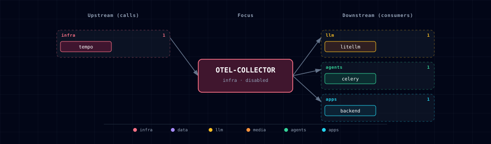

# OpenTelemetry Collector

## 1. Overview

OpenTelemetry Collector is Atlas' disabled by default, internal-only telemetry ingest point. It receives OTLP traces from backend and LiteLLM and forwards trace data to Tempo. Loki log export is deliberately not enabled yet; the logs pipeline uses the debug exporter until trace ingestion is proven.

This is a local development service. It is not exposed through Kong, has no browser UI, and should not be treated as an internet-facing ingestion endpoint.

## 2. Access

- SOURCE: `OTEL_COLLECTOR_SOURCE=disabled` by default.
- Internal OTLP HTTP endpoint when enabled: `http://otel-collector:4318`.
- Internal OTLP gRPC endpoint when enabled: `http://otel-collector:4317`.
- Direct host URL: none in the first slice.
- Kong URL: none; no Kong route is generated.
- Grafana surface: use Grafana with the Tempo datasource to inspect traces.

## 3. Configuration

The service reads `./config/config.yaml`, mounted to `/etc/otelcol/config.yaml`. Atlas computes `OTEL_COLLECTOR_ENDPOINT`, `OTEL_COLLECTOR_OTLP_HTTP_ENDPOINT`, `OTEL_COLLECTOR_OTLP_GRPC_ENDPOINT`, and `ATLAS_OTEL_ENABLED` from SOURCE choices.

## 4. Architecture & Wiring

Backend and LiteLLM export OTLP HTTP spans to the collector. The collector batches and forwards traces to Tempo. The collector stays stateless and uses no persistent volume.

Trace correlation uses W3C `traceparent` first. Backend spans start or continue request traces, and LiteLLM's OTel v2 integration continues an incoming `traceparent` header when present. Kong is not instrumented as a tracing producer in this slice, so Kong access logs and request IDs are adjacent correlation clues rather than Tempo spans. A future Kong `correlation-id` plugin pass should standardize `X-Request-ID` injection and forwarding once the backend/LiteLLM trace path is proven.

## 5. Dependencies & Integrations

> Auto-generated section — the **Current** subsections are derived from `services/otel-collector/service.yml`'s `data_flow.calls` field (and inverse passes). Re-run `python -m bootstrapper.docs.regen otel-collector` after manifest changes.

### 5.1 Current — Upstream (this service calls)

| Service | Category |
|---|---|
| tempo | infra |

### 5.2 Current — Downstream (services that call this)

| Service | Category |
|---|---|
| litellm | llm |
| backend | apps |

### 5.3 Architecture diagram

[Open the interactive HTML diagram](./architecture.html) for a full-screen view.

### 5.4 Future — Missing pair integrations

_No high-confidence opportunities identified._

### 5.5 Future — Candidate new services

_No high-confidence opportunities identified._

### 5.6 Future — Unused features in this service

_No high-confidence opportunities identified._

## 6. Troubleshooting

- If backend or LiteLLM do not emit traces, confirm `OTEL_COLLECTOR_SOURCE=container` and `TEMPO_SOURCE=container`.
- If Grafana shows no traces, check the Tempo datasource and the collector logs.
- Roll back by setting `OTEL_COLLECTOR_SOURCE=disabled`; backend and LiteLLM tracing env collapses to no-op values.
