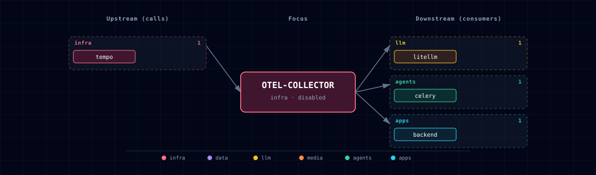

# 5.2.40. OpenTelemetry Collector

## 1. Overview

OpenTelemetry Collector is Atlas' disabled by default, internal-only telemetry ingest point. It receives OTLP traces and logs, forwards traces to Tempo, and persists redacted logs in Loki. The stock backend, Celery, and LiteLLM wiring currently emits traces; any application that emits OTLP logs to the same endpoint uses the Loki path.

This is a local development service. It is not exposed through Kong, has no browser UI, and should not be treated as an internet-facing ingestion endpoint.

## 2. Access

- SOURCE: `OTEL_COLLECTOR_SOURCE=disabled` by default.
- Internal OTLP HTTP endpoint when enabled: `http://otel-collector:4318`.
- Internal OTLP gRPC endpoint when enabled: `http://otel-collector:4317`.
- Direct host URL: none.
- Kong URL: none; no Kong route is generated.
- Grafana surface: use the Tempo datasource for traces and Loki for logs.

## 3. Configuration

The service reads `./config/config.yaml`, mounted at `/etc/otelcol/config.yaml`. Atlas computes `OTEL_COLLECTOR_ENDPOINT`, `OTEL_COLLECTOR_OTLP_HTTP_ENDPOINT`, `OTEL_COLLECTOR_OTLP_GRPC_ENDPOINT` and `ATLAS_OTEL_ENABLED` from the SOURCE values. Container mode requires `TEMPO_SOURCE=container` and `LOKI_SOURCE=container`. If either is missing, `./start.sh` stops with an error before Compose starts.

**Receiver limits.** gRPC messages are capped at 4 MiB and HTTP request bodies at 4,194,304 bytes. The gRPC transport rejects larger messages. The HTTP receiver returns `400 Bad Request` with `request body too large` before it parses OTLP.

**Logs pipeline.** The pipeline applies the memory limiter and redaction, then batches at most 1,024 records. It sends through a queue of 512 requests with two consumers and exponential retry. The queue is bounded and in memory. It rides out a Loki outage while the Collector runs, but queued records do not survive a Collector restart. Loki keeps accepted logs for `LOKI_RETENTION_PERIOD`.

**Attribute redaction** deletes top-level log and resource attributes whose keys case-insensitively end in one of the names below. The name is the whole key or follows a `.`, `_` or `-`.

Names: `authorization`, `proxy-authorization`, `x-api-key`, `api_key`, `api-key`, `apikey`, `token`, `access_token`, `refresh_token`, `client_secret`, `password`, `passwd`, `secret`, `cookie`, `set-cookie`, `master_key`. For example, it removes `db.password`, `OPENAI_API_KEY` and `http.request.header.cookie`, and keeps `max_tokens`. It does not recursively inspect nested attribute maps.

**String-body redaction** uses the same key list, also with a prefix such as `LITELLM_MASTER_KEY=`, in `key=value` or `key: value` text:

- `authorization` and `proxy-authorization`: the whole value, including the scheme (`Bearer`, `Basic`, `Token` and others).
- `cookie` and `set-cookie`: the first value and every following `; name=value` pair.
- All other keys: the value up to the next whitespace, `,`, `;`, `&`, quote, `}` or `]`.
- Passwords in `scheme://user:password@` strings, and `sk-…` API keys.

A body key must start the string or follow whitespace, `{`, `[`, `,`, `?`, `&` or `;`. Quotes around keys and values are allowed, so JSON-like and logfmt text match. A transform error fails the batch instead of sending it unredacted. Body filtering is best-effort: it does not traverse structured nested or non-string bodies, encodings, or unknown keys. Do not log secrets.

**Trace redaction** blanks credential query values in the `url.query`, `url.full` and `http.url` span attributes. Parameters: `apikey`, `api_key`, `token`, `access_token`, `key`, `password`, `secret`, `sig`, `X-Amz-Security-Token`, `X-Amz-Signature`, `X-Amz-Credential`. This keeps the `apikey` that Kong's `key-auth` forwards to the backend out of Tempo. The transform uses `error_mode: ignore`, so a span that fails it is exported unchanged.

**Health and startup.** The image is distroless, so the health check runs the Collector's `validate` subcommand against the mounted config. The Collector starts after Tempo is healthy and Loki has started. Loki has no health check; the Loki export queue retries until Loki accepts writes. The backend stops at startup if tracing is enabled without an exporter endpoint or the OTel packages.

## 4. Architecture & Wiring

Backend, Celery, and LiteLLM export OTLP HTTP spans to the collector. The collector batches and forwards traces to Tempo. OTLP log producers use the same receiver; after redaction and bounded live retry, the collector sends logs to Loki's native `/otlp` endpoint. The collector stays stateless and uses no persistent volume.

Loki keeps OTLP `trace_id` and `span_id` as structured metadata. Grafana's Loki datasource reads the `trace_id` label to build the Tempo link; it does not scan the log line. To query a correlated record in LogQL:

```logql
{service_name="backend"} | trace_id = "0123456789abcdef0123456789abcdef"
```

Trace correlation uses W3C `traceparent`. Backend spans start or continue request traces. The backend's instrumented httpx client sends `traceparent` on outbound calls. When `ATLAS_OTEL_ENABLED=true`, LiteLLM's `otel` callback continues the trace and excludes prompt and completion content. Kong emits no spans, so Kong access logs and request IDs are correlation clues only. A Kong `correlation-id` plugin is a candidate in the [Kong README](../kong/README.md).

## 5. Dependencies & Integrations

### 5.1. Current — Upstream (this service calls)

| Service | Category |
|---|---|
| loki | infra |
| tempo | infra |

### 5.2. Current — Downstream (services that call this)

| Service | Category |
|---|---|
| litellm | llm |
| celery | agents |
| backend | apps |

### 5.3. Architecture diagram



[Open the full-size diagram](./architecture.html) for a full-screen view.

### 5.4. Future — Missing pair integrations

_No high-confidence opportunities identified._

### 5.5. Future — Candidate new services

_No high-confidence opportunities identified._

### 5.6. Future — Unused features in this service

_No high-confidence opportunities identified._

## 6. Troubleshooting

- If backend or LiteLLM do not emit traces, confirm `OTEL_COLLECTOR_SOURCE=container` and `TEMPO_SOURCE=container`.
- If logs do not appear, confirm `LOKI_SOURCE=container`, query the normalized `service_name` label, and inspect Collector retry errors. A Collector restart discards records that Loki had not accepted.
- If the collector is unhealthy, run the same mounted-config validation shown in the Compose health check and inspect the reported receiver, processor, or exporter error.
- If Grafana shows no traces, check the Tempo datasource and the collector logs.
- Roll back by setting `OTEL_COLLECTOR_SOURCE=disabled`; backend and LiteLLM tracing env collapses to no-op values.

## 7. Capabilities & limitations

Support tier: **experimental** — Capability contract declared; no cited cold-start, workflow, or upgrade qualification run yet (evidence at `v0.1.0`).

| Capability | Status | Verification | Notes |
|---|---|---|---|
| OTLP trace ingestion and Tempo export | supported | tested | Atlas accepts internal OTLP over gRPC and HTTP, batches traces, and exports them to the required Tempo service. |
| Log export to Loki | supported | tested | Atlas redacts a documented top-level credential-key allowlist and sends OTLP logs through a bounded live retry queue. Accepted logs persist in the required local Loki service. |
| Public telemetry ingestion | not-supported | tested | Collector receivers are backend-network only with no published host port or Kong route in the stock deployment. |
