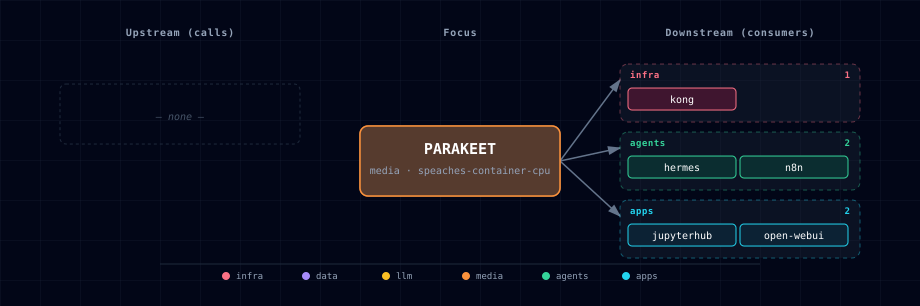

# 5.2.41. Parakeet (STT engine)

Parakeet is one of the STT engines selectable via `STT_PROVIDER_SOURCE`. It is
documented under the **STT Provider** aggregator rather than as a standalone
service, because the user-facing role is "pick an STT engine" — not "pick
Parakeet":

→ See [services/stt-provider/README.md](../stt-provider/README.md) for the full
user-facing description, source-variant table, and configuration reference.

## 1. Engine quick reference

- **Image:** `nvcr.io/nvidia/pytorch:26.06-py3` (GPU only — Parakeet-TDT model)
- **License:** CC-BY-4.0 (NVIDIA)
- **Activation:** `STT_PROVIDER_SOURCE=parakeet-container-gpu` (or
  `parakeet-localhost` — Parakeet-MLX on macOS / native Linux)
- **In-container port:** 8000
- **Host port:** `${STT_PROVIDER_PORT}` (computed from `BASE_PORT` by the
  bootstrapper)
- **Readiness:** Uvicorn starts while a deadline-bounded background task loads
  the configured model. `GET /health` returns `503` until loading completes.

This manifest also owns the broader `STT_PROVIDER_SOURCE` enum (every STT
option across engines), which is why it lives here historically rather than
on the aggregator. The manifest (`service.yml`) and compose fragment
(`compose.yml`) in this folder are the bootstrapper's source of truth for those
values; treat this README as a pointer, not a duplicate of the aggregator doc.

## 2. Dependencies & Integrations

### 2.1. Current — Upstream (this service calls)

_No upstream calls._

### 2.2. Current — Downstream (services that call this)

| Service | Category |
|---|---|
| kong | infra |
| hermes | agents |
| n8n | agents |
| jupyterhub | apps |
| open-webui | apps |

### 2.3. Architecture diagram

[Open the full-size diagram](./architecture.html) for a full-screen view.

### 2.4. Future — Missing pair integrations

_No high-confidence opportunities identified._

### 2.5. Future — Candidate new services

_No high-confidence opportunities identified._

### 2.6. Future — Unused features in this service

_No high-confidence opportunities identified._

## 3. Capabilities & limitations

| Capability | Status | Verification | Notes |
|---|---|---|---|
| NVIDIA Parakeet transcription | supported | tested | The GPU source loads the configured Parakeet-TDT checkpoint and serves standard and advanced OpenAI-shaped transcription routes with truthful readiness. |
| Host speech-to-text variants | partial | tested | Atlas can route to operator-run Parakeet MLX or whisper.cpp endpoints, but installation, model provisioning, process supervision, and host acceleration remain operator-owned. |
| Timestamp-rich transcription | partial | tested | Atlas-managed Parakeet providers expose segment and word timing when the selected implementation returns alignment data; plain results honestly report timestamps unavailable. |
| Provider authentication and workload bounds | partial | tested | Atlas Parakeet requires a bearer token and bounds uploads, admission, and inference by default; those guarantees do not extend to selected Speaches or whisper.cpp upstreams. |
| Cross-architecture Parakeet container | not-supported | tested | The only Parakeet container is NVIDIA GPU; Apple Silicon uses the separately installed MLX localhost provider and no CPU container or GPU quantization knob is advertised. |
