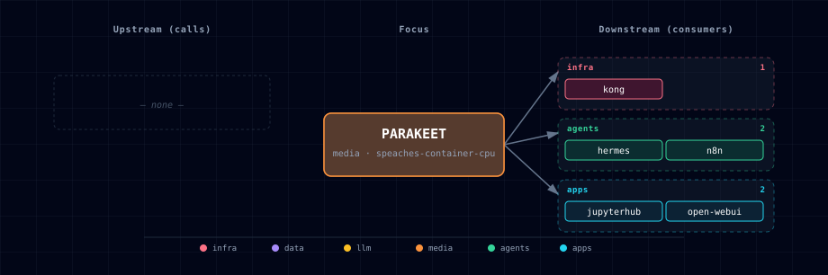

# 5.2.41. Parakeet (STT engine)

Parakeet is an STT engine selected with `STT_PROVIDER_SOURCE`. See
[the STT Provider README](../stt-provider/README.md) for setup and configuration.

## 1. Engine quick reference

- **Image:** built locally from `provider/gpu/Dockerfile` on `nvcr.io/nvidia/pytorch:26.06-py3` (GPU only; Parakeet-TDT model)
- **License:** model CC-BY-4.0; container base NVIDIA-DLC
- **Activation:** `STT_PROVIDER_SOURCE=parakeet-container-gpu` (or
  `parakeet-localhost` — Parakeet-MLX on macOS / native Linux)
- **In-container port:** 8000
- **Host port:** `${STT_PROVIDER_PORT}` (computed from `BASE_PORT` by the
  bootstrapper)
- **Readiness:** Uvicorn starts while a deadline-bounded background task loads
  the model. `GET /health` returns `503` until loading completes. A cold first
  boot downloads the ~2.4 GB checkpoint. The healthcheck start period (810 s
  plus retries) covers the 900 s load deadline.

This manifest also owns the `STT_PROVIDER_SOURCE` list for all STT engines.

## 2. Dependencies & Integrations

### 2.1. Current — Upstream (this service calls)

_No upstream calls._

### 2.2. Current — Downstream (services that call this)

| Service | Category |
|---|---|
| kong | infra |
| hermes | agents |
| n8n | agents |
| jupyterhub | apps |
| open-webui | apps |

### 2.3. Architecture diagram

[Open the full-size diagram](./architecture.html) for a full-screen view.

### 2.4. Future — Missing pair integrations

_No high-confidence opportunities identified._

### 2.5. Future — Candidate new services

_No high-confidence opportunities identified._

### 2.6. Future — Unused features in this service

_No high-confidence opportunities identified._

## 3. Capabilities & limitations

Support tier: **experimental** — Capability contract declared; no cited cold-start, workflow, or upgrade qualification run yet (evidence at `v0.1.0`).

| Capability | Status | Verification | Notes |
|---|---|---|---|
| NVIDIA Parakeet transcription | supported | tested | The GPU source loads the configured Parakeet-TDT checkpoint and serves standard and advanced OpenAI-shaped transcription routes with truthful readiness. |
| Host speech-to-text variants | partial | tested | Atlas can route to operator-run Parakeet MLX or whisper.cpp endpoints, but installation, model provisioning, process supervision, and host acceleration remain operator-owned. |
| Timestamp-rich transcription | partial | tested | Atlas-managed Parakeet providers expose segment and word timing when the selected implementation returns alignment data; plain results honestly report timestamps unavailable. |
| Provider authentication and workload bounds | partial | tested | Atlas Parakeet requires a bearer token and bounds uploads, admission, and inference by default; those guarantees do not extend to selected Speaches or whisper.cpp upstreams. |
| Cross-architecture Parakeet container | not-supported | tested | The only Parakeet container is NVIDIA GPU. Apple Silicon uses the separately installed MLX localhost provider; no CPU container or GPU quantization knob is advertised. |
