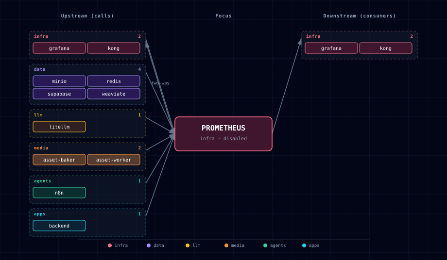

# 5.2.42. Prometheus (metrics scraper + TSDB)

Prometheus runs as three containers in the `infra` band: `prometheus`, `node-exporter` (host metrics) and `cadvisor` (cgroup-level container metrics). `PROMETHEUS_SOURCE` scales all three together.

## 1. Overview

Image: `prom/prometheus:v2.55.1` (Apache 2.0). The bundled exporters are `prom/node-exporter:v1.11.1` and `gcr.io/cadvisor/cadvisor:v0.55.1`. Default TSDB retention is **7 days**. The wizard asks for it on the Prometheus source step.

The scrape config is static (`services/prometheus/config/prometheus.yml`) and lists every supported target in the stack. Targets of `disabled` services report `UP=0`; the file is not templated per enabled service. Recording / alert rules live under `services/prometheus/config/rules/`; the bundled `stack-recording.yml` is an empty placeholder.

### 1.1. cAdvisor isolation boundary

cAdvisor receives no Docker socket, Docker API proxy, host-root mount, or Docker data-directory mount. It reads only the host cgroup hierarchy through `/sys`, runs with a read-only root filesystem, all Linux capabilities dropped, and `no-new-privileges`. Docker discovery is explicitly pointed at a nonexistent socket and container-label storage is disabled.

This deliberately trades friendly Docker names and labels for isolation: container series are keyed by cgroup ID. Use Compose/Grafana context to correlate IDs when needed. Host CPU, memory, disk, and network names remain available from `node-exporter`.

## 2. Access

| Surface | URL | Auth |
|---|---|---|
| Prometheus UI + API (direct) | `http://localhost:${PROMETHEUS_PORT}` | None |
| Prometheus UI + API (Kong) | `http://prometheus.localhost:${KONG_HTTP_PORT}` | None. `/-/quit` and `/-/reload` return 403 here; the direct port still accepts them (see §7). |
| Direct (internal) | `http://prometheus:9090` | None — backend-network only |
| node-exporter (direct) | `http://localhost:${NODE_EXPORTER_PORT}/metrics` | None |
| cAdvisor (direct) | `http://localhost:${CADVISOR_PORT}` | None |

`prometheus.localhost` has no authentication. With the default `HOST_BIND_IP=127.0.0.1:`, Kong listens on loopback only; see §7 before exposing it further. Use Grafana as the user-facing dashboard surface.

## 3. Configuration

```bash
PROMETHEUS_SOURCE=disabled              # container | disabled
PROMETHEUS_RETENTION_DAYS=7             # 1..365
PROMETHEUS_PORT=                        # auto-assigned by topology (infra block)
NODE_EXPORTER_PORT=                     # auto-assigned
CADVISOR_PORT=                          # auto-assigned
```

Auto-managed (do not edit by hand):

```bash
PROMETHEUS_ENDPOINT=...                  # consumed by Grafana provisioning
PROMETHEUS_SCALE / NODE_EXPORTER_SCALE / CADVISOR_SCALE
POSTGRES_EXPORTER_SCALE / REDIS_EXPORTER_SCALE  # cross-manifest writes
```

`_generate_prometheus_config()` sets all five scale vars and `PROMETHEUS_ENDPOINT` from `PROMETHEUS_SOURCE`. The two `*_EXPORTER_SCALE` vars control the sidecars in `services/supabase/` and `services/redis/`.

## 4. Scrape targets

15 targets ship in `config/prometheus.yml`:

| Job | Target | Notes |
|---|---|---|
| `prometheus` | `prometheus:9090` | Self-metrics |
| `grafana` | `grafana:3000` | Grafana self-metrics |
| `node` | `node-exporter:9100` | Host CPU/mem/disk/net |
| `cadvisor` | `cadvisor:8080` | Per-container resources |
| `kong` | `kong-api-gateway:8100` | Kong Status API + Prometheus plugin. (The Compose service name is `kong-api-gateway`; `kong` alone does not resolve on the backend-network.) |
| `litellm` | `litellm:4000` | Per-model tokens / cost / latency / errors (requires `callbacks: [prometheus]` in LiteLLM config) |
| `weaviate` | `weaviate:2112` | Requires `PROMETHEUS_MONITORING_ENABLED=true` on Weaviate |
| `n8n` | `n8n:5678` | Requires `N8N_METRICS=true` |
| `n8n-worker` | `n8n-worker:5678` | Queue mode runs executions worker-side — execution-data counters live here |
| `minio` | `minio:9000/minio/v2/metrics/cluster` | Requires `MINIO_PROMETHEUS_AUTH_TYPE=public` |
| `backend` | `backend:8000/metrics` | `prometheus-fastapi-instrumentator` middleware |
| `asset-worker` | `asset-worker:8095` | Auth-free operational metrics; asset mutation routes remain bearer-token protected |
| `asset-baker` | `asset-baker:8096` | Auth-free operational metrics; asset mutation routes remain bearer-token protected |
| `postgres-exporter` | `postgres-exporter:9187` | Sidecar embedded in Supabase family; scales 1↔0 with `PROMETHEUS_SOURCE` |
| `redis-exporter` | `redis-exporter:9121` | Sidecar embedded in Redis family; scales 1↔0 with `PROMETHEUS_SOURCE` |

Ollama is **deliberately not scraped** — LiteLLM is its gateway and emits per-call request/token/cost metrics, so scraping Ollama directly would duplicate that data. Container-level resource usage is covered by cAdvisor.

**Not scraped:** JupyterHub and Hermes. The JupyterHub image (`quay.io/jupyter/datascience-notebook`) runs a single-user server with no `/metrics` endpoint. The `nousresearch/hermes-agent` image has no `/metrics` endpoint either.

## 5. Dependencies & Integrations

### 5.1. Current — Upstream (this service calls)

| Service | Category |
|---|---|
| grafana ↔ | infra |
| kong ↔ | infra |
| minio | data |
| redis | data |
| supabase | data |
| weaviate | data |
| litellm | llm |
| asset-baker | media |
| asset-worker | media |
| n8n | agents |
| backend | apps |

### 5.2. Current — Downstream (services that call this)

| Service | Category |
|---|---|
| grafana ↔ | infra |
| kong ↔ | infra |

### 5.3. Architecture diagram



[Open the full-size diagram](./architecture.html) for a full-screen view.

### 5.4. Future — Missing pair integrations

_No high-confidence opportunities identified._

### 5.5. Future — Candidate new services

- **Alertmanager** — paging and routing for Prometheus alerting rules. The bundle uses Grafana's unified alerting. A separate Alertmanager matters only for clustered HA alerting.

### 5.6. Future — Unused features in this service

- **Remote write to long-term storage** — `remote_write` to Mimir / Thanos / VictoriaMetrics for retention beyond the local TSDB, when local disk limits retention.
- **Recording rules** — pre-aggregated time series for expensive Grafana queries; `config/rules/stack-recording.yml` is an empty placeholder ready to be populated.
- **Native histograms** — Prometheus 2.40+ supports native histograms. LiteLLM and the FastAPI instrumentators can emit them with a smaller storage footprint than classic histograms.

## 6. Troubleshooting

- **Targets show `DOWN` for services that are running** — the service probably has not enabled its `/metrics` endpoint. Check the per-service flag (`N8N_METRICS=true`, `PROMETHEUS_MONITORING_ENABLED=true`, …). Visit `http://prometheus.localhost:${KONG_HTTP_PORT}/targets` (default port 63000) to see the `lastError` for each failing job.
- **No metrics for postgres / redis** — the sidecar exporters scale to 0 when `PROMETHEUS_SOURCE=disabled`. Confirm `PROMETHEUS_SOURCE=container` is set in `.env` and re-run `./start.sh`.
- **Disk pressure** — `prometheus-data` named volume grows roughly linearly with retention × scrape rate × series count. Lower `PROMETHEUS_RETENTION_DAYS` or trim scrape jobs in `config/prometheus.yml`.
- **cAdvisor or node-exporter unable to start on macOS** — `/proc` and host filesystem mounts behave differently inside Docker Desktop's VM than on Linux. Some node-exporter collectors degrade gracefully, and cAdvisor's container metrics are platform-agnostic. Host-level metrics on macOS are best-effort.

## 7. Capabilities & limitations

Support tier: **experimental** — Capability contract declared; no cited cold-start, workflow, or upgrade qualification run yet (evidence at `v0.1.0`).

| Capability | Status | Verification | Notes |
|---|---|---|---|
| Stack metrics scraping and local TSDB | supported | tested | Atlas ships a static fifteen-target scrape inventory, exporter lifecycle wiring, and configurable local Prometheus retention. |
| Host and container resource metrics | partial | tested | node-exporter and hardened cAdvisor provide resource series, but cAdvisor omits Docker labels and host collectors are best-effort under Docker Desktop. |
| Alert routing and long-term metrics storage | not-supported | documented | Atlas configures neither Alertmanager nor remote-write storage, and the shipped recording-rule file remains an empty placeholder. |
| Authenticated Prometheus and exporter access | not-supported | tested | The direct PROMETHEUS_PORT, NODE_EXPORTER_PORT, and CADVISOR_PORT publishes have no authentication. The CORS-only Kong prometheus.localhost route has no authentication. --web.enable-lifecycle is enabled. Kong answers 403 to /-/quit and /-/reload, but the direct port accepts them, so any web page can POST /-/quit and stop Prometheus. The default HOST_BIND_IP=127.0.0.1: keeps direct ports loopback-bound. Before wider exposure, firewall or remove the direct ports, and add an authentication proxy or remove the Prometheus Kong route. |
