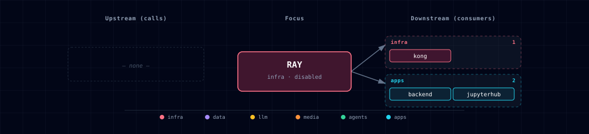

# 5.2.43. Ray

Distributed-compute substrate for the stack. Ray runs as a head + worker cluster reachable from JupyterHub, Backend (via REST), and any host Python via `ray.init("ray://localhost:<RAY_CLIENT_PORT>")`.

## 1. Overview

Ray (`rayproject/ray:2.56.0`, Apache 2.0) is a generic parallel-compute framework. This stack ships it as a 2-container family (head + workers) wired so every tier can dispatch parallel work without rolling its own asyncio.gather glue. Use Ray when you have N independent units of work to fan out across CPUs (and eventually GPUs on multi-host Linux).

Active when `RAY_SOURCE ∈ {ray-container-cpu, ray-container-gpu}`. Authenticated remote Ray endpoints (Anyscale, self-hosted clusters) are deferred to the stack-wide authenticated-remote design.

## 2. Access

| Surface | URL | Auth |
|---|---|---|
| Dashboard (UI + REST job-submission API) | `http://localhost:${RAY_DASHBOARD_PORT}` direct or `http://ray.localhost:${KONG_HTTP_PORT}` via Kong | Direct: unauthenticated and bound to loopback only. Kong: basic-auth with `DASHBOARD_USERNAME` / `DASHBOARD_PASSWORD`. |
| Client server (trusted host Python) | `ray://localhost:${RAY_CLIENT_PORT}` | Unauthenticated; bound to loopback only. Never forward or publicly expose this port. |
| GCS (internal cluster controller) | `localhost:${RAY_GCS_PORT}` host-side; `ray-head:6379` inside the network | Unauthenticated; host mapping is loopback only. |
| Backend REST jobs API | `http://localhost:${BACKEND_PORT}/api/ray/jobs/submit` etc. | Bearer token from `RAY_JOB_API_TOKEN` |

## 3. Configuration

| Env var | Default | When | Description |
|---|---|---|---|
| `RAY_SOURCE` | `disabled` | always | One of `ray-container-cpu`, `ray-container-gpu`, `disabled`. |
| `RAY_WORKER_COUNT` | `2` | when source ∈ {cpu, gpu} | Number of `ray-worker` containers. Use `0` for head-only single-node mode. No hard upper bound — bounded by host RAM and CPUs. |
| `RAY_DASHBOARD_PORT`, `RAY_GCS_PORT`, `RAY_CLIENT_PORT` | auto-assigned | always | Topology-allocated in the infra block and published only on `127.0.0.1`. |
| `RAY_JOB_API_TOKEN` | auto-generated | always | Required as `Authorization: Bearer <token>` on every Backend `/api/ray` route. Stored in `.env` and injected only into Backend. |
| `RAY_IMAGE`, `RAY_GPU_IMAGE`, `RAY_HEAD_SCALE`, `RAY_WORKER_SCALE`, `RAY_ADDRESS` | auto-managed | always | Resolved by `_generate_ray_config()` from RAY_SOURCE + RAY_WORKER_COUNT. Don't edit by hand. |

**Wizard behavior:** when the user selects `ray-container-cpu` or `ray-container-gpu`, the wizard then prompts for `RAY_WORKER_COUNT` (integer, default 2) inline on the source step via the `SecondaryNumberInput` widget.

## 4. Architecture & wiring

**Containers in the family:**
- `ray-head` — the cluster controller. Runs `ray start --head`. Exposes ports 8265 (dashboard + REST), 6379 (GCS — Ray's internal cluster controller, *distinct from the project's Redis cache* despite both using Redis wire protocol), 10001 (client server). Healthcheck on `:8265/api/version`.
- `ray-worker` — one or more replicas. Runs `ray start --address=ray-head:6379 --block`. No host ports.

**Why no `/tmp/ray` volume:** Ray spills object-store state to `/tmp/ray` per node, but the fragments deliberately mount **no** named volume there. The `rayproject/ray` image runs as the non-root `ray` user and doesn't pre-create `/tmp/ray`, so a named Docker volume would be initialized `root:root` and become unwritable by `ray` — Ray would then fail to start. Session state therefore lives in the container's writable layer (per-run, ephemeral), which is the intended behavior; `/dev/shm` is sized via `shm_size` to avoid the object-store spill in the first place.

**Critical shared memory:** Both containers set `shm_size: 8gb` — Docker's default 64MB causes immediate crash because Ray's Plasma object store needs shared memory. If you see startup failures with "Connection refused" on port 8265 within 60 seconds, check shm size.

**No external runtime dependencies.** Ray ships its own GCS (Redis-protocol cluster controller) and Plasma (shared-memory object store). The cluster is fully self-contained. The `supabase` + `redis` entries in this manifest's `depends_on.required` are **display-ordering pins** (so Kong wins the alphabetical tie within the infra port-slot block), NOT runtime calls — Ray does not actually talk to either at runtime.

**Consumers in the stack:**
- **Backend** — exposes `POST /api/ray/jobs`, `GET`/`DELETE /api/ray/jobs/{job_id}`, and `GET /api/ray/cluster/status`. It adapts via `RAY_ADDRESS` set by `_generate_ray_config()` and requires `RAY_JOB_API_TOKEN` as a bearer token on every route.
- **JupyterHub** — notebooks can `import ray; ray.init()` directly (RAY_ADDRESS picked up from env). Sample notebook: `services/jupyterhub/build/notebooks/07_ray_cluster.ipynb` (mounted read-only at `/home/jovyan/notebooks/` inside the JupyterHub container).
- **Hermes** — no Ray submission integration is wired today. A future integration must receive `RAY_JOB_API_TOKEN` through a scoped client contract before it can call Backend's protected Ray routes.

## 5. Dependencies & Integrations

### 5.1. Current — Upstream (this service calls)

_No upstream calls._

### 5.2. Current — Downstream (services that call this)

| Service | Category |
|---|---|
| kong | infra |
| backend | apps |
| jupyterhub | apps |

### 5.3. Architecture diagram

[Open the full-size diagram](./architecture.html) for a full-screen view.

### 5.4. Future — Missing pair integrations

_No high-confidence opportunities identified._

### 5.5. Future — Candidate new services

_No high-confidence opportunities identified._

### 5.6. Future — Unused features in this service

_No high-confidence opportunities identified._

## 6. Troubleshooting

- **Head container exits immediately with "Bus error" or "/dev/shm too small"** — Docker's default shared-memory size (64MB) is too small. Compose's `shm_size: 8gb` should handle this, but some installs (rootless Podman, older Docker) ignore it. Verify with `docker inspect ${PROJECT_NAME}-ray-head | grep ShmSize`.
- **Workers stuck "starting"** — they `depends_on: ray-head: service_healthy`. The head's `start_period: 60s` allows up to 60s before health checks count. If still stuck after 2 minutes, check the head's healthcheck output: `docker exec ${PROJECT_NAME}-ray-head wget -qO- http://localhost:8265/api/version` (the image ships wget, not curl).
- **`ray.init("ray://localhost:PORT")` from host fails with version mismatch** — your host's `ray` Python package version must match the cluster's image version. Pin `ray>=2.56.0,<2.57` in your host venv to match the image's `rayproject/ray:2.56.0`.
- **Dashboard unreachable through Kong** — Kong's `ray.localhost` route requires `--setup-hosts` to have run AND basic-auth credentials match `DASHBOARD_USERNAME` / `DASHBOARD_PASSWORD` in `.env`. The unauthenticated direct port works only from the Docker host because Compose binds it to `127.0.0.1`.
