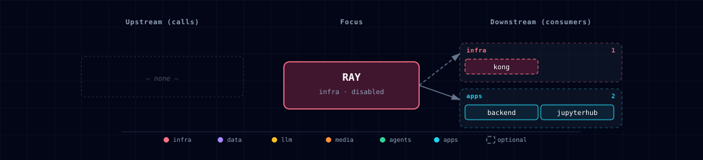

# 5.2.43. Ray

Distributed-compute substrate for the stack. Ray runs as a head + worker cluster. The Backend reaches it through the dashboard REST API. Ray Client (`ray.init("ray://…")`) works only from Python 3.10 with ray 2.56.x (§6).

## 1. Overview

Ray (`rayproject/ray:2.56.0`, Apache 2.0) is a generic parallel-compute framework. This stack ships it as a 2-container family (head + workers) wired so every tier can dispatch parallel work without rolling its own asyncio.gather glue. Use Ray when you have N independent units of work to fan out across CPUs (and eventually GPUs on multi-host Linux).

Active when `RAY_SOURCE ∈ {ray-container-cpu, ray-container-gpu}`. Authenticated remote Ray endpoints (Anyscale, self-hosted clusters) are deferred to the stack-wide authenticated-remote design.

## 2. Access

| Surface | URL | Auth |
|---|---|---|
| Dashboard (UI + REST job-submission API) | `http://localhost:${RAY_DASHBOARD_PORT}` direct or `http://ray.localhost:${KONG_HTTP_PORT}` via Kong | Direct: unauthenticated and bound to loopback only. Kong: basic-auth with `DASHBOARD_USERNAME` / `DASHBOARD_PASSWORD`. |
| Client server (trusted host Python) | `ray://localhost:${RAY_CLIENT_PORT}` | Unauthenticated; bound to loopback only. Never forward or publicly expose this port. |
| GCS (internal cluster controller) | `localhost:${RAY_GCS_PORT}` host-side; `ray-head:6379` inside the network | Unauthenticated; host mapping is loopback only. |
| Backend REST jobs API | `http://localhost:${BACKEND_PORT}/api/ray/jobs/submit` etc. | Bearer token from `RAY_JOB_API_TOKEN` |

The backend reaches Ray through the dashboard's HTTP job API, never Ray Client. It sets `RAY_API_SERVER_ADDRESS` to the dashboard URL. Otherwise the Ray SDK resolves `RAY_ADDRESS=ray://…` through `ray.init`, which fails on the backend's newer Python. Every SDK call, including the client's construction-time version probe, has a transport timeout. When the dashboard does not answer the probe or `/api/cluster_status`, the routes return `503`; no job request was sent.

`POST /api/ray/jobs/submit` requires a stable `submission_id` using the
Ray-compatible `raysubmit_` prefix and letters, digits, or underscores. Reuse
that ID after an ambiguous response: Atlas returns `409` when it already exists,
and the existing `GET`/`DELETE .../{job_id}` routes reconcile or stop it.

## 3. Configuration

| Env var | Default | When | Description |
|---|---|---|---|
| `RAY_SOURCE` | `disabled` | always | One of `ray-container-cpu`, `ray-container-gpu`, `disabled`. `ray-container-gpu` only swaps in the CUDA image: the compose fragment requests no GPU device yet, so Ray reports `GPU: 0` and `num_gpus` tasks stay pending. |
| `RAY_WORKER_COUNT` | `2` | when source ∈ {cpu, gpu} | Number of `ray-worker` containers. Use `0` for head-only single-node mode. The wizard and `--ray-worker-count` accept 0-64. |
| `RAY_DASHBOARD_PORT`, `RAY_GCS_PORT`, `RAY_CLIENT_PORT` | auto-assigned | always | Topology-allocated in the infra block and published only on `127.0.0.1`. |
| `RAY_JOB_API_TOKEN` | auto-generated | always | Required as `Authorization: Bearer <token>` on every Backend `/api/ray` route. Stored in `.env` and injected only into Backend. |
| `RAY_DASHBOARD_URL` | empty | optional | Dashboard URL for the Backend job client. Empty derives `http://ray-head:8265` from `RAY_ADDRESS`. |
| `RAY_HEAD_MEMORY_LIMIT`, `RAY_WORKER_MEMORY_LIMIT` | `4g` | when source ∈ {cpu, gpu} | Memory limit per head or worker container. The `/dev/shm` object store counts against this limit. |
| `RAY_HEAD_CPU_LIMIT`, `RAY_WORKER_CPU_LIMIT` | `2.0` | when source ∈ {cpu, gpu} | CPU limit per head or worker container. |
| `RAY_IMAGE`, `RAY_GPU_IMAGE` | `rayproject/ray:2.56.0`, `rayproject/ray:2.56.0-gpu` | always | Image pins. For `ray-container-gpu`, `_generate_ray_config()` writes the `RAY_GPU_IMAGE` value into `RAY_IMAGE`. |
| `RAY_HEAD_SCALE`, `RAY_WORKER_SCALE`, `RAY_ADDRESS` | auto-managed | always | Resolved by `_generate_ray_config()` from `RAY_SOURCE` and `RAY_WORKER_COUNT`. `RAY_ADDRESS` is `ray://ray-head:10001` for container sources and empty for `disabled`. Do not edit by hand. |

**Wizard:** after you pick a Ray container source, the wizard asks for `RAY_WORKER_COUNT` (default 2) on the same step. CLI: `--ray-worker-count`.

## 4. Architecture & wiring

**Containers in the family:**
- `ray-head` — the cluster controller. Runs `ray start --head`. Exposes ports 8265 (dashboard + REST), 6379 (GCS) and 10001 (client server). The GCS speaks the Redis protocol but is not the project's Redis cache. Healthcheck on `:8265/api/version`.
- `ray-worker` — one or more replicas. Runs `ray start --address=ray-head:6379 --block`. No host ports.

**No `/tmp/ray` volume.** Ray keeps per-node session state under `/tmp/ray`. The image runs as the non-root `ray` user, and Docker would create a named volume there as `root:root`, which stops Ray from starting. Session state therefore lives in the container's writable layer and is lost when the container is replaced. `shm_size` gives the object store enough `/dev/shm` to avoid spilling.

**Shared memory.** Both containers set `shm_size: 8gb`. Docker's default 64MB crashes Ray at once, because the Plasma object store uses shared memory. If port 8265 refuses connections within 60 seconds of start, check the shm size.

**No runtime dependencies.** Ray includes its own GCS (Redis-protocol cluster controller) and Plasma object store. The `supabase` and `redis` entries in `depends_on.required` only fix display order, so Kong wins the alphabetical tie in the infra port-slot block. Ray does not call them.

**Consumers in the stack:**
- **Backend** — exposes `POST /api/ray/jobs/submit`, `GET`/`DELETE /api/ray/jobs/{job_id}`, and `GET /api/ray/cluster/status`. It adapts via `RAY_ADDRESS` set by `_generate_ray_config()` and requires `RAY_JOB_API_TOKEN` as a bearer token on every route.
- **JupyterHub** — receives `RAY_ADDRESS`, and `services/jupyterhub/build/notebooks/07_ray_cluster.ipynb` calls `ray.init()`. That call fails because the kernel runs Python 3.13 and the Ray image runs Python 3.10 (open issue #1374). Until that issue is resolved, submit notebook work through the Ray Jobs REST API at `http://ray-head:8265/api/jobs/`. §6 has an example.
- **Hermes** — no Ray submission integration is wired today. A future integration must receive `RAY_JOB_API_TOKEN` through a scoped client contract before it can call Backend's protected Ray routes.

## 5. Dependencies & Integrations

### 5.1. Current — Upstream (this service calls)

_No upstream calls._

### 5.2. Current — Downstream (services that call this)

| Service | Category | Status |
|---|---|---|
| kong | infra | optional: RAY_SOURCE=ray-container-cpu or ray-container-gpu |
| backend | apps | current |
| jupyterhub | apps | current |

### 5.3. Architecture diagram



[Open the full-size diagram](./architecture.html) for a full-screen view.

### 5.4. Future — Missing pair integrations

_No high-confidence opportunities identified._

### 5.5. Future — Candidate new services

_No high-confidence opportunities identified._

### 5.6. Future — Unused features in this service

_No high-confidence opportunities identified._

## 6. Troubleshooting

- **Head container exits immediately with "Bus error" or "/dev/shm too small"** — Docker's default shared-memory size (64MB) is too small. Compose sets `shm_size: 8gb`, but some installs (rootless Podman, older Docker) ignore it. Verify with `docker inspect ${PROJECT_NAME}-ray-head | grep ShmSize`.
- **Workers stuck "starting"** — they `depends_on: ray-head: service_healthy`. The head's `start_period: 60s` allows up to 60s before health checks count. If still stuck after 2 minutes, check the head's healthcheck output: `docker exec ${PROJECT_NAME}-ray-head wget -qO- http://localhost:8265/api/version` (the image ships wget, not curl).
- **`ray.init("ray://…")` fails with a version mismatch** — Ray Client needs the same `ray` version and the same Python minor version on both sides. `rayproject/ray:2.56.0` runs Python 3.10. From the host, use Python 3.10 with `ray>=2.56.0,<2.57`. The JupyterHub kernel runs Python 3.13, so `07_ray_cluster.ipynb` fails at `ray.init()` (open issue #1374). From a notebook, use the Ray Jobs REST API instead:

  ```python
  import time, requests
  api = "http://ray-head:8265/api/jobs/"
  entry = "python -c 'import ray; ray.init(); print(ray.cluster_resources())'"
  job_id = requests.post(api, json={"entrypoint": entry}).json()["submission_id"]
  while requests.get(api + job_id).json()["status"] not in ("SUCCEEDED", "FAILED", "STOPPED"):
      time.sleep(2)
  print(requests.get(api + job_id + "/logs").json()["logs"])
  ```
- **Dashboard unreachable through Kong** — Kong's `ray.localhost` route requires `--setup-hosts` to have run AND basic-auth credentials match `DASHBOARD_USERNAME` / `DASHBOARD_PASSWORD` in `.env`. The unauthenticated direct port works only from the Docker host because Compose binds it to `127.0.0.1`.

## 7. Capabilities & limitations

Support tier: **experimental** — Capability contract declared; no cited cold-start, workflow, or upgrade qualification run yet (evidence at `v0.1.0`).

| Capability | Status | Verification | Notes |
|---|---|---|---|
| Containerized CPU distributed compute | supported | tested | Atlas configures a Ray head plus an operator-selected worker count and supplies the backend with the resulting cluster address. |
| NVIDIA GPU worker execution | partial | tested | The GPU source selects the CUDA images only. The compose fragment requests no NVIDIA device, so GPU tasks stay pending until GPU reservations are wired (#1373). |
| Remote Ray surface security | partial | tested | Kong protects the dashboard and the backend API uses bearer authentication, while native client and GCS ports remain unauthenticated loopback bindings. |
| Persistent Ray session state | not-supported | documented | The stock Ray cluster has no named volume for session state, so jobs and cluster metadata do not survive container replacement. |
