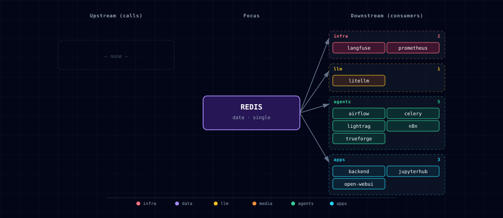

# 5.2.44. Redis

Shared cache, queue, and pub/sub broker for the stack. The manifest comment is blunt: Redis is "consumed by half the stack." It has one container, one source variant (`container`), no GPU paths, and no init container. Despite being infrastructure rather than a feature, Redis is the single most cross-cutting service in the project — n8n's queue mode, Kong's rate-limit cache, Open WebUI's WebSocket store, LightRAG's KV layer, and JupyterHub notebooks all share this one instance.

The stack convention partitions Redis by **database index**, not by service. As wired today: `/0` carries the n8n queue (`QUEUE_BULL_REDIS_DB: 0`), and Kong's rate-limit cache (no `KONG_REDIS_DATABASE` set → library default 0); `/2` is shared by Open WebUI's WebSocket store (`OPEN_WEB_UI_REDIS_DB`) and LightRAG's KV/doc-status store (`LIGHTRAG_REDIS_URI`) — different key shapes, no collision in practice, but isolate one of them if you repurpose the db; `/3` is JupyterHub's `REDIS_URL`; `/4` is Celery's broker + result backend (`CELERY_BROKER_URL` / `CELERY_RESULT_BACKEND`). Consumers that need an isolated namespace build their own connection string off `${REDIS_PASSWORD}` and `redis:6379/<db>`.

## 1. Overview

Image: `redis:7.2.14-alpine`. Persistence: AOF (`--appendonly yes`). Auth: a single shared password (`REDIS_PASSWORD`) — there are no ACL users today. The container exposes the standard `6379` port internally; the host port (default `63025`) is published only for debugging. Inside the stack, every consumer talks to `redis:6379` via the Docker DNS name on `backend-network`.

Volume: `${PROJECT_NAME}-redis-data` (AOF append log). `./stop.sh --cold` removes it.

## 2. Access

| Path | URL | Notes |
|---|---|---|
| Host (debug) | `localhost:${REDIS_PORT}` (default `63025`) | Use with `redis-cli -h 127.0.0.1 -p 63025 -a "$REDIS_PASSWORD"`. |
| Internal | `redis://:${REDIS_PASSWORD}@redis:6379/<db>` | What sibling containers use. |
| Kong | — | Redis is infrastructure; no Kong route. |

Canonical port table: [Ports and Routes](../../docs/reference/ports-routes.md).

## 3. Configuration

```bash
REDIS_SOURCE=container                                 # only value
REDIS_PORT=63025                                       # host port; container port is always 6379
REDIS_PASSWORD=redis_password                          # rotate before any deployment
REDIS_URL=redis://:${REDIS_PASSWORD}@redis:6379/0      # default; consumers override db index
```

The default `REDIS_PASSWORD` is for fresh-install convenience only — rotate it via `.env` and `docker compose up --force-recreate redis` (cascades to dependent services, which read `REDIS_PASSWORD` at startup).

Database-index convention (consumer-built URLs):

| DB | Consumer | Notes |
|---|---|---|
| 0 | n8n, kong, litellm, langfuse, backend | n8n queue (`QUEUE_BULL_REDIS_DB: 0`); Kong rate-limit cache (no `KONG_REDIS_DATABASE` set → library default 0); LiteLLM cache and Langfuse BullMQ (no db index → library default 0); backend media-operation store + readiness probe via `REDIS_URL` |
| 2 | open-webui, lightrag | WebSocket store (`OPEN_WEB_UI_REDIS_DB`) + LightRAG KV/doc-status — disjoint key shapes |
| 3 | jupyterhub | notebook `REDIS_URL` |
| 4 | celery | broker + result backend (`CELERY_BROKER_URL` / `CELERY_RESULT_BACKEND`) |

## 4. Architecture & wiring

**Startup ordering.** The manifest's `depends_on.required: supabase` is **ordering / slot-pinning only** — the topology port allocator derives slot positions from `depends_on`, so removing it would renumber later services' ports. Redis has no functional Postgres dependency, and `compose.yml` no longer gates redis startup on supabase-db-init (PR #11 dropped that); the only compose-level `depends_on` is `redis-exporter` waiting on `redis` being healthy.

**Consumers.** From the data-flow graph (§6.2): `litellm` (cache + budget tracking), `lightrag` (KV/doc-status), `open-webui` (WebSocket store), `n8n` (BullMQ queue, `QUEUE_BULL_REDIS_*`), `jupyterhub` (notebook `REDIS_URL` on db `/3`), `airflow`, and `prometheus` (redis-exporter scrape) reach Redis at runtime. Kong consumes it via compose env wiring (`KONG_REDIS_HOST`) — modeled as compose-level wiring only. The backend reads `REDIS_URL` for its media-operation store (`media_operation_store.py`) and readiness probe (`readiness.py`), on db 0; Local Deep Researcher is unwired (future pair, §6.4).

**Failure mode.** Every consumer treats Redis as fatal: a Redis outage kills n8n queue execution, drops Open WebUI live updates, breaks LiteLLM caching, and stalls LightRAG's KV layer. There is no fallback in the stack.

**Eviction policy.** `REDIS_MAXMEMORY_POLICY` defaults to `volatile-lru`, which evicts only TTL-bearing keys after `REDIS_MAXMEMORY` sets a nonzero cap. With the default `REDIS_MAXMEMORY=0`, Redis remains unbounded and no eviction occurs. Queue and session keys without TTL are not eviction candidates.

**Observability sidecar (`redis-exporter`).** The Redis family also ships a `redis-exporter` container (`oliver006/redis_exporter:v1.86.0`) on host port `${REDIS_EXPORTER_PORT}` and in-container `9121`. It scales **1↔0 with `PROMETHEUS_SOURCE`** — the bootstrapper's `_generate_prometheus_config()` hook writes `REDIS_EXPORTER_SCALE` from this single switch, so the sidecar is dormant when Prometheus is off and self-starts when Prom is enabled. Prometheus scrapes it at `redis-exporter:9121/metrics`; the `Postgres + Redis` Grafana dashboard renders memory usage, ops/sec, and hit ratio.

## 5. LightRAG KV store

When `LIGHTRAG_SOURCE != disabled` AND `REDIS_SOURCE != disabled`, LightRAG uses Redis `db=2` as its KV and doc-status backend (via `RedisKVStorage`). Use `redis-cli -a "$REDIS_PASSWORD" -n 2 --scan --pattern '*'` to inspect.

## 6. Dependencies & Integrations

### 6.1. Current — Upstream (this service calls)

_No upstream calls._

### 6.2. Current — Downstream (services that call this)

| Service | Category |
|---|---|
| langfuse | infra |
| prometheus | infra |
| litellm | llm |
| airflow | agents |
| celery | agents |
| lightrag | agents |
| n8n | agents |
| backend | apps |
| jupyterhub | apps |
| open-webui | apps |

### 6.3. Architecture diagram



[Open the full-size diagram](./architecture.html) for a full-screen view.

### 6.4. Future — Missing pair integrations

- **redis ↔ comfyui** — *Why:* ComfyUI's compose declares `depends_on: redis` (startup ordering only) but the container receives no `REDIS_URL`. A real link would let n8n/backend enqueue generation jobs to a Redis list/stream and read `progress`/`executed` events back via a sidecar publisher, replacing the per-caller websocket pattern. *Mechanism:* ComfyUI custom node + `redis-py` writing `XADD comfyui:events` on progress; producers `BLPOP comfyui:jobs` from a tiny worker that calls `/prompt`. *Effort:* medium. *Confidence:* medium.
- **redis ↔ local-deep-researcher** — *Why:* LDR's compose has no `REDIS_URL` today (db `/3` is currently JupyterHub's and `/4` is Celery's; an LDR checkpointer would take a fresh index, e.g. `/5`). LangGraph's Redis checkpointer would let long-running research runs survive container restarts and let backend stream node-by-node progress. *Mechanism:* `redis://:${REDIS_PASSWORD}@redis:6379/5` consumed by `langgraph.checkpoint.redis.RedisSaver`; `PUBSUB` channel `ldr:run:<id>` for progress. *Effort:* small. *Confidence:* high.
- **redis ↔ hermes** — *Why:* Hermes has no shared state between requests; conversation memory, tool-call rate-limits, and per-user budget counters live in process. *Mechanism:* Hermes custom skill reads/writes `hermes:session:<id>` hashes and `hermes:ratelimit:<user>` counters via `redis-py`. *Effort:* small. *Confidence:* medium.
- **redis ↔ doc-processor** — *Why:* document parsing is expensive and idempotent on file SHA. A Redis cache keyed on `sha256(file)` lets repeat ingests (common during n8n flow iteration) short-circuit; a Redis stream broadcasts `doc:parsed` events to backend + weaviate ingest. *Mechanism:* cache: `SETEX doc:parsed:<sha> 86400 <json>`; event bus: `XADD doc:events`. *Effort:* small. *Confidence:* medium.
- **redis ↔ weaviate** — *Why:* embedding generation dominates ingest latency; a content-hash → vector cache cuts repeat-ingest cost dramatically and de-duplicates concurrent embeddings across n8n/backend. *Mechanism:* `GET emb:<model>:<sha>` before calling Weaviate's vectorizer; `SETEX` on miss. Lives behind a tiny helper in backend. *Effort:* medium. *Confidence:* medium.

### 6.5. Future — Candidate new services

- **RedisInsight** ([details](../../docs/research/candidates/redisinsight.md)) — *Headline:* official Redis GUI for browsing keys, profiling commands, and inspecting streams across all stack consumers. *Wires into:* backend, n8n, kong, litellm, open-webui, jupyterhub.
- **Redis Stack (`redis-stack-server`)** ([details](../../docs/research/candidates/redis-stack.md)) — *Headline:* drop-in Redis image bundling RediSearch, RedisJSON, RedisBloom, and RedisTimeSeries — unlocks vector + JSON queries without a second datastore. *Wires into:* backend, weaviate (overlap), n8n, hermes.

### 6.6. Future — Unused features in this service

- **Redis Streams (`XADD`/`XREAD`/consumer groups)** — *Why pursue:* replace ad-hoc HTTP fan-out between backend, n8n, ComfyUI, and doc-processor with a single durable event bus already present in the image. *Effort:* medium.
- **Pub/Sub channels** — *Why pursue:* live progress streaming for ComfyUI and LDR to the Open WebUI chat surface without polling. *Effort:* small.
- **Redis ACL users** — *Why pursue:* replace the single shared `REDIS_PASSWORD` with per-service users so a compromised n8n container cannot read the Kong rate-limit cache. *Effort:* small.
- **Workload-specific memory classes** — *Why pursue:* the shared instance defaults to `volatile-lru`, but dedicated cache and durable-queue instances could use different caps and policies without competing for one memory budget. *Effort:* medium.
- **RDB snapshots alongside AOF** — *Why pursue:* faster cold-start restore; current `--appendonly yes` is durable but slow to replay on large datasets. *Effort:* small.

## 7. Troubleshooting

**`NOAUTH Authentication required`.** Consumer's `REDIS_URL` is missing the password segment. Inspect with `docker exec <project>-backend env | grep REDIS_URL`. Expected shape: `redis://:${REDIS_PASSWORD}@redis:6379/<db>` — note the leading colon before the password (no username).

**n8n `EXECUTIONS_MODE=queue` workflows hang.** Check `docker logs <project>-redis` for connection errors from n8n. n8n's queue mode uses Redis db `/0` (`QUEUE_BULL_REDIS_DB: 0`); if the password rotated without restarting n8n, its workers retry forever.

**Memory pressure.** With `REDIS_MAXMEMORY=0`, Redis grows until the container's memory limit kills it. Monitor with `docker exec <project>-redis redis-cli -a "$REDIS_PASSWORD" INFO memory`. Set `REDIS_MAXMEMORY` to a deliberate cap; keep `volatile-lru` when only TTL-bearing cache keys may be evicted, or choose another policy only after reviewing queue and session durability.

**Data loss after `./stop.sh --cold`.** Expected — `--cold` deletes the `${PROJECT_NAME}-redis-data` volume, taking the AOF log with it. Use `./stop.sh` (no `--cold`) to preserve queue/session state across restarts.

```bash
docker compose ps redis
docker compose logs -f redis
docker exec <project>-redis redis-cli -a "$REDIS_PASSWORD" INFO server
```

For general startup and routing issues, see [Troubleshooting](../../docs/quick-start/troubleshooting.md).

## 8. Operations

**Inspect keys by namespace.** Consumers use unstructured key names today; useful prefixes to scan are `bull:` (n8n queue), `litellm:` (caching/budget), `kong:` (rate-limit counters), and LightRAG's `{workspace}_{namespace}:` keys on db `/2`. Scan with `redis-cli --scan --pattern 'bull:*'` — never `KEYS` on a busy instance.

**Watch traffic live.** `redis-cli MONITOR` dumps every command server-side. Useful when verifying a new consumer is connecting to the right db index. Verbose — turn off as soon as you're done.

**Force AOF rewrite.** `BGREWRITEAOF`. After heavy churn the AOF grows non-linearly; a rewrite compacts it. Safe to run any time.

**Cold-start vs warm-start.** `./stop.sh` (no flags) preserves the AOF and Redis replays it on next boot — n8n queue + sessions survive. `./stop.sh --cold` deletes the volume entirely.

**Capacity rule of thumb.** `REDIS_MAXMEMORY` defaults to `0` (unlimited), so with AOF and no cap the container still OOMs at the Docker memory limit — which loses in-flight queue state rather than shedding anything. Set it (e.g. `REDIS_MAXMEMORY=512mb`) to ~75% of the container's memory budget and Redis will evict instead.

**What gets evicted, and why it is safe.** `REDIS_MAXMEMORY_POLICY` defaults to `volatile-lru`, which evicts **only keys carrying a TTL**. On this stack that means LiteLLM's response cache (`litellm.cache:*`, TTL from `LITELLM_CACHE_TTL`). The things that must not vanish — n8n's BullMQ queue, Kong's rate-limit counters, Langfuse's queue, the backend's media store — are written without a TTL and are therefore never eviction candidates. The previous `noeviction` did the opposite: a full instance rejected *writes*, so an oversized cache would take the queue down with it. If nothing volatile remains, `volatile-lru` returns the same OOM error `noeviction` would, so the worst case is unchanged. The stack default is whatever Docker Desktop allocates (~2 GB). For production deployments, set `maxmemory` explicitly to ~75% of the container's memory budget and pick an eviction policy per workload.

## 9. Tuning

Stack-relevant knobs that aren't currently exposed via `.env`:

| Knob | Default | Recommended for stack |
|---|---|---|
| `maxmemory` | unbounded | 75% of container memory budget |
| `maxmemory-policy` | `volatile-lru` | Keep for the mixed stock workload; use a dedicated cache instance before selecting `allkeys-lru`. |
| `appendfsync` | `everysec` | leave as-is; `always` is overkill, `no` loses queue state on crash |
| `save` (RDB) | disabled | enable for faster cold-start replay |

Set `REDIS_MAXMEMORY` and `REDIS_MAXMEMORY_POLICY` in `.env`. The remaining low-level knobs require a targeted Compose change.

## 10. Security

- **Shared password.** Every consumer uses the same `REDIS_PASSWORD`. A compromised n8n container can read Kong's rate-limit cache, LiteLLM's budget counters, and backend sessions. Redis 7 ACLs would fix this — see Future — Unused features.
- **No TLS in-cluster.** Traffic on `backend-network` is unencrypted. Acceptable for the single-host stack; not for multi-host deployments. Wrap with `stunnel` or upgrade to a Redis variant with native TLS if you cross trust boundaries.
- **Host port exposed.** `REDIS_PORT` (default 63025) is published on the host. With the default password this is a soft target if anyone has LAN access. Either rotate `REDIS_PASSWORD` aggressively or remove the host-port publish from `services/redis/compose.yml` and use `docker exec` for debugging.
- **AOF includes commands, not just data.** `appendonly.aof` is a literal command log; anyone with read access to the volume can reconstruct every key. Treat the volume as confidential.

## 11. Further reading

- [Redis commands reference](https://redis.io/commands/) — the canonical command index, organized by data type.
- [Redis persistence](https://redis.io/docs/latest/operate/oss_and_stack/management/persistence/) — AOF vs RDB trade-offs, useful when tuning the stack's defaults.
- [BullMQ on Redis](https://docs.bullmq.io/) — n8n's queue layer; explains the `bull:*` key shape.
- [LiteLLM caching](https://docs.litellm.ai/docs/caching/all_caches) — Redis cache integration LiteLLM uses (already enabled in this stack).

## 12. Capabilities & limitations

| Capability | Status | Verification | Notes |
|---|---|---|---|
| Authenticated cache and queue substrate | supported | tested | Atlas runs password-protected Redis as the shared cache, queue, coordination, and transient-state substrate for multiple service families. |
| AOF persistence and bounded eviction | partial | tested | Append-only persistence and volatile-LRU are configured, but the default zero maxmemory is unbounded and only expiring keys become eviction candidates after a cap is set. |
| Per-service ACL and transport isolation | not-supported | documented | Consumers share one password and logical database convention over plaintext Redis; Atlas provisions neither per-service ACL users nor TLS. |
