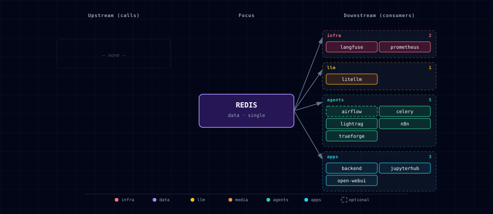

# 5.2.44. Redis

Shared cache, queue and pub/sub broker. Redis is the most cross-cutting service in the stack: one instance serves every consumer in §6.2. It has one container, one source variant (`container`), no GPU path and no init container.

Consumers are separated by **database index**, not by service. The §3 table lists which consumer uses which index.

## 1. Overview

Image: `redis:7.2.14-alpine`. Persistence: AOF (`--appendonly yes`). Auth: one shared password (`REDIS_PASSWORD`), with no ACL users. Every consumer connects to `redis:6379` by Docker DNS on `backend-network`. The host port (default `63025`) is for debugging.

Volume: `${PROJECT_NAME}-redis-data` (AOF append log). `./stop.sh --cold` removes it.

## 2. Access

| Path | URL | Notes |
|---|---|---|
| Host (debug) | `localhost:${REDIS_PORT}` (default `63025`) | Use with `redis-cli -h 127.0.0.1 -p 63025 -a "$REDIS_PASSWORD"`. |
| Internal | `redis://:${REDIS_PASSWORD}@redis:6379/<db>` | What sibling containers use. |
| Kong | — | Redis is infrastructure; no Kong route. |

Canonical port table: [Ports and Routes](../../docs/reference/ports-routes.md).

## 3. Configuration

```bash
REDIS_SOURCE=container                                 # only value
REDIS_PORT=63025                                       # host port; container port is always 6379
REDIS_PASSWORD=redis_password                          # placeholder; ./start.sh replaces it with a random value on first run
REDIS_URL=redis://:${REDIS_PASSWORD}@redis:6379/0      # default; consumers override db index
REDIS_MAXMEMORY=0                                      # no cap; see §9
REDIS_MAXMEMORY_POLICY=volatile-lru
```

To change `REDIS_PASSWORD`, edit `.env` and rerun `./start.sh`. Redis and every consumer read the password only when their containers start, so all of them must be recreated.

Database-index convention (consumer-built URLs):

| DB | Consumer | Notes |
|---|---|---|
| 0 | n8n, litellm, langfuse, backend | n8n queue (`QUEUE_BULL_REDIS_DB: 0`). LiteLLM cache and Langfuse BullMQ set no index, so they use 0. Backend state through `REDIS_URL` (§4). |
| 2 | open-webui, lightrag | WebSocket store (`OPEN_WEB_UI_REDIS_DB`) and LightRAG KV/doc-status. The key shapes do not overlap; isolate one of them if you reuse db 2. |
| 3 | jupyterhub | notebook `REDIS_URL` |
| 4 | celery | broker + result backend (`CELERY_BROKER_URL` / `CELERY_RESULT_BACKEND`) |
| 5 | trueforge | `REDIS_URL` |

A consumer that needs its own namespace builds a URL from `${REDIS_PASSWORD}` and `redis:6379/<db>`.

## 4. Architecture & wiring

**Startup ordering.** The manifest lists `depends_on.required: supabase` only to pin topology port slots; removing it would renumber later services' ports. Redis has no functional Postgres dependency. The only compose-level `depends_on` in this fragment is `redis-exporter` waiting for a healthy `redis`.

**Consumers.** §6.2 lists every service that reaches Redis at runtime. Notes:

- The Backend and Celery use db 0 through `REDIS_URL` for hosted-media operations, RAG ingestion state and memory consolidation leases. The Backend readiness probe checks it too.
- Kong does not use Redis. Its only rate limiter runs with `policy: local`, and its `depends_on: redis` is start ordering only.
- Airflow receives `REDIS_PASSWORD` for DAGs that use `RedisHook`.
- Local Deep Researcher is not wired (§6.4).

**Failure mode.** No consumer has a fallback. A Redis outage stops n8n queue execution and Open WebUI live updates. It also breaks LiteLLM caching and stalls LightRAG's KV layer.

**Eviction policy.** See §9.

**Observability sidecar (`redis-exporter`).** The family also ships `redis-exporter` (`oliver006/redis_exporter:v1.86.0`) on host port `${REDIS_EXPORTER_PORT}` and container port `9121`.

- It scales 1↔0 with `PROMETHEUS_SOURCE`: the bootstrapper's `_generate_prometheus_config()` hook writes `REDIS_EXPORTER_SCALE`.
- Prometheus scrapes `redis-exporter:9121/metrics`. The `Postgres + Redis` Grafana dashboard shows memory usage, ops/sec and hit ratio.
- Its `/scrape?target=` endpoint is disabled (`REDIS_EXPORTER_DISABLE_SCRAPE_ENDPOINT=true`), because it would dial any target with `REDIS_PASSWORD`.

## 5. LightRAG KV store

When `LIGHTRAG_SOURCE != disabled` AND `REDIS_SOURCE != disabled`, LightRAG uses Redis `db=2` as its KV and doc-status backend (via `RedisKVStorage`). Use `redis-cli -a "$REDIS_PASSWORD" -n 2 --scan --pattern '*'` to inspect.

## 6. Dependencies & Integrations

### 6.1. Current — Upstream (this service calls)

_No upstream calls._

### 6.2. Current — Downstream (services that call this)

| Service | Category | Status |
|---|---|---|
| langfuse | infra | current |
| prometheus | infra | current |
| litellm | llm | current |
| airflow | agents | optional: an operator-authored DAG; airflow-init only seeds the Connection |
| celery | agents | current |
| lightrag | agents | current |
| n8n | agents | current |
| trueforge | agents | current |
| backend | apps | current |
| jupyterhub | apps | current |
| open-webui | apps | current |

### 6.3. Architecture diagram



[Open the full-size diagram](./architecture.html) for a full-screen view.

### 6.4. Future — Missing pair integrations

- **redis ↔ comfyui** — *Why:* ComfyUI's compose declares `depends_on: redis` (startup ordering only) but the container receives no `REDIS_URL`. A real link would let n8n or the Backend queue generation jobs in a Redis list or stream. A sidecar publisher would return `progress`/`executed` events and replace the per-caller websocket pattern. *Mechanism:* ComfyUI custom node + `redis-py` writing `XADD comfyui:events` on progress; producers `BLPOP comfyui:jobs` from a tiny worker that calls `/prompt`. *Effort:* medium. *Confidence:* medium.
- **redis ↔ local-deep-researcher** — *Why:* LDR's compose has no `REDIS_URL`. Dbs `/3`, `/4` and `/5` belong to JupyterHub, Celery and TrueForge, so an LDR checkpointer would take a new index such as `/6`. LangGraph's Redis checkpointer would let long-running research runs survive container restarts and let backend stream node-by-node progress. *Mechanism:* `redis://:${REDIS_PASSWORD}@redis:6379/6` consumed by `langgraph.checkpoint.redis.RedisSaver`; `PUBSUB` channel `ldr:run:<id>` for progress. *Effort:* small. *Confidence:* high.
- **redis ↔ hermes** — *Why:* Hermes has no shared state between requests; conversation memory, tool-call rate-limits, and per-user budget counters live in process. *Mechanism:* Hermes custom skill reads/writes `hermes:session:<id>` hashes and `hermes:ratelimit:<user>` counters via `redis-py`. *Effort:* small. *Confidence:* medium.
- **redis ↔ doc-processor** — *Why:* document parsing is expensive and idempotent on file SHA. A Redis cache keyed on `sha256(file)` lets repeat ingests (common during n8n flow iteration) short-circuit; a Redis stream broadcasts `doc:parsed` events to backend + weaviate ingest. *Mechanism:* cache: `SETEX doc:parsed:<sha> 86400 <json>`; event bus: `XADD doc:events`. *Effort:* small. *Confidence:* medium.
- **redis ↔ weaviate** — *Why:* embedding generation dominates ingest latency; a content-hash → vector cache cuts repeat-ingest cost dramatically and de-duplicates concurrent embeddings across n8n/backend. *Mechanism:* `GET emb:<model>:<sha>` before calling Weaviate's vectorizer; `SETEX` on miss. Lives behind a tiny helper in backend. *Effort:* medium. *Confidence:* medium.

### 6.5. Future — Candidate new services

- **[RedisInsight](../../docs/research/candidates/redisinsight.md)** — *Headline:* official Redis GUI for browsing keys, profiling commands, and inspecting streams across all stack consumers. *Wires into:* backend, n8n, kong, litellm, open-webui, jupyterhub.
- **[Redis Stack (`redis-stack-server`)](../../docs/research/candidates/redis-stack.md)** — *Headline:* drop-in Redis image bundling RediSearch, RedisJSON, RedisBloom, and RedisTimeSeries — unlocks vector + JSON queries without a second datastore. *Wires into:* backend, weaviate (overlap), n8n, hermes.

### 6.6. Future — Unused features in this service

- **Redis Streams (`XADD`/`XREAD`/consumer groups)** — *Why pursue:* one durable event bus, already in the image, could replace ad-hoc HTTP fan-out between backend, n8n, ComfyUI and doc-processor. *Effort:* medium.
- **Pub/Sub channels** — *Why pursue:* live progress streaming for ComfyUI and LDR to the Open WebUI chat surface without polling. *Effort:* small.
- **Redis ACL users** — *Why pursue:* replace the single shared `REDIS_PASSWORD` with per-service users so a compromised n8n container cannot read LiteLLM's budget counters. *Effort:* small.
- **Workload-specific memory classes** — *Why pursue:* separate cache and queue instances could each have their own cap and policy, not one shared budget and `volatile-lru`. *Effort:* medium.
- **RDB snapshots alongside AOF** — *Why pursue:* faster cold-start restore; current `--appendonly yes` is durable but slow to replay on large datasets. *Effort:* small.

## 7. Troubleshooting

**`NOAUTH Authentication required`.** Consumer's `REDIS_URL` is missing the password segment. Inspect with `docker exec <project>-backend env | grep REDIS_URL`. Expected shape: `redis://:${REDIS_PASSWORD}@redis:6379/<db>` — note the leading colon before the password (no username).

**n8n `EXECUTIONS_MODE=queue` workflows hang.** Check `docker logs <project>-redis` for connection errors from n8n. n8n's queue mode uses Redis db `/0` (`QUEUE_BULL_REDIS_DB: 0`). If the password changed and n8n was not recreated, its workers retry forever (§3).

**Memory pressure.** Monitor with `docker exec <project>-redis redis-cli INFO memory` (the container sets `REDISCLI_AUTH`). Set a cap as §9 describes.

**Redis crash-loops with `Bad file format reading the append only file`**. An unclean write, such as a host power loss, left bytes in the append-only file (AOF) that Redis cannot parse. Redis refuses to load it, Compose `--wait` fails, and every service that waits on it stays at `Created`.

- `./start.sh doctor` reports a failed `redis-aof` check. It names the volume and prints the checker lines with the offset where valid data ends. The check reads a copy of the volume and never changes it.
- A last command that was only cut off is not a failure. Redis drops it and starts (`aof-load-truncated` is on by default), so the check passes.
- Back up first. `--fix` truncates the file at the first bad byte and drops every write after it, so keep the backup until the stack is verified.

```bash
./stop.sh
REDIS_IMAGE=$(grep '^REDIS_IMAGE=' .env | cut -d= -f2-)
VOLUME=<project>-redis-data
docker run --rm -v "$VOLUME":/data -v "$PWD":/backup "$REDIS_IMAGE" \
  tar czf /backup/redis-aof-backup.tgz -C /data appendonlydir
docker run --rm -it -v "$VOLUME":/data -w /data/appendonlydir "$REDIS_IMAGE" \
  redis-check-aof --fix appendonly.aof.manifest   # answer y to truncate
./start.sh
```

If the doctor reports that the base snapshot is not sane, `--fix` cannot repair it. Restore an earlier backup, or remove the volume (`docker volume rm "$VOLUME"`) to start Redis empty and lose its queue, sessions and cache. To restore a backup, extract it through the same container, because the archive is root-owned on Linux:

```bash
docker run --rm -v "$VOLUME":/data -v "$PWD":/backup "$REDIS_IMAGE" \
  sh -c 'rm -rf /data/appendonlydir && tar xzf /backup/redis-aof-backup.tgz -C /data'
```

**Data loss after `./stop.sh --cold`.** Expected — `--cold` deletes the `${PROJECT_NAME}-redis-data` volume, taking the AOF log with it. Use `./stop.sh` (no `--cold`) to preserve queue/session state across restarts.

```bash
docker compose ps redis
docker compose logs -f redis
docker exec <project>-redis redis-cli INFO server
```

For general startup and routing issues, see [Troubleshooting](../../docs/quick-start/troubleshooting.md).

## 8. Operations

**Inspect keys by namespace.** Useful prefixes are `bull:` (n8n queue), `litellm.cache:` (LiteLLM response cache), and LightRAG's `{workspace}_{namespace}:` keys on db `/2`. Scan with `redis-cli --scan --pattern 'bull:*'`. Never use `KEYS` on a busy instance.

**Watch traffic live.** `redis-cli MONITOR` prints every command the server receives. Use it to check that a new consumer connects to the right db index, then stop it.

**Force AOF rewrite.** `BGREWRITEAOF` compacts the AOF after heavy churn. It is safe to run at any time.

**Cold-start vs warm-start.** `./stop.sh` (no flags) keeps the AOF, and Redis replays it on the next start, so the n8n queue and sessions survive. `./stop.sh --cold` deletes the volume.

## 9. Tuning

**Memory cap and eviction.**

- `REDIS_MAXMEMORY` defaults to `0` (no cap). Redis then grows until Docker's memory limit kills it, which loses in-flight queue state.
- Set a cap of about 75% of the container's memory budget, for example `REDIS_MAXMEMORY=512mb`.
- `REDIS_MAXMEMORY_POLICY` defaults to `volatile-lru`, which evicts only keys with a TTL. On this stack that is LiteLLM's response cache (`litellm.cache:*`, TTL from `LITELLM_CACHE_TTL`).
- The n8n and Langfuse queues and the Backend's state have no TTL, so Redis never evicts them.
- If no TTL key is left, writes fail with an OOM error.

Stack-relevant knobs (the first two are `.env` settings; the rest need a Compose change):

| Knob | Default | Recommended for stack |
|---|---|---|
| `maxmemory` | unbounded | 75% of container memory budget |
| `maxmemory-policy` | `volatile-lru` | Keep for the mixed stock workload; use a dedicated cache instance before selecting `allkeys-lru`. |
| `appendfsync` | `everysec` | leave as-is; `always` is overkill, `no` loses queue state on crash |
| `save` (RDB) | disabled | enable for faster cold-start replay |

Set `REDIS_MAXMEMORY` and `REDIS_MAXMEMORY_POLICY` in `.env`. The remaining low-level knobs require a targeted Compose change.

## 10. Security

- **Shared password.** Every consumer uses the same `REDIS_PASSWORD`. A compromised n8n container can read LiteLLM's budget counters and backend sessions. Redis 7 ACLs would fix this — see Future — Unused features.
- **No TLS in-cluster.** Traffic on `backend-network` is unencrypted. This is acceptable on one host, not across hosts. Use `stunnel` or a Redis build with native TLS if traffic crosses a trust boundary.
- **Host port.** `REDIS_PORT` (default 63025) binds to `127.0.0.1` unless you widen `HOST_BIND_IP`. Every consumer shares one password, so do not widen the bind without a firewall.
- **AOF includes commands, not just data.** `appendonly.aof` is a literal command log; anyone with read access to the volume can reconstruct every key. Treat the volume as confidential.

## 11. Further reading

- [Redis commands reference](https://redis.io/commands/) — the canonical command index, organized by data type.
- [Redis persistence](https://redis.io/docs/latest/operate/oss_and_stack/management/persistence/) — AOF vs RDB trade-offs, useful when tuning the stack's defaults.
- [BullMQ on Redis](https://docs.bullmq.io/) — n8n's queue layer; explains the `bull:*` key shape.
- [LiteLLM caching](https://docs.litellm.ai/docs/caching/all_caches) — Redis cache integration LiteLLM uses (already enabled in this stack).

## 12. Capabilities & limitations

Support tier: **experimental** — Capability contract declared; no cited cold-start, workflow, or upgrade qualification run yet (evidence at `v0.1.0`).

| Capability | Status | Verification | Notes |
|---|---|---|---|
| Authenticated cache and queue substrate | supported | tested | Atlas runs password-protected Redis as the shared cache, queue, coordination, and transient-state substrate for multiple service families. |
| AOF persistence and bounded eviction | partial | tested | Append-only persistence and volatile-LRU are configured, but the default zero maxmemory is unbounded and only expiring keys become eviction candidates after a cap is set. |
| Per-service ACL and transport isolation | not-supported | documented | Consumers share one password and logical database convention over plaintext Redis; Atlas provisions neither per-service ACL users nor TLS. |
