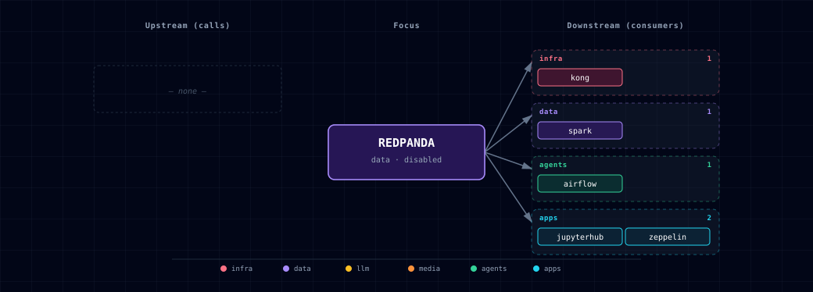

# 5.2.45. Redpanda

## 1. Overview

Redpanda adds a disabled-by-default Kafka API broker for Atlas data-engineering streaming work. It is scoped to a single-node local broker, a topic bootstrap init container, and Redpanda Console. Spark gets the matching Kafka Structured Streaming jars baked into the Atlas Spark image, so notebooks, Zeppelin, Airflow Spark jobs, and Spark Connect jobs can read and write Kafka streams without runtime `--packages` downloads.

## 2. Access

| Surface | URL / endpoint | Notes |
| --- | --- | --- |
| Kafka API, in-network | `redpanda:9092` | Use from Spark, Airflow workers, notebooks, and other containers. |
| Kafka API, host | `localhost:${REDPANDA_KAFKA_PORT}` | Direct Kafka client access. |
| Redpanda Console, direct | `http://localhost:${REDPANDA_CONSOLE_PORT}` | Direct host port, useful while developing locally. Ungated by Redpanda; use `HOST_BIND_IP=127.0.0.1:` on shared hosts. |
| Redpanda Console, Kong | `http://redpanda.localhost:${KONG_HTTP_PORT}` | Routed through Kong with dashboard basic auth. |

## 3. Configuration

`REDPANDA_SOURCE=disabled` by default. Enable the service with:

```bash
./start.sh --track data-eng --redpanda-source container
```

The init container creates the comma-separated topics in `REDPANDA_DEMO_TOPICS`; the default is `REDPANDA_DEMO_TOPICS=atlas_stream_events`. Leave it blank or remove topics from the list when you want a broker with no Atlas-created demo topics.

Downstream projects that need deterministic topics before a Spark subscription should set `REDPANDA_DEMO_TOPICS=<topic1,topic2>` in `.env`. For example, data-engineering scenario suites can use `REDPANDA_DEMO_TOPICS=events,online_retail_cdc` to pre-seed project-owned topics at bootstrap. Redpanda runs in `dev-container` mode, so producer-first flows can create topics on first write, but Atlas consumers should prefer explicit `REDPANDA_DEMO_TOPICS` pre-seeding when a reader expects the topic to already exist.

When Redpanda is enabled, Atlas injects in-network bootstrap values for downstream containers:

- `REDPANDA_BROKERS=redpanda:9092`
- `SPARK_KAFKA_BOOTSTRAP_SERVERS=redpanda:9092`

Those values are container-network endpoints for Spark, Airflow, JupyterHub, Zeppelin, and other Atlas services. Host-side clients should use `localhost:${REDPANDA_KAFKA_PORT}` instead.

Image pins:

- `REDPANDA_IMAGE=docker.redpanda.com/redpandadata/redpanda:v26.1.12`
- `REDPANDA_CONSOLE_IMAGE=docker.redpanda.com/redpandadata/console:v3.8.0`

## 4. Spark streaming contract

Atlas bakes the Spark Kafka connector into `services/spark/build/Dockerfile`:

- `org.apache.spark:spark-sql-kafka-0-10_2.13:4.1.2`
- `org.apache.spark:spark-token-provider-kafka-0-10_2.13:4.1.2`
- `org.apache.kafka:kafka-clients:3.9.2`
- `org.apache.commons:commons-pool2:2.12.1`

Example Spark read:

```python
events = (
    spark.readStream.format("kafka")
    .option("kafka.bootstrap.servers", "redpanda:9092")
    .option("subscribe", "atlas_stream_events")
    .option("startingOffsets", "earliest")
    .load()
)
```

Use durable streaming checkpoints when writing to the lakehouse:

```python
query = (
    events.writeStream
    .format("iceberg")
    .option("checkpointLocation", "s3a://checkpoints/redpanda/atlas_stream_events")
    .toTable("lakehouse.bronze.stream_events")
)
```

## 5. Dependencies & Integrations

### 5.1. Current — Upstream (this service calls)

_No upstream calls._

### 5.2. Current — Downstream (services that call this)

| Service | Category |
|---|---|
| kong | infra |
| spark | data |
| airflow | agents |
| jupyterhub | apps |
| zeppelin | apps |

### 5.3. Architecture diagram



[Open the full-size diagram](./architecture.html) for a full-screen view.

### 5.4. Future — Missing pair integrations

_No high-confidence opportunities identified._

### 5.5. Future — Candidate new services

_No high-confidence opportunities identified._

### 5.6. Future — Unused features in this service

_No high-confidence opportunities identified._

## 6. Scope

This first Atlas integration intentionally does not add Kafka Connect, Debezium, Redpanda Connect, Schema Registry, multi-broker clustering, SASL/TLS, or production retention tuning. Kafka Connect and Debezium belong in a follow-up CDC issue once the core broker and Spark connector contract is stable.

## 7. Troubleshooting

- `redpanda.localhost` returns 404 or dashboard HTML: confirm `REDPANDA_SOURCE=container` and rerun `./start.sh --setup-hosts`.
- Spark cannot find `kafka` format: rebuild/pull the Atlas Spark image so the Dockerfile's Kafka connector jars are present under `/opt/spark/jars`.
- Host Kafka clients cannot connect: use `localhost:${REDPANDA_KAFKA_PORT}`, not the Kong port. Kafka is a binary protocol and is intentionally not routed through Kong.

## 8. Capabilities & limitations

| Capability | Status | Verification | Notes |
|---|---|---|---|
| Single-node Kafka-compatible streaming | supported | tested | Atlas runs a Redpanda broker in single-node development mode and exposes its Kafka API to in-stack and host clients. |
| Topic bootstrap and broker console | supported | tested | An idempotent init container creates the declared Atlas topics and the bundled Console provides browser-based broker inspection. |
| Production broker security and clustering | not-supported | documented | The stock deployment has one broker and configures no SASL, TLS, Schema Registry, Kafka Connect, or multi-broker replication. |
| Broker and Console access control | partial | documented | The Kong Console route uses Basic authentication and the dashboard_user ACL, but the direct Console and Kafka listener are ungated; set HOST_BIND_IP=127.0.0.1: on shared hosts. |
