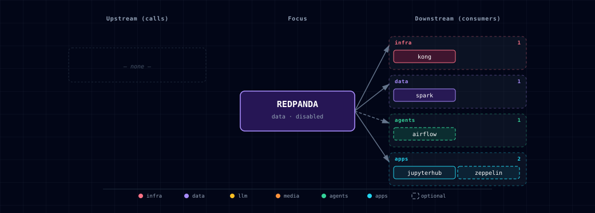

# 5.2.45. Redpanda

## 1. Overview

Redpanda is an optional, disabled-by-default Kafka API broker for data-engineering streaming. Atlas runs one local broker, a topic-bootstrap init container and Redpanda Console.

The Atlas Spark image includes the Kafka Structured Streaming jars. Spark Connect jobs (the JupyterHub notebooks) and cluster-mode Airflow submits therefore read and write Kafka without `--packages` downloads. Zeppelin and client-mode Airflow submits run their driver in images without these jars. There, add `--packages org.apache.spark:spark-sql-kafka-0-10_2.13:<spark version>`.

## 2. Access

| Surface | URL / endpoint | Notes |
| --- | --- | --- |
| Kafka API, in-network | `redpanda:9092` | Use from Spark, Airflow tasks, notebooks, and other containers. |
| Kafka API, host | `localhost:${REDPANDA_KAFKA_PORT}` | Direct Kafka client access. |
| Redpanda Console, direct | `http://localhost:${REDPANDA_CONSOLE_PORT}` | Direct host port for local development. Not gated by Redpanda. Loopback-only by default (`HOST_BIND_IP=127.0.0.1:`); keep that value on shared hosts. |
| Redpanda Console, Kong | `http://redpanda.localhost:${KONG_HTTP_PORT}` | Routed through Kong with dashboard basic auth. |

## 3. Configuration

`REDPANDA_SOURCE=disabled` by default. Enable the service with:

```bash
./start.sh --track data-eng --redpanda-source container
```

The init container creates the comma-separated topics in `REDPANDA_DEMO_TOPICS`; the default is `REDPANDA_DEMO_TOPICS=atlas_stream_events`. Leave it blank or remove topics from the list when you want a broker with no Atlas-created demo topics.

To create project topics before a Spark job subscribes, set them in `.env`, for example `REDPANDA_DEMO_TOPICS=events,online_retail_cdc`. Redpanda runs in `dev-container` mode, so producer-first flows can create a topic on first write. Readers that expect a topic to exist should pre-seed it.

The same mode turns on `--unsafe-bypass-fsync` and write caching. An acknowledged record is not yet on disk, so a host or Docker VM crash can lose the most recent writes. Treat the broker as a development stream, not a system of record, and replay from the source after a crash.

When Redpanda is enabled, Atlas sets in-network bootstrap values in `.env`:

- `REDPANDA_BROKERS=redpanda:9092` (written to `.env` only; no container receives it)
- `SPARK_KAFKA_BOOTSTRAP_SERVERS=redpanda:9092` (passed to Spark, Airflow, JupyterHub and Zeppelin)

These are container-network endpoints. Host-side clients should use `localhost:${REDPANDA_KAFKA_PORT}` instead.

Image pins:

- `REDPANDA_IMAGE=docker.redpanda.com/redpandadata/redpanda:v26.1.12`
- `REDPANDA_CONSOLE_IMAGE=docker.redpanda.com/redpandadata/console:v3.8.0`

## 4. Spark streaming contract

Atlas bakes the Spark Kafka connector into `services/spark/build/Dockerfile`:

- `org.apache.spark:spark-sql-kafka-0-10_2.13:4.1.2`
- `org.apache.spark:spark-token-provider-kafka-0-10_2.13:4.1.2`
- `org.apache.kafka:kafka-clients:3.9.2`
- `org.apache.commons:commons-pool2:2.12.1`

Example Spark read:

```python
events = (
    spark.readStream.format("kafka")
    .option("kafka.bootstrap.servers", "redpanda:9092")
    .option("subscribe", "atlas_stream_events")
    .option("startingOffsets", "earliest")
    .load()
)
```

Use durable streaming checkpoints when writing to the lakehouse:

```python
query = (
    events.writeStream
    .format("iceberg")
    .option("checkpointLocation", "s3a://checkpoints/redpanda/atlas_stream_events")
    .toTable("lakehouse.bronze.stream_events")
)
```

## 5. Dependencies & Integrations

### 5.1. Current — Upstream (this service calls)

_No upstream calls._

### 5.2. Current — Downstream (services that call this)

| Service | Category | Status |
|---|---|---|
| kong | infra | current |
| spark | data | current |
| airflow | agents | optional: an operator-authored DAG; Atlas passes only SPARK_KAFKA_BOOTSTRAP_SERVERS |
| jupyterhub | apps | current |
| zeppelin | apps | optional: Kafka jars not bundled (#1376); Atlas passes only SPARK_KAFKA_BOOTSTRAP_SERVERS |

### 5.3. Architecture diagram



[Open the full-size diagram](./architecture.html) for a full-screen view.

### 5.4. Future — Missing pair integrations

_No high-confidence opportunities identified._

### 5.5. Future — Candidate new services

_No high-confidence opportunities identified._

### 5.6. Future — Unused features in this service

_No high-confidence opportunities identified._

## 6. Scope

Atlas does not include Kafka Connect, Debezium, Redpanda Connect, Schema Registry, multi-broker clustering, SASL/TLS or production retention tuning.

## 7. Troubleshooting

- `redpanda.localhost` returns 404 or dashboard HTML: confirm `REDPANDA_SOURCE=container` and rerun `./start.sh --setup-hosts`.
- Spark cannot find the `kafka` format: run `./start.sh` so it rebuilds the local Spark image (`services/spark/build/Dockerfile` installs the Kafka jars under `/opt/spark/jars`). Zeppelin and client-mode Airflow drivers need `--packages` (see §1).
- Host Kafka clients cannot connect: use `localhost:${REDPANDA_KAFKA_PORT}`, not the Kong port. Kafka is a binary protocol and is intentionally not routed through Kong.

## 8. Capabilities & limitations

Support tier: **experimental** — Capability contract declared; no cited cold-start, workflow, or upgrade qualification run yet (evidence at `v0.1.0`).

| Capability | Status | Verification | Notes |
|---|---|---|---|
| Single-node Kafka-compatible streaming | supported | tested | Atlas runs a Redpanda broker in single-node development mode and exposes its Kafka API to in-stack and host clients. |
| Topic bootstrap and broker console | supported | tested | An idempotent init container creates the declared Atlas topics and the bundled Console provides browser-based broker inspection. |
| Production broker security and clustering | not-supported | documented | The stock deployment has one broker and configures no SASL, TLS, Schema Registry, Kafka Connect, or multi-broker replication. |
| Broker and Console access control | partial | documented | The Kong Console route uses Basic authentication and the dashboard_user ACL. The direct Console and Kafka listener are ungated; keep the default HOST_BIND_IP=127.0.0.1: on shared hosts. |
