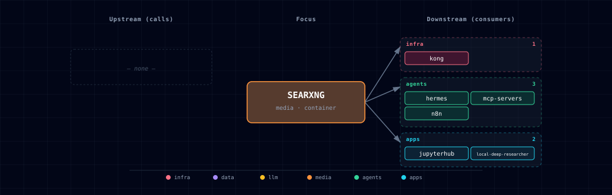

# 5.2.46. SearXNG

Privacy-preserving metasearch engine. SearXNG aggregates results from many upstream engines, such as Google, DuckDuckGo, Brave, Wikipedia and arXiv. The pinned image defines over 300 engines, with about 86 on by default. It keeps no logs, does not fingerprint users and sends no API keys.

The stack uses it as the default search backend for Local Deep Researcher, Hermes and n8n's manually imported `searxng-research-workflow.json`. Open WebUI's web-search toggle is not wired (§5.4).

## 1. Overview

Image: `searxng/searxng:2026.6.28-357662d86`. Container port: `8080`. Source variants: `container` or `disabled`.

`service.yml` env vars feed compose. `config/settings.yml` configures SearXNG itself (§3). `SEARXNG_SECRET` reaches SearXNG as a container env var, which overrides `server.secret_key`; nothing templates the file.

## 2. Access

| Path | URL | Notes |
|---|---|---|
| Direct | `http://localhost:${SEARXNG_PORT}` (default `63056`) | Web UI + `/search` API. |
| Kong | `http://search.localhost:${KONG_HTTP_PORT}` | Browser-friendly; needs `./start.sh --setup-hosts`. |
| Internal | `http://searxng:8080/search` | What sibling containers call (LDR, n8n, Hermes). |
| JSON API | `GET /search?q=…&format=json` | Enabled in `settings.yml`; used by every machine consumer. |

Canonical port table: [Ports and Routes](../../docs/reference/ports-routes.md).

## 3. Configuration

```bash
SEARXNG_SOURCE=container             # container | disabled
SEARXNG_PORT=63056                   # computed by topology.py
SEARXNG_SECRET=                      # auto-generated by bootstrapper; rotate by clearing + restart
```

`services/searxng/config/settings.yml` is a thin `use_default_settings` override. It sets only two things:

- `search.formats: [html, json]` enables JSON output, which LDR, n8n, Hermes and the backend parse. The image default is HTML only.
- `use_default_settings.engines.remove: [ahmia, torch]` drops the Tor-only engines. They need a Tor proxy the stack does not wire, and otherwise fail engine setup at boot.

Everything else comes from the image default: the engine list with its per-engine config, `server.limiter: false`, `server.image_proxy: false`, `valkey.url: false` and `general.enable_metrics: true`. In the pinned image, arXiv, PubMed, Semantic Scholar and Google Scholar are on; Crossref and OpenAlex are off. Image bumps therefore do not break engine config. A full forked file would drift from the pinned image and log `Cannot load engine …` or `Engine setup was not successful` errors.

To change one engine, add a minimal `engines:` entry; SearXNG merges it over that engine's default. Public-instance mode, the limiter and the default locale have no Atlas env vars. To change them, add the keys (`server.public_instance`, `server.limiter`, `search.default_lang`) to `config/settings.yml`.

**Required dependency.** `depends_on.required: [redis]` only fixes port-slot order: removing it would renumber later ports. SearXNG does not use Redis, and compose does not wait for it. To enable the limiter store, point `valkey.url` at `redis` and add a compose dependency.

## 4. Architecture & wiring

**Request flow:** caller (LDR, Hermes, n8n or browser) → `http://searxng:8080/search?q=…&format=json` → enabled engines in parallel → aggregate and de-duplicate. The reply is a JSON object whose `results` array holds `{url, title, content, engine, score, …}` entries.

**No per-engine API keys required** for the default set (for example DuckDuckGo, Google, Brave, Wikipedia, Stack Overflow, GitHub). Bing is off in the image default.

**Trusted proxies.** SearXNG's bot detection trusts `X-Forwarded-For` only from configured proxies. `config/limiter.toml` sets `botdetection.trusted_proxies` to the three RFC1918 ranges, so any Docker bridge network qualifies. Its `pass_ip` list holds loopback and the same ranges, so n8n, LDR and backend requests pass even with the limiter on.

**Consumers:** Kong, Hermes, mcp-servers (`SEARXNG_URL` in the MCP server env), n8n, JupyterHub (`SEARXNG_URL` in the notebook env) and Local Deep Researcher. Open WebUI is not a consumer because its web-search toggle is off. Setting `ENABLE_RAG_WEB_SEARCH=true` and `RAG_WEB_SEARCH_ENGINE=searxng` would add it.

**Volumes / state.** One cache volume, `searxng-data`, at `/var/cache/searxng`. `./config` is bind-mounted at `/etc/searxng`. SearXNG keeps no other state.

## 5. Dependencies & Integrations

### 5.1. Current — Upstream (this service calls)

_No upstream calls._

### 5.2. Current — Downstream (services that call this)

| Service | Category |
|---|---|
| kong | infra |
| hermes | agents |
| mcp-servers | agents |
| n8n | agents |
| jupyterhub | apps |
| local-deep-researcher | apps |

### 5.3. Architecture diagram



[Open the full-size diagram](./architecture.html) for a full-screen view.

### 5.4. Future — Missing pair integrations

- **searxng ↔ open-webui** — *Why:* Open WebUI's "Web Search" toggle supports SearXNG, but `services/open-webui/service.yml` sets none of its env vars. Chat has no live-web grounding without the side-loaded `research_tool.py` extra. *Mechanism:* add `searxng` to `runtime_adaptive.open-web-ui.adapts_to`; set `ENABLE_RAG_WEB_SEARCH=true`, `RAG_WEB_SEARCH_ENGINE=searxng`, `SEARXNG_QUERY_URL=http://searxng:8080/search?q=<query>` when `SEARXNG_SOURCE != disabled`. *Effort:* small. *Confidence:* high.
- **searxng ↔ n8n** — *Why:* the repo ships `services/n8n/init/config/searxng-research-workflow.json` that calls `http://searxng:8080/search`, but n8n's manifest does not declare searxng in `runtime_deps.optional`. If the user disables SearXNG, the workflow imports fine and silently 404s on first run. *Mechanism:* add `searxng` to `services/n8n/service.yml` `runtime_deps.n8n.optional`; emit an info_message; optionally add the `n8n-nodes-langchain.toolSearXng` sub-node. *Effort:* small. *Confidence:* high.
- **searxng ↔ weaviate** — *Why:* SearXNG results are ephemeral — every query re-hits external engines. Caching top-N hits in a Weaviate class lets backend / Hermes do hybrid retrieval over "what we've already searched" without re-burning engine quota or tripping CAPTCHAs. *Mechanism:* small fetcher calls `GET http://searxng:8080/search?format=json`, then POSTs each hit to `http://weaviate:8080/v1/objects` in a `WebSearchResult` class. *Effort:* medium. *Confidence:* medium.
- **searxng ↔ comfyui** — *Why:* SearXNG's image category returns direct image URLs. ComfyUI workflows wanting a reference image for img2img currently require users to paste URLs by hand; an n8n bridge closes that loop. *Mechanism:* n8n HTTP Request → `searxng:8080/search?q=<q>&categories=images&format=json` → pipe top URL into ComfyUI's `LoadImage` node via `/prompt`. *Effort:* medium. *Confidence:* medium.

### 5.5. Future — Candidate new services

- **Perplexica** ([details](https://github.com/thekaveh/atlas/blob/main/docs/research/candidates/perplexica.md)) — *Headline:* self-hosted Perplexity-style AI answering engine that consumes SearXNG + an OpenAI-compatible LLM (LiteLLM). *Wires into:* searxng, litellm, ollama, kong.
- **Browserless** ([details](https://github.com/thekaveh/atlas/blob/main/docs/research/candidates/browserless.md)) — *Headline:* headless-Chrome service that renders the JS-heavy URLs SearXNG returns so doc-processor/weaviate get the actual page text. *Wires into:* n8n, doc-processor, backend.

### 5.6. Future — Unused features in this service

- **`open_metrics` Prometheus endpoint** — *Why pursue:* `/metrics` stays off because the inherited `general.open_metrics` is empty. It would give engine-latency and error-rate stats to a Prometheus scraper. *Effort:* small.
- **`server.image_proxy: true`** — *Why pursue:* currently off. Turning it on lets ComfyUI and Open WebUI fetch image results without third-party-host 403s, at the cost of RAM. *Effort:* small.
- **Crossref and OpenAlex scholarly engines** — *Why pursue:* they are off in the image default. Enabling them adds to the default arXiv, PubMed and Semantic Scholar search for LDR and Hermes. *Effort:* small.
- **`limiter: true` with Redis/Valkey bot detection** — *Why pursue:* the stack ships a Redis the limiter could use. It is not wired: `valkey.url: false`, and no compose dependency. Enabling it means pointing `valkey.url` at `redis://:${REDIS_PASSWORD}@redis:6379/<unused db>` and adding the compose dependency in one change. *Effort:* small.
- **`engines=` query parameter** — *Why pursue:* callers send `/search` with no engine pinning, so a slow or failing engine drags p99. Pass `engines=duckduckgo,brave` from callers. *Effort:* small.

## 6. Troubleshooting

**`/search?format=json` returns HTML.** `json` was removed from `search.formats` in `settings.yml` (the shipped file has `[html, json]`). Restore it and restart SearXNG.

**`429 Too Many Requests` from a single upstream engine.** Engine-side rate-limit, not SearXNG's. SearXNG drops that engine for the query, lists it in `unresponsive_engines`, and suspends it for a while; results shrink. Either wait or disable the offending engine in `settings.yml`.

**Image results 403 on click.** The third-party host blocks hotlinking. Set `server.image_proxy: true` in `settings.yml` so SearXNG proxies the image.

**Open WebUI's web-search toggle does nothing.** Expected: the wiring is a future integration (§5.4). Use the `research_tool.py` extra instead.

**LDR / Hermes get empty results.** The reply is still 200. Read its `unresponsive_engines` list: it names each engine that failed and why (for example `HTTP connection error` or a rate limit). `engines=` also queries engines that are off by default, such as Crossref. If no named engine exists (a typo, or a removed engine such as `ahmia`), SearXNG queries its default general engines instead.

```bash
docker compose ps searxng
docker compose logs -f searxng
SEARXNG_PORT="$(sed -n 's/^SEARXNG_PORT=//p' .env)"   # run from the repository root
curl -s "http://localhost:${SEARXNG_PORT}/search?q=test&format=json" | jq '.results[0]'
```

For general startup and routing issues, see [Troubleshooting](../../docs/quick-start/troubleshooting.md).

## 7. Operations

**Add or remove an engine.** Drop an engine with `use_default_settings.engines.remove` (or `keep_only`). To override an engine's options, add an `engines:` entry that names it. Then restart SearXNG. An engine entry supports `disabled: true/false`, `timeout:`, `categories:` and engine-specific options (for example `language:` for Wikipedia).

**Inspect the live engine selection.** `GET /preferences` returns the current per-engine state. Useful when a result set looks too narrow.

**Rotate the secret.** Delete `SEARXNG_SECRET` from `.env` and re-run `./start.sh`. The bootstrapper writes a new value, and SearXNG reads it on restart. Saved user preferences (cookies signed with the old secret) become invalid.

**Public-instance mode.** SearXNG's `server.public_instance: true` turns on extra anti-abuse defaults (engine throttling, captcha hints) for internet-facing instances. Set it in `config/settings.yml`. Leave it off for stack-internal use.

## 8. Performance notes

SearXNG queries the selected engines in parallel.

- **Fewer engines, lower latency.** Latency follows the slowest selected engine. Machine callers should pin two or three fast engines with `engines=` (for example `engines=duckduckgo,brave`).
- **Image search is slower than text** because image aggregation includes byte-fetch checks. With `image_proxy: false`, a fast response can still hold URLs that 403 on click.
- **Use JSON for machine callers.** Pass `format=json`; the response needs no HTML parsing.

## 9. Security & privacy

- **No request logging.** SearXNG forgets a query once the response goes out. The stack does not change that: there are no access logs and no per-user query history.
- **Engine selection sets your exposure.** Default-on engines include Google, Brave and DuckDuckGo. SearXNG hides *you* from them (no referrer, server IP), but they still see the query. If that matters, keep only engines whose privacy policy you accept, for example DuckDuckGo, Brave, or Mojeek (off by default).
- **No outbound proxy by default.** SearXNG calls each engine directly from its container. To route engine calls through Tor or another proxy, set `outgoing.proxies:` in `settings.yml`.
- **Public-instance hardening.** Before you expose SearXNG to the internet, set `server.public_instance: true` and `server.limiter: true` in `config/settings.yml`. Point `valkey.url` at the stack Redis first. The `search.localhost` Kong route and the host port already exist and have no authentication. Without the limiter, the instance is an open relay for engine abuse.

## 10. Further reading

- [SearXNG documentation](https://docs.searxng.org/) — admin + dev reference; covers `settings.yml`, engine configuration, and the limiter plugin.
- [SearXNG search API](https://docs.searxng.org/dev/search_api.html) — exact request/response shape for `/search`.
- [Engine settings reference](https://docs.searxng.org/admin/settings/settings_engines.html) — every engine's tunable knobs, useful when enabling scholarly engines.
- [Limiter](https://docs.searxng.org/admin/searx.limiter.html) — explains the Valkey-backed bot protection (not wired in this stack).

## 11. Capabilities & limitations

Support tier: **experimental** — Capability contract declared; no cited cold-start, workflow, or upgrade qualification run yet (evidence at `v0.1.0`).

| Capability | Status | Verification | Notes |
|---|---|---|---|
| JSON privacy metasearch | supported | documented | Atlas pins SearXNG with a thin version-matched override that enables HTML and JSON results while removing Tor-only engines. |
| Machine-consumer search integration | partial | tested | Hermes, MCP servers, n8n, JupyterHub, and Local Deep Researcher receive the search endpoint, but Open WebUI's native web-search toggle remains unwired. |
| Authenticated metasearch access | not-supported | documented | The host-published UI/API and rate-limited CORS-only search.localhost route have no Atlas authentication; bind loopback, remove the publish, or add an authentication proxy before remote exposure. |
| Public-instance abuse protection | not-supported | documented | Public-instance mode, the SearXNG limiter, and its Valkey store are disabled; operators must edit live settings and restore storage wiring before internet exposure. |
