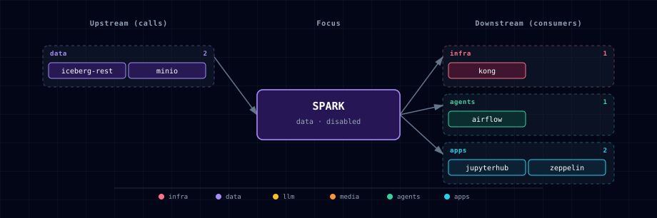

# Apache Spark (standalone cluster)

Spark runs as a 5-container family in the stack's `data` band: `spark-master`, `spark-worker` (replicas via `SPARK_WORKER_COUNT`), `spark-history`, `spark-connect` (dedicated Spark Connect gRPC sidecar), and `spark-init` (an idempotent minio/mc init that creates the spark-history bucket).

## 1. Overview

Image: locally built `${PROJECT_NAME}-spark:local` — `FROM apache/spark:4.1.2` plus hadoop-aws, AWS SDK v2, `iceberg-spark-runtime-4.1_2.13:1.11.0`, and `iceberg-aws-bundle:1.11.0` jars baked in by `services/spark/build/Dockerfile` (the upstream image ships no S3A or Iceberg support). Standalone mode — no YARN, no Kubernetes. Each role (master, worker, history, connect) is launched with an explicit `/opt/spark/bin/spark-class` or `start-connect-server.sh` command in `services/spark/compose.yml` since `apache/spark` doesn't carry the `SPARK_MODE=master|worker|history` env-driven entrypoint that Bitnami used to ship. **Spark Connect (gRPC) runs on the dedicated `spark-connect` sidecar at `sc://spark-connect:15002`** — earlier drafts attempted to host Connect inside the master JVM via `SPARK_DAEMON_JAVA_OPTS`, but `spark-class Master` doesn't honour `--conf` or `spark.plugins`, so the listener never bound. The sidecar runs `start-connect-server.sh --master spark://spark-master:7077`, which is the upstream-supported pattern.

> **Note on image choice:** earlier drafts of this service pinned `bitnami/spark:4.1.2`. Bitnami's image library moved behind the Broadcom paywall in 2025; no public 4.x tag exists today. `apache/spark` is the upstream-maintained alternative.

## 2. Access

| Surface | URL | Auth |
|---|---|---|
| Master UI (direct) | `http://localhost:${SPARK_MASTER_UI_PORT}` | None |
| Master UI (Kong) | `http://spark.localhost:${KONG_HTTP_PORT}` | None |
| History UI (direct) | `http://localhost:${SPARK_HISTORY_PORT}` | None |
| History UI (Kong) | `http://spark-history.localhost:${KONG_HTTP_PORT}` | None |
| Spark Connect | `sc://spark-connect:15002` | None — backend-network only |
| Master RPC | `spark://spark-master:7077` | None — backend-network only |
| Master REST status API | `http://spark-master:6066` | None — backend-network-only; used by `spark-submit --status` |

## 3. Configuration

```bash
SPARK_SOURCE=disabled              # container | disabled
SPARK_IMAGE=apache/spark:4.1.2
SPARK_MASTER_UI_PORT=              # auto-assigned by topology (data band)
SPARK_HISTORY_PORT=                # auto-assigned
SPARK_WORKER_COUNT=2               # 1-8 (wizard prompts via SecondaryNumberInput)
SPARK_CONNECT_CORES_MAX=1          # max standalone cores held by Spark Connect
```

## 4. Integration with the stack

- **MinIO** — `spark-history` reads `s3a://spark-history/` for event logs. The `spark-init` container creates the bucket on first start (idempotent).
- **Iceberg REST** — Spark Connect ships a default `lakehouse` catalog pointing at `http://iceberg-rest:8181`, with the warehouse at `s3a://lakehouse/`, MinIO path-style S3 settings, the scoped Iceberg MinIO service-account credentials, and `client.region=us-east-1`. The config is present even when `ICEBERG_REST_SOURCE=disabled`; Spark still starts for ML-only users, and only lakehouse SQL fails until the catalog is enabled.
- **Supabase Postgres** — Spark JDBC connector available; users add `--jars postgresql.jar` and point at `jdbc:postgresql://supabase-db:5432/${SUPABASE_DB_NAME}`. No pre-wired connection.
- **Zeppelin** — Zeppelin's Spark interpreter points at `spark://spark-master:7077` (standalone Spark RPC). Spark Connect remains the JupyterHub/client path. See `services/zeppelin/README.md`.
- **Airflow** — Airflow's `spark_default` Connection is seeded by `airflow-init` when `SPARK_SOURCE=container`. The provided `example_etl_with_llm.py` DAG uses `PythonOperator` + Spark Connect (`sc://spark-connect:15002`) for smoke; `SparkSubmitOperator` is available via the bundled `apache-airflow-providers-apache-spark` for user DAGs. Atlas enables the standalone master REST status API at `spark-master:6066` so cluster-mode `SparkSubmitOperator` can poll driver status after submission. The endpoint is backend-network-only and intentionally has no host port or Kong route. See `services/airflow/README.md`.
- **Prometheus + Grafana** — deferred. Spec §5.1 marks Spark × Prometheus + Grafana as CRITICAL-opt-in (JMX exporter sidecar + scrape job + `spark.json` dashboard), but the implementation is not yet wired. Tracking as a follow-up; for now use cAdvisor's container-level metrics in the existing Grafana dashboards.

Spark Connect is a long-lived standalone application. Atlas caps it with
`SPARK_CONNECT_CORES_MAX=1` (`spark.cores.max`) so it leaves worker capacity
for standalone workloads such as Airflow cluster-mode `SparkSubmitOperator`
drivers and Zeppelin `%spark` paragraphs. Raise the value for more Spark Connect parallelism only when `SPARK_WORKER_COUNT` and worker CPU limits leave
enough unused cores for those standalone workloads; otherwise Connect can
monopolize the cluster and leave other applications stuck in `PENDING`.

Spark Connect also publishes a Docker health signal once its backend-only
listener accepts TCP connections on `15002`. Downstream wait-for-healthy tooling
can verify it with:

```bash
docker inspect --format '{{.State.Health.Status}}' ${PROJECT_NAME}-spark-connect
```

Expected result: `starting` during JVM startup, then `healthy` after
`sc://spark-connect:15002` is accepting sessions. The probe runs inside the
container and does not publish `15002` to the host.

Minimal Spark Connect lakehouse smoke from an in-stack client:

```python
from pyspark.sql import SparkSession

spark = SparkSession.builder.remote("sc://spark-connect:15002").getOrCreate()
spark.sql("CREATE NAMESPACE IF NOT EXISTS lakehouse.bronze")
spark.sql("CREATE TABLE IF NOT EXISTS lakehouse.bronze.t (id BIGINT, note STRING) USING iceberg")
spark.sql("SHOW NAMESPACES IN lakehouse").show()
```

Advanced Iceberg smoke:

```bash
scripts/smoke-iceberg-advanced-sql.sh spark-connect
scripts/smoke-iceberg-advanced-sql.sh zeppelin
```

The advanced smoke is an opt-in validation surface for the `data-eng` and `all`
tracks. It adds No new service, no new SOURCE, and no new port; it uses the
existing Spark, Iceberg REST, MinIO, JupyterHub, and Zeppelin topology. The smoke
covers `MERGE INTO`, `VERSION AS OF`, `rollback_to_snapshot`, `CREATE BRANCH`
with `spark.wap.branch`, schema evolution, nested JSON, Structured Streaming
from `s3a://landing/` into Iceberg with checkpoints under `s3a://checkpoints/`,
and maintenance calls such as `rewrite_data_files`, `expire_snapshots`, and
`remove_orphan_files`. See
[`docs/deployment/iceberg-advanced-smoke.md`](../../docs/deployment/iceberg-advanced-smoke.md).

### 4.1 Cloud burst: Amazon EMR Serverless (optional)

Because the stack speaks the open Spark Connect protocol, a notebook or tool can
point at a **managed** Spark Connect endpoint instead of the in-stack sidecar —
e.g. [EMR Serverless interactive sessions](https://docs.aws.amazon.com/emr/latest/EMR-Serverless-UserGuide/spark-connect.html).
A reference helper ships at [`examples/emr_serverless_connect.py`](./examples/emr_serverless_connect.py):
it runs the boto3 session lifecycle (`start_session` → `get_session_endpoint` →
`SparkSession.builder.remote(...)` with the session token → `terminate_session`).

Caveats (why it's a documented helper, not a wired source):

- **Version pinning.** EMR Serverless interactive is Spark **3.5.6**; a Spark
  Connect client must match its server, so this needs a *separate* environment
  (`pip install "pyspark[connect]==3.5.6" boto3`) — it cannot share JupyterHub's
  `pyspark-client==4.1.2` kernel (which targets the in-stack 4.1.2 sidecar).
- **Ephemeral + auth.** Sessions are short-lived: the auth token expires hourly,
  `spark.stop()` only disconnects (you must `terminate` to stop billing), and IAM
  (`emr-serverless:StartSession`/`GetSessionEndpoint`/…) gates the session APIs.
- This is why EMR is a helper + docs, not a `SPARK_SOURCE` variant — its
  session/token model doesn't map to the stack's static, always-on endpoints.

## 5. Dependencies & Integrations

### 5.1 Current — Upstream (this service calls)

| Service | Category |
|---|---|
| iceberg-rest | data |
| minio | data |
| redpanda | data |

### 5.2 Current — Downstream (services that call this)

| Service | Category |
|---|---|
| kong | infra |
| airflow | agents |
| jupyterhub | apps |
| zeppelin | apps |

### 5.3 Architecture diagram



[Open the interactive HTML diagram](./architecture.html) for a full-screen view.

### 5.4 Future — Missing pair integrations

_No high-confidence opportunities identified._

### 5.5 Future — Candidate new services

_No high-confidence opportunities identified._

### 5.6 Future — Unused features in this service

_No high-confidence opportunities identified._

## 6. Troubleshooting

- **History UI shows no jobs** — first check producer config: a driver must set `spark.eventLog.enabled=true` + `spark.eventLog.dir=s3a://spark-history/`. The `spark-connect` sidecar and Zeppelin's `SPARK_SUBMIT_OPTIONS` already set these globally, so any sc://spark-connect:15002 client + Zeppelin `%spark` cell emits events automatically. User-driven `spark-submit` jobs need to pass the same `--conf` pair. Secondary check: confirm the spark-history bucket exists in MinIO (`mc ls minio/spark-history`); the `spark-init` container creates it on first start.
- **Airflow `SparkSubmitOperator` cluster-mode task succeeds in Spark but fails after submission** — confirm the standalone master REST status API is reachable from an in-stack container: `docker exec ${PROJECT_NAME}-airflow-scheduler curl -fsS http://spark-master:6066/`. Airflow's Spark provider uses this backend-network-only endpoint for post-submit driver status polling (`spark-submit --status <driverId>`); do not expose `6066` to the host.
- **Standalone jobs stay `PENDING` while Spark Connect is running** — check the master JSON (`docker exec ${PROJECT_NAME}-spark-master curl -fsS http://localhost:8080/json/`) and compare `coresused` with the active app list. If `Spark Connect server` is consuming too much of the cluster, lower `SPARK_CONNECT_CORES_MAX` or increase `SPARK_WORKER_COUNT` / worker CPU capacity before running Airflow or Zeppelin standalone jobs.
- **Workers don't appear in the master UI** — Compose's `depends_on: spark-master: condition: service_healthy` should serialize this. If a worker stays "lost", check `docker logs ${PROJECT_NAME}-spark-worker-1`.
- **OOM in a worker** — the worker container is cgroup-capped at `${SPARK_WORKER_MEMORY_LIMIT:-4g}` (compose `deploy.resources.limits.memory`), but Spark's *internal* executor heap (`SPARK_WORKER_MEMORY`) is unset, so the JVM sizes itself heuristically and can exceed the cgroup → OOM-kill. For production, set `SPARK_WORKER_MEMORY` (Spark heap) below `SPARK_WORKER_MEMORY_LIMIT` (container cap) to leave headroom for off-heap/overhead.
- **Spark Connect refused** — the gRPC server runs on the `spark-connect` sidecar (NOT spark-master); clients must use `sc://spark-connect:15002`. The port is backend-network-only — don't expose 15002 to the host.
