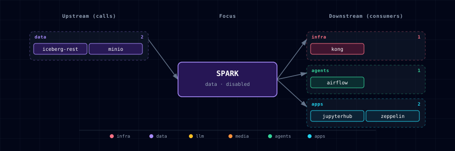

# 5.2.47. Apache Spark (standalone cluster)

Spark runs as a 5-container family in the stack's `data` band:
- `spark-master`;
- `spark-worker` (replicas via `SPARK_WORKER_COUNT`);
- `spark-history`;
- `spark-connect`, the dedicated Spark Connect gRPC sidecar;
- `spark-init`, an idempotent MinIO-client init on the maintained `pgsty/mc` image that creates the spark-history bucket.

## 1. Overview

Image: locally built `${PROJECT_NAME}-spark:local`, `FROM apache/spark:4.1.2`. `services/spark/build/Dockerfile` adds jars the upstream image lacks:
- hadoop-aws and AWS SDK v2 (S3A);
- Iceberg (`iceberg-spark-runtime-4.1_2.13:1.11.0`, `iceberg-aws-bundle:1.11.0`);
- the Spark 4.1.2 Kafka connector (`spark-sql-kafka-0-10_2.13`, `spark-token-provider-kafka-0-10_2.13`, `kafka-clients` 3.9.2, `commons-pool2`).

Standalone mode: no YARN, no Kubernetes. `apache/spark` has no env-driven `SPARK_MODE` entrypoint, so `services/spark/compose.yml` starts each role (master, worker, history, connect) with an explicit `/opt/spark/bin/spark-class` or `start-connect-server.sh` command. **Spark Connect (gRPC) runs on the dedicated `spark-connect` sidecar at `sc://spark-connect:15002`**, started with `start-connect-server.sh --master spark://spark-master:7077`.

## 2. Access

| Surface | URL | Auth |
|---|---|---|
| Master UI (direct) | `http://localhost:${SPARK_MASTER_UI_PORT}` | None; the UI's kill buttons are off (`spark.ui.killEnabled=false`), so a cross-site form cannot stop applications or drivers |
| Master UI (Kong) | `http://spark.localhost:${KONG_HTTP_PORT}` | None |
| History UI (direct) | `http://localhost:${SPARK_HISTORY_PORT}` | None |
| History UI (Kong) | `http://spark-history.localhost:${KONG_HTTP_PORT}` | None |
| Spark Connect | `sc://spark-connect:15002` | None — backend-network only |
| Master RPC | `spark://spark-master:7077` | None — backend-network only |
| Master REST status API | `http://spark-master:6066` | None — backend-network-only; used by `spark-submit --status` |

## 3. Configuration

```bash
SPARK_SOURCE=disabled              # container | disabled
SPARK_IMAGE=apache/spark:4.1.2
SPARK_MASTER_UI_PORT=              # auto-assigned by topology (data band)
SPARK_HISTORY_PORT=                # auto-assigned
SPARK_WORKER_COUNT=2               # 1-8; also --spark-workers
SPARK_CONNECT_CORES_MAX=1          # max standalone cores held by Spark Connect
SPARK_MASTER_MEMORY_LIMIT=2g       # container limits (deploy.resources.limits)
SPARK_MASTER_CPU_LIMIT=1.0
SPARK_WORKER_MEMORY_LIMIT=4g       # per worker replica
SPARK_WORKER_CPU_LIMIT=2.0
```

`SPARK_SOURCE=container` requires `MINIO_SOURCE` other than `disabled`: `spark-init` waits on `minio-init`, so the bootstrapper refuses that combination.

## 4. Integration with the stack

- **MinIO** — `spark-history` reads `s3a://spark-history/` for event logs. The `spark-init` container creates the bucket on first start (idempotent).
- **Iceberg REST** — Spark Connect ships a default `lakehouse` catalog at `http://iceberg-rest:8181`. It uses warehouse `s3a://lakehouse/`, MinIO path-style S3 settings, the scoped Iceberg MinIO service account and `client.region=us-east-1`. The config is present even when `ICEBERG_REST_SOURCE=disabled`; Spark still starts for ML-only users, and only lakehouse SQL fails until the catalog is enabled.
- **MinIO credentials** — the worker, Spark Connect and history server authenticate with the scoped `MINIO_SPARK_ACCESS_KEY` / `MINIO_SPARK_SECRET_KEY` service account, not MinIO root. Its policy covers the Spark history, lakehouse, jars, checkpoints and landing buckets. Any other bucket returns Access Denied unless the job supplies its own credentials, as the Airflow lakehouse DAG does.
- **Supabase Postgres** — Spark JDBC connector available; users add `--jars postgresql.jar` and point at `jdbc:postgresql://supabase-db:5432/${SUPABASE_DB_NAME}`. No pre-wired connection.
- **Zeppelin** — Zeppelin's Spark interpreter points at `spark://spark-master:7077` (standalone Spark RPC). Spark Connect remains the JupyterHub/client path. See `services/zeppelin/README.md`.
- **Airflow** — Airflow's `spark_default` Connection is seeded by `airflow-init` when `SPARK_SOURCE=container`. The `example_etl_with_llm.py` DAG uses `PythonOperator` and Spark Connect (`sc://spark-connect:15002`). `SparkSubmitOperator` (from the bundled `apache-airflow-providers-apache-spark`) is used by the manual `lakehouse_spark_submit_smoke` DAG and is available for user DAGs. Atlas enables the standalone master REST status API at `spark-master:6066` so cluster-mode `SparkSubmitOperator` can poll driver status after submission. The endpoint is backend-network-only and intentionally has no host port or Kong route. See `services/airflow/README.md`.
- **Redpanda** — with Redpanda enabled, every Spark role receives `SPARK_KAFKA_BOOTSTRAP_SERVERS`. Use it as `kafka.bootstrap.servers` for `format("kafka")`.
- **Prometheus + Grafana** — not wired. Spark exports no JMX metrics to Prometheus, and no Spark dashboard ships. Use the cAdvisor container metrics in Grafana.

### 4.1. Spark Connect sessions

The `spark-connect` sidecar publishes no host port, so `sc://spark-connect:15002` resolves only inside the Docker `backend-network`. JupyterHub is the in-stack notebook client; host IDEs cannot reach it unless you publish the port yourself. For a managed remote endpoint, see §4.3.

Spark Connect is a long-lived application. `SPARK_CONNECT_CORES_MAX=1` (`spark.cores.max`) leaves worker cores for standalone workloads such as Airflow cluster-mode drivers. Zeppelin is capped the same way by `ZEPPELIN_SPARK_CORES_MAX`; each start re-seeds it, so change it in `.env`. Raise either value (for example, for more Spark Connect parallelism) only when `SPARK_WORKER_COUNT` and the worker CPU limits leave free cores. Otherwise other applications stay `PENDING`.

Spark Connect reports Docker health once its backend-only listener accepts TCP connections on `15002`. Wait-for-healthy tooling can check it with:

```bash
docker inspect --format '{{.State.Health.Status}}' ${PROJECT_NAME}-spark-connect
```

Expected result: `starting` during JVM startup, then `healthy` after
`sc://spark-connect:15002` is accepting sessions. The probe runs inside the
container and does not publish `15002` to the host.

Minimal Spark Connect lakehouse smoke from an in-stack client:

```python
from pyspark.sql import SparkSession

spark = SparkSession.builder.remote("sc://spark-connect:15002").getOrCreate()
spark.sql("CREATE NAMESPACE IF NOT EXISTS lakehouse.bronze")
spark.sql("CREATE TABLE IF NOT EXISTS lakehouse.bronze.t (id BIGINT, note STRING) USING iceberg")
spark.sql("SHOW NAMESPACES IN lakehouse").show()
```

### 4.2. Advanced Iceberg smoke

```bash
scripts/smoke-iceberg-advanced-sql.sh spark-connect
scripts/smoke-iceberg-advanced-sql.sh zeppelin
```

The advanced smoke is an opt-in check for the `data-eng` and `all` tracks. It adds no new service, no new SOURCE, and no new port; it uses the existing Spark, Iceberg REST, MinIO, JupyterHub, and Zeppelin topology. It covers:
- `MERGE INTO`, `VERSION AS OF`, `rollback_to_snapshot`, and `CREATE BRANCH` with `spark.wap.branch`;
- schema evolution and nested JSON;
- Structured Streaming from `s3a://landing/` into Iceberg, with checkpoints under `s3a://checkpoints/`;
- maintenance calls such as `rewrite_data_files`, `expire_snapshots`, and `remove_orphan_files`.

See
[`docs/operations/iceberg-advanced-smoke.md`](../../docs/operations/iceberg-advanced-smoke.md).

### 4.3. Cloud burst: Amazon EMR Serverless (optional)

A notebook or tool can use a **managed** Spark Connect endpoint instead of the in-stack sidecar, for example [EMR Serverless interactive sessions](https://docs.aws.amazon.com/emr/latest/EMR-Serverless-UserGuide/spark-connect.html).
A reference helper ships at `services/spark/examples/emr_serverless_connect.py`.
It runs the boto3 session lifecycle (`start_session` → `get_session_endpoint` →
`SparkSession.builder.remote(...)` with the session token → `terminate_session`).

EMR Serverless support is this helper, not a `SPARK_SOURCE` value. Its sessions are ephemeral, billed and IAM-gated. The client needs a separate Python environment that matches EMR's Spark version. Terminate each session to stop billing. The helper script lists the exact version pins, IAM actions and session rules.

## 5. Dependencies & Integrations

### 5.1. Current — Upstream (this service calls)

| Service | Category |
|---|---|
| iceberg-rest | data |
| minio | data |
| redpanda | data |

### 5.2. Current — Downstream (services that call this)

| Service | Category |
|---|---|
| kong | infra |
| airflow | agents |
| jupyterhub | apps |
| zeppelin | apps |

### 5.3. Architecture diagram



[Open the full-size diagram](./architecture.html) for a full-screen view.

### 5.4. Future — Missing pair integrations

_No high-confidence opportunities identified._

### 5.5. Future — Candidate new services

_No high-confidence opportunities identified._

### 5.6. Future — Unused features in this service

_No high-confidence opportunities identified._

## 6. Troubleshooting

- **History UI shows no jobs** — first check producer config: a driver must set `spark.eventLog.enabled=true` + `spark.eventLog.dir=s3a://spark-history/`. The `spark-connect` sidecar and Zeppelin's `SPARK_SUBMIT_OPTIONS` already set these globally, so any sc://spark-connect:15002 client + Zeppelin `%spark` cell emits events automatically. User-driven `spark-submit` jobs need to pass the same `--conf` pair. Then confirm that `spark-init` created the bucket: `docker logs ${PROJECT_NAME}-spark-init` ends with `spark-init: spark-history bucket ready`.
- **Airflow `SparkSubmitOperator` cluster-mode task succeeds in Spark but fails after submission**. Confirm that an in-stack container reaches the standalone master REST status API: `docker exec ${PROJECT_NAME}-airflow-scheduler curl -fsS http://spark-master:6066/`. Airflow's Spark provider uses this backend-network-only endpoint for post-submit driver status polling (`spark-submit --status <driverId>`); do not expose `6066` to the host.
- **Standalone jobs stay `PENDING` while Spark Connect is running**. Check the master JSON (`docker exec ${PROJECT_NAME}-spark-master curl -fsS http://localhost:8080/json/`) and compare `coresused` with the active app list. If `Spark Connect server` is consuming too much of the cluster, lower `SPARK_CONNECT_CORES_MAX` or increase `SPARK_WORKER_COUNT` / worker CPU capacity. Do this before you run Airflow or Zeppelin standalone jobs.
- **Workers don't appear in the master UI** — Compose's `depends_on: spark-master: condition: service_healthy` should serialize this. If a worker stays "lost", check `docker logs ${PROJECT_NAME}-spark-worker-1`.
- **OOM in a worker** — Compose caps the worker container at `SPARK_WORKER_MEMORY_LIMIT` (default `4g`). `SPARK_WORKER_MEMORY` is unset, so Spark sizes worker memory without regard to that cap, and the container can be OOM-killed. Setting `SPARK_WORKER_MEMORY` or `SPARK_WORKER_CORES` in `.env` has no effect, because compose does not pass them. Add them to the `spark-worker` `environment:` block (or a compose override), below the cap, or keep executor memory requests under the cap.
- **Spark Connect refused** — the gRPC server runs on the `spark-connect` sidecar, not on `spark-master`. Clients must use `sc://spark-connect:15002` from the backend network; the port is not published to the host. Check readiness with the `docker inspect` command in §4.1: the status must be `healthy`.

## 7. Capabilities & limitations

Support tier: **experimental** — Capability contract declared; no cited cold-start, workflow, or upgrade qualification run yet (evidence at `v0.1.0`).

| Capability | Status | Verification | Notes |
|---|---|---|---|
| Standalone batch compute cluster | supported | tested | Atlas configures one Spark master, an operator-selected worker count, and backend-network submission surfaces for standalone jobs. |
| Spark Connect and history services | supported | tested | A health-checked backend-only Spark Connect sidecar serves remote sessions while the history server reads event logs from a provisioned MinIO bucket. |
| Iceberg and Kafka data paths | partial | tested | Atlas bakes and configures the Iceberg, S3A and Kafka connectors. Lakehouse and streaming operations require the optional Iceberg REST and Redpanda services. Live smoke remains opt-in. |
| Highly available Spark control plane | not-supported | documented | The stock standalone topology has one master, no recovery directory, and no YARN or Kubernetes scheduler integration. |
| Authenticated Spark web access | not-supported | tested | The direct SPARK_MASTER_UI_PORT and SPARK_HISTORY_PORT publishes are unauthenticated. The CORS-only Kong Spark routes are unauthenticated. The default HOST_BIND_IP=127.0.0.1: keeps direct ports loopback-bound. Set another value only for deliberate remote access. Before exposure beyond a trusted host, firewall or remove the direct ports, and use an authentication proxy or remove both Spark Kong routes. |
