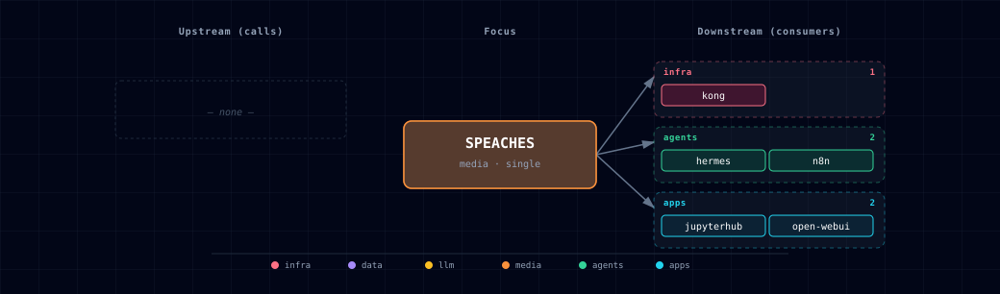

# 5.2.48. Speaches (unified TTS + STT engine)

Speaches is an STT and TTS engine. One container serves
`/v1/audio/transcriptions` (Faster-Whisper) and `/v1/audio/speech` (Kokoro
and Piper voices). Select it with `STT_PROVIDER_SOURCE=speaches-*` or
`TTS_PROVIDER_SOURCE=speaches-*`. When both select it, one container serves both.

Speaches downloads no model by default, so requests return `404` until you
download one (issue #799, open). See
[the STT Provider README](../stt-provider/README.md) for STT and
[the TTS Provider README](../tts-provider/README.md) for TTS.

## 1. Engine quick reference

- **Images:**
  - CPU: `ghcr.io/speaches-ai/speaches:0.9.0-rc.3-cpu`
  - GPU: `ghcr.io/speaches-ai/speaches:0.9.0-rc.3-cuda`
- **License:** MIT
- **Activation:** any of
  - `STT_PROVIDER_SOURCE=speaches-container-cpu`
  - `STT_PROVIDER_SOURCE=speaches-container-gpu`
  - `TTS_PROVIDER_SOURCE=speaches-container-cpu`
  - `TTS_PROVIDER_SOURCE=speaches-container-gpu`
- **GPU caveat:** `speaches-container-gpu` selects the CUDA image, but the service gets no NVIDIA device (issue #1373, open). It runs on CPU or fails CUDA initialisation. Use `speaches-container-cpu`.
- **In-container port:** 8000
- **Host port:** `${SPEACHES_PORT}` (computed from `BASE_PORT`)

## 2. Dependencies & Integrations

### 2.1. Current — Upstream (this service calls)

_No upstream calls._

### 2.2. Current — Downstream (services that call this)

| Service | Category |
|---|---|
| kong | infra |
| hermes | agents |
| n8n | agents |
| jupyterhub | apps |
| open-webui | apps |

### 2.3. Architecture diagram

[Open the full-size diagram](./architecture.html) for a full-screen view.

### 2.4. Future — Missing pair integrations

_No high-confidence opportunities identified._

### 2.5. Future — Candidate new services

_No high-confidence opportunities identified._

### 2.6. Future — Unused features in this service

_No high-confidence opportunities identified._

## 3. Capabilities & limitations

Support tier: **experimental** — Capability contract declared; no cited cold-start, workflow, or upgrade qualification run yet (evidence at `v0.1.0`).

| Capability | Status | Verification | Notes |
|---|---|---|---|
| OpenAI-compatible text-to-speech | partial | tested | Speaches serves /v1/audio/speech, but Atlas does not preload Kokoro; the model must be downloaded before requests succeed. |
| OpenAI-compatible speech-to-text | partial | untested | Speaches exposes /v1/audio/transcriptions, but Atlas has not validated the current preload and Open WebUI model path against a live container. |
| Configurable STT model selection | stubbed | documented | SPEACHES_STT_MODEL is declared but does not alter the hard-coded PRELOAD_MODELS value or Open WebUI's STT model. |
