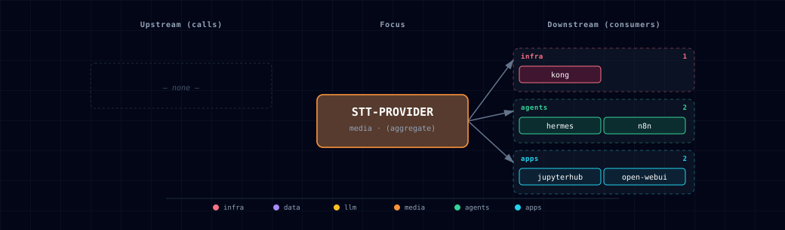

# 5.2.49. STT Provider

Pluggable speech-to-text layer. All backends speak the OpenAI
`/v1/audio/transcriptions` protocol.

## 1. Source matrix

| `STT_PROVIDER_SOURCE` | Engine | Container image | License | Hardware |
|---|---|---|---|---|
| `speaches-container-cpu` (default) | Speaches → Faster-Whisper | `ghcr.io/speaches-ai/speaches:0.9.0-rc.3-cpu` | MIT | Linux + macOS Docker, CPU |
| `speaches-container-gpu` | Speaches → Faster-Whisper | `ghcr.io/speaches-ai/speaches:0.9.0-rc.3-cuda` | MIT | Not usable yet: CUDA image, but no GPU device is attached (#1373) |
| `parakeet-container-gpu` | NVIDIA Parakeet-TDT (NeMo) | (built from `services/parakeet/provider/gpu/Dockerfile` on `nvcr.io/nvidia/pytorch`) | Model CC-BY-4.0; container base NVIDIA-DLC | NVIDIA |
| `parakeet-localhost` | Parakeet-MLX (Mac) or native Parakeet | — | Model CC-BY-4.0 | macOS MLX / Linux |
| `whisper-cpp-localhost` | whisper.cpp | — (`brew install whisper-cpp`) | MIT | macOS Metal+ANE / Linux |
| `disabled` | — | — | — | — |

When STT and TTS both select Speaches, one container serves both endpoints.
If one selects the CPU variant and the other the GPU variant, the GPU variant
wins and the bootstrapper prints a notice.

> **GPU limitation:** the `speaches` compose service requests no NVIDIA runtime
> or device (issue #1373, open). `speaches-container-gpu` therefore gets no GPU:
> it runs on CPU or fails CUDA initialisation. Use `speaches-container-cpu`, or
> `parakeet-container-gpu` for GPU transcription.

## 2. Engine comparison

Speaches is the portable container option. Parakeet has NVIDIA and Apple
Silicon implementations. whisper.cpp is a native Metal/Core ML path.
Language coverage, accuracy, throughput and memory depend on the model, the
audio, the options and the hardware. Atlas publishes no hardware-independent
ranking; benchmark representative inputs on the deployment host.

## 3. Quick start

The default container starts, but it has no model:

```bash
./start.sh
curl http://localhost:63060/health
```

This checks container health only. Transcription returns `404` until you
download the `whisper-1` model (see the note in §4; issue #799, open). Then
the direct endpoint is `http://localhost:63060/v1/audio/transcriptions`.

NVIDIA Parakeet (run from the repository root, which holds `.env`):

```bash
./start.sh --stt-provider-source parakeet-container-gpu
curl -X POST http://localhost:63055/v1/audio/transcriptions \
  -H "Authorization: Bearer $(grep '^PARAKEET_API_TOKEN=' .env | cut -d= -f2-)" \
  -F file=@sample.wav -F model=whisper-1
```

macOS native acceleration:

```bash
# Option A: whisper.cpp (Metal + Core ML / ANE)
brew install whisper-cpp ffmpeg
# Download a ggml model first: see the whisper-cpp README §4.
whisper-server --host 0.0.0.0 --port 63042 \
  --model /path/to/ggml-large-v3.bin \
  --inference-path /v1/audio/transcriptions \
  --convert &

./start.sh --stt-provider-source whisper-cpp-localhost

# Option B: Parakeet-MLX (MLX-native), from the repository root
python3.12 -m venv .venv-parakeet-mlx
. .venv-parakeet-mlx/bin/activate
python -m pip install -r services/parakeet/provider/mlx/requirements-locked.txt
export PARAKEET_API_TOKEN="$(grep '^PARAKEET_API_TOKEN=' .env | cut -d= -f2-)"
export PARAKEET_LOCALHOST_BIND_HOST=0.0.0.0
export PARAKEET_LOCALHOST_PORT=63042
cd services/parakeet/provider && python -m mlx.api_server &
./start.sh --stt-provider-source parakeet-localhost
```

See [the whisper-cpp README](../parakeet/provider/whisper-cpp/README.md)
for the whisper.cpp walkthrough and Linux build instructions, or
[the MLX README](../parakeet/provider/mlx/README.md) for Parakeet-MLX.

## 4. Environment variables

| Variable | Default | Notes |
|---|---|---|
| `STT_PROVIDER_SOURCE` | `speaches-container-cpu` | Engine selector. |
| `STT_PROVIDER_PORT` | `63055` | Host port of the Parakeet container and the wizard display slot. When a Speaches source is active, the bootstrapper sets it to `SPEACHES_PORT`. |
| `STT_ENDPOINT` | (auto) | Internal URL containers reach STT on. |
| `STT_PROVIDER_SCALE` | (auto) | 1 when any container variant is active. |
| `SPEACHES_STT_MODEL` | `Systran/faster-distil-whisper-large-v3` | Inert: `PRELOAD_MODELS` is hard-coded in the Speaches compose file (#799). Open WebUI always sends `whisper-1`, which Speaches maps to `Systran/faster-whisper-large-v3`, not the distil build. |
| `PARAKEET_MODEL` | `nvidia/parakeet-tdt-0.6b-v3` | Or `…-v2` for English-only (slightly faster). |
| `PARAKEET_GPU_IMAGE` | `nvcr.io/nvidia/pytorch:26.06-py3` | Base for the Parakeet GPU Dockerfile. |
| `PARAKEET_MAX_UPLOAD_BYTES` | `104857600` | Maximum upload size in bytes for the Parakeet GPU and localhost APIs. The body is capped before parsing (plus 1 MiB framing). Larger requests return `413`. An invalid value stops startup. |
| `PARAKEET_UPLOAD_TIMEOUT_SECONDS` | `120` | Positive total seconds allowed to receive an upload body before `408` releases provider admission capacity. |
| `PARAKEET_CONCURRENCY` | `1` | Maximum concurrent inference calls per Parakeet provider process. |
| `PARAKEET_API_TOKEN` | generated | Auto-generated bearer required by Atlas-managed Parakeet routes except `/health`. |
| `PARAKEET_AUTH_MODE` | `required` | Set `disabled` only for an explicit emergency/local rollback. |
| `PARAKEET_CORS_ORIGINS` | (empty) | Comma-separated browser origin allowlist; wildcard is invalid with required authentication. |
| `PARAKEET_INFERENCE_TIMEOUT_SECONDS` | `900` | Model-load and inference deadline; timeout returns `504` and terminates the process for restart. |
| `PARAKEET_LOCALHOST_BIND_HOST` | `127.0.0.1` | Native Parakeet listen address. |
| `PARAKEET_LOCALHOST_PORT` | `63042` | Host port where a host-side Parakeet server listens. URL is derived as `http://host.docker.internal:63042`. |
| `WHISPER_CPP_LOCALHOST_PORT` | `63042` | Host port where a host-side whisper.cpp server listens. It shares the Parakeet slot because the two modes are mutually exclusive. URL is derived as `http://host.docker.internal:63042`. |
| `HUGGING_FACE_HUB_TOKEN` | (empty) | For gated models. |

> **Important:** Speaches does not download models itself (verified against
> `speaches @ v0.9.0-rc.3`). The compose default is `PRELOAD_MODELS: '[]'`, so
> `/v1/audio/transcriptions` returns HTTP 404 ("Model is not installed locally").
> Download the `whisper-1` target once:
> `curl -X POST http://localhost:63060/v1/models/Systran/faster-whisper-large-v3`.
> Or add it to the JSON array in `PRELOAD_MODELS` in `services/speaches/compose.yml`.
> The model persists in the `speaches-cache` volume. Parakeet and whisper.cpp
> load their model directly.

## 5. OpenAI-compatible API

Every engine implements the same call shape:

```http
POST http://<endpoint>/v1/audio/transcriptions
Content-Type: multipart/form-data

file=<binary audio>
model=whisper-1
language=en               (optional)
response_format=json      (optional: json, text, verbose_json)
```

Parakeet and whisper.cpp ignore `model` and use the loaded checkpoint.
Speaches resolves `model` and returns HTTP 404 if it is not downloaded (see
§4). Send `whisper-1`: Speaches maps it to `Systran/faster-whisper-large-v3`,
and the OpenAI client library uses it by default.

Both Atlas-managed Parakeet providers:

- accept exactly `json`, `text` or `verbose_json` (`srt` and `vtt` are not supported);
- stream request bodies to bounded temporary files, and delete them after success, rejection or failure;
- run inference off the API event loop.

Atlas-managed Parakeet also applies these rules:

- `GET /health` is public. All other routes need `Authorization: Bearer <PARAKEET_API_TOKEN>`.
- Capacity is reserved before multipart parsing. When the provider is full, it returns `429` before it reads the body.
- Model load and inference share one deadline (`PARAKEET_INFERENCE_TIMEOUT_SECONDS`). On timeout the provider returns `504` and exits with status 70.
- Docker restarts the container. Run native Parakeet under a service manager with restart-on-failure.
- The container publishes on loopback. Set `HOST_BIND_IP=0.0.0.0:` only for separately protected external access.
- Native mode needs a non-loopback `PARAKEET_LOCALHOST_BIND_HOST` for remote clients.

These guarantees do not apply to Speaches or whisper.cpp.

## 6. Open WebUI integration

The bootstrapper writes `OPEN_WEB_UI_STT_ENGINE` (`openai`),
`OPEN_WEB_UI_STT_API_URL` (`${STT_ENDPOINT}/v1`) and `OPEN_WEB_UI_STT_API_KEY`
to `.env`. The Open WebUI compose file maps them to `AUDIO_STT_ENGINE`,
`AUDIO_STT_OPENAI_API_BASE_URL` and `AUDIO_STT_OPENAI_API_KEY`. It hard-codes
`AUDIO_STT_MODEL=whisper-1`.

When the microphone button works depends on the engine:

- Parakeet and whisper.cpp: once the service is healthy.
- Speaches: only after `Systran/faster-whisper-large-v3` (the `whisper-1` target) is downloaded (see §4).

`OPEN_WEB_UI_STT_API_KEY` is the Parakeet provider token for a Parakeet source.
It is `sk-unused` for other STT engines, and empty when STT is disabled. The
key stays in the Open WebUI server process; browser code does not see it.

For the managed Parakeet GPU source, healthy means the model is loaded. The
API starts a deadline-bounded background load, and `/health` returns `503`
until inference is available. Speaches `/health` reports process liveness only.

## 7. Supported audio formats

- Parakeet providers expect WAV, FLAC, MP3, M4A, OGG or OPUS. Other extensions log a warning and still go to the model.
- whisper.cpp accepts WAV, MP3 and FLAC. Other formats need `--convert` and `ffmpeg` on the `PATH`.
- Open WebUI transcodes browser microphone recordings to MP3 before it sends them.

## 8. References

- [Speaches](https://github.com/speaches-ai/speaches)
- [Faster-Whisper](https://github.com/SYSTRAN/faster-whisper)
- [Parakeet-TDT v3 model card](https://huggingface.co/nvidia/parakeet-tdt-0.6b-v3)
- [Parakeet-MLX](https://github.com/senstella/parakeet-mlx)
- [whisper.cpp](https://github.com/ggml-org/whisper.cpp)
- [OpenAI Whisper API spec](https://platform.openai.com/docs/guides/speech-to-text)

## 9. Dependencies & Integrations

### 9.1. Current — Upstream (this service calls)

_No upstream calls._

### 9.2. Current — Downstream (services that call this)

| Service | Category |
|---|---|
| kong | infra |
| hermes | agents |
| n8n | agents |
| jupyterhub | apps |
| open-webui | apps |

### 9.3. Architecture diagram



[Open the full-size diagram](./architecture.html) for a full-screen view.

### 9.4. Future — Missing pair integrations

- **stt-provider ↔ minio** — *Why:* transcripts vanish with the HTTP response — nothing persists source audio or transcript JSON. Pushing both to MinIO gives every service a stable URL and enables re-transcription on engine swap. *Mechanism:* new `stt-transcripts` bucket provisioned by `minio-init`; post-transcribe hook puts `s3://stt-transcripts/<sha256>.wav` plus sidecar `.json` via S3 SigV4 over `http://minio:9000`. *Effort:* small. *Confidence:* high.
- **stt-provider ↔ weaviate** — *Why:* indexing durable transcripts turns long-form audio (meetings, podcasts, voice notes) into a semantically searchable corpus alongside the docling pipeline. *Mechanism:* `Transcript` class with `text`, `start_ms`, `end_ms`, `source_audio_uri`, vectorized by the active `text2vec-openai` module via `http://weaviate:8080/v1/objects`. *Effort:* medium. *Confidence:* medium.
- **stt-provider ↔ redis** — *Why:* transcription is expensive and deterministic in `(audio-sha256, model, language)`. A cache cuts repeat cost to ~zero for n8n loops, re-runs, demos. *Mechanism:* a Redis database index that no other consumer uses ([Redis README](../redis/README.md)), with key `stt:{sha256}:{model}:{lang}` → transcript JSON, TTL 30d. A backend wrapper or a Kong plugin in front of `STT_ENDPOINT` does the lookup. *Effort:* small. *Confidence:* medium.
- **stt-provider ↔ doc-processor** — *Why:* docling parses PDFs/Office docs but does not handle audio. Composing `stt → docling` gives a unified "any media → markdown" ingest. *Mechanism:* caller hits `STT_ENDPOINT`, then POSTs transcript text to `${DOCLING_ENDPOINT}/v1/document/convert` as `text/plain`. No new service. *Effort:* small. *Confidence:* medium.
- **stt-provider ↔ openclaw** — *Why:* Telegram/WhatsApp/Discord deliver voice notes as audio; OpenClaw routes text through Hermes today with no audio path. *Mechanism:* OpenClaw middleware POSTing incoming audio to `${STT_ENDPOINT}/v1/audio/transcriptions` (multipart), then forwarding the text result to its existing LLM-routing path. *Effort:* small. *Confidence:* medium.
- **stt-provider ↔ supabase** — *Why:* transcript metadata (user, session, source URI, model, language, duration) belongs in a relational store. It gives open-webui and backend a "my transcripts" view keyed by Supabase JWT `sub`. *Mechanism:* `transcripts` table via PostgREST at `http://supabase-api:3000`, RLS on `auth.uid()`; post-transcribe hook writes rows pointing at MinIO URIs. *Effort:* medium. *Confidence:* medium.

### 9.5. Future — Candidate new services

- **WhisperX** ([details](https://github.com/thekaveh/atlas/blob/main/docs/research/candidates/whisperx.md)) — *Headline:* fourth STT engine adding speaker diarization and word-aligned timestamps behind the existing OpenAI shape. *Wires into:* backend, n8n, open-webui, hermes, openclaw, minio, weaviate.

### 9.6. Future — Unused features in this service

- **Streaming / Realtime SSE+WebSocket** — *Why pursue:* Speaches ships SSE-streamed transcription and a WebSocket realtime API; we only expose the batch `/v1/audio/transcriptions`. Enables live captions in open-webui and live agent voice loops in Hermes. *Effort:* medium.
- **Translation endpoint** — *Why pursue:* Speaches/Faster-Whisper support speech translation; we never expose `/v1/audio/translations`. Cheap multilingual UX gain. *Effort:* small.
- **Per-engine model hot-swap** — *Why pursue:* Speaches loads/unloads models on demand; we hard-pin one model per engine. Lets users A/B `distil-large-v3` vs `large-v3` without restarting. *Effort:* small.
- **Word/segment timestamps in API responses** — *Why pursue:* Parakeet and Speaches both expose them; open-webui wiring requests plain `json` and discards them. Needed for click-to-seek UX and for Weaviate chunking by utterance. *Effort:* small.
- **Diarization** — *Why pursue:* no in-stack engine does it; prerequisite for meeting-grade transcripts (covered by WhisperX candidate). *Effort:* medium.
- **Sentiment / emotional-tone analysis** — *Why pursue:* upstream Speaches advertises this; feeds n8n/backend dashboards without a separate NLP service. *Effort:* small.

## 10. Troubleshooting

**Speaches returns 404 "Model is not installed locally"** — download the model
(see the note in §4). The healthcheck passes as soon as Uvicorn is up; it does
not wait for a model.

**Open WebUI mic button does nothing** — check the env vars:

```bash
docker exec <project>-open-web-ui env | grep AUDIO_STT
```

If `AUDIO_STT_ENGINE` and `AUDIO_STT_OPENAI_API_BASE_URL` are empty,
`STT_PROVIDER_SOURCE` is `disabled`. With Speaches, also check that the model
is downloaded.

**Parakeet GPU container OOMs** — it needs about 2 GB VRAM. Use
`speaches-container-cpu` or a localhost engine. NeMo's Parakeet loader has no
`int8` compute-type control.

**whisper.cpp not detected as localhost** — make sure it's serving the
`/v1/audio/transcriptions` path (use `--inference-path`).

## 11. Capabilities & limitations

`parakeet` — Support tier: **experimental** — Capability contract declared; no cited cold-start, workflow, or upgrade qualification run yet (evidence at `v0.1.0`).
`speaches` — Support tier: **experimental** — Capability contract declared; no cited cold-start, workflow, or upgrade qualification run yet (evidence at `v0.1.0`).

| Service | Capability | Status | Verification | Notes |
|---|---|---|---|---|
| parakeet | NVIDIA Parakeet transcription | supported | tested | The GPU source loads the configured Parakeet-TDT checkpoint and serves standard and advanced OpenAI-shaped transcription routes with truthful readiness. |
| parakeet | Host speech-to-text variants | partial | tested | Atlas can route to operator-run Parakeet MLX or whisper.cpp endpoints, but installation, model provisioning, process supervision, and host acceleration remain operator-owned. |
| parakeet | Timestamp-rich transcription | partial | tested | Atlas-managed Parakeet providers expose segment and word timing when the selected implementation returns alignment data; plain results honestly report timestamps unavailable. |
| parakeet | Provider authentication and workload bounds | partial | tested | Atlas Parakeet requires a bearer token and bounds uploads, admission, and inference by default; those guarantees do not extend to selected Speaches or whisper.cpp upstreams. |
| parakeet | Cross-architecture Parakeet container | not-supported | tested | The only Parakeet container is NVIDIA GPU. Apple Silicon uses the separately installed MLX localhost provider; no CPU container or GPU quantization knob is advertised. |
| speaches | OpenAI-compatible text-to-speech | partial | tested | Speaches serves /v1/audio/speech, but Atlas does not preload Kokoro; the model must be downloaded before requests succeed. |
| speaches | OpenAI-compatible speech-to-text | partial | untested | Speaches exposes /v1/audio/transcriptions, but Atlas has not validated the current preload and Open WebUI model path against a live container. |
| speaches | Configurable STT model selection | stubbed | documented | SPEACHES_STT_MODEL is declared but does not alter the hard-coded PRELOAD_MODELS value or Open WebUI's STT model. |
