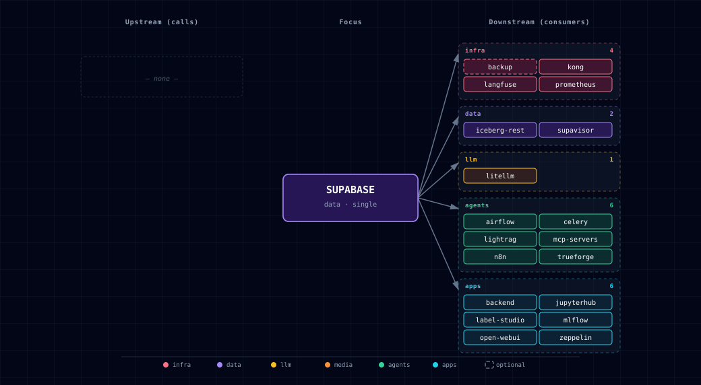

# 5.2.50. Supabase Ecosystem

Supabase provides Postgres, Auth, Storage, Realtime, and a management dashboard that Atlas builds on.

## 1. Overview

Atlas runs these Supabase services:

- **PostgreSQL Database** - Primary database with pgvector and PostGIS extensions
- **Auth Service (GoTrue)** - User authentication and JWT management  
- **Storage Service** - File storage and management
- **API Service (PostgREST)** - Auto-generated REST API
- **Realtime Service** - WebSocket connections for live updates (not functional yet; see §4.5)
- **Studio Dashboard** - Web-based database management interface

## 2. Database Setup Process

The database initialization follows a staged process managed by Docker Compose dependencies:

### 2.1. Base Database Initialization (`supabase-db` service)

- Uses the standard `supabase/postgres` image
- On first start with an empty data volume, runs internal initialization scripts from `/docker-entrypoint-initdb.d/`
- Base scripts handle:
  - Setting up PostgreSQL
  - Creating the database specified by `POSTGRES_DB`
  - Creating standard Supabase roles (`anon`, `authenticated`, `service_role`)
  - Enabling necessary extensions (`pgcrypto`, `uuid-ossp`)
  - Setting up basic `auth` and `storage` schemas

**IMPORTANT**: The `SUPABASE_DB_USER` in your `.env` file must be set to `supabase_admin`. This is required by the base image's internal scripts.

Host connections require SCRAM passwords. PostgreSQL runs with the image's own configuration (`-D /etc/postgresql`: listens on all container interfaces, logical WAL for Realtime, Supabase preload libraries) and its `/etc/postgresql/pg_hba.conf`, which requires `scram-sha-256` for every network range and trusts only in-container connections (loopback, plus the local socket for `supabase_admin` and peer-mapped users), as upstream Supabase does. The image's `/etc/postgresql-custom` lives on the `supabase-db-config` volume: it holds `pgsodium_root.key`, so Vault and pgsodium secrets stay decryptable across container recreation. A database restored into a cluster with a different key cannot decrypt them, so keep that volume with the data volume. The startup wrapper also rewrites legacy `trust` or `password` host rules in the data directory's `pg_hba.conf` to `scram-sha-256`, so that file is safe if it is ever used directly; local socket rules and explicit rejects are preserved. A file with `md5` host rules is left unchanged and reported, because MD5-only role verifiers must be migrated first. Application containers use dedicated generated roles, while only database initialization and backup/restore retain `SUPABASE_DB_USER`.

**Password is baked at initdb (`password authentication failed for user "supabase_admin"`).** The `supabase_admin` role's password is set **once**, when the `supabase-db-data` volume is first created, and is never re-synced afterward. `SUPABASE_DB_PASSWORD` ships as the placeholder `password` and is auto-rotated to a random value on the first `./start.sh`. If the data volume later persists across a `.env` password change (e.g. `.env` regenerated from `.env.example` against a retained volume — `./stop.sh` without `--cold` keeps volumes), clients authenticate with the new value while the role still holds the old one → `password authentication failed`. The bootstrapper now **skips** rotation and warns when it detects an existing `<project>_supabase-db-data` volume, so it won't silently rotate `.env` out of sync. To recover a drifted stack, either set `SUPABASE_DB_PASSWORD` back to the volume's original value, or run `./stop.sh --cold` (removes volumes) then `./start.sh` to reinitialize the role and `.env` together.

### 2.2. Custom Post-Initialization (`supabase-db-init` service)

- A dedicated, short-lived service using `postgres:15.19-alpine` image
- Depends on `supabase-db` and waits until it's ready using `pg_isready`
- Executes all `.sql` files from `./services/supabase/db/scripts/` directory in alphabetical order
- Then executes optional downstream-owned `.sql` files from `./services/supabase/db/_user/` in alphabetical order
- Custom scripts handle project-specific setup.

The seeding layout follows a two-tier convention: core scaffolding lives in the `0x`-prefixed files; per-service "vertical slice" files (`10`–`14`) each own one service's tables, migrations, and seeds. All files are executed in alphabetical order by `db-init-runner.sh`, which means slice-to-slice FK references work as long as a lower-numbered slice creates the referenced table first (e.g. `public.users` in `10` is referenced by slices `13` and `14`).

  - Enabling extensions: `vector`, `postgis`, `pgcrypto` (`01-extensions.sql`)
  - Ensuring schemas `auth` and `storage` exist (`02-schemas.sql`)
  - Creating custom types for Supabase Auth / GoTrue (`03-auth-types.sql`)
  - GoTrue migration sync shim (`03b-gotrue-migration-sync.sql`)
  - Setting up storage schema and tables (`04-storage.sql`)
  - Granting appropriate permissions to standard roles (`06-permissions.sql`)
  - Creating shared functions like `public.health` and `update_updated_at_column()` (`07-functions.sql`)
  - **`10-users.sql`** — `public.users` table (shared user identity, referenced by downstream slices)
  - **`12-comfyui.sql`** — `public.comfyui_workflows` and `public.comfyui_generations` tables (runtime app state), their indexes, and the default workflow seed rows. `public.comfyui_models` was decommissioned — its DDL was removed from this file and a guarded DROP lives in `16-decommission-comfyui-models.sql`.
  - **`13-backend-research.sql`** — `research` schema and research tables (`public.research_sessions`, `public.research_results`, `public.research_sources`, `public.research_logs`) (owned by backend / local-deep-researcher)
  - **`14-backend-memory.sql`** — LangMem memory tables (`public.memory_facts`, `public.memory_sessions`, `public.memory_consolidation_log`), the embedding-schema state, dimension-specific HNSW index, guarded contract function, and monotonic Weaviate dirty/synchronized generations (owned by Backend / LangMem). Existing `vector(768)` values expand losslessly to full-precision `vector`; Backend re-embeds every NULL or mismatched row before the migration validates the selected-dimension constraint. Dimensions through 2,000 use a `vector` HNSW key; wider dimensions through 4,000 retain full-precision storage and use a matching `halfvec` expression index. Weaviate rebuild completion uses a generation compare-and-set and refuses to clear while any durable `vector_sync_pending` intent remains. The legacy `user_id` VARCHAR→UUID migration is guarded per-table (nested `BEGIN/EXCEPTION`): a pre-existing volume holding a non-UUID `user_id` leaves that table in its legacy shape with a `WARNING` rather than aborting DB init (#800)
  - **`15-decommission-llms.sql`** — decommission migration: drops the former `public.llms` catalog table on pre-existing volumes (idempotent `DROP TABLE IF EXISTS`). Fresh installs never create `public.llms` (the former `11-litellm.sql` was removed). The LLM model source-of-truth now lives in `services/ollama/models.yaml` and `services/litellm/models.yaml`, resolved by `bootstrapper/utils/model_resolver.py`.
  - **`16-decommission-comfyui-models.sql`** — decommission migration: drops the former `public.comfyui_models` catalog table on pre-existing volumes (idempotent `DROP TABLE IF EXISTS`). Fresh installs never create `public.comfyui_models` (its DDL left `12-comfyui.sql`). The ComfyUI model source-of-truth now lives in `services/comfyui/models.yaml` (and the `custom-models.yaml` sidecar), resolved by `bootstrapper/utils/comfyui_resolver.py` into a manifest at start. `public.comfyui_workflows` and `public.comfyui_generations` are RUNTIME app state and are NOT affected.

All Atlas-owned SQL scripts use `IF NOT EXISTS` logic to allow safe re-runs.

### 2.3. Downstream user migrations

Downstream projects can add local Supabase SQL without editing Atlas-owned
files by placing scripts in `./services/supabase/db/_user/`. The
`supabase-db-init` container mounts that directory read-only at `/user-scripts`
and runs its `*.sql` files after every Atlas-owned script in
`./services/supabase/db/scripts/` has completed successfully.

The ordering contract is:

1. Atlas-owned SQL in `db/scripts/`, sorted lexically.
2. User-owned SQL in `db/_user/`, sorted lexically.

The user slot is optional. A fresh checkout works with no user SQL files, and
the `_user` directory ignores local SQL by default so downstream migrations do
not accidentally enter upstream Atlas PRs. Prefix user files with numbers such
as `10-project-schema.sql` and `20-seed-reference-data.sql` to make ordering
explicit.

Write user SQL to be idempotent: use patterns such as `CREATE SCHEMA IF NOT
EXISTS`, `CREATE TABLE IF NOT EXISTS`, guarded `ALTER TABLE` blocks, and
conflict-safe seed statements. If any user SQL file fails, `psql` exits with
`ON_ERROR_STOP=1`, `supabase-db-init` fails, and downstream services gated on
`supabase-db-init` do not start against a partially initialized database.

### 2.4. Service Dependencies

Most other services have `depends_on: { supabase-db-init: { condition: service_completed_successfully } }` to ensure they only start after both base and custom initialization are complete.

## 3. Authentication System

The stack uses Supabase Auth (GoTrue) for user authentication and management with JWT tokens.

### 3.1. Key Components

**supabase-auth (GoTrue)**:
- Issues JWTs upon successful login/sign-up
- Validates JWTs presented to its endpoints  
- Configured via `GOTRUE_*` environment variables
- Sign-ups enabled by default (`GOTRUE_DISABLE_SIGNUP="false"`)
- Emails auto-confirmed for local development (`GOTRUE_MAILER_AUTOCONFIRM="true"`)
- Together these mean anyone who can reach the auth endpoint can mint an `authenticated` token, which the Backend accepts on `/media/generate` (including the paid FAL provider), `/media/spend`, research and memory routes. Kong binds to loopback by default. Media budgets do not contain this: they are off by default (`MEDIA_BUDGET_ENABLED=false`), and when on, caps apply per consumer and per `project` (a free-text request field), so every new account and every new project name starts with a fresh cap. Before widening `HOST_BIND_IP` or publishing the gateway, disable sign-up with a Compose override that sets `GOTRUE_DISABLE_SIGNUP: "true"` on `supabase-auth` (the fragment hard-codes `"false"`, so a `.env` entry has no effect).
- Default privileges grant `anon` SELECT and `authenticated` ALL on future `public` tables; db-init revokes them from tables without row-level security, but a table created by a `db/_user/*.sql` script stays exposed through PostgREST until the next db-init run. Enable RLS (or revoke) in the same script.

**supabase-api (PostgREST)**:
- Expects valid JWT in `Authorization: Bearer <token>` header
- Validates JWT signature using `PGRST_JWT_SECRET` (shared with auth)
- Enforces database permissions based on JWT role claim via PostgreSQL RLS

**supabase-storage**:
- Accepts JWTs passed via Kong, but Atlas hardens the `storage` schema (no `anon`/`authenticated` grants, row-level security off), so only the service-role key can read or write objects; user and anon tokens get "permission denied"

**kong-api-gateway**:
- Routes authenticated requests to backend services
- Relies on upstream services for JWT validation

### 3.2. JWT Keys (.env file)

- `SUPABASE_JWT_SECRET`: Secret key for signing/verifying JWTs (consistent across all services)
- `SUPABASE_ANON_KEY`: Pre-generated JWT for `anon` role (public access)
- `SUPABASE_SERVICE_KEY`: Pre-generated JWT for `service_role` (admin privileges)

### 3.3. Setup and Usage

1. **Generate Keys**: start.py automatically generates secure JWT keys during first run or cold start
2. **Client Authentication**: Implement login flow using `/auth/v1/token?grant_type=password`
3. **Anonymous Access**: Use `SUPABASE_ANON_KEY` for public requests
4. **Service Role Access**: Use `SUPABASE_SERVICE_KEY` for admin operations (handle securely)
5. **User Management**: Use the Kong-protected Supabase Studio route at `http://supabase-studio.localhost:${KONG_HTTP_PORT}` (Studio's own port is not published).

Supabase Auth identities are synchronized into `public.users` by the
idempotent `public.handle_auth_user_sync()` trigger in `10-users.sql`. The same
script backfills existing `auth.users` rows. This keeps the authenticated JWT
subject usable as the owner foreign key for Backend research and memory data;
profile names come from `raw_user_meta_data.name`, then `full_name`, then the
email local part, with a stable fallback. Existing matching rows are updated,
while unrelated legacy `public.users` rows remain intact.
Deleting an Auth account deletes its synchronized owner row and cascades the
associated research and memory records through their existing foreign keys.

Row-level security permits authenticated users to read or update only the row
whose id matches `auth.uid()` and permits the service role to manage all rows;
anonymous callers have no policy. The synchronization function is trigger-only:
execute privilege is revoked from public API roles despite its required
`SECURITY DEFINER` ownership.

## 4. Individual Services

`SUPABASE_{META,STORAGE,AUTH,API,REALTIME,STUDIO}_SOURCE=disabled` scales that container to 0 (the bootstrapper writes the matching `SUPABASE_<X>_SCALE`), and the port check skips it. Kong and Realtime depend on those sub-services optionally (`required: false`), so they start without the ones a stack does not use; routes to a disabled one return 503 (#1462). The database (`SUPABASE_DB_SOURCE`) stays required.

### 4.1. PostgreSQL Database

**Access**: Direct connection via standard PostgreSQL client
**Port**: `${SUPABASE_DB_PORT}` (default: 63012)
**Extensions**: pgvector, PostGIS, uuid-ossp, pgcrypto

### 4.2. Auth Service (GoTrue)

**Access**: through Kong at `/auth/v1` only. GoTrue is not published on the host: it answers any browser origin, and with sign-up and auto-confirm on, any web page open in your browser could create an account and read its token. `SUPABASE_AUTH_PORT` stays reserved but is not bound.
**Purpose**: User registration, login, password recovery, email confirmation
**Features**: JWT authentication, user management, password policies
**Port**: GoTrue listens on 9999 (`GOTRUE_API_PORT`; its own default is 8081), which is where Kong's `/auth/v1` routes and Storage's `GOTRUE_URL` point; the container's healthcheck probes `/health` there.
**Token claims**: `GOTRUE_JWT_AUD` and `GOTRUE_JWT_DEFAULT_GROUP_NAME` are `authenticated`, so user tokens carry the `aud` and `role` the backend and PostgREST require. Users stored with an empty `aud` and `role` (signed up before this setting) are repaired on the next start.
**Profile sync**: the `auth.users` → `public.users` trigger and backfill run as the no-login role `atlas_auth_sync`, which can only read the synced `auth.users` columns and write `public.users`. GoTrue's database role owns `auth.users`; with the trigger owned by the init superuser, that role could make itself superuser. Every init statement that writes a table another role owns (this backfill, the empty-claims repair, the storage bucket insert and index DDL) runs inside a temporary `SECURITY DEFINER` function owned by that role, which also fires deferred constraint triggers before it returns. Code the owning role planted therefore never runs as the init superuser.

**Limits**: GoTrue's `SITE_URL` (`http://supabase-studio:3000`) and `API_EXTERNAL_URL` (`http://supabase-auth:9999`) are container-internal and SMTP points at a local relay that does not exist, so email confirmation, recovery, magic-link and OAuth redirect links are not usable from a browser; the stock defaults auto-confirm sign-ups instead.

### 4.3. Storage Service

**Access**: `http://localhost:${SUPABASE_STORAGE_PORT}` (default: 63015)
**Features**:
- Secure file storage and management
- Service-role access only: the hardened `storage` schema grants nothing to `anon`/`authenticated`
- Integration with authentication system
- Support for various file types
- Through Kong, `/storage/v1/` needs the `apikey` header, but `/storage/v1/object/public/`, `/storage/v1/object/sign/` and `/storage/v1/object/upload/sign/` do not, so `` tags and outside services can fetch public-bucket and signed URLs and PUT to signed upload URLs
- Resumable (TUS) uploads work through Kong: `REQUEST_ALLOW_X_FORWARDED_PATH=true` keeps the `/storage/v1` prefix in the upload `Location` header, which Studio's file browser follows
- The `default` bucket is private, so the `url` the backend's `/storage/upload` returns (a public-object URL on the internal Kong host) is not fetchable as-is; fetch through the backend or Studio, or create a signed URL

### 4.4. API Service (PostgREST)

**Access**: `http://localhost:${SUPABASE_API_PORT}` (default: 63017)
**Purpose**: Auto-generated REST API for database operations
**Features**:
- Automatic API generation from database schema
- Row Level Security (RLS) enforcement
- Not yet functional: Realtime subscriptions (see §4.5) and the `/graphql/v1` route, which returns 404 because the `pg_graphql` extension is not installed and `graphql_public` is not an exposed schema

### 4.5. Realtime Service

**Access**: WebSocket at `http://localhost:${SUPABASE_REALTIME_PORT}` (default: 63018)
**Purpose**: Live database change notifications
**Status**: not functional yet. Realtime v2.112 serves only tenants it has seeded, and Atlas does not seed one (`SEED_SELF_HOST`, `API_JWT_SECRET` and `DB_ENC_KEY` are not set, and the tenant is chosen from the request host's first label, which the Kong and direct URLs do not carry), so every connection is refused as an unknown tenant. Nothing in the stack subscribes today; enabling it is tracked as follow-up work.

Realtime is an Erlang node. The image ships one fixed release cookie, so Atlas binds its epmd, Erlang distribution and gen_rpc listeners to the container's loopback (`ERL_AFLAGS` `inet_dist_use_interface`, `ERL_EPMD_ADDRESS`, `GEN_RPC_SOCKET_IP`). Other containers on `backend-network` reach only the HTTP/WebSocket port 4000. A single Realtime node needs no cluster traffic.

Realtime creates and manages its own logical replication slots. Database initialization no longer creates a separate `supabase_realtime_slot` (Realtime never used it, so it only retained WAL) and drops that slot on startup when it is idle.

### 4.6. Studio Dashboard

**Protected access**: `http://supabase-studio.localhost:${KONG_HTTP_PORT}`
**Direct access**: none. Studio is not published on the host: it has no application authentication, and its pg-meta proxy accepts form-encoded POSTs a web page can send cross-site, so a loopback port let any page open in your browser run SQL. `SUPABASE_STUDIO_PORT` stays reserved but is not bound.
**Purpose**: Web-based database management interface
**Credentials**: `DASHBOARD_USERNAME` / `DASHBOARD_PASSWORD` protect the Kong `supabase-studio.localhost` route (default user `kong_admin`; the password is auto-generated on first `./start.sh`). Studio is reached only through that route.
**Features**:
- Database schema visualization
- Query editor and runner
- User management interface
- Storage file browser
- Real-time monitoring

### 4.7. `postgres-exporter` (observability sidecar)

**Image**: `prometheuscommunity/postgres-exporter:v0.19.1`
**Access**: `http://localhost:${POSTGRES_EXPORTER_PORT}/metrics` (in-container `9187`)
**Purpose**: Prometheus exporter exposing `pg_stat_*` views as a `/metrics` endpoint for the observability bundle.
**Configuration**: connects to `supabase-db:5432` using the dedicated `${POSTGRES_EXPORTER_DB_USER}`/`${POSTGRES_EXPORTER_DB_PASSWORD}` login with `pg_monitor`; it does not receive the database-owner credential. It scrapes only the primary database: database auto-discovery is off because the per-service databases (`airflow`, `langfuse`, …) revoke `CONNECT` from it, which would pin `pg_exporter_last_scrape_error` at 1.
**Lifecycle**: scales **1↔0 with `PROMETHEUS_SOURCE`** — the bootstrapper's `_generate_prometheus_config()` hook writes `POSTGRES_EXPORTER_SCALE` from this single switch, so the sidecar is dormant when Prometheus is off. The `Postgres + Redis` Grafana dashboard renders connections, query rate, and table sizes from its output.

## 5. Environment Variables

Key environment variables for Supabase configuration:

```bash
# Database
POSTGRES_DB=postgres
SUPABASE_DB_USER=supabase_admin
SUPABASE_DB_PASSWORD=your_password
SUPABASE_DB_PORT=63012
SUPABASE_AUTH_DB_PASSWORD=atlas-db-password       # rotated on first start
SUPABASE_STORAGE_DB_PASSWORD=atlas-db-password    # rotated on first start
SUPABASE_API_DB_PASSWORD=atlas-db-password        # rotated on first start

# Authentication
SUPABASE_JWT_SECRET=your_jwt_secret
SUPABASE_ANON_KEY=generated_anon_key
SUPABASE_SERVICE_KEY=generated_service_key

# Service Ports
SUPABASE_AUTH_PORT=63016          # reserved, not bound (use Kong /auth/v1)
SUPABASE_API_PORT=63017
SUPABASE_STORAGE_PORT=63015
SUPABASE_STUDIO_PORT=63019
SUPABASE_REALTIME_PORT=63018

# Dashboard Credentials (password auto-rotated on first launch)
DASHBOARD_USERNAME=kong_admin
DASHBOARD_PASSWORD=<auto-generated into .env>
```

### 5.1. Security note — pg-meta host port

`supabase-meta` (pg-meta) is **not published on the host**. It is an
auth-less HTTP API that executes SQL as a dedicated `dashboard_user` member,
and it answers any browser origin (CORS `*`), so even a loopback-only publish
let any web page open in the operator's browser query `auth.users`. Studio
and the Kong `/pg/` route (Basic authentication + `dashboard_user` ACL)
reach it over the internal Docker network. `SUPABASE_META_PORT` stays
reserved in the port block but is not bound.

### 5.2. Security note — writable `public` schema

Open WebUI, LightRAG, pg-meta and Realtime roles can create objects in
`public`. PostgreSQL resolves an unqualified call to the best type match on the
search path. A planted `public` overload can therefore beat a `pg_catalog`
built-in and run as whoever calls it.

Every `SECURITY DEFINER` function in the database pins a `search_path` without
`public`. Atlas's own functions use `pg_catalog, pg_temp` (or an empty path)
and qualify `public` objects. `01-extensions.sql` pins PostGIS's
`ST_EstimatedExtent` the same way, so call its schema-qualified three-argument
form: the two-argument form no longer finds a table by search path.

Init runs as a superuser, so `db-init-runner` protects it in three ways:

- Every init `psql` call uses `search_path=public,auth,extensions`. The
  superuser's saved path also names a schema literally called `"\$user"`,
  which any role with `CREATE` on the database could add ahead of `public`.
- It refuses to run while a non-superuser owns a function or operator named
  like a superuser-owned one in `pg_catalog`, `public`, `auth` or
  `extensions`. Superuser-run slices still call some routines (`format`, `=`,
  `<>`, `vector_dims`) without exact argument types.
- It refuses to run while a trigger on a superuser-owned table calls a function
  that a non-superuser owns. `anon`, `authenticated` and `service_role` hold no
  `TRIGGER` privilege on `public` tables, and init inserts the default storage
  bucket as the table's owner.

Each service database (LiteLLM, Airflow, Langfuse and the others) is owned by
its service role, which therefore owns that database's `public` schema. Init's
ownership pass there runs with `search_path = pg_catalog, pg_temp` and
schema-qualified built-ins, so nothing the role plants in it runs as the
superuser.

When init refuses, it names each object. Drop them, then restart. The backup
and restore scripts resolve nothing through `public` (`search_path =
pg_catalog, pg_temp`). Downstream SQL in `db/_user/` runs as the init
superuser too: qualify calls the same way (#1456).

## 6. Integration Points

**Backend API**: Uses Supabase for data persistence and user management
**Open WebUI**: Integrates with authentication for user sessions
**n8n**: Uses PostgreSQL for workflow storage and execution history
**Kong Gateway**: Routes requests to appropriate Supabase services with authentication

## 7. Common Operations

### 7.1. Connect to Database
```bash
# Using psql
psql -h localhost -p ${SUPABASE_DB_PORT} -U supabase_admin -d postgres

# Using Docker
docker exec -it ${PROJECT_NAME}-supabase-db psql -U supabase_admin -d postgres
```

### 7.2. Check Service Health
```bash
# Database
docker exec ${PROJECT_NAME}-supabase-db pg_isready

# Services
curl -I http://localhost:${SUPABASE_API_PORT}/   # PostgREST serves its OpenAPI root; it has no /health on this port
docker exec ${PROJECT_NAME}-supabase-auth wget -qO- http://localhost:9999/health
```

### 7.3. View Logs
```bash
docker logs ${PROJECT_NAME}-supabase-db -f
docker logs ${PROJECT_NAME}-supabase-auth -f
docker logs ${PROJECT_NAME}-supabase-api -f
docker logs ${PROJECT_NAME}-supabase-studio -f
```

## 8. LightRAG schema

When `LIGHTRAG_SOURCE != disabled` AND `SUPABASE_DB_SOURCE != disabled`, `lightrag-init` runs `migrate-pgvector.sql` which provisions `CREATE EXTENSION IF NOT EXISTS vector` and a `lightrag` schema. LightRAG's `PGVectorStorage` manages tables under that schema at runtime.

## 9. Dependencies & Integrations

### 9.1. Current — Upstream (this service calls)

_No upstream calls._

### 9.2. Current — Downstream (services that call this)

| Service | Category | Status |
|---|---|---|
| backup | infra | optional: BACKUP_SOURCE=container; runs on demand, not resident |
| kong | infra | current |
| langfuse | infra | current |
| prometheus | infra | current |
| iceberg-rest | data | current |
| supavisor | data | current |
| litellm | llm | current |
| airflow | agents | current |
| celery | agents | current |
| lightrag | agents | current |
| mcp-servers | agents | current |
| n8n | agents | current |
| trueforge | agents | current |
| backend | apps | current |
| jupyterhub | apps | current |
| label-studio | apps | current |
| mlflow | apps | current |
| open-webui | apps | current |
| zeppelin | apps | current |

### 9.3. Architecture diagram



[Open the full-size diagram](./architecture.html) for a full-screen view.

### 9.4. Future — Missing pair integrations

- **supabase ↔ hermes** — *Why:* Hermes persists agent state to a `hermes-data` volume only (the manifest header says "no Postgres/Redis dependency"). Backing sessions, skills, and tool-call history with Postgres gives durable cross-restart memory, multi-replica safety, and stack-wide queryability. *Mechanism:* `postgresql://supabase_admin@supabase-db:5432/postgres` with a dedicated `hermes` schema; `hermes-init` creates tables with `IF NOT EXISTS`. *Effort:* medium. *Confidence:* medium.
- **supabase ↔ doc-processor** — *Why:* docling extracts structured chunks that today flow only into Weaviate as vectors. Persisting raw chunk text + source metadata in Postgres gives RLS-scoped tenant isolation, exact-match search, and a source-of-truth row Weaviate can be rebuilt from. *Mechanism:* docling writes via PostgREST at `http://supabase-api:3000/rest/v1/doc_chunks` using `SUPABASE_SERVICE_KEY`; embeddings still go to Weaviate. *Effort:* medium. *Confidence:* medium.
- **supabase ↔ openclaw** — *Why:* OpenClaw is the messaging-platform gateway and depends only on litellm; conversation history, user-to-channel mappings, and rate-limit counters currently live in-memory. *Mechanism:* `postgresql://supabase_admin@supabase-db:5432/postgres` schema `openclaw`; tables seeded by a small `openclaw-init` SQL script alongside the existing `supabase-db-init` chain. *Effort:* small. *Confidence:* medium.
- **supabase ↔ tts-provider** — *Why:* generated audio is ephemeral. Storing TTS output in `supabase-storage` keyed by `(user_id, text_hash, voice)` gives a free cache (skip re-synth on identical inputs) and a per-user history pane. *Mechanism:* `PUT http://supabase-storage:5000/object/tts/<user>/<hash>.wav` with `SUPABASE_SERVICE_KEY`; metadata row via PostgREST. *Effort:* small. *Confidence:* high.
- **supabase ↔ stt-provider** — *Why:* parakeet/speaches transcripts vanish after the response. Writing them to a `transcripts` table with the caller's JWT `sub` enables history search, RAG-over-meetings, and per-user RLS isolation. *Mechanism:* stt-provider POSTs to PostgREST `/rest/v1/transcripts` with the forwarded `Authorization: Bearer <jwt>` header so RLS picks up the user. *Effort:* small. *Confidence:* medium.

### 9.5. Future — Candidate new services

- **Supabase Edge Functions (Deno)** ([details](../../docs/research/candidates/supabase-edge-functions.md)) — *Headline:* self-hosted Deno serverless layer that lets Postgres triggers and Kong routes invoke short TypeScript handlers without standing up n8n. *Wires into:* litellm, n8n, supabase-storage, kong.
- **imgproxy** ([details](../../docs/research/candidates/imgproxy.md)) — *Headline:* on-the-fly image transform/resize sidecar that Supabase Storage's `IMGPROXY_URL` is purpose-built to talk to. *Wires into:* supabase-storage, minio, comfyui, open-webui, backend.

### 9.6. Future — Unused features in this service

- **`pg_cron` + `pg_net` extensions** — *Why pursue:* enables scheduled jobs and outbound HTTP from inside Postgres (database webhooks to Hermes/n8n/Edge Functions); `01-extensions.sql` currently enables only `vector`/`postgis`/`pgcrypto`. *Effort:* small.
- **Database Webhooks** — *Why pursue:* lets row-level changes trigger LiteLLM calls or n8n flows without a polling worker; depends on `pg_net`. *Effort:* small.
- **Row-Level Security policy coverage** — *Why pursue:* the `public.users`, backend research, memory, and media-spend-ledger tables now define RLS policies, but the ComfyUI workflow/generation tables still lack table-specific RLS (they hold shared, non-user app state). Finish the per-table policy model before exposing those tables through PostgREST broadly. *Effort:* medium.
- **GoTrue OAuth providers (Google, GitHub)** — *Why pursue:* stack ships with email-only login; SSO is a near-zero-code add via `GOTRUE_EXTERNAL_*` envs. *Effort:* small.
- **`pg_graphql` endpoint** — *Why pursue:* Kong already routes `/graphql/v1` to PostgREST's `rpc/graphql`, but no consumer uses pg_graphql's typed schema; wiring n8n/backend to it would give a typed GraphQL surface. *Effort:* small.
- **Realtime broadcast + presence channels** — *Why pursue:* `supabase-realtime` runs but nothing subscribes; broadcast channels would let backend push job-status updates to open-webui without polling. *Effort:* medium.
- **Storage image transformation** — *Why pursue:* prerequisite for the imgproxy candidate; lights up resize URLs once `IMGPROXY_URL` is set. *Effort:* small.

## 10. Troubleshooting

**Database connection issues**: Verify SUPABASE_DB_USER is set to `supabase_admin`
**Auth service errors**: Check JWT secret consistency across services
**Studio access issues**: Verify dashboard credentials for the Kong hostname and that `./start.sh --setup-hosts` added `supabase-studio.localhost`; Studio has no direct host port.
**Initialization failures**: Check supabase-db-init logs for SQL script errors

For more troubleshooting help, see [../quick-start/troubleshooting.md](../../docs/quick-start/troubleshooting.md).

## 11. Capabilities & limitations

Support tier: **experimental** — Capability contract declared (#967); no cited cold-start, workflow, or upgrade qualification run yet (evidence at `v0.1.0`).

| Capability | Status | Verification | Notes |
|---|---|---|---|
| Integrated Postgres application platform | supported | tested | Atlas runs PostgreSQL with Auth, PostgREST, Storage, Realtime, Meta, Studio, database initialization, and optional metrics export as one required family. Realtime runs but serves no tenant yet (§4.5). |
| Idempotent schema and RLS initialization | supported | tested | Ordered Atlas and downstream SQL runners initialize extensions, service schemas, grants, identity synchronization, and row-level-security policies with failure gating. |
| Least-privilege application database role | supported | tested | Atlas creates idempotent per-service logins and dedicated database/schema ownership or read grants; application containers do not receive the Supabase owner credential. |
| Production email authentication | partial | documented | GoTrue issues and validates JWTs, but the stock local-development defaults auto-confirm email and point SMTP at localhost rather than a configured delivery service. |
| pg-meta administrative access control | supported | tested | The Kong /pg/ route uses Basic authentication and the dashboard_user ACL. pg-meta itself has no application authentication, executes as a dedicated dashboard_user member and allows any browser origin, so it is not published on the host; SUPABASE_META_PORT is reserved but unused. |
| Supabase Studio access control | supported | tested | The Kong route uses Basic authentication and the dashboard_user ACL. Studio has no application authentication and its pg-meta proxy accepts form-encoded POSTs that a web page can send cross-site, so it is not published on the host; SUPABASE_STUDIO_PORT is reserved but unused. |
| Authenticated remote PostgreSQL access | supported | tested | Host TCP uses SCRAM-SHA-256 with generated scoped passwords under the image's own pg_hba.conf, plus an upgrade-time HBA rewrite for legacy volumes' data-directory rules; publication remains loopback by default and explicit remote exposure still requires firewall and TLS planning. |
