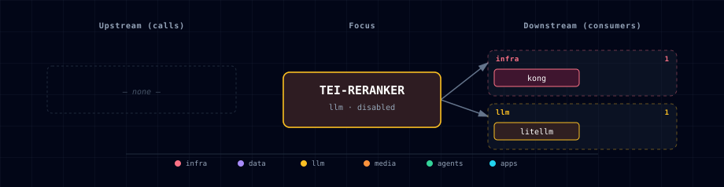

# TEI Reranker

> **Image:** `ghcr.io/huggingface/text-embeddings-inference:cpu-1.9` (CPU) / `:1.9` (GPU)
> **Container port:** 80  · **Default host port:** allocated by `topology.py` slot allocator (LLM band 63040–63049)
> **Default:** disabled

## 1. Overview

HuggingFace `text-embeddings-inference` running `mixedbread-ai/mxbai-rerank-base-v1` — a cross-encoder reranker that scores `(query, passage)` pairs. Use it as a quality lift on top of any first-stage retriever (vector search, BM25, hybrid). The image exposes a stable `/rerank` HTTP endpoint and a `/health` probe.

**Why this model:** mxbai-rerank-base-v1 ships ONNX out of the box (so the amd64 ORT backend in `cpu-1.9` loads it cleanly) AND is light enough (~184 M params) that the arm64 candle backend in `cpu-arm64-latest` completes warmup successfully on Apple Silicon. BGE-reranker-v2-m3 was the original spec'd model but its safetensors-only distribution + ~560 M params caused the arm64 candle backend to crash silently during warmup (RestartCount climbed in live smoke until the model was swapped 2026-06-07).

The service is reusable by consumers that send TEI's request body shape (`query` plus `texts`). Atlas never wires stock LightRAG *directly* to TEI, because LightRAG's built-in Jina/Cohere rerank clients send `query` plus `documents`, which TEI rejects. LightRAG reaches this reranker through the backend rerank adapter (`POST /lightrag/rerank`, #415), which translates `{query, documents}` ↔ `{query, texts}`; enable it with `LIGHTRAG_RERANK_ADAPTER_ENABLED=true` (see the [backend README §5.1](../backend/README.md#51-lightrag--tei-rerank-adapter-post-lightragrerank-415)).

## 2. Source variants

| Source | Container scale | Endpoint | Notes |
|---|---|---|---|
| `container-cpu` | 1 | `http://tei-reranker:80` | Default CPU image; runs on any host |
| `container-gpu` | 1 | `http://tei-reranker:80` | CUDA image; needs NVIDIA |
| `localhost` | 0 | `http://host.docker.internal:${TEI_RERANKER_LOCALHOST_PORT}` | Host-installed TEI |
| `disabled` | 0 | `""` | Reranker service off |

## 3. Configuration

```env
TEI_RERANKER_SOURCE=disabled                       # default
TEI_RERANKER_PORT=...                              # slot-allocated
TEI_RERANKER_LOCALHOST_PORT=63049                  # host-installed TEI rerank port
TEI_RERANKER_MODEL_ID=mixedbread-ai/mxbai-rerank-base-v1
TEI_RERANKER_REVISION=main
TEI_RERANKER_MAX_CLIENT_BATCH_SIZE=32
TEI_RERANKER_MEMORY_LIMIT=4g
TEI_RERANKER_CPU_LIMIT=2.0
TEI_RERANKER_HF_CACHE_DIR=/data
```

## 4. Usage

```bash
# Rerank passages
curl -s http://localhost:${TEI_RERANKER_PORT}/rerank \
  -H 'Content-Type: application/json' \
  -d '{
    "query": "What is graph-augmented RAG?",
    "texts": [
      "LightRAG combines knowledge graphs with dense vector retrieval.",
      "GraphQL is a query language.",
      "Reranking improves RAG quality by ordering retrieved passages."
    ]
  }'
# → [{"index": 0, "score": ...}, ...]
```

### 4.1 Stack-standard rerank via LiteLLM (#516)

When `TEI_RERANKER_SOURCE != disabled` with a resolved endpoint, `litellm-init` also registers a **`tei-rerank`** model on the LiteLLM gateway, so any consumer gets a standard **Cohere-shaped `POST /v1/rerank`** fronting TEI — with LiteLLM's unified auth, cost logging, and retries — instead of bespoke per-consumer TEI wiring:

```bash
curl -s http://localhost:${LITELLM_PORT}/v1/rerank \
  -H "Authorization: Bearer ${LITELLM_MASTER_KEY}" \
  -H 'Content-Type: application/json' \
  -d '{"model":"tei-rerank","query":"…","documents":["…","…"]}'
# → {"results": [{"index": 0, "relevance_score": ...}, ...]}
```

- **Note:** `/rerank` is **not** an OpenAI modality — it is the Cohere-shaped API (`{query, documents}`). LiteLLM registers TEI via the **`huggingface/`** rerank provider, which translates the Cohere request into TEI's native `{query, texts}` shape. The `infinity`/`jina`/`cohere` prefixes would send `{query, documents}` and break against TEI (the mismatch documented in `services/lightrag/service.yml`) — so the `huggingface/` prefix is pinned.
- **Relationship to #415.** The backend `/lightrag/rerank` adapter still serves LightRAG's specific client shape; the LiteLLM `/v1/rerank` route is the stack-standard path for general consumers. No api_key is needed — TEI is unauthenticated in-network and the endpoint is resolved into `config.yaml` at init time.

## 5. Dependencies & Integrations

> Auto-generated section — the **Current** subsections are derived from `services/tei-reranker/service.yml`'s `data_flow.calls` field (and inverse passes). Re-run `python -m bootstrapper.docs.regen tei-reranker` after manifest changes.

### 5.1 Current — Upstream (this service calls)

_No upstream calls._

### 5.2 Current — Downstream (services that call this)

| Service | Category |
|---|---|
| kong | infra |
| litellm | llm |

### 5.3 Architecture diagram



[Open the interactive HTML diagram](./architecture.html) for a full-screen view.

### 5.4 Future — Missing pair integrations

_No high-confidence opportunities identified._

### 5.5 Future — Candidate new services

_No high-confidence opportunities identified._

### 5.6 Future — Unused features in this service

_No high-confidence opportunities identified._

## 6. Health checks

```bash
curl -fs http://localhost:${TEI_RERANKER_PORT}/health   # 200 OK when up
```

Container `start_period` is 120 s (first run downloads the model).

## 7. Troubleshooting

- **First boot logs optional HuggingFace artifact 404s** — expected for some reranker models. TEI probes optional Sentence Transformers files, logs 404 warnings when they are absent, then continues with the model artifacts it needs.
- **Out of memory on CPU variant** — bump `TEI_RERANKER_MEMORY_LIMIT`. mxbai-rerank-base-v1 needs ~1.5 GB on CPU; the originally spec'd BGE-reranker-v2-m3 needed ~3 GB.
- **Slow inference** — switch to `container-gpu` if NVIDIA is available; CPU latency is ~150 ms per pair vs ~15 ms on GPU.
- **Model not found** — verify `TEI_RERANKER_MODEL_ID` matches a public HF repo. Private repos need an `HF_TOKEN` env var (not wired by default; hand-add to the compose env block).
