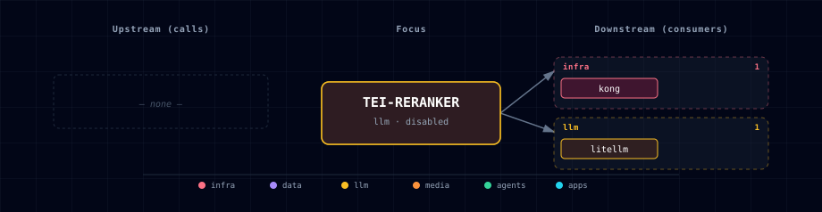

# 5.2.52. TEI Reranker

> **Image:** `ghcr.io/huggingface/text-embeddings-inference` — CPU: `cpu-1.9` (amd64) / `cpu-arm64-latest` (arm64), GPU: `:1.9`
> **Container port:** 80  · **Default host port:** allocated by `topology.py` slot allocator (LLM band 63040–63049)
> **Default:** disabled

## 1. Overview

Hugging Face `text-embeddings-inference` (TEI) running `mixedbread-ai/mxbai-rerank-base-v1`, a cross-encoder that scores `(query, passage)` pairs. Use it to reorder results from any first-stage retriever (vector, BM25 or hybrid). The image exposes `/rerank` and a `/health` probe.

**Why this model:** mxbai-rerank-base-v1 ships ONNX weights, which the amd64 ORT backend in `cpu-1.9` needs. It is also small enough (~184 M params) for the arm64 Candle backend in `cpu-arm64-latest` to finish warmup on Apple Silicon.

Any consumer that sends TEI's body shape (`query` plus `texts`) can call it. LightRAG's built-in Jina/Cohere clients send `query` plus `documents`, which TEI rejects, so Atlas never wires LightRAG directly to TEI. LightRAG uses the backend rerank adapter (`POST /lightrag/rerank`), which translates between the two shapes. Enable it with `LIGHTRAG_RERANK_ADAPTER_ENABLED=true` (see the [backend README §5.1](../backend/README.md)).

## 2. Source variants

| Source | Container scale | Endpoint | Notes |
|---|---|---|---|
| `container-cpu` | 1 | `http://tei-reranker:80` | Default CPU image; runs on any host |
| `container-gpu` | 1 | `http://tei-reranker:80` | CUDA image. Compose does not request a GPU yet ([#1373](https://github.com/thekaveh/atlas/issues/1373)), so this variant gets no GPU access. |
| `localhost` | 0 | `http://host.docker.internal:${TEI_RERANKER_LOCALHOST_PORT}` | Host-installed TEI |
| `disabled` | 0 | `""` | Reranker service off |

For every enabled source, Kong generates the `rerank.localhost` alias. Container variants route it to `http://tei-reranker:80/`; `localhost` routes it to `host.docker.internal:${TEI_RERANKER_LOCALHOST_PORT}`.

Container callers can use `http://tei-reranker:80`. Host callers use the published `http://localhost:${TEI_RERANKER_PORT}` for a container variant, or the host TEI port for `localhost`.

## 3. Configuration

```env
TEI_RERANKER_SOURCE=disabled                       # default
TEI_RERANKER_PORT=...                              # slot-allocated
TEI_RERANKER_LOCALHOST_PORT=63049                  # host-installed TEI rerank port
TEI_RERANKER_MODEL_ID=mixedbread-ai/mxbai-rerank-base-v1
TEI_RERANKER_REVISION=800f24c113213a187e65bde9db00c15a2bb12738
TEI_RERANKER_MAX_CLIENT_BATCH_SIZE=32
TEI_RERANKER_MEMORY_LIMIT=4g
TEI_RERANKER_CPU_LIMIT=2.0
TEI_RERANKER_HF_CACHE_DIR=/data
```

## 4. Usage

Run the host commands from the repository root. `TEI_RERANKER_PORT` defaults to `63041`.

```bash
# Rerank passages
TEI_RERANKER_PORT="$(sed -n 's/^TEI_RERANKER_PORT=//p' .env)"
curl -s http://localhost:${TEI_RERANKER_PORT}/rerank \
  -H 'Content-Type: application/json' \
  -d '{
    "query": "What is graph-augmented RAG?",
    "texts": [
      "LightRAG combines knowledge graphs with dense vector retrieval.",
      "GraphQL is a query language.",
      "Reranking improves RAG quality by ordering retrieved passages."
    ]
  }'
# → [{"index": 0, "score": ...}, ...]
```

### 4.1. Stack-standard rerank via LiteLLM

When `TEI_RERANKER_SOURCE` is not `disabled` and the endpoint resolves, `litellm-init` registers a **`tei-rerank`** model on LiteLLM. Consumers then get a Cohere-shaped `POST /v1/rerank` in front of TEI, with LiteLLM's auth, cost logging and retries:

```bash
LITELLM_PORT="$(sed -n 's/^LITELLM_PORT=//p' .env)"
LITELLM_MASTER_KEY="$(sed -n 's/^LITELLM_MASTER_KEY=//p' .env)"
curl -s http://localhost:${LITELLM_PORT}/v1/rerank \
  -H "Authorization: Bearer ${LITELLM_MASTER_KEY}" \
  -H 'Content-Type: application/json' \
  -d '{"model":"tei-rerank","query":"…","documents":["…","…"]}'
# → {"results": [{"index": 0, "relevance_score": ...}, ...]}
```

- **Provider prefix.** `/rerank` is the Cohere-shaped API (`{query, documents}`), not an OpenAI modality. LiteLLM registers TEI through the **`huggingface/`** rerank provider, which translates the request into TEI's `{query, texts}`. The `infinity`, `jina` and `cohere` prefixes send `{query, documents}`, which TEI rejects, so `huggingface/` is pinned.
- **Backend adapter vs LiteLLM.** The backend `/lightrag/rerank` adapter serves LightRAG's client shape. LiteLLM `/v1/rerank` is the standard path for other consumers. No TEI API key is needed: TEI is unauthenticated in-network, and init writes the endpoint into `config.yaml`.

## 5. Dependencies & Integrations

### 5.1. Current — Upstream (this service calls)

_No upstream calls._

### 5.2. Current — Downstream (services that call this)

| Service | Category |
|---|---|
| kong | infra |
| litellm | llm |
| backend | apps |

### 5.3. Architecture diagram



[Open the full-size diagram](./architecture.html) for a full-screen view.

### 5.4. Future — Missing pair integrations

_No high-confidence opportunities identified._

### 5.5. Future — Candidate new services

_No high-confidence opportunities identified._

### 5.6. Future — Unused features in this service

_No high-confidence opportunities identified._

## 6. Health checks

```bash
TEI_RERANKER_PORT="$(sed -n 's/^TEI_RERANKER_PORT=//p' .env)"
curl -fs http://localhost:${TEI_RERANKER_PORT}/health   # 200 OK when up
```

Container `start_period` is 300 s, because the first run downloads the model before the server binds.

## 7. Troubleshooting

- **First boot logs optional HuggingFace artifact 404s** — expected for some reranker models. TEI probes optional Sentence Transformers files, logs 404 warnings when they are absent, then continues with the model artifacts it needs.
- **Out of memory on CPU variant** — raise `TEI_RERANKER_MEMORY_LIMIT`. mxbai-rerank-base-v1 needs about 1.5 GB on CPU.
- **Slow inference** — CPU is the only working container variant until GPU device requests are wired ([#1373](https://github.com/thekaveh/atlas/issues/1373)). Lower `TEI_RERANKER_MAX_CLIENT_BATCH_SIZE`, or use the `localhost` source with a host TEI that has a GPU.
- **Model not found** — verify `TEI_RERANKER_MODEL_ID` matches a public HF repo. Private repos need an `HF_TOKEN` env var (not wired by default; hand-add to the compose env block).

## 8. Capabilities & limitations

Support tier: **experimental** — Capability contract declared; no cited cold-start, workflow, or upgrade qualification run yet (evidence at `v0.1.0`).

| Capability | Status | Verification | Notes |
|---|---|---|---|
| Cross-encoder reranking sources | supported | tested | Atlas resolves architecture-specific amd64 ORT and arm64 Candle CPU images, an NVIDIA image, or an existing host TEI endpoint for the configured model. |
| LiteLLM standard rerank route | supported | tested | The tei-rerank alias uses LiteLLM's Hugging Face adapter to translate Cohere-shaped documents into TEI text pairs behind gateway authentication. |
| Direct LightRAG-to-TEI reranking | not-supported | tested | LightRAG sends a documents payload that native TEI rejects; it must use the opt-in backend adapter rather than the TEI endpoint directly. |
| Authenticated native reranker access | partial | tested | The LiteLLM route requires its master key, but TEI's host-published port and CORS-only rerank.localhost alias expose the unauthenticated native API. |
| Arbitrary reranker model portability | partial | tested | The default model revision is pinned to the tested 800f24c113213a187e65bde9db00c15a2bb12738 commit for reproducible ONNX amd64 and safetensors arm64 artifacts. Operator model or revision overrides are not pre-certified for both backends or their memory limits. |
