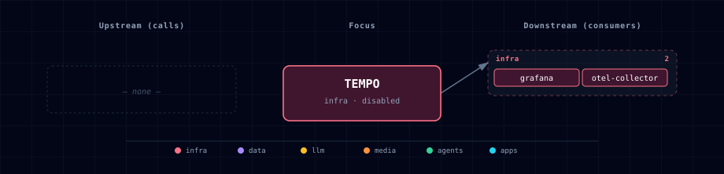

# 5.2.52. Tempo

## 1. Overview

Tempo is Atlas' disabled by default, Grafana-native trace store. The first slice runs it as a local development service with local filesystem storage and no public Kong route.

Tempo has no built-in authentication layer, so Atlas keeps it internal-only and expects operators to inspect traces through Grafana.

## 2. Access

- SOURCE: `TEMPO_SOURCE=disabled` by default.
- Internal endpoint: `http://tempo:3200`.
- Direct host URL: none in the first slice.
- Kong URL: none; no Kong route is generated.
- Grafana surface: the `Tempo` datasource is provisioned when Grafana starts.

## 3. Configuration

The service reads `./config/tempo.yaml`, mounted to `/etc/tempo/tempo.yaml`. Atlas computes `TEMPO_ENDPOINT` from `TEMPO_SOURCE`.

## 4. Architecture & Wiring

OpenTelemetry Collector forwards traces to Tempo over OTLP HTTP. Grafana queries Tempo for trace exploration. This service is local development oriented and not a high-availability production tracing deployment.

## 5. Dependencies & Integrations

### 5.1 Current — Upstream (this service calls)

_No upstream calls._

### 5.2 Current — Downstream (services that call this)

| Service | Category |
|---|---|
| grafana | infra |
| otel-collector | infra |

### 5.3 Architecture diagram

[Open the interactive HTML diagram](./architecture.html) for a full-screen view.

### 5.4 Future — Missing pair integrations

_No high-confidence opportunities identified._

### 5.5 Future — Candidate new services

_No high-confidence opportunities identified._

### 5.6 Future — Unused features in this service

_No high-confidence opportunities identified._

## 6. Troubleshooting

- If the collector refuses to start, confirm `TEMPO_SOURCE=container`.
- If Grafana cannot query traces, confirm `TEMPO_ENDPOINT=http://tempo:3200` in the Grafana container environment.
- Roll back by setting `TEMPO_SOURCE=disabled` and `OTEL_COLLECTOR_SOURCE=disabled`.
