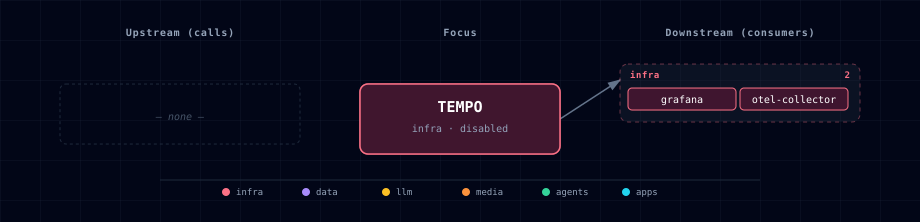

# 5.2.53. Tempo

## 1. Overview

Tempo is Atlas' Grafana-native trace store, disabled by default. It uses local filesystem storage and has no Kong route.

Tempo has no built-in authentication layer, so Atlas keeps it internal-only and expects operators to inspect traces through Grafana.

## 2. Access

- SOURCE: `TEMPO_SOURCE=disabled` by default.
- Internal endpoint: `http://tempo:3200`.
- Direct host URL: none.
- Kong URL: none; no Kong route is generated.
- Grafana surface: the `Tempo` datasource is provisioned when Grafana starts.

## 3. Configuration

The service reads `./config/tempo.yaml`, mounted to `/etc/tempo/tempo.yaml`. Atlas computes `TEMPO_ENDPOINT` from `TEMPO_SOURCE`. `TEMPO_RETENTION_PERIOD` sets trace retention (default `336h`, Tempo's own 14-day default). Tempo 3 reads retention in its backend scheduler and its backend worker. The config sets both from this variable.

The image is distroless (no shell, no `wget`). The health check runs the binary's own `/tempo -health`, which probes `/ready` and exits nonzero until Tempo is ready. The Collector waits for this check to pass.

## 4. Architecture & Wiring

The OpenTelemetry Collector forwards traces to Tempo over OTLP HTTP. Grafana queries Tempo for trace exploration. This is a local development service, not a high-availability tracing deployment.

## 5. Dependencies & Integrations

### 5.1. Current — Upstream (this service calls)

_No upstream calls._

### 5.2. Current — Downstream (services that call this)

| Service | Category |
|---|---|
| grafana | infra |
| otel-collector | infra |

### 5.3. Architecture diagram

[Open the full-size diagram](./architecture.html) for a full-screen view.

### 5.4. Future — Missing pair integrations

_No high-confidence opportunities identified._

### 5.5. Future — Candidate new services

_No high-confidence opportunities identified._

### 5.6. Future — Unused features in this service

_No high-confidence opportunities identified._

## 6. Troubleshooting

- If `./start.sh` stops with "OTel Collector requires Tempo", set `TEMPO_SOURCE=container` (or `--tempo-source container`), or disable the Collector.
- If Grafana cannot query traces, confirm `TEMPO_ENDPOINT=http://tempo:3200` in the Grafana container environment.
- Roll back by setting `TEMPO_SOURCE=disabled` and `OTEL_COLLECTOR_SOURCE=disabled`.

## 7. Capabilities & limitations

Support tier: **experimental** — Capability contract declared; no cited cold-start, workflow, or upgrade qualification run yet (evidence at `v0.1.0`).

| Capability | Status | Verification | Notes |
|---|---|---|---|
| Local distributed trace storage | supported | tested | Atlas configures a filesystem-backed Tempo service receiving internal OTLP traces from the OpenTelemetry Collector and exposes it to Grafana. |
| Authenticated public trace ingestion | not-supported | tested | Tempo has no host port, Kong route, or authentication layer in the stock topology; ingestion is restricted to the backend network. |
| Highly available trace retention | not-supported | documented | The bundled single replica uses local filesystem storage and does not provide replicated object storage or production high availability. |
