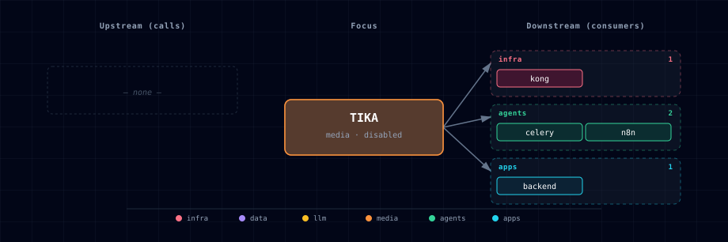

# 5.2.53. Apache Tika

## 1. Overview
Apache Tika is Atlas' disabled-by-default fallback extractor for long-tail document formats that Docling does not target well. It is a degraded plain-text path, not a replacement for Docling's structure-aware PDF, Office, image, table, OCR, and chunking pipeline.

Atlas pins Apache Tika 3.3.1 through `apache/tika:3.3.1.0`. Tika 4.x is intentionally not the default in this slice because the server line has breaking endpoint and configuration changes.

## 2. Access
- Direct URL: `http://localhost:${TIKA_PORT}`
- Kong URL: `http://tika.localhost:${KONG_HTTP_PORT}`
- Internal URL: `http://tika:9998`
- Localhost source URL: `http://host.docker.internal:${TIKA_LOCALHOST_PORT}`

Kong creates the `tika.localhost` route when `TIKA_SOURCE=container` or `TIKA_SOURCE=tika-localhost`. The route is removed when `TIKA_SOURCE=disabled`.

## 3. Configuration
- `TIKA_SOURCE=disabled|container|tika-localhost` controls the source. The default is `disabled`.
- `TIKA_IMAGE=apache/tika:3.3.1.0` pins the stable Tika 3.x image.
- `TIKA_PORT` is assigned by Atlas' media-category port slot allocator.
- `TIKA_LOCALHOST_PORT=9998` points Kong and in-container consumers at a host-running Tika server.
- `TIKA_ENDPOINT` is auto-managed for backend and n8n consumers.
- `TIKA_MAX_FILE_SIZE=52428800` limits backend extraction payloads to 50 MiB by default.
- `TIKA_TIMEOUT_SECONDS=30` bounds backend fallback calls; it must be finite, greater than 0, and no greater than 3,600 seconds or Backend startup fails.
- `TIKA_JAVA_TOOL_OPTIONS=-Xmx768m` caps the container JVM heap.

## 4. Docling-First Fallback Policy
Backend extraction stays Docling-first for supported and unknown formats. Tika is used only when one of these explicit fallback conditions is met:

- Docling returns HTTP 415.
- Docling returns a response containing `unsupported-format` or `unsupported format`.
- The file is a documented long-tail format that Atlas routes directly to Tika to avoid wasting Docling/GPU work.

The initial long-tail list includes EML, MSG, RTF, ODT, ODS, ODP, ZIP, TAR, GZIP, and BZIP2. Tika output is plain text and should be marked degraded in downstream RAG metadata.

## 5. Guardrails
- Keep Tika disabled unless long-tail extraction is needed.
- Do not expose Tika directly to untrusted networks; it accepts document bytes and has no built-in Atlas auth.
- Use `TIKA_MAX_FILE_SIZE` and `TIKA_TIMEOUT_SECONDS` to bound backend fallback calls.
- Treat ZIP and other archive formats carefully. Tika can inspect embedded content, but Atlas v1 does not add malware scanning, recursive archive policy, or persistent quarantine storage.
- Preserve provenance in downstream indexing: filename, content type, byte size, selected extractor, and fallback reason.

## 6. Dependencies & Integrations

### 6.1. Current — Upstream (this service calls)

_No upstream calls._

### 6.2. Current — Downstream (services that call this)

| Service | Category |
|---|---|
| kong | infra |
| celery | agents |
| n8n | agents |
| backend | apps |

### 6.3. Architecture diagram

[Open the interactive HTML diagram](./architecture.html) for a full-screen view.

### 6.4. Future — Missing pair integrations

_No high-confidence opportunities identified._

### 6.5. Future — Candidate new services

_No high-confidence opportunities identified._

### 6.6. Future — Unused features in this service

_No high-confidence opportunities identified._

## 7. Troubleshooting
- Kong route missing: confirm `TIKA_SOURCE` is `container` or `tika-localhost`, then rerun `./start.sh`.
- Backend returns unsupported-format: enable Tika and restart so `TIKA_ENDPOINT` is generated.
- Localhost mode cannot connect: ensure the host Tika server listens on `TIKA_LOCALHOST_PORT` and that `host.docker.internal` resolves from containers.
- Empty or low-quality text: remember Tika is the degraded fallback path. Prefer Docling for formats it supports.
