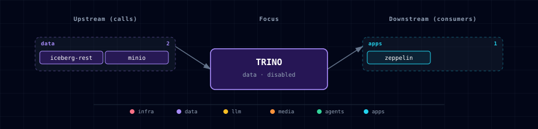

# Trino

Trino is an optional, disabled-by-default SQL query engine for the Data Engineering track. Atlas wires Trino to the existing Iceberg REST catalog and MinIO-backed lakehouse buckets so notebooks, Zeppelin, Airflow tasks, and local tools can query the same tables through a SQL surface.

## 1. Overview

Image: `trinodb/trino:482`.

The first Atlas slice is intentionally narrow: one single-node coordinator, one `lakehouse` catalog, and no extra workers. The catalog uses Iceberg REST for table metadata and MinIO for object storage. This keeps Trino aligned with the Spark/Iceberg path already used by the data-eng stack.

## 2. Access

| Surface | URL | Notes |
|---|---|---|
| Kong | `http://trino.localhost:${KONG_HTTP_PORT}` | Routed only when `TRINO_SOURCE=container`. |
| Direct | `http://localhost:${TRINO_PORT}` | Coordinator UI and HTTP API. |
| In-network | `http://trino:8080` | Use from notebooks, Zeppelin JDBC, Airflow tasks, and other containers. |

## 3. Configuration

```dotenv
TRINO_SOURCE=disabled
TRINO_IMAGE=trinodb/trino:482
TRINO_PORT=
TRINO_SCALE=
ICEBERG_REST_SOURCE=disabled
MINIO_SOURCE=container
```

`TRINO_SOURCE=container` requires both `MINIO_SOURCE=container` and `ICEBERG_REST_SOURCE=container`. The bootstrapper fails early if either dependency is disabled.

## 4. Architecture & Wiring

The mounted catalog file at `services/trino/catalog/lakehouse.properties` defines:

- `connector.name=iceberg`
- `iceberg.catalog.type=rest`
- `iceberg.rest-catalog.uri=http://iceberg-rest:8181`
- `iceberg.rest-catalog.warehouse=s3://lakehouse/`
- native S3 access to MinIO at `http://minio:9000`
- scoped Iceberg MinIO credentials through `${ENV:MINIO_ICEBERG_ACCESS_KEY}` and `${ENV:MINIO_ICEBERG_SECRET_KEY}`

Minimal SQL smoke once Spark or another writer has created tables:

```sql
SHOW CATALOGS;
SHOW SCHEMAS FROM lakehouse;
SHOW TABLES FROM lakehouse.bronze;
SELECT * FROM lakehouse.bronze.<table_name> LIMIT 10;
```

Zeppelin can use its JDBC interpreter with:

```text
%jdbc(trino)
SHOW TABLES FROM lakehouse.bronze;
```

For a future seeded interpreter, use JDBC URL `jdbc:trino://trino:8080/lakehouse` and driver class `io.trino.jdbc.TrinoDriver`.

## 5. Dependencies & Integrations

> Auto-generated section — the **Current** subsections are derived from `services/trino/service.yml`'s `data_flow.calls` field (and inverse passes). Re-run `python -m bootstrapper.docs.regen trino` after manifest changes.

### 5.1 Current — Upstream (this service calls)

| Service | Category |
|---|---|
| iceberg-rest | data |
| minio | data |

### 5.2 Current — Downstream (services that call this)

_No downstream consumers._

### 5.3 Architecture diagram



[Open the interactive HTML diagram](./architecture.html) for a full-screen view.

### 5.4 Future — Missing pair integrations

Seed a Zeppelin JDBC interpreter and add notebook examples that create a Spark-written Iceberg table and query it through Trino.

### 5.5 Future — Candidate new services

Superset or another BI UI can sit downstream of Trino once the lakehouse query path is stable.

### 5.6 Future — Unused features in this service

Worker scaling, query resource groups, access-control files, and additional catalogs are intentionally out of scope for this first integration.

## 6. Troubleshooting

- **Catalog missing:** confirm `ICEBERG_REST_SOURCE=container` and that `iceberg-rest` is healthy before Trino starts.
- **S3 access denied:** confirm `minio-init` completed and populated `MINIO_ICEBERG_ACCESS_KEY` / `MINIO_ICEBERG_SECRET_KEY`.
- **Kong alias does not load:** run `./start.sh --setup-hosts` so `trino.localhost` resolves locally.
