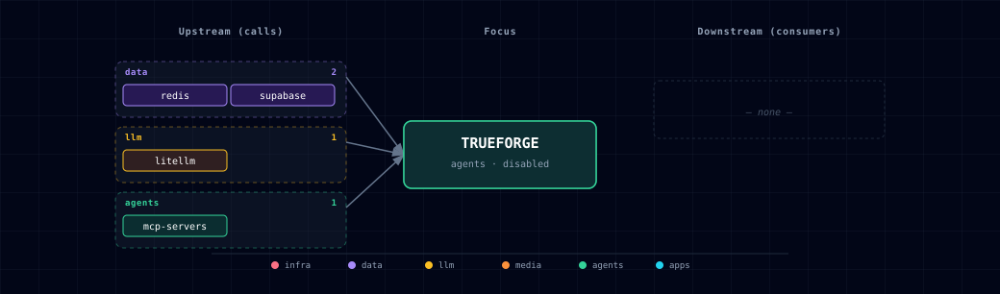

# 5.2.56. TrueForge (agent runtime: MCP + approvals + schedules)

## 1. Overview

TrueForge ([truefoundry/trueforge](https://github.com/truefoundry/trueforge)) is Atlas's general agent runtime — the first `agents`-family service where agents are **saved configurations, not code**: pick a model, attach MCP tool connectors, set an approval policy, optionally put it on a schedule. It complements the fixed-purpose agents (Local Deep Researcher, Hermes, OpenClaw) rather than replacing them, and was adopted at upstream v0.2.0 as an `experimental`-tier service after the [#1159](https://github.com/thekaveh/atlas/issues/1159) evaluation.

The family runs three containers off one image:

- `trueforge` — the server: API, chat UI, session/turn execution.
- `trueforge-controller` — the schedule dispatcher (hourly/daily/weekly unattended runs).
- `trueforge-init` — one-shot settings seeding on every start (model provider + MCP connector), then exits.

**Boundary vs Open WebUI:** Open WebUI is the RAG *chat* surface — conversations, knowledge collections, document Q&A. TrueForge is the agent *harness* — tool-using agents with human approval gates, schedules, and per-session cost accounting. If the job is "talk to my documents", use Open WebUI; if it is "an agent that acts through tools, on demand or on a schedule", use TrueForge.

**Platform note:** upstream publishes a linux/amd64 image only; on Apple Silicon, Docker Desktop runs it under emulation (same arrangement as chatterbox and docling).

## 2. Access

| Surface | URL | Notes |
| --- | --- | --- |
| Kong | `http://trueforge.localhost:${KONG_HTTP_PORT}` | Routed only when `TRUEFORGE_SOURCE=container`; guarded by the dashboard-user basic-auth/ACL pair like Langfuse and MLflow. |
| Direct | `http://localhost:${TRUEFORGE_PORT}` | Bound through `HOST_BIND_IP`; the default is loopback-only, while an explicit non-empty value enables deliberate remote access. |

There is no login inside TrueForge itself: the OIDC triple is deliberately unset, so the server runs with its fixed local admin identity and **anyone who can reach it is admin** (see §4.3).

## 3. Configuration

```dotenv
TRUEFORGE_SOURCE=disabled             # container | disabled
TRUEFORGE_PORT=                       # topology-assigned
TRUEFORGE_ENDPOINT=                   # auto-managed
TRUEFORGE_API_KEY=                    # auto-generated
TRUEFORGE_DB_NAME=trueforge           # dedicated database on supabase-db
TRUEFORGE_DB_USER=trueforge
TRUEFORGE_DB_PASSWORD=                # auto-generated
```

Enable with `./start.sh --trueforge-source container` or through the wizard (track `gen-ai-eng`). Everything else is derived: the database and its owner role are provisioned idempotently by the Supabase init chain, the `*_URI` DSN twins are synchronized by the bootstrapper, and `TRUEFORGE_API_KEY` (the controller→server service credential) is generated on first run and then preserved.

Model/MCP/skill/sandbox configuration deliberately does **not** go through env catalogs — `trueforge-init` seeds the live settings API instead (§4.2), which survives image upgrades and stays consistent with whatever the LiteLLM gateway currently serves.

## 4. Architecture & wiring

### 4.1. Storage and runtime plumbing

- **Postgres**: a dedicated `trueforge` database on the shared `supabase-db`, owned by a restricted `trueforge` role (litellm/langfuse isolation pattern), with TrueForge's tables in their own `trueforge` schema inside it.
- **Redis**: the shared stack Redis on logical database `5`, used only for executor peering (cross-replica turn cancellation).
- **Kong**: `trueforge.localhost` fronts the UI/API; `PUBLIC_BASE_URL` points at the Kong URL so MCP OAuth/DCR callbacks resolve.

### 4.2. What trueforge-init seeds (idempotent, every start)

1. Mints a dedicated **LiteLLM virtual key** (alias `trueforge`) so agent traffic never carries the master key, falling back to the master key with a logged warning if key minting fails.
2. Reads the gateway's live `/v1/models` catalog and seeds one `custom` model provider (`atlas-litellm` → `http://litellm:4000/v1`). Whatever Ollama or cloud models are enabled arrive through this — **Ollama needs no direct wiring**, and model availability tracks the gateway automatically on every restart.
3. When `MCP_SERVERS_SOURCE=container`, registers the in-stack `atlas-tools` MCP connector (`http://mcp-servers:8000/mcp`, streamable HTTP, no auth on the internal network): Supabase Postgres queries, Neo4j graph queries, and SearXNG web search become agent tools behind TrueForge's per-tool-call approvals and `@write`/`@destructive` gating. When the family is instead **disabled**, the init reconciles rather than skips: the pinned v0.2.0 settings API has no DELETE, so the managed connector is *parked* on a reserved unresolvable address (RFC 2606 `.invalid`) with a `[disabled by Atlas]` description — the catalog clearly marks it instead of offering a dead-but-normal-looking tool, and enable→disable→enable converges with no duplicates. The `atlas-tools` name is Atlas-owned (don't hand-create connectors under it); user-created connectors are never touched. Saved agents referencing the parked connector still start — upstream rejects session creation only when a referenced connector name is absent from settings (`Unknown MCP server … — not configured`, `sessionResources.ts` at the pinned commit) — and their calls to these tools fail at connect time, bounded by upstream's `MCP_CONNECT_TIMEOUT_MS` (default 30 s).

Settings writes are replace-by-name, so re-runs converge instead of accumulating. Every bootstrap HTTP call is bounded: a per-request abort signal plus one finite total budget (5 minutes) means a hung peer fails the init container with a named operation instead of leaving it running forever, and SIGTERM aborts in-flight work immediately.

### 4.3. Security posture

- No OIDC (fixed admin identity) — the same network-trusted tier as the other Atlas UIs, with two mitigations: the Kong route carries the dashboard-user basic-auth/ACL guard, and the model provider holds a scoped LiteLLM virtual key rather than raw provider credentials. Wire the `OIDC_*` triple to an external IdP before any exposure beyond a trusted host.
- Skills and sandbox execution are **off**: no skill sources and no sandbox provider are configured (upstream supports Daytona only). TrueForge rejects agent specs that request either at session creation, so the boundary is explicit.

### 4.4. Observability

TrueForge is not wired to Langfuse directly — and does not need to be. All model traffic transits LiteLLM, so the existing LiteLLM→Langfuse success-callback path captures cost, tokens, and latency per agent turn whenever `LANGFUSE_SOURCE=container`. TrueForge additionally records per-turn token counts and `total_cost_in_usd` on its own sessions, visible in the UI.

### 4.5. Schedules vs n8n vs Airflow

Schedules run **agents** (goal-seeking, tool-using, non-deterministic) on hourly/daily/weekly cadences — a niche neither n8n (event-driven deterministic workflows) nor Airflow (data DAGs) covers. Deterministic multi-step automation still belongs in n8n; data pipelines in Airflow. n8n's MCP Server Trigger can expose a workflow as an agent tool, which is the intended bridge between the two.

## 5. Dependencies & Integrations

### 5.1. Current — Upstream (this service calls)

| Service | Category |
|---|---|
| redis | data |
| supabase | data |
| litellm | llm |
| mcp-servers | agents |

### 5.2. Current — Downstream (services that call this)

_No downstream consumers._

### 5.3. Architecture diagram



[Open the full-size diagram](./architecture.html) for a full-screen view.

### 5.4. Future — Missing pair integrations

_No high-confidence opportunities identified._

### 5.5. Future — Candidate new services

_No high-confidence opportunities identified._

### 5.6. Future — Unused features in this service

_No high-confidence opportunities identified._

## 6. Troubleshooting

- **`trueforge` exits immediately at boot**: the server validates its full env contract at startup and refuses to boot on any invalid value. `docker logs ${PROJECT_NAME}-trueforge` names the offending variable; the usual suspects are an unprovisioned database (check that `supabase-db-init` completed) or an empty `TRUEFORGE_API_KEY` (run `./start.sh` once so the bootstrapper generates it — don't hand-edit `.env` from scratch).
- **No models in the UI**: `trueforge-init` seeds the provider from LiteLLM's live catalog; check `docker logs ${PROJECT_NAME}-trueforge-init`. An empty gateway catalog (e.g. `LLM_PROVIDER_SOURCE=none` with no cloud keys) fails the seed on purpose rather than registering a dead provider.
- **Agent creation rejected with a skills/sandbox error**: expected — v1 configures neither (§4.3). Remove the skills/sandbox blocks from the agent spec.
- **Schedules never fire**: the controller is a separate container; check `docker logs ${PROJECT_NAME}-trueforge-controller` and that `TRUEFORGE_API_KEY` matches between server and controller (it always does unless `.env` was edited by hand).
- **Slow first boot on Apple Silicon**: the amd64 image runs emulated; allow extra start-up time before the healthcheck settles (the compose healthcheck budgets for this).

## 7. Capabilities & limitations

Support tier: **experimental** — Adopted at upstream v0.2.0 per the #1159 evaluation; capability contract declared; no cited cold-start, workflow, or upgrade qualification run yet (evidence at `v0.1.0`).

| Capability | Status | Verification | Notes |
|---|---|---|---|
| User-composable saved agents over LiteLLM models | supported | documented | trueforge-init seeds a single `custom` model provider pointed at the in-stack LiteLLM gateway, so every enabled Ollama and cloud model is available to agents; keys never live in agent configs. Live qualification run pending (#1159). |
| MCP tool calling with per-call human approvals | supported | documented | Remote streamable-HTTP MCP connectors with per-tool-call approvals and @write/@destructive gating. trueforge-init registers the in-stack mcp-servers endpoint when that family is enabled; other connectors are user-added. |
| Scheduled unattended agent runs | supported | documented | The trueforge-controller container dispatches hourly/daily/weekly schedules through the server API. Raw cron expressions and webhook/event triggers are not part of upstream v0.2. |
| Git-backed skills and code sandbox execution | not-supported | documented | Atlas configures no skill sources and no sandbox provider (upstream supports Daytona only). TrueForge rejects agent specs that request skills or a sandbox at session creation, so the boundary is explicit rather than silently degraded. |
| Authenticated multi-user access | not-supported | documented | The OIDC triple is deliberately unset, so TrueForge runs with its fixed local admin identity — anyone who can reach the server or the Kong route is admin, the same network-trusted posture as the other Atlas UIs. Model-provider credentials are still scoped: the seeded provider carries a dedicated LiteLLM virtual key, not the master key. |
