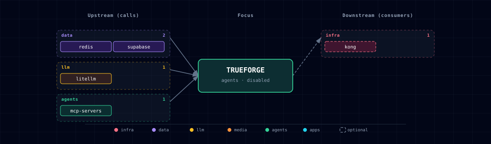

# 5.2.56. TrueForge (agent runtime: MCP + approvals + schedules)

## 1. Overview

TrueForge ([truefoundry/trueforge](https://github.com/truefoundry/trueforge)) is Atlas's general agent runtime. It is the first `agents`-family service where agents are **saved configurations, not code**. You pick a model, attach MCP tool connectors, set an approval policy, and optionally add a schedule. It complements the fixed-purpose agents (Local Deep Researcher, Hermes, OpenClaw). Atlas adopted it at upstream v0.2.0 as an `experimental`-tier service after the [#1159](https://github.com/thekaveh/atlas/issues/1159) evaluation.

The family runs three containers off one image:

- `trueforge` — the server: API, chat UI, session/turn execution.
- `trueforge-controller` — the schedule dispatcher (hourly/daily/weekly unattended runs).
- `trueforge-init` — one-shot settings seeding on every start (model provider + MCP connector), then exits.

**Boundary vs Open WebUI:** Open WebUI is the RAG *chat* surface — conversations, knowledge collections, document Q&A. TrueForge is the agent *harness* — tool-using agents with human approval gates, schedules, and per-session cost accounting. For "talk to my documents", use Open WebUI. For "an agent that acts through tools, on demand or on a schedule", use TrueForge.

**Platform note:** upstream publishes a linux/amd64 image only; on Apple Silicon, Docker Desktop runs it under emulation (same arrangement as chatterbox and docling).

## 2. Access

| Surface | URL | Notes |
| --- | --- | --- |
| Kong | `http://trueforge.localhost:${KONG_HTTP_PORT}` | Routed only when `TRUEFORGE_SOURCE=container`; guarded by the dashboard-user basic-auth/ACL pair like Langfuse and MLflow. |
| Direct | `http://localhost:${TRUEFORGE_PORT}` | Bound through `HOST_BIND_IP`; the default is loopback-only, while an explicit non-empty value enables deliberate remote access. |

TrueForge has no login of its own. The OIDC triple is unset, so the server runs with its fixed local admin identity: **anyone who can reach it is admin** (see §4.3).

## 3. Configuration

```dotenv
TRUEFORGE_SOURCE=disabled             # container | disabled
TRUEFORGE_IMAGE=tfy.jfrog.io/tfy-images/trueforge:0.2.0-8b1d98e   # pinned upstream image
TRUEFORGE_PORT=                       # topology-assigned
TRUEFORGE_ENDPOINT=                   # auto-managed
TRUEFORGE_API_KEY=                    # auto-generated
TRUEFORGE_DB_NAME=trueforge           # dedicated database on supabase-db
TRUEFORGE_DB_USER=trueforge
TRUEFORGE_DB_PASSWORD=atlas-db-password   # placeholder; replaced on first start
```

Enable with `./start.sh --trueforge-source container` or through the wizard (track `gen-ai-eng`). Everything else is derived:

- The Supabase init chain creates the database and its owner role (idempotent).
- The bootstrapper keeps the `*_URI` DSN twins in sync.
- `TRUEFORGE_API_KEY` (the controller→server credential) is generated on first run and then kept.

Model, MCP, skill and sandbox configuration does **not** use env catalogs. `trueforge-init` seeds the live settings API instead (§4.2). That survives image upgrades and follows what the LiteLLM gateway serves.

## 4. Architecture & wiring

### 4.1. Storage and runtime plumbing

- **Postgres**: a dedicated `trueforge` database on the shared `supabase-db`, owned by a restricted `trueforge` role (the litellm/langfuse isolation pattern). The tables are in a `trueforge` schema.
- **Redis**: the shared stack Redis on logical database `5`, used only for executor peering (cross-replica turn cancellation).
- **Kong**: `trueforge.localhost` fronts the UI/API; `PUBLIC_BASE_URL` points at the Kong URL so MCP OAuth/DCR callbacks resolve.

### 4.2. What trueforge-init seeds (idempotent, every start)

1. Reads the gateway's live `/v1/models` catalog. An empty or failed read stops the init before any key rotates, so TrueForge keeps its working key.
2. Mints a **LiteLLM virtual key** (alias `trueforge`), so agent traffic does not carry the master key. If minting fails, it falls back to the master key and logs a warning.

   It seeds one `custom` model provider (`atlas-litellm` → `http://litellm:4000/v1`) with that catalog. All enabled Ollama and cloud models arrive through it; **Ollama needs no direct wiring**. Model availability follows the gateway at every restart.
3. When `MCP_SERVERS_SOURCE=container`, registers the in-stack `atlas-tools` MCP connector (`http://mcp-servers:8000/mcp`, streamable HTTP, no auth on the internal network). Its tools (Supabase Postgres queries, Neo4j graph queries, SearXNG web search) sit behind TrueForge's per-tool-call approvals and `@write`/`@destructive` gating.

   When the family is **disabled**, the pinned v0.2.0 settings API has no DELETE. The init therefore *parks* the connector on an unresolvable RFC 2606 `.invalid` address with a `[disabled by Atlas]` description. Re-enabling restores it without duplicates.

   Saved agents that reference the parked connector still start. Upstream rejects a session only when a referenced connector name is missing from settings (`Unknown MCP server … — not configured`). Calls to the parked tools fail at connect time, after upstream's `MCP_CONNECT_TIMEOUT_MS` (default 30 s).

   `atlas-tools` is reserved for Atlas; do not create a connector with that name. Atlas never changes user-created connectors.

Settings writes replace by name, so re-runs converge. Each HTTP call has a per-request timeout, and the whole init has a 5-minute budget. A hung peer fails the init with the operation name. SIGTERM aborts in-flight work at once.

### 4.3. Security posture

- No OIDC (fixed admin identity): the same network-trusted tier as the other Atlas UIs. Two mitigations apply. The Kong route has the dashboard-user basic-auth/ACL guard. The model provider normally holds a scoped LiteLLM virtual key, not raw provider credentials. If key minting fails, init uses the LiteLLM master key until the next start (§4.2). Wire the `OIDC_*` triple to an external IdP before any exposure beyond a trusted host.
- Skills and sandbox execution are **off**: no skill sources and no sandbox provider are configured (upstream supports Daytona only). TrueForge rejects agent specs that request either at session creation, so the boundary is explicit.

### 4.4. Observability

TrueForge is not wired to Langfuse directly — and does not need to be. All model traffic transits LiteLLM, so the existing LiteLLM→Langfuse success-callback path captures cost, tokens, and latency per agent turn whenever `LANGFUSE_SOURCE=container`. TrueForge additionally records per-turn token counts and `total_cost_in_usd` on its own sessions, visible in the UI.

### 4.5. Schedules vs n8n vs Airflow

Schedules run **agents** (goal-seeking, tool-using, non-deterministic) hourly, daily or weekly. Neither n8n (event-driven deterministic workflows) nor Airflow (data DAGs) covers this. Deterministic multi-step automation belongs in n8n. Data pipelines belong in Airflow. n8n's MCP Server Trigger can expose a workflow as an agent tool; that is the intended bridge.

## 5. Dependencies & Integrations

### 5.1. Current — Upstream (this service calls)

| Service | Category |
|---|---|
| redis | data |
| supabase | data |
| litellm | llm |
| mcp-servers | agents |

### 5.2. Current — Downstream (services that call this)

| Service | Category | Status |
|---|---|---|
| kong | infra | optional: TRUEFORGE_SOURCE=container |

### 5.3. Architecture diagram



[Open the full-size diagram](./architecture.html) for a full-screen view.

### 5.4. Future — Missing pair integrations

_No high-confidence opportunities identified._

### 5.5. Future — Candidate new services

_No high-confidence opportunities identified._

### 5.6. Future — Unused features in this service

_No high-confidence opportunities identified._

## 6. Troubleshooting

- **`trueforge` exits immediately at boot**: the server validates its full env contract at startup and refuses any invalid value. `docker logs ${PROJECT_NAME}-trueforge` names the variable. Usual causes:
  - an unprovisioned database: check that `supabase-db-init` completed;
  - an empty `TRUEFORGE_API_KEY`: run `./start.sh` once so the bootstrapper generates it. Do not hand-write `.env` from scratch.
- **No models in the UI**: `trueforge-init` seeds the provider from LiteLLM's live catalog; check `docker logs ${PROJECT_NAME}-trueforge-init`. An empty gateway catalog (e.g. `LLM_PROVIDER_SOURCE=none` with no cloud keys) fails the seed on purpose rather than registering a dead provider.
- **Agent creation rejected with a skills/sandbox error**: expected: Atlas configures neither (§4.3). Remove the skills/sandbox blocks from the agent spec.
- **Schedules never fire**: the controller is a separate container. Check `docker logs ${PROJECT_NAME}-trueforge-controller`. Check that `TRUEFORGE_API_KEY` is the same for server and controller; it is, unless `.env` was edited by hand.
- **Slow first boot on Apple Silicon**: the amd64 image runs emulated; allow extra start-up time before the healthcheck settles (the compose healthcheck budgets for this).

## 7. Capabilities & limitations

Support tier: **experimental** — Capability contract declared for upstream v0.2.0; no cited cold-start, workflow, or upgrade qualification run yet (evidence at `v0.1.0`).

| Capability | Status | Verification | Notes |
|---|---|---|---|
| User-composable saved agents over LiteLLM models | supported | documented | trueforge-init seeds a single `custom` model provider pointed at the in-stack LiteLLM gateway. Every enabled Ollama and cloud model is therefore available to agents. Keys never live in agent configs. Live qualification run pending (#1159). |
| MCP tool calling with per-call human approvals | supported | documented | Remote streamable-HTTP MCP connectors with per-tool-call approvals and @write/@destructive gating. trueforge-init registers the in-stack mcp-servers endpoint when that family is enabled; other connectors are user-added. |
| Scheduled unattended agent runs | supported | documented | The trueforge-controller container dispatches hourly/daily/weekly schedules through the server API. Raw cron expressions and webhook/event triggers are not part of upstream v0.2. |
| Git-backed skills and code sandbox execution | not-supported | documented | Atlas configures no skill sources and no sandbox provider (upstream supports Daytona only). TrueForge rejects agent specs that request skills or a sandbox at session creation, so the boundary is explicit rather than silently degraded. |
| Authenticated multi-user access | not-supported | documented | The OIDC triple is unset, so TrueForge runs with a fixed local admin identity. Anyone who reaches the server or the Kong route is admin, like the other Atlas UIs. The seeded provider normally holds a dedicated LiteLLM virtual key. If key minting fails at init, for example before LiteLLM's database is ready, init uses the LiteLLM master key until the next start. Meanwhile anyone reaching TrueForge holds LiteLLM admin rights. |
